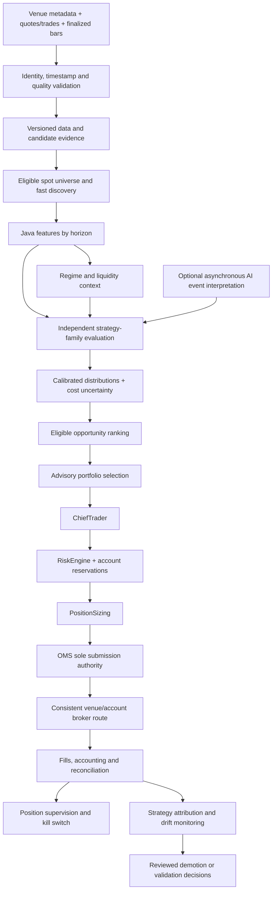
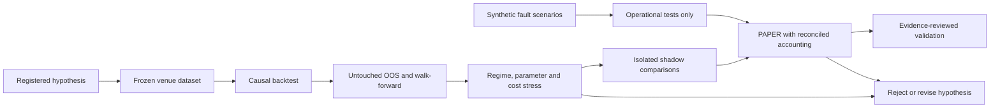

# ARGUS — Crypto Trading Forensic Audit and Strategy-First Redesign Plan

Analysis date: September 26, 2026. Source revision inspected: `9ed245e1a48776ea29c787ea6d65d22a41157a57`. Evidence timestamps below are UTC unless explicitly marked otherwise. **Analysis and planning only. No implementation, configuration changes, migrations, service operations, orders or LIVE authorization.**

## Executive Summary

Argus has **PARTIAL crypto capability**, including usable research building blocks and a local PAPER broker component. It is not demonstrated to be an end-to-end PAPER crypto trading system, and is not production-capable on the evidence inspected. Its highest-priority deficiency is not a shortage of indicators: crypto research, market-data ingestion, strategy decisions, broker routing and portfolio accounting do not yet form one verified operational path.

The most consequential verified findings are:

1. The canonical registry enables research/paper eligibility for **BTC-USD and ETH-USD only**, with USD as quote asset. Product precision and execution assumptions are reviewed defaults, not queried venue rules. [S1]
2. The saved September 25 startup log explicitly reports crypto ingestion **idle** and **no dedicated crypto broker configured**. This is evidence about that logged startup, not a claim about the current process environment. [D2]
3. The optional 15-second REST worker only copies a quote midpoint into a freshness cache. That cache write does **not emit MARKET_DATA**, warm agent bar buffers, preserve executable bid/ask, or call the paper broker's fill engine. An invalid provider timestamp is replaced with the current time. [S2–S3]
4. Dedicated broker selection exists, but OMS BUY routing and RiskEngine account valuation use the **common active broker**. The dedicated crypto broker helper has no production consumer outside its definition in the inspected search; the venue gate checks configured broker presence, not a completed executable path. BrokerManager ticks only its active broker. [S4–S6]
5. The local crypto PAPER broker is long-only, fractional and supports simulated partial fills, but its accounting has source-visible inconsistencies: entry fees reduce cash without entering reported realized P&L, and a concurrent SELL can report a fill quantity larger than the quantity actually sold. Its orders, cash and positions are in-memory. [S7]
6. Six crypto strategy implementations/wrappers exist: fixed/adaptive volatility-filtered momentum, fixed/adaptive Bollinger reversion, regime-filtered momentum and Donchian breakout. They are **RESEARCH_ONLY**, not six independent live edges. Two wrappers share their underlying implementations; regime-filtered momentum shares its base signal. [S8–S10]
7. Persisted bridge records show 24 BTC/USD and ETH/USD research calls on September 21: eight HTTP errors, eight circuit-open results and eight later successes. Successful calculation is verified; profitable trading is not. No canonical-pair predictions, risk rows, trades, joined fills or strategy-backtest rows were found in the inspected tables. [D1]
8. Generic strategies frequently depend on SPY, sector ETFs, session VWAP, opening ranges or daily boundaries. Their formulas can execute on numbers without establishing a valid crypto hypothesis. Conditional checks and raw confidence are not calibrated probabilities. [S11]

**Recommendation:** start with one venue-specific spot research dataset and BTC/ETH; establish correct accounting, data identity and deterministic end-to-end PAPER behavior; then test a small number of complementary strategies. Prioritize multi-hour/daily trend and breakout baselines, followed by conditional mean reversion and carefully tested BTC/ETH relative strength. Broader rotation is a subsequent experiment. Defer market making, high-frequency order-flow trading, leveraged derivatives, funding carry and cross-exchange arbitrage until their data and execution requirements can actually be met. No strategy is currently certified profitable by this audit.

## Evidence Scope, Method and Classification

This audit used fresh source inspection and new read-only database queries. Earlier stock-audit conclusions were not treated as crypto evidence. The source revision changed since that earlier audit; source and historical runtime observations are therefore explicitly separated.

The sole generated artifact is this document. Existing changes at the start were the modified stock redesign plan and untracked `AGENTS.md`; they were preserved. No `.env`, credential store, API key or exchange secret was read. No authenticated provider requests, application startup imports, tests that initialize databases, backtests or migrations were executed. Tests were inspected as source, not rerun. Consequently **TEST_VERIFIED is not assigned to passing behavior in this audit**. This avoids presenting historical comments or test names as current execution evidence.

Evidence vocabulary:

- **SOURCE_VERIFIED / VERIFIED FACT:** supported by inspected code or non-secret configuration. This proves implementation, not deployment or profitability.
- **DATABASE_VERIFIED / VERIFIED FACT:** supported by retained rows within the stated database and query scope.
- **RUNTIME_VERIFIED / VERIFIED FACT:** supported by a saved runtime log, with its historical window identified; not a current health probe.
- **TEST_VERIFIED:** reserved for an actually executed test with captured result; none claimed here.
- **INFERRED / INFERENCE:** a bounded conclusion from facts, with a possible alternative or missing link stated.
- **UNVERIFIED / HYPOTHESIS:** needs a new experiment, data or account evidence.
- **RECOMMENDATION:** proposed future work; all strategy-edge claims remain hypotheses.

Read-only SQL used `better-sqlite3` with `readonly:true`, `fileMustExist:true`, `PRAGMA query_only=ON`; multi-query extracts used `BEGIN` followed by `ROLLBACK` and connection close. No application module was imported to query the DB. The observed `observability_events` population was **8,154,990 rows**, spanning **2026-09-12T02:11:08.738Z to 2026-09-26T02:36:18.575Z**. This is retained coverage, not proof of continuous logging. Counts across other tables use all their retained rows, not the event-retention window.

### Source index

Paths are relative to the repository root `C:\WorkProjects\Multi-Agent-AI-Trading-Platform`; named methods are search anchors.

- **S1:** `config/cryptoInstruments.json`; `src/server/config/cryptoInstruments.ts`; `src/server/core/InstrumentRegistry.ts`.
- **S2:** `src/server/crypto/live/AlpacaCryptoMarketData.ts` — `getLatestCryptoQuotes`, `getCryptoBars`, `getCryptoAccountStatus`; `config/runtimeIntervals.json`.
- **S3:** `src/server/services/CryptoMarketDataIngestion.ts` — `start`, `tick`; `src/server/services/MarketDataWorker.ts` — `cacheObservedQuote`; `src/server/core/ArgusCoreBoot.ts`, `SystemBootstrap.ts`, `gracefulShutdown.ts`.
- **S4:** `src/brokers/BrokerManager.ts` — `resolveCryptoBrokerSelection`, `getBrokerForSymbol`, `getCryptoBrokerId`, `tick`, `wireInternalPaperTicksFromMarketData`.
- **S5:** `src/server/services/OrderManagement.ts` — `resolveOrderBroker`, BUY submission and follow-up/recovery paths; `PortfolioReconciliation.ts` — active-broker portfolio selection.
- **S6:** `src/server/engines/RiskEngine.ts` — crypto day filters, market-hours branch, account portfolio, daily loss; `PositionSizing.ts`; `src/server/risk/CryptoVenueAvailability.ts`; `src/server/crypto/CryptoSessionClock.ts`.
- **S7:** `src/brokers/CryptoPaperBroker.ts` — `placeOrder`, `tick`, `portfolio`; `CryptoPaperBroker.test.ts`.
- **S8:** `quant-core-java/src/main/java/io/argus/quantcore/institutional/models/` — `BtcAdaptiveVolatilityMomentumStrategy`, `BtcTan2025VolAdjustedMomentumStrategy`, `BtcAdaptiveBollingerMeanReversionStrategy`, `BtcTan2025BollingerMeanReversionStrategy`, `CryptoRegimeConditionalMomentumStrategy`, `BtcDonchianBreakoutStrategy`.
- **S9:** same Java directory — `CryptoFeatureEngine`, `CryptoReturnFeatureEngine`, `CryptoLogReturns`, `CryptoRegimeEngine`, `CryptoExpectedEdgeEngine`, `CryptoTransactionCostModel`, `CryptoVolatilityScaledPositionSizing`, `CryptoAtrRiskNormalization`, `CryptoBenchmarkComparison`.
- **S10:** `src/server/crypto/live/AlpacaCryptoResearchBridge.ts`; Java `server/QuantCoreServer.java`; `config/engineOwnership.json`; `src/server/config/modelRegistry.ts`.
- **S11:** `src/server/quant/strategies/StrategyEngine.ts` and its five core/sixteen experimental imports; `src/server/multiAsset/StrategyRouter.ts`; Java `strategy/StrategyRegistry.java`, `strategy/core/`, `strategy/institutional/`.
- **S12:** `src/brokers/CoinbaseBroker.ts`, `AlpacaBroker.ts`; their tests and capability declarations.
- **S13:** `src/server/engines/backtest/BacktestEngine.ts`, `HistoricalDataGateway.ts`, `historicalBarProvider.ts`, `Commissions.ts`; `src/server/research/` validation/attribution/promotion infrastructure; Java `backtest/`.
- **S14:** `src/server/crypto/synthetic/` — synthetic broker, population, price/regime processes, fills, slippage, Monte Carlo and pollution guards; architecture-boundary tests.
- **S15:** Java `OjAlgoPortfolioRiskEngine`, `PortfolioOptimizationEngine`, `MinVarianceTwoStrategyCombinerEngine`; existing forecast/evidence and model-ownership contracts.
- **D1:** read-only `data/argus.db` query results described below.
- **D2:** `logs/argus-dev.log`, September 25 boot context: no crypto broker at line 180; ingestion idle at lines 192 and 223 in the inspected file.

### Database findings and reproducibility

For canonical pair evidence, use exact membership in `('BTC-USD','ETH-USD','BTC/USD','ETH/USD')`, not a `BTC%`/`ETH%` prefix. The broad exploratory prefix search also returned equity-like names such as ETHA and BTCS; these are not crypto-pair observations.

- Canonical pair rows in `agent_predictions`, `quant_assessments`, `risk_assessments`, `trades`, `ohlcv_bars`, `quant_strategy_backtests` and `strategy_engine_backtest_runs`: **zero observed**. Joined fills to canonical-pair trades: zero. Broad `backtest_runs.symbols` searches for BTC/ETH: zero.
- Exact BTC/USD events: **12** `QUANT_BRIDGE_CALL_OUTCOME`; ETH/USD: **12**. At 17:34 and 18:01 on September 21, BTC calls returned HTTP 400 and ETH calls encountered an open breaker. At **18:04:43.985Z–18:04:44.059Z**, all four requested calculations for both pairs returned SUCCESS, with reported 21–27 ms bridge durations. These durations exclude upstream market-data acquisition.
- The four successfully called engines were `crypto_feature`, `crypto_regime`, `btc_tan2025_vol_adjusted_momentum`, `btc_tan2025_bollinger_mean_reversion`. Result payloads here establish endpoint outcomes, not strategy P&L or full returned feature validity.
- Bare `BTC`: four predictions, nine quant assessments; 276 daily bars plus 51 minute bars. Bare `ETH`: two predictions, 40 quant assessments; 276 daily bars. Daily closes range **25.955–55.58 for BTC** and **14.8–45.56 for ETH**. Their recorded sources are Alpaca and IBKR respectively. Instrument identity is unresolved; these are not accepted as Bitcoin/Ether spot history. Their presence is a data-identity warning, not proof of crypto strategy activity.

Representative read-only query contracts: group `observability_events` by exact symbol/event type and inspect `ts,payload`; group `ohlcv_bars` by exact symbol/timeframe/source with count/min/max timestamp/close; count exact canonical membership in decision/trade/backtest tables. The schema has no `orders` table in this DB; orders are represented through existing trading structures, so an empty nonexistent table is not cited as evidence. No complete independent crypto opportunity tape exists in the inspected canonical bar table. Historical warehouse files outside these queried tables were not certified complete; absence here is not a claim that no external research ever happened.

## Independently Discovered Current Architecture

**SOURCE_VERIFIED:** Node orchestrates data, agents, decisions, persistence and order management; Java provides deterministic quantitative engines through `QuantCoreBridge`. The protected flow is candidate/agent ideas → ChiefTrader → RiskEngine → PositionSizing → OMS → BrokerManager/adapter → fills/accounting/reconciliation. Research engines and the synthetic crypto laboratory are separate from order authority. [S3–S6, S10–S14]

Status must distinguish implementation from deployment:

- **ACTIVE infrastructure, crypto use INCOMPLETE:** instrument validation, fractional sizing, crypto UTC daily-count/notional handling and a crypto venue-availability branch exist in production source. They do not establish a complete executed route.
- **DISABLED at logged startup:** crypto REST ingestion; dedicated crypto broker selection unconfigured. Current flags remain UNVERIFIED because secrets/environment were not inspected.
- **RESEARCH_ONLY:** crypto Java features, regimes and strategy engines; the live-data research CLI/bridge; expected-edge and advisory sizing helpers. HTTP endpoints exist for several despite stale class comments saying no endpoint.
- **INCOMPLETE PAPER component:** `CryptoPaperBroker`, registered with BrokerManager and separately selectable. Its basic order/fill behavior has unit-test source, but no organic crypto trading chain was demonstrated.
- **INCOMPLETE external execution integration:** Coinbase Advanced Trade adapter exists, but dedicated PAPER routing explicitly refuses `coinbase`; no current account or live readiness is claimed.
- **UNUSED in production decision flow:** regime-conditional crypto wrapper and research-only outputs where registry/consumer search shows no live consumer. “Unused” here does not mean absent from tests or HTTP research.
- **SHADOW:** the project has general model lifecycle/shadow infrastructure; inspected crypto model entries remain RESEARCH rather than certified active crypto shadow strategies. A registry label is not a shadow outcome dataset.

Learning/adaptation infrastructure includes strategy history, score normalization, calibration comparisons, exploration/recertification, evolution candidates and a model lifecycle ladder. Reuse its provenance and approval discipline. None of those names establishes safe online self-modification or validated crypto allocation.

## Current Crypto Capability

Overall classification: **PARTIAL**. At component level, there is a PAPER-capable local simulator and real-data RESEARCH capability; at system level, the verified routing, ingestion, identity and accounting gaps prevent an unqualified PAPER_CAPABLE or PRODUCTION_CAPABLE declaration.

Supported canonical pairs are BTC-USD and ETH-USD. Alpaca provider mapping uses BTC/USD and ETH/USD. The client can request arbitrary symbol strings, and Coinbase maps account currencies into `asset-USD`, but that is not a validated dynamic universe. USD/USDC are treated specially in Coinbase balances; this does not make USD and USDC economically identical or establish multi-quote-currency portfolio support.

REST quotes include bid/ask and sizes; bars include OHLCV, optional trade count and VWAP. The worker retains only midpoint/time. No crypto WebSocket sequence processing, persistent crypto book/trade tape or canonical bar-warmup path was found in this ingestion implementation. Historical crypto bars are available through the research client, while the common gateway and commission defaults remain equity-oriented. [S2–S3, S13]

Fractional sizing, instrument minimum fields, a UTC day clock and a venue/data gate are implemented. Headers claiming whole-share-only sizing or an entirely unwired clock are stale: current RiskEngine imports those crypto helpers. Conversely, headers claiming full implementation cannot override missing routing consumers. [S6]

## Crypto Gap Analysis

**G1 — DATA_GAP / proven defect / SOURCE_VERIFIED:** invalid quote timestamps become `Date.now()` during ingestion. Finite positive midpoint alone does not validate positive uncrossed bid/ask, sequence or provider time. Future timestamps can produce negative ages that satisfy the venue gate's `age <= threshold` test. Recommend rejecting malformed/future evidence, preserving source/receipt time separately, and allowing bounded clock skew only through an explicit policy. [S2–S3, S6]

**G2 — INFRASTRUCTURE_GAP / architectural limitation:** the polling loop has no explicit request timeout in the client and no in-flight overlap guard in the worker. A hung request can overlap subsequent 15-second polls; stop does not cancel an in-flight result. Recommend bounded I/O, cancellation, generation-safe cache updates, backoff and single-flight operation. Runtime occurrence is UNVERIFIED. [S2–S3]

**G3 — BROKER_EXCHANGE_GAP / EXECUTION_GAP / source-proven integration gap:** dedicated crypto broker selection is not used by OMS BUY routing or RiskEngine account lookup. Market-data cache writes also do not drive fill ticks. Do not fix this by selecting a live venue globally or bypassing risk. Define one instrument/account/venue routing contract used consistently by approval, reservation, submission, follow-up and reconciliation. [S4–S6]

**G4 — PORTFOLIO_GAP / proven PAPER accounting defects:** BUY fees reduce cash but are excluded from position basis and reported realized P&L; after a round trip, reported realized P&L therefore omits entry fees. During a concurrent SELL, actual `sellQty` is capped to holdings, but fee and reported `filledQuantity` use the larger pre-cap quantity. Example: two pending SELLs each validated against one held BTC can let a later fill consume only the remaining fraction while report increments exceed it. This is a source-level counterexample, not a trade performed by this audit. Require cash/position/fill conservation tests and fee attribution. [S7]

**G5 — EXECUTION_GAP / missing capability:** in-memory PAPER orders/balances reset with process lifecycle; quote-based fills use assumptions, not market depth or queue priority. `modifyOrder` broadly assigns updates without equivalent placement validation. Require durable recovery, immutable order identity, validated amendments and explicit simulation versioning. [S7]

**G6 — RISK_GAP / architectural limitation:** crypto trade-count/notional day boundaries are UTC, but the account daily-loss baseline still uses New York date and common active-account equity. Different clocks can be intentional; here a coherent multi-account loss-budget contract is not demonstrated. Define both account-level and strategy/asset reporting clocks, plus rolling losses, without disabling the current kill switch. [S6]

**G7 — STRATEGY_GAP / MODEL_GAP:** research positions are LONG/FLAT, not complete executable entry/exit policies or calibrated distributions. Generic strategy checks may rely on equity context; `StrategyRouter` only restricts penny/micro profiles and otherwise returns unrestricted. Crypto-specific eligibility is missing at this seam. [S8–S11]

**G8 — MARKET_STRUCTURE_GAP / DATA_GAP:** reviewed default precision/minimums, no verified venue product lifecycle, no persistent fees/tier history, no derivatives funding/OI/liquidation ingestion. These are absent capabilities, not evidence that thresholds should be lowered. [S1–S2, S12]

**G9 — BACKTESTING_GAP / VALIDATION_GAP:** no inspected canonical-pair backtest rows or certified historical tape; equity fees, session assumptions and daily strategies must not be silently reused. Existing simulator tests prove neither fill realism nor alpha. [D1, S13–S14]

**G10 — OBSERVABILITY_GAP:** canonical pair events demonstrate isolated research calls, not complete candidate → decision → order → fill attribution. Bare ticker collisions can contaminate apparent coverage. Persist venue-aware instrument identity and full terminal reasons. [D1]

**G11 — configuration issue, RUNTIME_VERIFIED for saved startup:** ingestion idle and crypto broker unconfigured explain why those components did not operate in that logged run. Enabling them alone would not resolve G1–G10. [D2]

**G12 — external-provider/account limitation, UNVERIFIED:** actual account eligibility, jurisdiction, entitlements, negotiated fees and order restrictions were not inspected. Provider API availability is not permission to trade through the user's account.

## Existing Strategy Audit

### Crypto-specific implementations

All six below are long-only research positions with no direct order authority. Their result contract has position, sufficientData, evidence and diagnostics; there is no complete fill-aware lifecycle, calibrated forecast, mandatory stop/target or capital allocation inside that contract. Position-sizing helpers are separate. Daily terminology is meaningful only when daily bars are actually supplied. [S8–S10]

**C1. Fixed volatility-adjusted momentum (`BtcTan2025VolAdjustedMomentumStrategy`).** Delegates to C2 with 30-bar momentum, 60-bar volatility, percentile threshold 80 and 365 periods/year. LONG when log-return momentum is positive and current realized volatility's rank against prior volatility observations is below the threshold; otherwise FLAT. Intended daily, multi-day holding, turnover determined by state changes; not an intraday burst detector. No independent stop/target. It is a replication specification, not evidence that the cited thesis's profitability claims are true; that external paper was not independently validated here.

**C2. Adaptive volatility momentum (`BtcAdaptiveVolatilityMomentumStrategy`).** Same formula with caller-supplied windows/threshold/annualization. Current volatility is excluded from the prior percentile sample, a useful causal property. Minimum sufficiency can leave very few prior volatility observations; sample-depth validity and parameter bounds need stronger validation. “Adaptive” means configurable evaluation here, not demonstrated online adaptation. Equity/generic return math, explicitly crypto-oriented annualization; highly redundant with C1 and C5. Expected slow turnover at daily frequency is an inference, not measured statistics.

**C3. Fixed Bollinger reversion (`BtcTan2025BollingerMeanReversionStrategy`).** Delegates to C4 with 20 bars and multiplier 2. Enters when close crosses below the lower band, exits when close crosses above the moving-average midline. Replays from FLAT over supplied history and returns the final position. Intended daily research; possible prolonged losing positions in a downtrend, no hard stop or maximum holding time in the strategy. Crossings, not simply “oversold,” drive entries.

**C4. Adaptive Bollinger reversion (`BtcAdaptiveBollingerMeanReversionStrategy`).** C3 with caller-supplied window/multiplier. Full-series replay makes state depend on the starting history: truncating a rolling input can forget an earlier entry. Require explicit durable strategy-state semantics or reproducible fixed warmup before live use. Chronological evaluation is helpful but does not make same-close execution feasible. Treat C3/C4 as one family, with different parameter versions. Cost sensitivity increases sharply if shortened to intraday bars.

**C5. Regime-conditional momentum (`CryptoRegimeConditionalMomentumStrategy`).** Runs C2, then allows LONG only when `CryptoRegimeEngine` says TRENDING_BULL. Requires aligned high/low/close. It can suppress a LONG, never add a new independent signal. Regime uses overlapping price-derived features, so it is a conditioning hypothesis, not an independent confirming agent. No HTTP endpoint/live consumer in the inspected registry; no complete exit execution policy.

**C6. BTC Donchian breakout (`BtcDonchianBreakoutStrategy`).** Uses prior-bar-excluding Donchian channel (default 20), ADX 14, optional volume windows 20/10 and volume multiple 2. Detects fresh/continuing/failed breakout. Only upward breakout can produce LONG. Score combines ATR-normalized distance capped at 0.4, trend up to 0.25, volume 0.2 and continuation 0.15; off-regime score is halved, LONG floor is 0.35. No calibrated probability is implied by its `confidence` diagnostic. Requires OHLC; volume is optional. There is no attached stop/target policy.

**C6 source-quality issue:** a comment claims a bare breakout cannot become LONG, but the distance component alone can reach 0.4, above 0.35, when the regime is compatible or unavailable. Construct a negative-control fixture to determine intended policy; do not assume the comment proves confirmation is mandatory. Its state classifier labels an immediate direction reversal from prior breakout as NO_BREAKOUT_CONTEXT rather than fresh; assess this explicitly. Default thresholds are research assumptions, not validated operational values.

### Five core and sixteen experimental generic strategies

Inventory is taken from current `StrategyEngine.ts`, not its stale comment mentioning fifteen experiments. Core has five; experimental has **sixteen**. Core Java equivalents share hypotheses with their TypeScript counterparts and must not count as additional evidence. Entries below summarize inspected condition and invalidation logic; thresholds come from project configuration. These are setup evaluators, not complete crypto trading systems. Their caller supplies bar timeframe and sizing; text invalidation conditions are not proof that an executor enforces them. [S11]

1. **Momentum breakout:** directional structure break, RVOL, ATR expansion, VWAP side, market/sector trend, relative strength versus SPY and ROC. Broken-level reversal/regime change invalidates; structural stop/target evidence requires review for crypto. Explicit equity context makes direct transfer unsuitable. Shares momentum/trend factors with several following entries.
2. **Pullback continuation:** established trend, proximity to SMA20, moderate RSI, reversal candle, volume contraction and no opposing change of character. Stop thesis is pullback/structure failure; target uses opposing support/resistance. Generic price hypothesis but session/feature definitions need crypto adaptation. Holding period is caller-dependent.
3. **Mean reversion:** ranging regime, extreme RSI, Keltner boundary, stochastic RSI and reversal candle. Structural stop; Keltner middle target; new range extreme or trend invalidates. Plausible range-only research with jump/trend-tail risk; overlaps C3/C4 but uses more conditions, not necessarily more edge.
4. **Trend following:** regime/trend strength, SMA20/50/200 stack, ADX/DI, MACD and CMF. SMA50 trailing-stop suggestion, no fixed target; weak ADX/change of character invalidates. Generic hypothesis; multiple conditions largely reuse price/volume trend. Daily 200-bar warmup differs materially from 200 minutes.
5. **Range reversion:** consolidation, proximity to support/resistance, RSI weakness/strength, no spike and no structural break. Range failure invalidates; boundary-based levels. Generic range hypothesis, correlated with mean reversion and S/R bounce.
6. **SMC liquidity sweep:** inferred sweep, change of character and contextual structure; sweep extreme ±ATR stop, opposing inferred liquidity or 2ATR target. These are OHLC structure proxies, not actual liquidation or order-book liquidity. Validate against a simple false-break/reversal baseline before assigning separate capital.
7. **VWAP volume structure:** trend plus VWAP pullback, RVOL, ADX and rejection candle; VWAP/structure failure invalidates. Requires a declared crypto VWAP anchor. Volume is venue-specific; not independent of trend/pullback families.
8. **Opening range breakout:** opening-window high/low, RVOL, VWAP, directional regime and previous-day context. No natural crypto opening auction is established. Defer until a separately justified session-boundary hypothesis beats an arbitrary-window control; do not transplant 09:30 ET.
9. **VWAP mean reversion:** range, distance from VWAP, low ADX, moderate volume and reversal candle. The reclaim/rejection check can pass on continued extension, so it is not strict confirmation of a reclaim. Specify anchor and entry rule; overlapping mean-reversion evidence.
10. **Donchian channel breakout:** close beyond prior channel, ADX, RVOL, regime and ATR expansion. Stop one ATR beyond broken extreme; target two ATR from current price; failed channel break invalidates. Compare directly with C6, not as independent votes.
11. **MA crossover:** SMA50/200 and EMA9/20 ordering, price position, ADX and regime. This checks a stack, not necessarily a new crossover. Stack flip/ADX fade invalidates. Trend-family baseline; slowness/turnover depends on frequency.
12. **Oscillator momentum:** RSI midline, MACD histogram, ROC, DI and regime. MACD/RSI reversal invalidates. Multiple transformations of the same returns; unlikely independent from momentum without empirical evidence.
13. **Bollinger volatility:** actual expansion trigger uses Keltner breakout with volatility expansion, band-width availability, RVOL and ADX. It does not require proven prior squeeze merely because of its name. Channel re-entry/compression invalidates. Research as breakout-family variant.
14. **Previous-period breakout:** previous-day high/low with volume, expansion and regime. Boundary reversal invalidates. UTC-day levels can be an explicit crypto hypothesis, but day origin must be tested rather than assumed economically privileged.
15. **Candlestick reversal:** detected pattern, nearby structural boundary and non-extreme opposing RSI. Broken support/resistance invalidates. High sensitivity to bar aggregation and arbitrary patterns; low-priority standalone research.
16. **Gap continuation:** current versus prior UTC-day close, gap magnitude, volume, VWAP and regime. Gap fill/volume collapse invalidates. A continuous crypto market has no routine equity overnight closure; apparent gaps may be missing data. Defer the equity-style strategy; study actual event jumps separately.
17. **Fibonacci pullback:** 61.8% of trailing daily range, trend, RSI and contracted volume. Reference/structure failure invalidates. An exact ratio has no validated special status here; compare with ordinary pullback-distance baselines and multiple-testing controls.
18. **Volume confirmation:** volume spike, CMF, MFI, structure and regime. Volume collapse/CMF reversal invalidates. Treat primarily as a feature/condition, not an independent economic strategy merely because several volume indicators agree.
19. **Support/resistance bounce:** boundary proximity, reversal candle and no volume-spike breakout. Level failure invalidates. Overlaps range/candle reversion; requires causal level formation and realistic stop execution.
20. **Relative-strength rotation:** SPY-relative return, sector regime, ADX, opposing stock/SPY movement and MA stacks. Equity-specific. Redesign comparisons around BTC/ETH/eligible token cohorts only after synchronized history and an actual broad universe exist.
21. **Statistical mean reversion:** close z-score, RSI, range and low ADX. Non-reverting extension/regime change invalidates. A price z-score is not proof of stationarity; compare with simpler reversion and trend-avoidance baselines.

For these generic modules, expected holding period, achieved transaction frequency and crypto fee drag remain **UNVERIFIED**. They are primarily bar-context setup rules. Do not infer a daily strategy from a variable named “days,” a minutes strategy from a scan timer, or live stop enforcement from returned text. A per-strategy executable specification must supply those missing contracts before backtesting or promotion.

### Stop, target and sizing verification supplement

SOURCE_VERIFIED in the generic strategy return objects [S11]: these are **suggested levels**, not evidence of broker-native orders or continuously enforced trailing logic. Below, “beyond” means below for a long and above for a short; actual spot SELL proposals must remain inventory reductions unless short capability is separately supported.

- Momentum breakout: stop one ATR beyond the broken structure; next opposing level target, falling back to two ATR if available.
- Pullback continuation: recent swing stop, then SMA20 fallback; nearest opposing structure target.
- Mean reversion: nearest structural boundary stop; Keltner middle target.
- Trend following: SMA50 stop suggestion; no fixed target.
- Range reversion: near boundary stop; opposite range boundary target. The numeric stop equals the boundary even though its prose says “just beyond.”
- SMC sweep: one ATR beyond inferred sweep extreme; opposing inferred liquidity target, then two-ATR fallback.
- VWAP volume structure: one ATR beyond the side-dependent VWAP/current-price reference; two-ATR target. Missing inputs fall back to nearest support, which requires a side-aware review before crypto reuse.
- Opening range breakout: one ATR beyond the broken opening-range extreme, or the extreme alone; two-ATR target.
- VWAP reversion: one ATR beyond the extended current print; session VWAP target. Its no-ATR support fallback also needs side-aware review.
- Donchian: one ATR beyond broken channel, or channel extreme alone; two-ATR target.
- MA stack/crossover: one ATR beyond SMA50, or SMA50 alone; two-ATR target despite a comment noting MA systems have no intrinsic fixed target.
- Oscillator momentum, gap continuation, relative-strength rotation and volume confirmation: one ATR from current price for stop, two ATR for target.
- Bollinger/Keltner expansion: one ATR beyond broken Keltner band, or band alone; two-ATR target.
- Previous-period breakout: one ATR beyond previous-day extreme, or the level alone; two-ATR target.
- Candlestick reversal: one ATR beyond S/R reference, or that level alone; two-ATR target.
- Fibonacci pullback: one ATR beyond 61.8% reference, or the reference alone; trailing-range extreme target.
- S/R bounce: one ATR beyond the near level, or that level alone; far boundary target, then two-ATR fallback.
- Statistical reversion: one ATR from current price; Keltner middle used as mean proxy rather than the rolling price-z-score mean.

Many modules return null levels if required evidence is absent. Their condition-count score can be nonzero even when particular entry checks fail; do not interpret every listed condition as a mandatory conjunction without auditing downstream eligibility. SMC uses weighted scoring. Context regime mismatch is discounted by `StrategyEngine`, and `bestStrategyIdea` selects an evaluation above the configured confidence floor. This differs from a fully specified execution policy with mandatory conditions.

All actual sizing remains in the protected `PositionSizing` path. Inspection of `calculatePositionSizing` confirms risk-per-unit starts with `currentPrice * STOP_LOSS_ASSUMPTION_PCT`; fractional step support does not mean live risk uses each strategy's ATR stop or the Java crypto volatility-sizing helper. Research must model the actual sizing contract or explicitly label a challenger. Validate level geometry, expected reward/risk, minimum size, fee reserve, holding timeout and exit enforcement per strategy before promotion.

### Institutional and supporting models

`InstitutionalStatArbStrategy` fits a pair using a 60-bar window, tests cointegration/ADF, requires extended spread z-score and acceptable half-life, and proposes mean-crossing or loss-of-cointegration invalidation. No single-price stop/target is supplied. Reusable statistical research, but two synchronized assets and two-leg execution/hedge accounting are prerequisites; current long-only crypto PAPER support does not implement a market-neutral pair.

`MultiFactorMomentumStrategy` combines momentum, reversion, volume/liquidity, volatility and an OHLC close-location “order-flow” proxy. It is not actual trade-aggressor flow. Composite ±0.5 is an entry threshold; sign/momentum reversal invalidates; no structural stop/target. Assess incremental value against its simple components and prevent component/ensemble double counting.

Crypto features contain returns, EMA, ATR, RSI, bands and relative BTC/ETH statistics. `computeRelative` accepts arrays without timestamps and uses the shorter length; therefore synchronization must be guaranteed upstream, not inferred from equal lengths. Its band-normalized score is distance divided by half-band-width, not a conventional standard-deviation z-score. `CryptoExpectedEdgeEngine` performs payoff arithmetic from caller-supplied calibration; it is not a trained forecast. `sampleSize >= minimum` alone does not establish calibration quality. Reject invalid probabilities/costs instead of silently converting malformed calibration into usable evidence. Sizing, ATR normalization and benchmark utilities are research tools, not alternate order authorities. [S9, S15]

## Strategy Quality Findings

**VERIFIED FACT:** the strategy inventory contains substantial overlap. Fixed/adaptive variants reuse code, regime filtering reuses momentum, and most generic strategies derive from the same OHLCV history. **INFERENCE:** the number of independent economic bets is much smaller than the number of strategy IDs. No measured crypto signal/return correlation matrix was available to quantify it.

**HYPOTHESIS:** slow trend and breakout can exploit persistence; conditional reversion can exploit temporary deviations; cross-sectional relative strength can improve selection. All may fail after fees or simply reproduce BTC market exposure. Validate against buy-and-hold, cash and volatility-matched passive exposure, not only raw P&L.

Required taxonomy fields: economic rationale, feature lineage, methodology family, venue/instrument eligibility, horizon, expected turnover, regime, outcome target, cost sensitivity and capital use. Compute signal correlation on aligned candidate decisions, return correlation on aligned portfolio intervals, conditional dependence by regime/weekend and residual information after the existing baseline. Use ablation and incremental OOS portfolio utility; do not decree independence from labels.

## Crypto Market-Data Audit

The current client retrieves real-shaped quotes/bars over REST, supports historical pagination and chronological sorting. It lacks explicit HTTP deadlines, pagination-cycle bounds, bar deduplication, OHLC validity checks and closed-bar exclusion. The research bridge requests through the current instant, so a currently forming daily bar can enter evaluation unless the provider response/caller excludes it. The worker's midpoint-only cache is inadequate for executable-cost modeling and feature construction. [S2–S3, S10]

Recommendations: retain venue/product identity, exchange timestamp, receipt timestamp, sequence where available, bid/ask/sizes, trade data and finalized bar intervals. Separate quote, trade and mark semantics. Reject crossed/negative/future/stale data. Backfill gaps with explicit provenance, do not fill missing volume with invented liquidity. Define clock-skew and out-of-order policies; invalidate incremental state after detected gaps until recovery.

Alpaca's documented crypto API supports streamed data and order books in addition to historical/latest endpoints. That is provider capability; Argus's inspected worker does not use those capabilities. Feed location/venue must match the intended execution model. [Alpaca real-time crypto data](https://docs.alpaca.markets/us/docs/real-time-crypto-pricing-data), [Alpaca crypto pricing data](https://docs.alpaca.markets/us/docs/crypto-pricing-data).

## Universe and Discovery Audit

There is no verified broad crypto product discovery pipeline in the inspected crypto source. The two-entry registry is an explicit limited universe, not a dynamic liquidity screen. Research CLI access to arbitrary pairs does not fix this. Begin with BTC/ETH for baseline quality; broaden only when venue metadata, data coverage, costs and instrument lifecycle are reliable.

Future universe = account-permitted spot products ∩ valid product metadata ∩ supported quote currencies ∩ sufficient historical coverage ∩ executable liquidity. Retain delisted/disabled products in historical universe snapshots. Store base, quote, venue, product type and effective dates, never only a ticker string. Apply age/listing, quote-volume, spread, depth/participation and volatility filters with reason-coded rejection. A large percentage move cannot override them.

Use inexpensive broad observations, then prioritized detailed subscriptions. Persist first discovery, feature availability, rank, evaluation and expiry. Measure coverage before increasing universe size. Respect provider limits and compute budget; avoid starving position supervision to scan more tokens.

## Regime Architecture

Current `CryptoRegimeEngine` applies slope/RSI trend rules before ATR compression/expansion, returning one label. Thus trend and volatility can be conflated; its 1.0 confidence is a rule outcome, not a probability. Defaults are unvalidated. [S9]

Recommendation: represent separate axes for trend/persistence, realized volatility/jumps, liquidity/spread, correlation/breadth and market stress. Add funding/basis axes only for strategies with suitable data. BTC dominance requires a defensible historical universe/market-cap source; BTC return alone is not dominance. UNKNOWN must be an explicit state.

Start with transparent context features and compare strategy performance with and without filtering. Enable/reduce/shadow/disable policies are versioned research hypotheses, subject to hysteresis and minimum observation requirements. Operational data failure blocks dependent entries immediately; economic underperformance is assessed on a predeclared evaluation window. Do not automatically switch strategy every time a noisy regime label changes.

## Multi-Timeframe Architecture

Seconds/minutes require continuous quotes/trades, latency measurement and realistically modeled order placement; defer alpha deployment at that horizon with the current REST cache. Five–fifteen minute models require finalized bars, intrabar execution ambiguity handling and strong turnover/cost controls. Hourly/multi-hour models are the preferred initial research expansion after daily baselines. Daily/multi-day strategies use crypto-calendar bars, explicit annualization and overnight/weekend exposure accounting.

Each horizon owns its features, outcome target, calibration, exit/time limit, cost model and risk allocation. Higher-timeframe context may condition a lower-timeframe entry only using finalized information available then. Never combine a five-minute probability with a daily confidence as if they predicted the same event. All horizons compete for a common portfolio risk budget and can abstain.

## Opportunity Ranking Design

Ranking is a challenger to test, not a presumed improvement. Reuse existing ranking/evidence infrastructure with venue-aware crypto identities and compatible horizons. First rank observation priority; then rank execution-eligible opportunities by expected net return, downside, uncertainty, liquidity and incremental portfolio risk. Top rank does not imply positive edge.

With only BTC/ETH, compare a simple two-asset allocation/no-trade baseline before a complex cross-sectional model. Broader ranking requires point-in-time constituents, tradability and synchronized data. Freeze the same candidate pool when comparing ranked selection, absolute thresholds and equal-risk baselines. Penalize missing evidence explicitly; do not silently renormalize away missing cost/liquidity inputs.

## Probabilistic Forecasting Design

Extend canonical forecast contracts with venue/product, horizon, as-of cutoff, target band, model/feature/calibration version, sample support, P(up/down/flat), expected return/volatility/downside, uncertainty and net-cost evidence. Distinguish direction probability from probability of profitable execution. UNKNOWN is a valid result.

Use chronological fitting, separate calibration folds and untouched final testing. Evaluate Brier score, log loss, reliability, interval coverage and economic utility against simple base-rate forecasts on the same observations. Stratify by horizon and cautiously by regime; sparse cells need shrinkage or abstention, not confident per-token estimates. Sample requirements depend on autocorrelation and effect size, not raw row count. Monitor drift in features, residuals, calibration and execution costs separately. Freeze versions during evaluation; retraining must not silently revise past predictions.

## Crypto Data Requirements

**Tier A, required first:** venue-specific finalized OHLCV and quote/trade observations; product metadata; fees and minimums; account/order/fill events. High operational value and moderate integration effort. Public API availability is documented, but actual retention, entitlement, limits and licensing must be checked for the account. Preserve fee-tier/effective-date history. Trade/quote volume may be venue-specific and manipulable; validate consistency rather than treating volume as economic truth.

**Tier B, conditional:** L2 book snapshots/deltas for depth-aware execution or order-flow hypotheses. High storage/recovery complexity, sequencing and spoofing sensitivity. Obtain historical book coverage before a book-based backtest; current snapshots cannot reconstruct past queues. For slow, small spot orders, executable L1 and conservative participation may suffice initially. Do not buy L2 merely to appear sophisticated.

**Tier C, derivatives-only research:** funding, open interest, liquidation records, mark/index prices and spot-futures basis. Require venue-specific definitions and synchronized histories. Report liquidation-feed coverage and revisions; observed prints are not a complete market liquidation census. Unsupported derivatives execution makes these context-only or deferred inputs, not immediately tradable carry.

**Tier D, optional alternative data:** on-chain activity, exchange/stablecoin flows, token unlock calendars, news and social data. Historical point-in-time availability, address-label revisions, manipulation, publication delays, license and cost are major concerns. Adopt only after an ablation demonstrates incremental OOS information beyond price/volume and costs. Prices and commercial data charges were not solicited in this audit; obtain concrete terms before procurement.

## Broker/Exchange Assessment

`CryptoPaperBroker` is a local simulator, not an exchange connection. Coinbase Advanced Trade source implements JWT-authenticated account/order requests, spot market IOC and limit GTC submission, cancellation and positions; it reports no streaming market data and refuses PAPER orders. It generates a new client ID rather than reusing the supplied one, has no inspected pagination loop for account/order lists, values missing asset prices at zero, excludes held balances from available-balance positions, and picks a first USD/USDC account as cash. These are material completeness/idempotency/valuation concerns for later review. No credentials or live account were tested. [S12]

The adapter's blanket “no sandbox” statement is outdated: Coinbase documents a **static mocked sandbox** for account/order response testing. It is useful for API contract work, not realistic liquidity/fill validation, and does not justify changing Argus's PAPER refusal. [Coinbase Advanced Trade sandbox](https://docs.cdp.coinbase.com/coinbase-app/advanced-trade-apis/sandbox).

Alpaca offers crypto spot trading and fee-dependent execution, but the inspected Argus Alpaca adapter declares `crypto:false`. Provider support is not implemented Argus support. Consider extending a compatible existing adapter before adding a new venue, subject to account eligibility and a reviewed routing contract. [Alpaca crypto spot trading](https://docs.alpaca.markets/us/docs/crypto-trading).

No new exchange is currently justified solely by strategy enthusiasm. Select one initial spot venue using verified account access, historical data alignment, actual fees, stable APIs, reconciliation support, product metadata and operational failure handling. Compare Coinbase/Alpaca capability gaps before procurement; other venues require separate jurisdiction/account and engineering assessment. Do not assume derivatives or leverage are available.

## Transaction-Cost Model

Current local PAPER assumptions are 5 bps spread adjustment, 2 bps slippage and 10 bps fee **per side**. The implementation adds the full configured spread adjustment to each side; do not call that number a full quoted spread without defining the convention. Approximate round-trip model hurdle is 34 bps before changing notional/other effects. These are simulation inputs, not measured user fees. Java's separate cost helper takes fee + half-spread + slippage, and its replication baseline uses 0.1% per trade. Unify units and scope without erasing the distinct baseline version. [S1, S7, S9]

Canonical cost records: venue/product, fee tier/effective time, maker/taker route, fee currency/conversion, estimated spread crossing, residual slippage/impact, latency, participation, funding/borrow where relevant and uncertainty. Avoid double counting spread when empirical slippage already measures fill versus midpoint. Maker orders have uncertain fill and adverse selection; zero spread crossing is not guaranteed free execution.

Expected net return = gross forecast minus expected round-trip execution/holding costs at the intended size/horizon. Missing required rates remain unknown, not zero. Persist realized costs separately and reconcile cash, base quantity, fees and valuation. For spot without leverage, funding is inapplicable; for derivatives it is a required time-dependent cash flow. Alpaca documents maker/taker and volume-dependent crypto fees, supporting account-specific modeling rather than a universal assumed rate. [Alpaca crypto fees](https://docs.alpaca.markets/us/docs/crypto-fees).

## Execution Architecture

Keep OMS as sole submission authority. Introduce one reviewed route resolution contract carrying instrument, venue/account, broker, capabilities and execution environment through risk, capital reservation, submission, updates, fills and reconciliation. A registry flag must not certify a healthy executable venue. Fail closed on route ambiguity; never redirect a SELL to an unrelated account as a silent fallback.

Use stable client-order IDs across timeout/retry and reconcile unknown acknowledgments before resubmission. Validate product increments, minimum notional, permissible order type/TIF and fee reserves. Handle partial fills, cancel/fill races, terminal state ordering and late callbacks idempotently. Separate desired position from individual order state. Reject unsupported STOP/stop-limit semantics rather than silently mapping them to MARKET; the Coinbase adapter currently maps non-LIMIT submission to MARKET.

For PAPER, fix accounting and persist recovery state before treating results as evidence. Fill quantities must equal actual inventory/cash changes; fees must reconcile to reported P&L. Use measured or conservatively stressed quotes/size constraints, not a universal $50,000-per-tick liquidity allowance. Limit fills need explicit queue/touch assumptions. A stop cannot guarantee a price during a jump or outage. Keep uncertain orders visible and restrict new risk until resolved.

## 24/7 Operations Design

Crypto's continuous market does not mean uninterrupted venue availability. Use venue health and maintenance state, not an equity opening bell or an always-true market-open shortcut. Current crypto clock provides UTC boundaries and current risk imports some of them; update stale comments during later implementation. [S6]

Define UTC crypto reporting days, account loss-budget boundaries and rolling drawdown windows explicitly. Persist baselines through restart; midnight must not erase unresolved losses or pending reservations. Schedule backups, model refresh and retention without unmonitored positions. Separate data collection, entry scanning and position supervision resource budgets. Measure heartbeat, quote age, missing bars, queue age, reconnect/backfill lag, order uncertainty and reconciliation failures. Recover in order: durable state → venue/account → open orders/fills → balances/positions → data warmup → eligibility. No automatic unpause of safety stops.

## Crypto Risk Model

Retain independent approval, risk, sizing, kill switch and PAPER/LIVE separation. Add asset/venue-specific evidence through existing gates rather than a parallel crypto authority. Required risks: per-position and aggregate exposure, correlated BTC/ETH beta, liquidity/participation, spread, volatility/jump uncertainty, venue outage, collateral/quote-asset concentration and rolling losses. Stablecoin exposure needs its own valuation/depeg treatment; USD and USDC should not share an assumed fixed conversion in stress.

Volatility scaling is advisory until validated and bounded by liquidity, concentration and uncertainty. Do not reward exceptionally low recent volatility with unbounded size. Use conservative tail stress and stale-data behavior; avoid assuming stops cap loss. Keep initial mandate spot/long-only. Leverage, liquidation and borrow risk require an entirely separate researched permission/capability set, not a flag flip. No new risk percentages are prescribed without the owner's loss limits and account evidence.

## Portfolio Construction

Reuse validated math, not unsupported claims of a working optimizer. `OjAlgoPortfolioRiskEngine` computes current/proposed variance and contribution evidence; it is not a production constrained QP optimizer and does not size orders. Its contribution quantity must be interpreted carefully as current-weight contribution rather than automatically the candidate's incremental risk. [S15]

Start with simple capped allocations and cash as an eligible outcome. Align returns by timestamp/venue/horizon, use covariance shrinkage and stress correlation convergence. Compare equal-capital, equal-risk and constrained utility selection after turnover/costs. Include pending orders and cross-strategy overlap. Multi-token holdings are not automatically diversified. Portfolio optimization remains advisory until it improves OOS results over simple baselines with robust numerical and operational behavior.

## Backtesting Redesign

The repository has historical replay, next-bar execution machinery, commissions/slippage, walk-forward research, Java backtesting and synthetic stress tools. These are useful foundations. However the common commission implementation is US-equity oriented; historical provider contracts do not by themselves certify crypto symbol/venue data. Do not feed ambiguous bare BTC/ETH bars into a crypto result. [S13, D1]

Build immutable datasets keyed by venue/product/timeframe with data hash, ingestion version, exchange/receipt times, missingness, listing/delisting status and finalized-bar policy. Retain historical universe snapshots. Decisions consume only closed bars available at the decision time; orders occur after decision/latency at executable prices. No same-close fill simply because the strategy saw that close. Model intrabar stop/target ordering conservatively or use finer data.

Add venue/date-specific fees, spread and impact; funding only where supported; precision, minimums, partial fills, unavailable borrow, missing data, maintenance and latency. Measure portfolio cash conservation. Report assumptions and unresolved execution bounds. The synthetic crypto lab can test fault handling and estimator sensitivity, but a generated price process cannot prove market alpha. Its isolated SYN symbol/path guards should remain intact. Do not merge synthetic outcomes with organic PAPER evidence. [S14]

## Strategy Validation Framework

Register hypothesis → freeze specification/dataset → backtest → untouched OOS → walk-forward → robustness/parameter sensitivity → regime/cost stress → shadow → PAPER → validated. A validated historical hypothesis is not a perpetual profit guarantee or automatic LIVE approval.

Prevent leakage with chronological training/calibration/testing, purging/embargo for overlapping outcomes and causal feature construction. Log all parameter/model trials; use multiple-testing-aware evaluation such as existing PBO/research tools only when their sample assumptions hold. Include delistings, failed tokens, inactive candidates and rejected setups. Evaluate parameter neighborhoods and delays, not only the maximum historical Sharpe point. Cluster uncertainty by market episode/date and overlapping positions.

Require evidence across bull, bear, sideways, quiet, volatile, crash, weekend and liquidity-shock periods. These labels must be generated causally when used as inputs; retrospective labels may stratify evaluation only. Choose minimum sample/effect-size criteria before opening test results. Profit concentration in one rally, one coin or one execution assumption fails robustness. When sufficient data are unavailable, mark the phase blocked by data rather than invent an OOS result.

## Strategy Attribution

Persist one linked record from candidate to decision and resulting position, including strategy/version, economic family, feature lineage, venue/product, horizon, regime, expected gross/cost/net return, uncertainty, eligibility and terminal reason. On completion, attach actual entry/exit, fees, realized net return, excursion, holding time and portfolio contribution. Record abstentions and displaced ranked candidates too.

When strategies share a position, choose an explicit capital-accounting convention; do not credit the entire P&L to every agreeing model. Separate beta exposure, timing, selection and execution contribution. Compare incremental portfolios with and without each strategy on aligned dates. Redundancy is empirical. No attribution ledger can rescue malformed fill/accounting data, so G4 precedes capital allocation research.

## Adaptive Strategy Allocation

Begin with frozen conservative weights for validated candidates. Later allocate using shrinkage-adjusted OOS net expectancy, uncertainty, covariance, regime compatibility and turnover cost. A recent winning streak is insufficient evidence. Set review cadence, minimum information, weight-change limits and cooldown in advance; evaluate the selector as its own strategy with its own holdout.

Immediate suspension applies to data-contract, order-state or risk violations. Economic demotion uses predeclared deterioration tests and uncertainty, first reducing eligibility or moving to shadow while preserving position exits and audit history. Re-promotion requires a new version and fresh evidence; do not repeatedly retune against the same failed holdout. A drifting calibration model and a broken broker are different failure classes with different remedies.

## AI-vs-Quant Assessment

Existing crypto research can call deterministic Java engines without an LLM. That is SOURCE_VERIFIED independence of the research calculation, not proof of an AI-free production trading path. Generic agents, forecasts and consensus have multiple dependencies; no crypto provider-outage end-to-end exercise was executed here.

Fresh inspection of `src/server/services/ChiefTraderAgent.ts` also verifies a `noRoutableProviders` branch: when debate would otherwise run and no provider is routable, it skips provider fan-out and evaluates independent-agent evidence without injecting an artificial HOLD vote. Preserve this existing behavior rather than proposing it as an entirely missing capability. The unresolved crypto problem is generating valid independent evidence and completing the operational path, not merely adding that branch.

Recommendation: ordinary crypto decisions, exits, risk and reconciliation should not depend on OpenAI/Anthropic/Gemini/OpenRouter/local LLM availability. Optional news/narrative extraction is asynchronous, source-timed and expiring. Strategies requiring unavailable event interpretation abstain individually; unrelated quantitative strategies continue if their own data and risk requirements pass. Do not fabricate missing votes or count price-derived LLM commentary as independent alpha.

Compare quant-only versus quant+AI on identical candidates, times, costs and eligibility, including inference latency/expense. Require incremental OOS information and portfolio utility before adding AI to a strategy's required inputs. Existing calibration and consensus safeguards remain unchanged during initial shadow research.

## Missed-Opportunity Framework

Freeze candidate population at each observation time. Define an opportunity by future executable return over a declared horizon relative to costs, downside and liquidity, not merely a coin rising later. Retrospective labels may evaluate recall but never enter contemporaneous features. Distinguish unavailable market coverage, late discovery, no signal, weak/uncalibrated evidence, valid risk rejection, routing failure and unfilled order.

Measure universe coverage, discovery/signal recall, directional accuracy, independent-family coverage, consensus/risk/execution conversion, net capture, precision and avoided-loss estimates. Denominators must be explicit and unavailable outcomes excluded or bounded rather than assumed profitable. Build matched controls on pre-decision liquidity, volatility, momentum, venue, horizon and regime, then retain every subsequent outcome. The inspected canonical history is insufficient for a realized matched crypto control study; the plan does not present synthetic examples as such a study.

## Crypto Strategy Research Priority Matrix

The following structured matrix is a research order, not a forecast of returns. Independence is provisional and must be measured. Turnover refers to the proposed initial horizon; current empirical values are unavailable.

**Priority 1 — Time-series trend / volatility-filtered momentum.** Rationale: persistent trends, with drawdown control as a hypothesis. Independence: low versus other trend signals, useful baseline. Data: clean venue OHLCV plus executable cost evidence. Horizon: multi-hour/daily; turnover low-to-moderate, cost sensitivity moderate. Regime: trending, vulnerable to whipsaw/crashes. Complexity moderate; validation needs bear/sideways as well as bull periods. Existing support C1/C2 and generic trend; needs closed-bar/state/exit/cost contracts. Compare unfiltered trend and passive volatility-matched exposure.

**Priority 2 — Range breakout / volatility expansion.** Rationale: persistence after a causal range escape. Independence: partial versus momentum, not guaranteed. Data: OHLCV/quotes; horizon hourly/multi-hour; turnover moderate, cost sensitivity moderate-to-high. Regime: expansion/trend, false-break risk. Complexity moderate, validation difficult around intrabar fills. Existing C6 and generic Donchian/Keltner; needs confirmation-policy tests, exits and realistic execution. Ablate volume/regime filters.

**Priority 3 — Conditional mean reversion.** Rationale: temporary deviation in liquid non-trending conditions. Independence: potentially complementary to trend, both can fail during structural breaks. Data: bars/quotes; horizon hourly/multi-hour; turnover moderate/high, high cost sensitivity. Regime: range, stress-sensitive. Complexity moderate; validation difficult because tail losses dominate. Existing C3/C4 and generic reversion; needs persistent state, maximum exposure/holding policy and crisis tests. Compare simple reversion before stacking indicators.

**Priority 4 — BTC/ETH relative strength, then cross-sectional momentum/token rotation.** Rationale: relative persistence and selective exposure. Independence: partial after BTC beta control. Data: synchronized venue bars, point-in-time constituents and costs; horizon multi-hour/daily; turnover moderate. Regime: correlations/breadth; cost sensitivity moderate. Complexity moderate for two assets, high for broad history. Existing relative features, equity rotation requires redesign. No claim of broad-universe ranking value from two coins alone.

**Priority 5 — Statistical pairs / residual reversion.** Rationale: stable spread dynamics, if demonstrable. Independence: potentially meaningful versus directional beta. Data: aligned prices, tradable hedge, borrow/funding/costs; horizon hourly/multi-day; turnover moderate/high, high cost sensitivity. Regime: relationship stability; complexity and validation high. Existing statistical engine only. Missing two-leg execution, leg-risk accounting and appropriate short/hedge access. Defer tradable implementation until those prerequisites exist; long-only rotation is a different hypothesis.

**Priority 6 — Leader/follower and multi-timeframe conditioning.** Rationale: delayed response or context-dependent persistence. Independence: often low after market beta and momentum. Data: synchronized event/quote/bar timestamps; horizon minutes–hours; turnover variable, latency/cost sensitivity high. Complexity moderate/high; validation very difficult due to synchronization artifacts. Relative-feature helpers are partial support. Require lag baselines, shuffled controls and realistic delay before deployment consideration.

**Priority 7 — Order flow, volume imbalance and liquidity regime.** Rationale: short-lived supply/demand pressure or execution improvement. Independence: potentially distinct with actual trade/book data; OHLC proxies do not establish it. Data: venue trades/L2 sequences and historical books; horizon seconds/minutes; turnover/cost sensitivity very high. Complexity/validation very high. Current midpoint poll inadequate. Research execution-cost improvement before speculative high-frequency alpha.

**Priority 8 — Funding / basis / carry / OI / liquidation behavior.** Rationale: financing imbalance or forced-flow context. Independence: potentially different economic mechanism but exposed to common stress. Data: derivative contracts, funding schedules, mark/index, OI/liquidations and spot hedge; horizon event/multi-hour/multi-day; turnover variable, costs/financing central. Complexity and tail-risk validation very high. No inspected production derivatives capability. Defer; require legal/account eligibility, liquidation modeling and hedged execution first.

**Priority 9 — On-chain, exchange flows, social/news narratives.** Rationale: incremental information before price adjustment. Independence: uncertain, often price-reactive. Data: licensed point-in-time histories with revision/publication timestamps; horizon hours/days; turnover variable. Integration and validation high; manipulation/revisions substantial. Existing optional news infrastructure is not crypto-edge proof. Introduce only after a simple price/cost baseline and a source-level ablation.

Volatility/liquidity/regime models are usually conditioning and risk tools, not separately counted alpha families. Do not add “more strategies” by naming every transformation a standalone capital allocation.

## Proposed Target Architecture

**Remain:** protected ChiefTrader/Risk/Sizing/OMS/Broker authority, reconciliation/kill switch/PAPER isolation, Java compute boundary, existing forecast/model registry, research lineage and isolated synthetic lab.

**Redesign:** crypto ingestion and identity, canonical bar lifecycle, broker/account routing, PAPER accounting/recovery, cost contracts, horizon-specific strategy state, equity-context dependencies and attribution.

**Remove from crypto decision semantics:** guessed freshness, unknown costs represented as zero, duplicate-family vote credit, implicit equity opening gaps, unverified simulator P&L as organic evidence and stale documentation claims. Removal means correcting semantics/consumers in a later reviewed change, not deleting working controls now.

**Introduce through existing interfaces:** venue product registry snapshots, persistent quote/bar evidence, crypto strategy eligibility and state, calibrated horizon forecasts, bounded candidate ranking, account-consistent reservations and periodic model/strategy graduation reviews.

## Mermaid Architecture Diagrams

## Prioritized Migration Roadmap

Each phase is future work requiring implementation authorization. No phase may graduate solely on trade count. OOS means unseen market periods, not isolated unit fixtures; where a phase is operational, specify that distinction rather than invent an alpha test.

### Phase 0 — Evidence and contracts

Problem/evidence: ambiguous instruments, missing canonical datasets and unverified deployment (D1/D2). Change: freeze instrument/venue/account/horizon/cost contracts and capture non-secret health plus read-only history. Impact: metadata/observability only initially. Data/dependencies: account eligibility, product metadata, historical coverage, owner risk limits and expense budget. Benefit: valid experiment denominators. Risk: misclassifying equity-like BTC/ETH data. Tests: identity collisions, venue aliases, missingness and timestamp boundaries. OOS: reserve untouched chronological periods. PAPER: no orders needed. Success: reproducible dataset/coverage manifest; failure: unresolved identity or inaccessible data. Rollback: quarantine questionable data while preserving originals.

### Phase 1 — Data and PAPER correctness

Problem/evidence: G1/G2/G4/G5. Change: strict quote/bar validation, deadlines/single-flight, finalized bars, correct fill/fee conservation and durable simulator recovery. Impact: data adapters and PAPER broker, no strategy threshold changes. Dependencies: Phase 0 contracts; data: malformed/real-shaped responses and ledger fixtures. Benefit: trustworthy inputs/outcomes. Risks: dropping legitimate out-of-order updates, incorrect fee conventions. Tests: invalid/future time, crossed quotes, duplicate pages, overlapping polls, concurrent SELLs, partial fills, amendments and restart. OOS: reserved real-data replay tests correctness under unseen feed conditions, not profitability. PAPER: cash + inventory + fees reconcile exactly within declared numeric tolerance. Failure/rollback: any conservation or stale-data breach blocks simulator evidence and dependent entries; keep old artifacts labeled invalid rather than delete them.

### Phase 2 — One complete quant-only PAPER path

Problem/evidence: G3/G6/G7. Change: consistent account routing/reservations, real market-data events/bar warmup, strategy lifecycle, deterministic exits, multi-account reconciliation. Impact: protected interfaces need explicit review; no bypass. Dependencies: Phase 1 and one fixed simple baseline strategy. Data: venue prices/product rules/account fixtures. Benefit: operation independent of AI. Risks: cross-account orders, duplicate retries, mismatched loss clocks. Tests: all AI unavailable, data outage, Java failure, route mismatch, cancel/fill race, restart and UTC/NY rollover. OOS: freeze baseline for later comparison. PAPER: organically produced decisions traverse real authorities; injected approvals do not count. Success: safe completed lifecycle or justified no-trade, no erroneous route/accounting. Failure: uncertain route or unreconciled balance; rollback: stop new affected entries, retain supervised exit/reconciliation capability.

### Phase 3 — Strategy research baseline and complementary challenger

Problem/evidence: research rules exist but no canonical strategy outcome proof. Change: causal daily/hourly trend baseline, then breakout, then reversion one at a time. Impact: Java research and existing harnesses. Dependencies: trustworthy dataset/costs/lifecycle. Benefit: identify whether any incremental edge exists. Risks: overfitting, duplicate bets, beta disguised as skill. Tests: causality, insufficient history, state replay, parameters and cost units. OOS: untouched periods, walk-forward, beta-matched benchmarks, trial accounting and uncertainty. PAPER: frozen eligible versions with cost divergence tracking. Success: predeclared positive net utility and acceptable tail risk; failure: cost sensitivity or concentrated returns. Rollback: demote to research/shadow, no threshold relaxation.

### Phase 4 — Universe, regime and ranking challengers

Problem/evidence: two-pair universe and no validated selector. Change: expand only eligible liquid products; compare regime conditioning and ranker against simple baselines. Impact: discovery/Java context/ranking, not authority changes. Dependencies: Phase 3 baseline and historical constituents. Benefit: incremental selection/diversification. Risks: survivorship, arbitrary sessions, churn and missing-data reward. Tests: historical eligibility, delisting, candidate expiry, no-trade rankings and aligned features. OOS: identical population/latency and selector ablations. PAPER: bounded subscriptions and stable operational budget. Failure: no incremental benefit or tail concentration; rollback: previous smaller universe/frozen selector while managing held positions.

### Phase 5 — Portfolio and sustained operational validation

Problem/evidence: advisory portfolio math exists but account integration/crypto allocation unproven. Change: simple constraints first, then validated advisory allocation, drift/demotion and 24/7 supervision. Dependencies: independently useful strategies and measured costs. Data: synchronized strategy returns, pending orders, fees and outage scenarios. Benefit: control combined risk and expenses. Risks: performance chasing and covariance failure. Tests: correlated shock, stablecoin/venue stress, numerical failures, weekend maintenance and recovery. OOS: allocator evaluated separately on unseen strategy returns. PAPER: reconciled multi-regime runs and bounded drawdown/turnover. Success: better net risk-adjusted utility than simple allocation with reliable operations. Failure/rollback: revert to frozen simple allocation or cash eligibility; never auto-escalate to LIVE.

## Experiments Required Before Implementation

These are specifications for future experiments, not jobs run by this audit:

1. Reproduce invalid timestamp/future-age acceptance with pure fixtures; demonstrate that no invalid timestamp becomes fresh evidence.
2. Trace one canonical BTC-USD candidate through data cache, event/bar warmup, strategy, ChiefTrader, Risk, route selection and PAPER fill; document the first absent link without injecting downstream approvals.
3. Verify concurrent SELL conservation and round-trip fee/P&L identity in an isolated broker test; contrast reported fill with actual inventory change.
4. Test C6's distance-only score boundary and direction-reversal classification; resolve intended semantics before promotion.
5. Compare full-history versus rolling-window Bollinger replay state and daily incomplete-bar inclusion.
6. Build a venue-identity coverage manifest; prove bare BTC/ETH records cannot silently enter a canonical-pair dataset.
7. Replay fixed trend and passive benchmarks with actual fee-tier assumptions plus worse-cost scenarios; establish whether research is economically plausible before buying specialized data.
8. Ablate each strategy filter and measure aligned family dependence; wrappers are never independent controls.
9. Exercise API/Java/AI/venue outages, partial acknowledgments and process recovery without live credentials or production mutations.

Existing test files cover quote parsing/pagination, paper basic fills/idempotency, sizing and architecture boundaries; inspect and extend them later. Their existence does not answer these missing cases. No current test-pass claim is made.

## Risks and Unknowns

No real crypto account eligibility, fee tier, exchange permissions, current runtime flags, complete tick/book history or current deployment health was verified. Registry/source changes after the captured boot cannot retroactively explain that run. Persisted research successes do not establish robust current connectivity. No validated crypto Sharpe, Brier score, win rate, expected daily income or capital capacity can be responsibly reported from the inspected evidence.

Research priority assumes a modest spot mandate and limited infrastructure; derivatives would change requirements materially. Costs can eliminate apparent intraday gains. Crypto market stress can simultaneously increase correlations, spreads, venue failures and loss severity. Historical regimes and best parameters are uncertain. A truthful research program must be able to conclude that a proposed strategy should not trade.

Do not chase gainers, lower thresholds to manufacture orders, multiply correlated indicators, treat heuristic confidence as probability, train and evaluate on the same period, ignore fees, transfer equity session rules blindly, trade illiquid tokens for percentage movement, or repeatedly optimize against a failed holdout. Do not let synthetic success become a LIVE readiness certificate.

## Recommended Implementation Sequence

First establish identity, evidence and account contracts. Second repair data and simulator correctness. Third complete one AI-independent quant-only PAPER route through the existing authorities. Fourth validate trend and breakout baselines, then a complementary reversion hypothesis. Fifth test universe expansion, relative strength, regime selection and ranking. Sixth validate portfolio allocation and continuous operation. Specialized data, multi-leg strategies and derivatives remain deferred until their prerequisites and incremental value are demonstrated.

The direct answers are: current capability is partial; current market data/discovery are insufficient for a broad systematic crypto product; some generic math is reusable but strategies need explicit crypto definitions; new reliable bars/quotes/product/cost evidence is necessary; a new exchange is not automatically necessary; order-book data is conditional, not an initial universal requirement; ranking and regime selection must earn their complexity; costs and 24/7 risk need consistent venue/account contracts; positive edge requires reproducible unseen-data and realistic PAPER evidence. Underperforming strategies are demoted by predeclared evidence, not replaced by whatever recently won.

**Stop here. This document authorizes no implementation and makes no profitability promise.**
