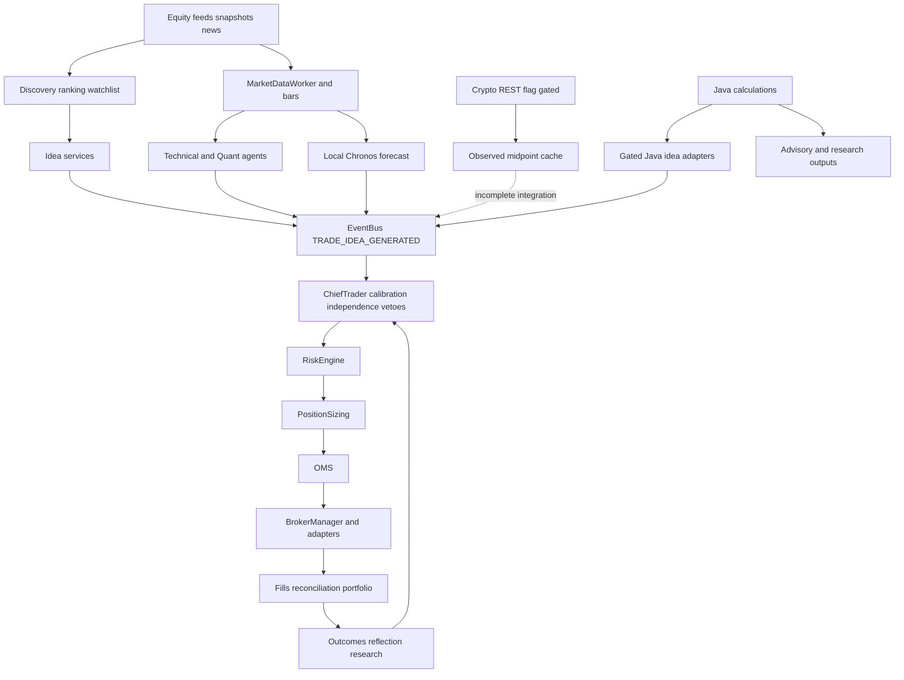
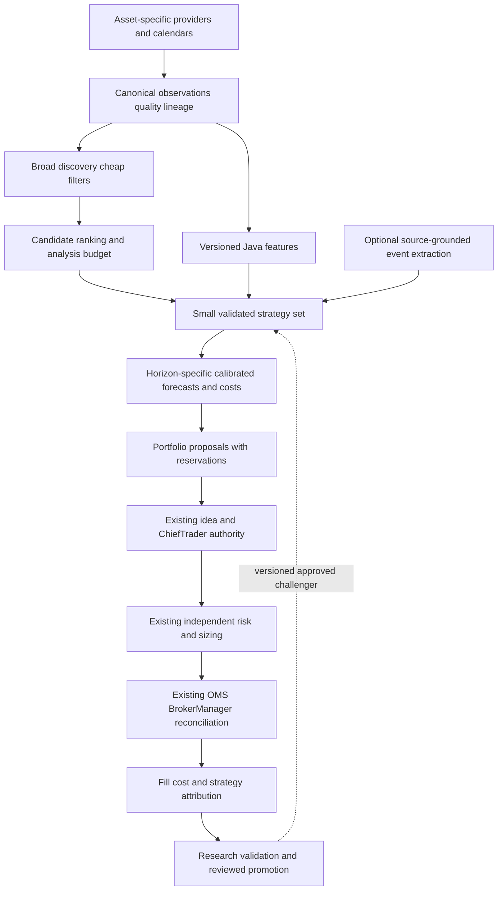
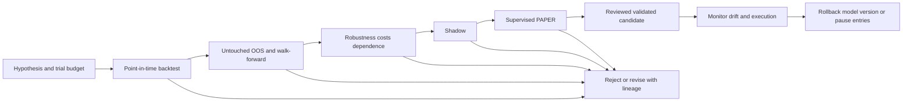

# Argus — Forensic Audit and Master Redesign Plan

Analysis conducted September 26–27, 2026. Source revision: `9ed245e1a48776ea29c787ea6d65d22a41157a57`. Historical comparison: Thursday September 24 and Friday September 25, 2026. Narrative times use America/New_York; stored timestamps retain their original representation.

**FORENSIC ANALYSIS, DESIGN AND PLANNING ONLY. No implementation, configuration change, migration, runtime change, order, deployment or LIVE authorization is granted.** This is the specifically requested dated proposal, not a replacement for the living architecture reference `docs/architecture/ARGUS_ARCHITECTURE.md`. Future approved implementation must update that reference. The protected ChiefTrader → RiskEngine → PositionSizing → OMS → BrokerManager path remains mandatory.

## Executive Summary

Argus is an event-driven, AI-assisted multi-agent trading terminal with deterministic quantitative components, a substantial research library, protected execution infrastructure and several partially integrated asset-specific capabilities. It is not yet demonstrated to be a profitable autonomous quantitative portfolio system.

**The biggest design problem is the distance between producing plausible signals and establishing executable, independent, cost-adjusted predictive evidence.** Adding indicators, agent names or Java engines does not close that distance. Argus has hundreds of recorded evaluations, heuristic confidence, correlated technical evidence, incomplete discovery inputs and research modules with no demonstrated production contribution. Crypto additionally has source-visible routing, freshness and simulator accounting gaps.

The most useful redesign is a **quant-first research and decision platform**, with broad inexpensive discovery, canonical versioned features, a small portfolio of independently tested hypotheses, explicit forecast horizons, honest cost uncertainty, portfolio-aware selection and optional asynchronous AI. Retain the existing protected order authority. Java owns new quantitative calculations; Node owns orchestration, persistence and protected controls. Preserve useful existing engines and validate their contribution before expanding them.

The owner's $20 daily aspiration on $2,000 equals 1% of starting capital per day before costs and taxes. That is an objective, not a defensible income forecast or a reason to increase turnover. Continuous observation and position supervision are desirable; continuous buying and selling are not success criteria. No architecture guarantees profit. The immediate objective is to discover whether any restricted strategy portfolio has reproducible positive net expectancy under executable conditions.

Recommended order: repair evidence correctness; establish independent opportunity denominators; validate one end-to-end quant-only path; research two complementary equity hypotheses and a separate crypto baseline; compare ranking and portfolio challengers in shadow; then consider supervised PAPER graduation. Do not begin by enabling all 137 registered models.

## Methodology

The investigation traced source from boot and data ingestion through discovery, agents, ChiefTrader, risk, sizing, OMS, broker selection and research feedback. Configuration and registry declarations were compared with actual call sites. Tests were inspected as source; no tests that initialize databases, migrations, backtests or trading services were executed. No credentials, `.env` contents or authenticated exchange accounts were inspected.

Database reads used `better-sqlite3` with `readonly:true`, `PRAGMA query_only=ON` and read transactions, without importing application bootstrap. Important units: `observability_events.ts` is Unix milliseconds; trade timestamps are ISO text. A query that compares event milliseconds to ISO strings is invalid evidence. Counts below use correctly typed bounds. Existing equity and crypto reports were pointers to source and historical evidence, not proof that every past assertion remains current.

This is an exhaustive registered-model inventory and targeted implementation/integration audit, **not a mathematical certification of every numerical routine**. The complete inventory appended below explicitly preserves that distinction. No new OOS study, live soak, broker validation or independent external review was performed. The adversarial panel is a structured self-review, not nine separately engaged experts.

### Reproducible evidence map

Paths below are repository-relative. Method names provide stable search anchors even when line numbers change.

- **S1 — Boot and authority:** `src/server/core/ArgusCoreBoot.ts`, `SystemBootstrap.ts`, `src/server/agents/ChiefTraderAgent.ts`, `src/server/engines/RiskEngine.ts`, `src/server/services/OrderManagement.ts`, `src/brokers/BrokerManager.ts`.
- **S2 — Discovery:** `src/server/continuous/MarketUniverseScanner.ts` (`fetchAvgDailyVolumeShares`, screening), `SnapshotScanner.ts` (`scored.sort`, `scoredInputs.map`), `discoveryGapEvidence.ts`, `TradePlanBuilder.ts`, `MissedOpportunityDetector.ts`.
- **S3 — Evidence and learning:** `src/server/services/ConfidenceCalibration.ts`, `ReflectionEngine.ts`, `CalibrationValidationWorker.ts`; ChiefTrader terminal-reason emission; `src/server/quant/internalQuantEnsemble.ts`, `strategyFamilies.ts`.
- **S4 — Quant integration:** `src/server/quant/strategies/StrategyEngine.ts` and imported strategies; `JavaQuantAdvisoryService.ts`, `JavaCoreEnsembleVoteService.ts`; `config/engineOwnership.json`, `src/server/config/modelRegistry.ts`; Java `QuantEnsembleEngine`, CORE strategies and institutional models.
- **S5 — Forecasts:** Kronos engine/agent and outcome evaluator; `scripts/local_ai_service.py`; forecast evidence and cost contracts.
- **S6 — Crypto data:** `config/cryptoInstruments.json`, `src/server/core/InstrumentRegistry.ts`, `src/server/services/CryptoMarketDataIngestion.ts`, `src/server/crypto/live/AlpacaCryptoMarketData.ts`, `AlpacaCryptoResearchBridge.ts`, `src/server/risk/CryptoVenueAvailability.ts`.
- **S7 — Crypto execution:** `src/brokers/CryptoPaperBroker.ts`, `CoinbaseBroker.ts`, `AlpacaBroker.ts`, BrokerManager routing/ticks, OMS `resolveOrderBroker`, `PortfolioReconciliation.ts`, RiskEngine and `PositionSizing.ts`.
- **S8 — Research:** `src/server/engines/backtest/BacktestEngine.ts`, `src/server/research/` including canonical next-bar engine, PBO and `evolution/StrategyEvolutionEngine.ts`; historical gateway/bar-provider contracts; Java `backtest/`.
- **S9 — Crypto models:** Java `institutional/models/` implementations named in Strategy Audit, supporting feature/regime/cost/sizing engines; synthetic crypto infrastructure under `src/server/crypto/synthetic/`.
- **D1 — Decisions:** retained `data/argus.db`, `observability_events`, `agent_predictions`, `quant_assessments`, `risk_assessments`, `trades`, `fills`.
- **D2 — Data/research:** `ohlcv_bars`, `candidate_rankings`, calibration tables, strategy backtest tables, retained bridge events and news/catalyst evidence.
- **L1 — Historical runtime:** September 25 boot material in `logs/argus-dev.log`; evidence of that boot only, not current service health.

## Evidence & Verification Standard

Use these labels literally. **SOURCE_VERIFIED** means an inspected implementation establishes a mechanism. **TEST_VERIFIED** requires a test executed with retained results; none is assigned by this audit. **RUNTIME_VERIFIED** refers only to a dated observed run/log, not source reachability. **DATABASE_VERIFIED** refers to retained rows and exact query scope. **EXTERNAL_RESEARCH** supports a hypothesis or provider contract, not Argus profitability. **INFERRED** identifies a causal interpretation not isolated experimentally. **UNVERIFIED** marks missing evidence.

Problems are classified as PROVEN_DEFECT, ARCHITECTURAL_LIMITATION, MODEL_QUALITY_PROBLEM, DATA_LIMITATION, EXTERNAL_DEPENDENCY, OPERATOR_CONFIGURATION, MISSING_CAPABILITY, EXPECTED_SAFE_BEHAVIOR or RESEARCH_HYPOTHESIS. A risk rejection, unavailable quote, insufficient independent evidence or correctly low calibrated confidence is not a defect merely because the stock later rose.

Every future finding should carry source revision, deployed revision when known, environment, account/venue identity without secrets, observation interval, query/filter, numerator and denominator, missingness, and causal confidence. Never substitute registry status, HTTP success, green unit tests or replay profit for organic strategy evidence.

## Independently Discovered Current Architecture

**SOURCE_VERIFIED, S1–S9.** Node/Express orchestrates an EventBus, agents, services, SQLite persistence and a Vite/React operator surface. Java exposes quantitative calculations through established HTTP boundaries. A Python service hosts local forecasting/sentiment components. External AI and optional sibling systems provide additional analysis. The components do not form one uniformly validated autonomous trading engine.

Major component contracts:

| Component / owner | Inputs → outputs; state | Dependencies, failure and latency | Authority / observed activation |
|---|---|---|---|
| Market data / Node provider adapters | Quotes/bars → observed prices and bars; caches/subscriptions | Entitlements, feed coverage, timestamps; stale/unavailable must remain explicit; short latency for executable quotes | Data only; historical equity activity retained; current all-symbol health unverified |
| Universe/discovery / continuous services | Assets, movers, snapshots, news → candidates/subscriptions; caches and ranking rows | Provider budgets, ADV, session clocks; partial coverage and repeated rejection; seconds/minutes | No orders; retained discovery events |
| Catalyst staging / news services | Articles → interpreted events/staged symbols; memory plus article persistence | Provider/AI latency and restart continuity; event time differs from receipt | Evidence/ideas only; historical AKAM staging retained |
| Feature/strategy workers / Node and Java | Bars/prices → indicators, strategy assessments and signals | Warmup, aligned horizons, flags, Java availability; computation deadlines | Some idea-producing paths; many registry entries research-only |
| Kronos / Node + Python Chronos | Price sequence → forecast/idea; rolling buffers | Local service, cadence and horizon consistency; optional target role | Gated ideas; observed predictions, not established edge |
| Calibration/reflection / Node | Predictions/outcomes → reliability, weights, learned text; DB state | Label quality, effective sample size, delayed outcomes | Some live weight/prompt influence; distinct validation worker is observational |
| ChiefTrader / Node | Ideas/evidence/context → approve/reject with terminal reason; rounds | Availability, confidence, independence, vetoes; decision deadlines | Sole protected decision authority; terminal events retained |
| Risk + sizing / Node | Approved idea, portfolio, quotes → permitted size/rejection | Account freshness, spread, capital, state and market restrictions | Independent veto; one Thursday premarket assessment, zero Friday |
| OMS / Node | Risk-approved intent → order lifecycle; persisted trade/fill state | Broker routing, retries, idempotency, partial fills; latency and recovery critical | Sole order submission route through BrokerManager |
| Brokers/reconciliation / adapters | Orders/accounts → fills/positions/cash; venue and local state | External transport, capability and complete account snapshots | Execution and account truth; crypto route incompletely integrated |
| Research / isolated engines | Historical data/config → backtest/OOS/evolution records | Point-in-time data, costs, selection bias; batch latency | No permission to trade from research status alone |

Boot attempts to start reconciliation, NewsEngine, Kronos, discovery, crypto ingestion, screener, scheduling, shadow runner, campaign tracking, session lifecycle, calibration validation and Java bridges under their respective settings. A call to `start()` may be a gated no-op; startup source is not proof each service was active.

## Runtime Reality vs Documentation

**SOURCE_VERIFIED:** statements such as “Java never votes” are too broad. Gated JavaFactorComposite and JavaCoreEnsemble services can emit ordinary ideas into ChiefTrader. An internal quantitative qualification branch can satisfy an independence condition under its configured family/effective-count rules. None submits directly to a broker. Registry SHADOW text and historical comments can lag these integrations.

The refreshed registry contains 137 quantitative model entries: 131 RESEARCH and six SHADOW declarations. Four indicator entries and five CORE strategy entries are separate. These counts measure catalog state, not active independent strategies. Runtime flags and Mission Control state were not inferred from `.env` or documentation claims.

**RUNTIME_VERIFIED, L1, historical only:** retained September 25 boot evidence reports crypto ingestion idle and no selected crypto broker in that context. **DATABASE_VERIFIED:** September 21 crypto bridge responses include successes after HTTP errors, demonstrating some historical research service activity. Neither proves an operational crypto trading path today.

The user's newly supplied safety contract contains both 24- and 25-gate descriptions and older smaller engine counts. Preserve the controls; use actual predicates and current registry entries for engineering work. Readiness is not recomputed by this document.

## Current Strengths

- A protected decision/risk/execution spine prevents research helpers from becoming unrestricted order paths.
- Terminal-reason telemetry makes upstream abstention distinguishable from execution failure.
- Paper/live/replay provenance, freshness checks, reconciliation and state controls provide useful foundations.
- Java calculation inventory, strategy parity work, canonical next-bar research, registry lifecycle validation and isolated synthetic facilities reduce the need for a rewrite.
- Explicit missing forecast economics and calibration sufficiency rules are better foundations than fabricated confidence or zero-cost assumptions.

These are SOURCE_VERIFIED design strengths, not a new operational certification.

## Proven Defects

**P1 — Ranking misassociation, SOURCE_VERIFIED, S2.** `SnapshotScanner` sorts `scored` but maps unsorted `scoredInputs` using `scored[i]` for raw momentum, relative volume and range expansion. Two differently ranked symbols can exchange metrics. Fix later by stable observation/instrument identity. Required regression: reversed input/rank order must preserve each symbol's own persisted values. Historical P&L impact is unquantified.

**P2 — Quote freshness fabrication, SOURCE_VERIFIED, S6.** Crypto ingestion substitutes `Date.now()` when provider timestamp parsing fails. An unknown observation time becomes apparently fresh. Reject/quarantine malformed time; retain provider and receipt clocks independently. Venue age checks also need a lower bound or explicit permitted clock skew so far-future timestamps cannot pass merely because negative age is below a maximum.

**P3 — Crypto PAPER fee accounting, SOURCE_VERIFIED, S7.** Entry fees reduce cash without entering position basis/reported realized P&L. A completed round trip can overstate reported profit relative to cash change. Require fee-inclusive reconciliation across cash, inventory, realized and unrealized P&L.

**P4 — Crypto PAPER concurrent SELL conservation, SOURCE_VERIFIED, S7.** Actual sell quantity is capped by remaining holdings, while reported fill accumulation and fee computation use the pre-cap fill quantity/notional. Multiple pending sells can overstate executed quantity. Required invariant: cumulative fills cannot exceed actual disposed inventory or requested quantity; fees use actual fills.

**P5 — Miss classification, SOURCE_VERIFIED, S2.** The missed-opportunity classifier can fall through to an execution-miss description implying prior approval even when no risk assessment exists. Preserve UNKNOWN/NOT_REACHED distinctions; do not diagnose missing orders as execution defects without the approval chain.

**P6 — Coinbase submission semantics, SOURCE_VERIFIED, S7.** Adapter submission generates a new client ID instead of preserving the caller's stable one; non-LIMIT requests fall through to market construction despite STOP mapping elsewhere. Retry duplication and unsupported-order conversion require explicit capability rejection and reconciliation-aware idempotency. No real order was submitted to demonstrate these risks.

Other important problems below are deliberately not promoted to proven defects without a specified violated contract or isolated counterexample.

## Architectural Limitations

**SOURCE_VERIFIED / INFERRED:** separate catalogs, agent scores and multiple horizon conventions obscure which economic hypothesis contributes value. “Confidence” combines setup quality, model certainty and empirical reliability. Independent agent names and ported implementations do not establish independent evidence.

Discovery uses provider-specific snapshots and liquidity history that can be incomplete. ADV retrieval lacks the explicit completed-session range/pagination contract needed for robust broad screening; missing data can remove candidates before expensive analysis. Premarket volume and gap definitions need session-aware semantics. Catalyst staging has in-memory continuity limits; articles being durable does not mean staged work is restored.

Crypto instrument selection, account selection, quote ingestion, simulator ticks and OMS routing are not one coherent contract. BUY routing uses the common active broker, while a separate crypto-selection helper exists. A cached midpoint alone does not drive the protected pipeline or the dedicated simulator. This is a source-proven integration limitation, not permission to globally select a live venue.

Risk sizing currently uses a configured percentage stop assumption rather than automatically consuming each strategy's ATR/structure stop. A returned stop/target is not evidence of an enforced exit. Portfolio analytics exist, but a validated joint, cost-aware opportunity allocator is not demonstrated.

## Missing Capabilities

Priority missing capabilities are a point-in-time instrument/universe history; complete candidate lineage including rejected/unobserved distinctions; consistent horizon/cost forecast contracts; empirical strategy-dependence estimates; comparable opportunity/control cohorts; durable catalyst recovery; a verified crypto data-to-PAPER lifecycle; and reproducible strategy-level net attribution.

Venue-specific book/fill history, fundamentals with availability dates, clean delisting/corporate-action history and crypto funding/open-interest/liquidation histories are dependencies for particular advanced hypotheses, not assumptions about existing data. Do not purchase or integrate all of them before measuring likely incremental value.

## Opportunity Funnel

**DATABASE_VERIFIED, D1.** Windows are `[04:00,09:30)` ET, September 24 and 25; UTC bounds `[08:00Z,13:30Z)`. This broader retained premarket scope is explicit and does not pretend to reconstruct every missing second of the original 08:45–09:30 request.

| Recorded stage | Thursday events / distinct symbols | Friday events / distinct symbols |
|---|---:|---:|
| Discovery filtered | 4,363 / 498 | 5,594 / 479 |
| Discovery admitted event | 0 / 0 | 0 / 0 |
| Watchlist subscription requested | 570 / 18 | 735 / 18 |
| Trade ideas generated | 486 / 10 | 401 / 8 |
| Agent predictions | 559 / 14 | 507 / 14 |
| Quant assessments | 321 / 14 | 405 / 15 |
| Consensus terminal reasons | 268 / 9 | 204 / 8 |
| Chief approved event | 1 / 1 | 0 / 0 |
| Risk assessments | 1 / 1 | 0 / 0 |
| Trades | 0 | 0 |

These are repeated events from different entry paths, not a monotone population funnel. Predictions can be HOLD; subscription requests do not prove fresh ticks. Seed/ranking routes explain activity despite zero broad-discovery admissions. Unique observed universe, complete executable opportunity population and independent directional-signal denominator remain unknown.

Thursday terminal reasons: CONFIDENCE_BELOW_STRONG 217; AGENT_HOLD 19; AGENT_DATA_UNAVAILABLE 12; MODERATE_REJECT_INSUFFICIENT_INDEPENDENCE 11; MODERATE_REJECT_CALIBRATION 5; INSUFFICIENT_AGENT_PARTICIPATION 3; CONSENSUS_APPROVED 1. Friday: CONFIDENCE_BELOW_STRONG 165; AGENT_HOLD 15; AGENT_DATA_UNAVAILABLE 14; MODERATE_REJECT_INSUFFICIENT_INDEPENDENCE 7; MODERATE_REJECT_CALIBRATION 3. Friday's largest recorded terminal category is therefore low confidence, not RiskEngine or OMS rejection. This does not identify the largest forgone profit source.

Across all retained trades, environments/statuses include PAPER FILLED 4, EXTERNAL_SYNC FILLED 2, REPLAY FILLED 180, REPLAY REJECTED 298 and UNKNOWN REJECTED 2. The four PAPER rows are August 20 NVDA SELL, August 21 IWM BUY/SELL and September 21 GLD SELL; all four `profit_loss` fields are null. Do not translate null into zero, infer organic strategy provenance from PAPER alone, or claim a validated profitable round trip from the two IWM prices without fees and lineage.

## Missed-Opportunity Analysis

Separate observable, admissible and executable opportunities. Define eligibility as of decision time using instrument status, available quote quality, session, liquidity and account constraints. Freeze forward horizons and executable entry/exit policy before seeing outcomes. Outcome labels may use later prices for evaluation; discovery and model inputs may not.

Historical cases provide distinct failure classes. INLF lacks adequate local observation evidence; that is not a proven erroneous rejection. APUS had stale/wide-spread and inadequate liquidity evidence; unsafe execution must remain rejected even if discovery data improves. AKAM had staged catalyst evidence before the following session; restart continuity is a plausible lost-discovery mechanism, not proof a profitable fill was available. PPLI lacks a complete Friday local lineage. AMD reached evaluation but did not establish qualifying entry evidence. NVDA had repeated technical/Kronos evaluations, weak calibrated reliability and insufficient independent support; manufacturing a second vote would not repair that. Thursday TSLA's sole premarket approved idea reached risk and was rejected for missing spread evidence: EXPECTED_SAFE_BEHAVIOR.

For a proper study, choose a frozen universe and timestamps independently of Argus rankings. Include all eligible triggers, not just eventual +10% winners. Match losing controls on information available then: session, sector, capitalization/liquidity, initial return, spread, volatility and catalyst category. Assign overlapping events to campaigns and bootstrap by session/campaign. Report observed winners captured/missed, observed losers avoided/taken, unobserved cases, censored outcomes and non-executable moves separately.

Existing local bars are too sparse and differently timed to establish a rigorous matched-control result for all named movers. No discovery-recall percentage or forgone-dollar total is claimed. A large final daily return may occur before detection, through a halt, at an unfillable spread, or after a severe adverse excursion.

## Strategy Audit

**SOURCE_VERIFIED, S4/S9; economic edge UNVERIFIED.** The generic StrategyEngine has five CORE and sixteen experimental strategies. Many are weighted technical-condition bundles. Unless stated otherwise, holding period is not intrinsic to the formula; it depends on the caller and exit implementation. Stops/targets are returned proposals, not verified enforced orders. Intraday variants have high cost sensitivity and potentially high turnover; daily variants are slower but remain gap exposed. No strategy below is certified OOS by this audit.

| Strategy | Hypothesis / principal inputs and entry | Proposed exit / regime / overlap |
|---|---|---|
| Momentum breakout | Persistence after structure break; RVOL, ATR expansion, VWAP, market/sector context | Broken level ± ATR; opposing level or 2 ATR target; trend; strong overlap with Donchian/previous-period |
| Pullback continuation | Temporary retracement within trend; SMA20, RSI, candle, volume contraction | Swing/SMA fallback stop, opposing structure target; overlaps trend/VWAP |
| Mean reversion | Range overshoot reverses; RSI, Keltner, stochastic/candle | Support/resistance stop, channel midpoint target; fails in persistent trends |
| Trend following | Persistent direction; SMA20/50/200, ADX/DI, MACD/CMF | SMA50 stop proposal, no fixed target; same price family as momentum |
| Range reversion | Repeated range boundaries; consolidation, RSI, no breakout/spike | Boundary stop and opposite boundary target; boundary placement needs precise validation |
| SMC liquidity sweep | OHLC-inferred sweep plus structural reversal | Sweep ± ATR, opposing inferred liquidity/2 ATR; no actual order-book evidence |
| VWAP volume structure | Trend resumes near VWAP with volume/ADX/candle | VWAP/ATR stop, 2 ATR target; review side-specific fallback; correlated pullback |
| Opening range breakout | Post-open price discovery continues; opening range, RVOL, VWAP | Range extreme ± ATR, 2 ATR; equity-session-specific, whipsaw sensitive |
| VWAP mean reversion | Intraday displacement reverts; VWAP distance, low ADX, volume/candle | ATR/structure stop, VWAP target; confirm reclaim logic cannot accept continuing extension |
| Donchian breakout | Prior channel break persists; ADX, volume, ATR | Channel ± ATR, 2 ATR; trend-family redundancy |
| Moving-average crossover | Aligned MA stack predicts trend continuation | SMA50 ± ATR, 2 ATR; implementation primarily stack state, not necessarily a new crossover event |
| Oscillator momentum | RSI/MACD/ROC/DI agreement proxies persistence | 1 ATR stop, 2 ATR target; multiple transforms of same prices |
| Bollinger volatility breakout | Volatility expansion breaks containment | Actual Keltner/ATR and available band-width inputs; band ± ATR/2 ATR; prior squeeze not independently established |
| Previous-period breakout | Prior day extreme breaks | Prior extreme ± ATR/2 ATR; overlaps Donchian/opening range |
| Candlestick reversal | Exhaustion near structure with RSI | Structure ± ATR/2 ATR; noise and discretionary-pattern proxy risk |
| Gap continuation | Gap with volume/VWAP/trend persists | 1 ATR/2 ATR; prior UTC-close semantics need equity session correction; weak crypto analogy |
| Fibonacci pullback | Trend resumes near 61.8% trailing range retracement | Fib ± ATR, range extreme target; exact ratio superiority unproven |
| Volume confirmation | RVOL/CMF/MFI/structure indicates persistent participation | 1 ATR/2 ATR; likely conditioning feature, not independent alpha |
| Support/resistance bounce | Boundary touch with candle/low volume reverts | Boundary ± ATR, opposite boundary/2 ATR; overlaps range strategies |
| Relative-strength rotation | Stock/sector strength versus SPY persists | 1 ATR/2 ATR; market-relative hypothesis, still substantial momentum overlap |
| Statistical mean reversion | Extreme close z-score reverts in quiet range | 1 ATR stop, Keltner midpoint target; target differs from z-score center |

Institutional statistical arbitrage estimates pair relationship/cointegration, spread z-score and half-life over a short historical window. It needs synchronized series, stable relationship tests, two-leg costs and executable hedge handling; a long-only spot order path cannot realize a market-neutral pair merely from a signed score. MultiFactorMomentum combines momentum, reversion, volume, volatility and an OHLC-based flow proxy. That proxy is not measured order flow; five factors are not five independent sources. Its score threshold is an assumption, and it lacks a complete intrinsic exit/holding contract.

Crypto-specific implementations:

1. `BtcTan2025VolAdjustedMomentumStrategy`: fixed baseline delegates to adaptive implementation. Positive momentum under volatility filter gives LONG; otherwise FLAT. Daily baseline hypothesis, no intrinsic stop/max holding rule.
2. `BtcAdaptiveVolatilityMomentumStrategy`: approximately 30-period momentum, 60-period volatility and historical percentile filtering over a longer reference window; current volatility excluded from comparison sample. Adaptation is parameterized rolling calculation, not demonstrated learning. Warmup/effective sample sufficiency matters.
3. `BtcTan2025BollingerMeanReversionStrategy`: fixed 20/2 band baseline delegates to adaptive implementation; lower-band crossing enters, middle-band crossing exits. Fee-sensitive countertrend strategy.
4. `BtcAdaptiveBollingerMeanReversionStrategy`: replays supplied history from FLAT; changing/truncating history can change inferred position state. Separate model state from actual holdings; specify initial-state/warmup contract.
5. `CryptoRegimeConditionalMomentumStrategy`: momentum gated by TRENDING_BULL from related price inputs. This is a conditional version of momentum, not independent confirmation.
6. `BtcDonchianBreakoutStrategy`: prior 20-channel, ADX14, optional volume confirmation, weighted distance/trend/volume/continuation score. Distance alone can reach 0.4 while LONG threshold is 0.35, contradicting a comment that a bare breakout cannot qualify. Treat intended confirmation policy as unresolved until a fixture/spec settles it; do not silently alter thresholds.

Supporting crypto feature/regime/return/cost/sizing/benchmark engines are not separate entry strategies. Regime confidence of 1 is a heuristic classification value, not a calibrated posterior. Relative-series features need timestamp joins, not equal-length array alignment. A band half-width-normalized value is not automatically a standard-deviation z-score.

The appended registry inventory identifies every registered model, declared status, output type and implementation locator. For models outside the targeted strategy set, full mathematical verification, complete economic hypothesis, realized turnover, OOS evidence and executable integration remain UNVERIFIED. Inventory completeness must not be confused with proof that all 137 models have been deeply validated.

## Equity Strategy Research Plan

Begin with liquid, observable stocks and a restricted mandate. First baseline: simple trend/breakout persistence at a fixed intraday or daily horizon. Complementary challenger: session-aware mean reversion only where data demonstrate conditional reversal after costs. Catalyst-conditioned continuation is next if source-timed news and executable quotes are adequate. Cross-sectional relative strength is a slower, portfolio-oriented challenger.

Early discovery channels to compare independently: true overnight gap; same-time-of-day abnormal volume; return/volume acceleration; break of a prior completed range; sector-relative strength; first-seen material public news/filings; unusual liquidity/spread improvement. These detect candidates or emerging movement, not guaranteed future winners. Persist first awareness and remaining opportunity at every stage.

Require adjusted historical prices and unadjusted execution prices with corporate-action reconciliation; earnings publication timestamps; sector membership as of date; delisted/rejected symbols; explicit premarket/RTH/postmarket partitions. Do not optimize on the six anecdotal missed names.

## Crypto Strategy Research Plan

Treat BTC-USD and ETH-USD spot as a separate initial universe. First validate data identity and executable venue economics. Compare slow trend/volatility filtering with buy-and-hold and cash at matched risk. Add band mean reversion only as a separately tested challenger. Test weekdays/weekends, high/low liquidity, jump periods and BTC/ETH joint exposure.

The canonical pairs have no retained prediction/quant/risk/trade/bar/backtest rows in the inspected tables; bare BTC/ETH records with equity-like prices and Alpaca/IBKR provenance cannot establish spot history. Historical research bridge successes are insufficient training/evaluation coverage. Acquire an explicit instrument/venue history before claiming crypto alpha.

Funding carry, basis, liquidation response and open-interest hypotheses require derivative venues, synchronized spot/perpetual prices, funding schedules, contract/margin/liquidation specifications and permitted execution. They are deferred research, not features to graft onto the current long-only spot simulator. On-chain/social inputs require availability and revision histories; their independence is unproven.

## Evidence Independence Analysis

Current safeguards recognize evidence groups, but assumed correlations and distinct agent names are not empirical independence. The internal ensemble's reviewed same-family/cross-family correlation assumptions should be labeled priors. Java and TypeScript implementations of the same CORE strategy are parity pairs, not two votes about different information.

Attach methodology, raw-data dependencies, economic rationale, horizon, regime exposure and version to every signal. Compute signed-signal correlation, conditional correlation by regime/session, residual outcome correlation after market/sector exposure, redundancy and incremental predictive value. Use mutual information only with estimator bias controls and sufficient data. Run drop-one-family and grouped ablations on identical candidate sets/costs, with blocked uncertainty estimates.

A strategy that improves forecast likelihood but adds no executable net utility may remain research-only. An uncorrelated losing strategy is not useful diversification. Preserve the existing independence thresholds; any future replacement of heuristic qualification is a separately reviewed protected-contract change supported by evidence, not a frequency adjustment.

## Regime Architecture

Represent separate axes: direction/persistence; realized volatility/jumps; liquidity/spread; breadth/correlation; stress; asset-specific event state. Add UNKNOWN for insufficient evidence. Estimate only from data available at the decision timestamp. Separate hidden-state probability from deterministic regime labels.

Begin with simple observable bins and shrink conditional estimates toward pooled baselines. Compare HMM/GARCH challengers against these baselines. Select regime-conditioned strategy relationships on training folds, then freeze for OOS. Prevent hindsight regime naming and tiny-cell optimization. Regime modifiers condition a forecast or allocation; they do not manufacture a new independent directional vote.

## Multi-Horizon Architecture

Every observation/forecast must carry bar duration, feature lookback, as-of time, prediction horizon, maximum staleness and label definition. Keep five-minute, multi-hour, daily and swing predictions separate. Combining them requires an explicitly modeled objective and exposure map.

Kronos wraps local Amazon Chronos rather than proving financial specialization from its name. Five forecast ticks, irregular observed-price cadence, possible daily-close warmup and a five-minute outcome label create horizon mismatch risks. Repair the measurement contract and compare regular-cadence baselines before fitting more models. Quant-only availability must also be tested with Chronos unavailable; it is distinct from an external LLM outage.

Position plans need entry deadline, maximum holding period, thesis invalidation and stop/target semantics. A fresh short-horizon prediction must not silently reset an older position's risk budget or extend its life indefinitely.

## Discovery Architecture

Use a staged pipeline: broad provider-supported observation → cheap quality/liquidity screening → candidate ranking → bounded deeper analysis → portfolio proposals → protected decision/risk/execution. Maintain separate budgets for open positions, urgent candidates and background exploration. Measure whether this allocation improves first-detection latency and useful evaluation coverage.

Extend existing discovery/ranking/catalyst/TradePlan infrastructure rather than adding a second scheduler/state machine. Persist candidate states: observed, data-incomplete, eligible, ranked, analyzed, expired, blocked, acted-on, with reason and source lineage. Recovery rehydrates valid staged events idempotently. Refresh plans when material evidence changes; an existing daily plan list must not permanently exclude later candidates.

Store requested versus receiving versus fresh subscriptions. A missing ADV input should appear as DATA_UNAVAILABLE with retry policy; it must not become a favorable liquidity estimate. Session clocks must handle DST, holidays and early closes instead of fixed UTC offsets.

## Opportunity Ranking Architecture

Compare three challengers under the same portfolio budget: existing absolute thresholds; relative rank only among already admissible candidates; hybrid absolute economic eligibility plus relative allocation. Ranking cannot make a negative-edge candidate attractive merely by making it first.

Rank using forecast distribution, downside, uncertainty, expected total cost, data completeness, regime compatibility, capital usage and marginal portfolio risk. Initially prefer transparent rank features to a complex learned optimizer. Normalize within comparable horizon/asset/session cohorts; do not compare a daily crypto score to a five-minute equity score.

Evaluate top-k precision/recall, turnover, rank stability, capacity, net utility and concentration across OOS folds. Preserve a randomized or stratified observation sample for research so top-ranked-only labels do not create permanent selection bias. No exploratory real-money trades are required to gather paper/shadow labels.

## Probabilistic Forecast Architecture

Distinguish setup score from probability. Define `probabilityUp/Down/Flat` against explicit return thresholds and horizon, summing to one; expected return/volatility/downside with units; uncertainty interval; cost estimate with support; net expected return only when total costs are supported. Missing values remain null/UNKNOWN.

Current beta-binomial calibration shrinks outcomes toward a heuristic score or bucket midpoint. This is more honest than ignoring outcomes, but does not establish a properly calibrated probability. Current retained ALL-provider buckets include Kronos raw .8–.9 with 3,429 wins/3,842 losses and calibrated value about .4721; Technical .7–.8 with 973/1,158 and about .4580. These September 26 snapshot aggregates are not Friday-as-of values or independent OOS samples.

Fit calibration only on prior training/calibration windows, separated from final testing. Evaluate Brier score, log loss, reliability curves, resolution and abstention coverage against base-rate and simple quant baselines. Use purging/blocking for overlapping labels and effective sample size. Regime/horizon calibration requires enough observations; otherwise shrink or abstain. For return distributions use quantile coverage and proper distributional scores. Never infer profit probability from directional accuracy alone.

## Market Data Architecture

Canonical record: stable instrument ID, asset class, venue/feed, quote currency, exchange time, provider time, receipt time, sequence/revision, session, bid/ask/size or bar interval, completeness and quality reasons. Canonical bars distinguish final from developing bars. Features consume a versioned as-of snapshot; late corrections create new versions, not invisible rewrites.

Equities require explicit feed scope, completed-session ADV pagination, corporate actions, trading calendar and halt status where available. IEX-only observations must not be represented as consolidated market truth. Crypto needs venue-specific bid/ask, precision/minimums, 24/7 gaps, maintenance and synchronized series. Quote ingestion requires timeout, overlap prevention, bounded retries, token-cycle protection for paginated histories and stale-response rejection.

Current crypto midpoint cache writes omit much execution-quality information and do not establish a MARKET_DATA-driven lifecycle. Broaden the canonical data contract before broadening the universe. Provider availability, licensing and account entitlement are EXTERNAL_DEPENDENCY issues, distinct from adapter defects.

## Feature Platform

Extend the existing feature/bar ownership boundaries with a versioned definition registry and one authoritative implementation per calculation. New calculations belong in Java. Node may assemble requests and persist results but must not create a second numerical engine. Retain legacy Node paths only with explicit migration state and parity expectations.

Feature identity includes definition/parameters, price adjustment policy, lookback, warmup, horizon, calendar and source. Streaming rolling state and historical batch evaluation must reproduce the same value on identical completed observations within declared tolerances. Test missing bars, duplicate/out-of-order events, corporate actions, restart and late corrections. Do not equate a tick-range ATR approximation with a bar true-range ATR.

Cache by instrument/as-of/feature version; invalidate on revised underlying data. Profile actual duplicate work before introducing a distributed feature store. Begin with existing persistence plus bounded in-process state and reproducible research exports.

## Quantitative Engine Design

Java computes features, strategy signals, distribution/risk analytics and numerical portfolio proposals. Node validates schemas, versions, freshness and deadlines, records evidence and submits ordinary ideas into the existing authority chain. Java receives no broker credentials and places no orders.

Standard result types distinguish directional hypotheses, conditioning modifiers, data-quality assessments, portfolio constraints and diagnostics. UNKNOWN/DEGRADED must not masquerade as neutral HOLD or high-confidence FLAT. Bound requests, cancel or discard late work, tie responses to input snapshot/version and preserve deterministic replay.

Use existing QuantCoreBridge/HTTP integration and registry rather than an additional IPC stack. Migrate one calculation owner at a time; parity differences need explained acceptance, not averaged outputs. Engine count is not a performance metric.

## ML Architecture

Start with regularized linear/logistic and simple tree baselines on clean fixed-horizon datasets. Existing random forests/boosting/KNN/SVM/time-series engines are research candidates, not a reason to ensemble all of them. Keep training, calibration and final evaluation distinct; freeze feature generation and data cutoffs.

Register artifact hash, training interval, feature version, hyperparameter search ledger, labels, cost assumptions and allowed operating domain. Compare incremental OOS utility against deterministic baselines; require stability under missing inputs, regime shifts and cost stress. Uncertainty and out-of-distribution abstention must be tested, not asserted from a model score. Defer deep end-to-end or reinforcement-learning policies until enough trustworthy decision/fill data exist.

## AI/LLM Role

External AI should be optional for ordinary quantitative observation, decisions, position management, risk and reconciliation. Appropriate asynchronous uses include source-grounded news/filing extraction, event classification, research assistance, explanations and anomaly investigation. LLM arithmetic, invented prices, synthetic missing votes and live parameter self-rewriting have no place in the control path.

Compare quant-only, quant plus deterministic event features, and quant plus AI-extracted features on the same source-timed candidates. Measure net value, delay, cost, calibration, abstention and outage performance. Syndicated headlines must not count as independent evidence. Persist prompt/model/source versions where licensing permits; historical replay cannot recreate unavailable contemporaneous LLM responses.

Provider failure should remove only the evidence-dependent strategy's eligibility, while unrelated validated quant strategies continue under unchanged gates. Do not implement outage tolerance by treating unavailable veto/evidence as favorable or deleting protected checks. Any required ChiefTrader interface change must be separately authorized and tested.

## Portfolio Construction

Use portfolio analytics before final trade approval to propose an affordable set of opportunities. Final approval, independent risk and sizing remain downstream authorities. Account for current holdings, pending orders/reservations, sector/factor exposure, correlated crypto beta, turnover and available capital. Revalidate proposals against the latest portfolio version before submission.

Begin with transparent exposure caps and marginal-risk allocation rather than a fragile high-dimensional optimizer on noisy expected returns. Compare equal-risk/capped allocations with shrinkage covariance and existing optimization engines. Cash is a valid allocation. A $2,000 account makes fees, minimum trade sizes and concentration material; account-specific permissions/settlement constraints must be verified before future operational design claims.

Do not count pending capital twice or release it on an ambiguous timeout. Research portfolio NAV must reconcile to cash, holdings and fees; reported strategy P&L must reconcile to the same ledger.

## Transaction Cost Modeling

Model commissions, bid/ask crossing, slippage, impact, maker/taker fees, financing/funding where applicable and turnover. Use instrument/venue/session/order-size conditioning. Estimated costs require uncertainty and provenance; missing cost is never zero. Avoid double-counting spread inside an arrival-price slippage metric and again as a separate charge.

Current crypto PAPER assumptions include spread, fee and slippage constants, not verified account fees or executable liquidity. Backtest costs must match actual strategy turnover and order behavior. Compare base and stressed cost scenarios, delayed fills, missed fills and adverse selection. Estimate capacity from participation/liquidity constraints rather than extrapolating small fills.

Institutional transaction-cost research supports studying costs explicitly, but its scale and execution access do not transfer to this retail account. See [Frazzini, Israel and Moskowitz, Trading Costs of Asset Pricing Anomalies](https://papers.ssrn.com/sol3/papers.cfm?abstract_id=2294498).

## Execution Architecture

One route descriptor must bind instrument, account, environment and venue across portfolio lookup, risk, reservation, submission, cancel/replace, fill processing and reconciliation. Extend existing BrokerManager/OMS ownership; no alternate crypto order path. Capability contracts reject unsupported order types before submission.

Persist stable client intent IDs; reconcile ambiguous submissions before retry. Model partial fills and cancel/fill races explicitly. On restart recover orders/fills/balances before accepting new exposure. Local crypto PAPER state needs durable recovery or explicit non-resumable reset semantics that never imply recovered positions.

Coinbase source concerns include non-paginated account/order views, positions using available balance without held inventory, unknown marks valued at zero and incomplete cash/basis semantics. Validate complete account snapshots before any future operational use. Provider sandbox responses can test API shape, not realistic matching or profitability; [Coinbase documents its static sandbox](https://docs.cdp.coinbase.com/coinbase-app/advanced-trade-apis/sandbox).

Choose market versus limit through measured fill probability, spread and adverse selection, not “limit is cheaper.” Advanced slicing is deferred until measured order size/impact justifies it.

## Risk Architecture

Maintain separate strategy, trade, portfolio, liquidity, execution, operational, market-data and model risks. Alpha proposes; risk can reject. Retain consensus, independence, price freshness, market-hours, capital allocation, spread/liquidity, duplicate protection, state/kill switches and paper/live boundaries.

Future strategy-specific stop plans need explicit gap/slippage treatment and integration with the existing sizing authority. Do not replace the current percentage assumption with an ATR number without validating units, worst-case loss and exit enforceability. Crypto UTC count/notional windows coexist with other day-boundary logic; define account loss budgets and rolling drawdown persistently so restart/midnight cannot reset unresolved risk.

Risk calibration should use stress scenarios as well as observed history. A drawdown limit cannot guarantee execution at the limit during gaps or venue outages. Preserve held-position supervision priority and require safe recovery before new entries.

## Backtesting Audit

**SOURCE_VERIFIED, S8:** multiple research paths exist. A same-bar historical simulator with dynamic slippage/commissions is not equivalent to the canonical NEXT_BAR_OPEN evaluator used for promotion. Results need engine identity and execution convention. Neither a method name nor “completed” status proves lookahead-free implementation or OOS profitability.

Audit each result for point-in-time universe, delistings, adjustment policy, feature warmup, only-completed bars, decision-to-fill delay, spread availability, partial fills, stop/target ordering within a bar and missing data. With OHLC alone, intrabar event ordering is ambiguous; use conservative rules or mark unresolved. Price paths cannot supply historical bid/ask depth that was never recorded.

Separate strategy evaluation, protected-spine historical replay and engineering synthetic tests. Replay reuses real decision/risk/OMS behavior with an isolated broker; it is not organic PAPER. Crypto needs venue fees, continuous calendars, outage intervals and explicit initial holdings. Record entry and exit fees in both NAV and reported trade profit.

Existing retained backtest counts and research engines do not establish a validated strategy portfolio. No new backtest was run in this planning task. Current OOS pass rates for every version remain UNVERIFIED.

## Research Factory

Use the existing registry/research infrastructure for a single auditable lifecycle: hypothesis → preregistered experiment → historical evaluation → untouched OOS → walk-forward → robustness/cost stress → shadow → supervised PAPER → validated candidate. Map older lifecycle names to this contract; a label such as LIVE_APPROVED never grants runtime permission.

Every experiment includes rationale, causal/data assumptions, null baseline, feature/horizon/cost versions, parameter budget, stopping criteria, exclusions, rejected runs and intended decision use. Retain all trials, including failures. Research artifacts cannot self-promote or modify production flags.

Prioritize experiments by expected information gain and integration dependency. One well-measured failed hypothesis can be more valuable than twenty optimized backtests. Promote only after economics, correctness and operational gates all pass independently.

## Validation Framework

Use chronological training/calibration/testing, then rolling walk-forward folds. Purge overlapping labels and embargo where leakage warrants it; fit scalers, regime models and feature selection inside training folds. Cluster uncertainty by session/campaign rather than treating repeated ticks as independent bets.

Require net expectancy intervals, downside/drawdown, turnover, calibration and stability by regime, asset and session. Compare matched risk/capital baselines and include cash. Predeclare sample sufficiency using the desired minimum detectable net effect and effective sample size; there is no universal “30 trades proves edge” rule.

Shadow validates contemporaneous data/latency and counterfactual decisions; PAPER validates protected execution/accounting and some behavioral realism. Neither alone certifies LIVE fills. Keep synthetic, replay, manual paper, organic paper and external synchronization separate. Promotion evidence must include failure and abstention cases, not only profitable completed trades.

## Overfitting Defenses

Maintain a complete strategy/parameter trial ledger; reserve a final holdout that is not repeatedly consulted. Apply multiple-testing-aware selection, deflated performance assessment and PBO only when their sampling/design assumptions and sufficient synchronized observations hold. Existing PBO tooling is useful infrastructure, not a validated score merely because it exists.

Use parameter neighborhoods, perturbation, delayed entries, cost stress, alternative feeds and leave-market/regime-out checks. Test whether results depend on a few outliers or illiquid names. Reject a model whose advantage disappears with small plausible cost or timing changes. Limit strategy proliferation and treat regime selection itself as another fitted choice. [Bailey et al., The Probability of Backtest Overfitting](https://www.davidhbailey.com/dhbpapers/backtest-prob.pdf) motivates this selection-risk discipline.

## Attribution System

Join candidate → data snapshot → feature version → strategy evidence → calibrated forecast → Chief decision → risk result → order intent → fills → position campaign → outcome. Keep causal timestamps and immutable versions. Attribute gross return, costs, exposure, capital usage and opportunity loss separately.

A strategy's vote weight is not its causal P&L contribution. Compare leave-one-family-out portfolios and matched counterfactual decisions on identical data/budgets. Measure incremental net return, drawdown and diversification; report interactions when contributions are not additive. Avoid allocating all winning P&L to every agreeing model.

Distinguish alpha failure, data unavailability, safe rejection, delay, execution shortfall and unattributable outcomes. Missing joins become visible coverage defects; do not silently discard them from performance denominators.

## Adaptive/Self-Improvement Design

**SOURCE_VERIFIED, S3/S8:** ReflectionEngine performs calibration and bounded heuristic weight adjustments, with effective evidence controls, and produces learned text consumed in debate context. This can influence live reasoning; it is not purely observational. It does not establish causal learning. CalibrationValidationWorker separately records validation/promotion evidence without directly changing live calibration.

StrategyEvolutionEngine generates bounded mutations, evaluates them through research/backtest/walk-forward stages and tracks lineage. Source search found `runEvolutionCycle` callers in tests, not a production scheduler. A force option for research/testing must never become permission to bypass production evidence gates.

Target improvement loop: detect drift → diagnose data/model/execution separately → propose bounded challenger → evaluate frozen criteria → shadow → reviewed promotion or reject → monitor/rollback. Freeze live model versions during evaluation. No automatic promotion from recent wins; no language-model edits to operational strategy code or safety thresholds. Weight changes require counterfactual and sample-quality evidence, not reactive performance chasing.

## Observability

For each candidate show first detection, data age/coverage, source, regime/horizon, rank, forecast/cost support, supporting and conflicting evidence, decision/risk blockers and next eligible reevaluation. For each position show actual thesis, original plan/version, fills, pending quantity, exposure, exit condition and reconciliation state.

Monitor pipeline population and latency with denominators: unique instruments observed, fresh, feature-ready, evaluated, directional, economically eligible, approved, ordered and filled. Show both per-event throughput and unique campaign counts. Explain expected abstention separately from broken data/transport.

Alerts should focus on stale held-position data, uncertain orders, reconciliation breaks, lost subscriptions, queue age, persistent schema/version mismatch and cost/calibration drift. A healthy AI connection is not trading readiness; a legitimate no-trade period is not automatically an outage.

## Reliability Architecture

Retain a modular Node control plane and bounded Java compute service. Measure event-loop lag, Java latency, queue depth/age, database write pressure, memory, feed gaps and rejected work before splitting services. Use bounded concurrency and priority for position supervision; expensive research must not starve risk/execution.

Extend existing retry/circuit-breaker/single-flight mechanisms rather than duplicating them. Apply request deadlines, generation IDs and stale-result rejection to async calls. Recover durable state, account/order truth and market-data warmup before new exposure. Do not auto-clear emergency stops after restart.

Security design: broker secrets remain confined to approved adapters; research/Java/LLM contexts receive no credentials. Treat news and sibling outputs as untrusted data, never tool instructions. Redact logs, restrict control endpoints and record operator changes. Current deployment authentication/network exposure was not audited, so no security certification is made.

## Alternative Architecture A

**Conservative deterministic strategy sleeve platform.** Keep existing services and protected path, restrict to a few fixed rules with explicit horizons, simple capped allocations and optional news annotations. Repair data/accounting/lineage; make minimal new modeling commitments.

Advantages: easiest to reproduce, lowest implementation/operational cost, low AI dependence, straightforward failure modes. Weaknesses: limited adaptive ranking and portfolio opportunity selection; fixed rules may leave useful cross-sectional information unused. Best choice if capital/data/research capacity remain very constrained. This is the recommended first operational baseline.

## Alternative Architecture B

**Probabilistic, portfolio-aware quant platform with staged research.** Shared canonical observations/features feed versioned strategy forecasts; hybrid ranking and marginal portfolio utility propose ordinary ideas through the protected spine. Separate asset/session/horizon models and optional event extraction; governed research and attribution close the loop.

Advantages: explicit uncertainty/costs, testable model contribution, reuse of Java research engines and better portfolio decisions. Weaknesses: substantial label, calibration and lineage work; optimizer sensitivity and selection bias can erase value. This is the recommended target, assembled incrementally from A only when challengers prove their usefulness.

## Alternative Architecture C

**Isolated strategy research cells with a central allocator.** Each strategy cell owns a versioned dataset/model and produces a timestamped forecast stream under resource quotas. A central reconciled portfolio allocator and unchanged protected authority consume eligible streams. Independent deployment/replay and stronger workload isolation are primary goals.

Advantages: experiment isolation, parallel research, fault containment and scalability for many truly distinct teams/strategies. Weaknesses: duplicated data/state, distributed timing/consistency, additional deployment/observability burden and harder small-account economics. Defer until measured workload or independent-team requirements justify it; do not introduce a message cluster merely to resemble an institution.

## Comparative Architecture Analysis

| Dimension | A | B | C |
|---|---|---|---|
| Quantitative rigor | Strong if narrow hypotheses tested | Strongest explicit forecast/portfolio framework; depends on data | Potentially strong, inconsistent without central standards |
| Reliability / latency | Few boundaries, simplest recovery | Bounded compute plus version checks; moderate overhead | Isolation helps, network/state coordination costs increase |
| Complexity / cost | Lowest | Moderate, staged | Highest |
| Research velocity | Fast for simple baselines | Fast after feature/lineage foundation | High for multiple teams, slow initial platform build |
| Scalability | Adequate initial scope | Adequate measured symbol/model growth | Highest potential |
| Explainability | Clear rules | Clear if forecast/cost decomposition retained | Requires cross-service lineage discipline |
| Operational risk | Lowest structural burden | Model/governance risks need controls | Distributed recovery and duplicate-state risk |
| AI dependence | Optional | Optional | Optional; isolation alone does not eliminate dependence |
| Validation | Easiest | More demanding but answers allocation questions | Hardest end-to-end reproduction |

Selection: B as a conditional target, A as the mandatory baseline, C deferred. This is a qualitative engineering comparison, not an invented numerical score or predicted profitability ranking. Reject added B complexity if it fails to outperform A after costs and maintenance burden.

## Recommended Target Architecture

Build one canonical evidence flow with asset-specific data/session/execution contracts and horizon-specific models. Reuse existing discovery, feature, research, registry, risk and OMS components. Introduce interfaces and persisted lineage before new infrastructure. Quantitative strategies operate without blocking LLM calls; strategies that require unavailable evidence abstain individually.

The target portfolio layer produces proposals, not orders. ChiefTrader retains decision authority, RiskEngine independent approval, PositionSizing sizing authority and OMS/BrokerManager execution. New numerical work belongs in Java through existing bridges. Model uncertainty, transaction costs and portfolio state are first-class inputs; no rank, AI opinion or research promotion bypasses a protected gate.

The first target milestone is a reproducible quant-only PAPER decision-and-accounting path, including legitimate rejection, provider outage and restart cases. Profitability validation is a separate milestone and may fail.

## Mermaid Diagrams

### Current observed/source-reachable structure

### Proposed evidence and authority structure

### Research promotion and rollback

## Adversarial Architecture Review

This is a self-review through nine professional perspectives, not independent panel testimony.

1. **Quant researcher:** forecast sophistication may conceal no alpha. Existing observations are overlapping and selected. Require a simple baseline, full trial ledger and untouched OOS before a probabilistic ensemble.
2. **Portfolio manager:** noisy expected returns plus a small account make optimization unstable. Start with transparent caps and compare marginal value against equal-risk allocations.
3. **Microstructure researcher:** bars and midpoint quotes cannot validate executable intraday profit. Restrict claims and acquire bid/ask/fill evidence before microstructure strategies.
4. **Execution engineer:** a shared symbol is not enough to bind venue/account; retry ambiguity and partial-fill races can dominate small edges. Resolve route identity and conservation before crypto strategy expansion.
5. **Distributed-systems architect:** a new feature store, message bus and services may increase failure modes without throughput need. Reuse existing boundaries; require profiling to justify separation.
6. **ML researcher:** regime-conditioned calibration fragments already biased samples. Use pooled/shrunk baselines, effective sample requirements and full fold-local fitting.
7. **Risk manager:** a portfolio proposal might be misread as approval, and quant-only might mean deleting vetoes. Preserve existing authority and explicitly block unsupported evidence-dependent decisions.
8. **SRE:** 24/7 crypto introduces recovery/maintenance obligations the equity session model may hide. Prove restart/reconciliation and held-position supervision before unattended operation.
9. **Security engineer:** optional AI/news can still leak secrets or inject instructions. Keep data provenance, narrow tool authority and credentials confined to adapters; audit deployment separately.

## Changes Made After Adversarial Review

The final design makes Architecture A a required comparator and initial baseline; B is conditional, not a compulsory grand rewrite. Advanced portfolio optimization, service splitting, microstructure and derivatives are deferred. Missing cost, data and model evidence now explicitly prevents positive economics claims. Regime estimates use shrinkage and UNKNOWN states. Crypto accounting/routing precede crypto alpha activation.

The model catalog is explicitly an inventory with targeted review depth, not 137 certified strategies. Self-review is labeled as such. Opportunity recall is left unreported until an independent complete denominator exists. PAPER rows with null P&L are reported as unknown, correcting the temptation to repeat an old zero-profit summary as a current measured result.

## Equity Strategy Priority Matrix

All rows are RESEARCH_HYPOTHESIS priorities, not recommendations to trade immediately. Literature is external rationale, not instrument/horizon-specific validation.

| Priority / family | Rationale / literature | Independence / regime | Data / horizon / turnover | Costs / capacity / validation | Argus coverage / dependency |
|---|---|---|---|---|---|
| 1 Trend/breakout baseline | Persistence; time-series momentum literature | Correlated price family; trending | Clean bars/quotes; hours–days; low–medium | Moderate cost sensitivity; liquid-name capacity; medium validation | Many implementations; choose one frozen baseline |
| 2 Conditional reversion | Temporary imbalance/overshoot; local hypothesis | Potential complement, conditional on range/liquidity | Bars/VWAP/quotes; minutes–hours; medium–high | High cost sensitivity; limited by spread; high validation | Multiple overlapping rules; consolidate challengers |
| 3 Catalyst continuation | Information diffusion after material public event | Potential new information, often price-correlated | First-receipt news/filings/earnings; hours–days; event-driven | Gaps/adverse selection; medium capacity; high validation | News infrastructure; durable staging/point-in-time labels needed |
| 4 Cross-sectional relative strength | Relative persistence across comparable names | Market/sector exposure needs residualization | Point-in-time universe/sector; days–weeks; lower turnover | Lower relative cost burden; portfolio constraints; medium–high validation | Relative strength/ranking engines; complete universe history needed |
| 5 Pairs/relative value | Stable residual relationship reverts | Potential complement, breakdown risk | Synchronized pairs, hedge/borrow data; hours–days | Two-leg costs; capacity venue-dependent; high validation | Stat-arb calculation exists; executable two-leg contract absent |
| 6 Factor combinations | Compensated exposures or underreaction | Often shared with momentum/market beta | As-of fundamentals/actions; days–months | Lower turnover, larger data burden; high validation | Factor engines; point-in-time fundamentals incomplete |
| 7 Microstructure/liquidity | Short-lived inventory/order-flow pressure | Potential distinct source | Quotes/trades/depth/sequences; subminute | Extreme latency/cost sensitivity; limited capacity; very high validation | OHLC proxies insufficient; defer |
| Conditioning only Volatility/regime | Risk and suitability, not standalone alpha | Often shared price information | Bars, optional options/VIX history | Can reduce turnover/risk; test incremental utility | GARCH/HMM/volatility engines; no extra directional vote |

Time-series momentum evidence in [Moskowitz, Ooi and Pedersen](https://www.aqr.com/Insights/Research/Journal-Article/Time-Series-Momentum) concerns different markets/horizons from a retail intraday stock strategy. It motivates a baseline, not a transferable profit expectation. Exact Argus candlestick/Fibonacci/SMC rules have no established edge from this audit and receive no independent priority merely for having a name.

## Crypto Strategy Priority Matrix

| Priority / family | Rationale / literature | Independence / regime | Data / horizon / turnover | Costs / capacity / validation | Argus coverage / dependency |
|---|---|---|---|---|---|
| 1 Slow trend with risk conditioning | Persistence; crypto momentum literature | Shared BTC/ETH beta; trending | Venue bars/quotes; days; low–medium | Fees still material; capacity adequate only within observed liquidity; medium | Momentum/Donchian available; data and PAPER correctness first |
| 2 Band reversion challenger | Temporary displacement | Complement only in stable liquid ranges | Complete history/state; hours–days; medium | High adverse-selection/fee sensitivity; high validation | Fixed/adaptive band implementations; state contract needed |
| 3 Cross-sectional momentum | Relative crypto leadership | Concentrated beta, universe bias | As-of product universe/delistings; days–weeks | Turnover/liquidity sensitive; high validation | Two-pair registry insufficient for broad ranking |
| 4 Spot relative value | Residual BTC/ETH or basket relationship | Relationship can break in stress | Aligned series and executable legs; hours–days | Two-leg cost/capital; high validation | Research models; long-only route limits hedge hypothesis |
| 5 Funding/basis carry | Compensation for derivative imbalances | Distinct economics, crash/venue exposure | Spot/perpetual/funding/margin; hours–days | Funding reversals, liquidation/custody risk; very high | No validated derivatives execution; defer |
| 6 Liquidation/open-interest events | Forced flow then continuation/reversal | Event dependence, exchange-specific | Time-stamped OI/liquidations/book; minutes–hours | Very high slippage/latency; low capacity; very high | Required histories absent; defer |
| 7 On-chain/news/attention | Incremental information | Often price-reactive and revised | Point-in-time sources; hours–days | Variable turnover; costly validation | Optional event infrastructure; source ablation required |
| Deferred Microstructure/market making | Spread capture with inventory risk | Distinct, adverse selection dominates | Full book/trades/order feedback; subsecond | Highest execution demands; very high | Unsupported by midpoint polling; do not build now |

[Liu and Tsyvinski, Risks and Returns of Cryptocurrency](https://www.nber.org/papers/w24877) documents momentum/attention relationships in its historical sample. It does not validate the current BTC/ETH implementations, fees or future returns. Exchange fee tiers and maker/taker behavior must come from the actual venue/account contract; see [Alpaca crypto fees](https://docs.alpaca.markets/us/docs/crypto-fees). Provider crypto support does not prove Argus's Alpaca broker integration supports crypto orders.

## What NOT To Build

- Do not activate every registered engine, count ports/indicators as independent alpha or add redundant agent personas.
- Do not add a second OMS, risk engine, kill switch, crypto order shortcut, scheduler or feature source of truth.
- Do not replace Node orchestration, the Python service framework or existing transport simply for fashion. Profile a real limitation first.
- Do not buy broad premium data without a specific hypothesis and measurable incremental benefit.
- Do not build HFT, market making, derivatives carry, reinforcement learning or a distributed research cluster before data/execution evidence supports them.
- Do not optimize to $20 every day, a trade-count target or catching every +10% stock. Do not lower gates to manufacture activity.
- Consolidate redundant model outputs at the evidence level after ablation; do not delete source libraries indiscriminately before dependency review.

## Prioritized Migration Roadmap

All phases below are proposals for separately authorized work. Complexity is relative engineering effort, not a schedule promise. No phase begins by completing this document.

### Phase 0 — Freeze contracts and repair measurement

**Problem/evidence:** P1/P5 and incomplete population lineage make downstream research unreliable. **Change/components:** specify canonical observation/candidate/forecast identifiers; correct ranking association and miss labels in existing discovery/observability components; establish reproducible frozen evidence exports. **Why now/dependencies/data:** every later metric depends on correct identity and timestamps; use retained records and recorded provider fixtures. **Benefit/complexity/risk:** trustworthy attribution; small–medium; historical metrics can change after correction.

**Experiments/tests:** reversed-rank fixture, missing-risk classifier fixture, millisecond/ISO boundary tests, duplicate-event/candidate tests. **OOS/shadow/PAPER:** no alpha OOS claim required for identity fixes; shadow compare reconstructed traces; no orders required. **Accept:** exact identity preserved, honest unknowns, all chosen cohort rows reconciled. **Reject:** unexplained row loss or changed approvals. **Rollback:** revert diagnostic code/version and preserve old/new metric definitions; never rewrite historical evidence to conceal discrepancies.

### Phase 1 — Data quality and durable discovery

**Problem/evidence:** incomplete ADV/session meaning, freshness fabrication, staged-catalyst continuity. **Change/components:** bounded completed-session history retrieval, explicit feed scope, session-aware features, durable candidate/catalyst lifecycle and reevaluation through existing services. **Why now:** data quality precedes forecast research. **Dependencies/data:** Phase 0; provider pagination/calendar/quote fixtures and point-in-time bars/news. **Benefit/complexity/risk:** better measurable coverage; medium; provider limits, schema migration and replay consistency.

**Experiments/tests:** truncated pagination/token-cycle/timeout, stale/future/crossed quote, DST/holiday/early close, restart Thursday-to-Friday catalyst recovery, late-arriving candidates. New numerical calculations go to Java. **OOS:** assess data coverage across unseen sessions, not tuned winner lists. **Shadow:** old/new eligible populations and reasons. **PAPER:** only after engineering checks, no weakened liquidity gates. **Accept:** reproducible complete-or-explicitly-incomplete data and idempotent recovery. **Reject:** fresh-looking unknowns or hidden partial retrieval. **Rollback:** prior version with entries withheld where quality cannot be established; preserve durable evidence.

### Phase 2 — Execution and crypto PAPER correctness

**Problem/evidence:** P2–P4/P6, routing mismatch and uncertain recovery. **Change/components:** shared account/instrument route contract within existing BrokerManager/OMS/risk/reconciliation; fee/fill conservation; explicit capabilities and durable simulator semantics. Protected-component edits require separate owner authorization. **Why now/dependencies/data:** no research economics can rely on incorrect accounting; depends on Phase 0 and canonical quality contract. **Benefit/complexity/risk:** trustworthy PAPER ledger; medium–high; order lifecycle regressions.

**Experiments/tests:** two pending SELLs, partial fill/cancel race, duplicate retry, missing mark, held balances, pagination, restart and ambiguous submission. **OOS:** not an alpha gate. **Shadow:** route/account decisions without submission. **PAPER:** isolated deterministic engineering scenarios then supervised real-data lifecycle. **Accept:** cash/inventory/fill/fee invariants and one consistent route; no LIVE access. **Reject:** silent order conversion, double reservation, unresolved state treated as safe. **Rollback:** disable affected new entry capability through existing controls, reconcile pending state, revert version without resetting ledger.

### Phase 3 — Smallest quant-only baseline

**Problem/evidence:** many models, unclear end-to-end independent value and AI availability dependencies. **Change/components:** one frozen Java hypothesis/feature contract, evidence adapter and explicit horizon/exit plan into existing ChiefTrader. Retain all safety gates and legitimate abstention. **Why now/dependencies/data:** correct data/accounting first; Phase 1 and relevant Phase 2. **Benefit/complexity/risk:** measurable baseline; medium; correlated evidence may still fail qualification, which is a valid result.

**Experiments/tests:** all external/local LLMs unavailable, Chronos unavailable separately, Java timeout, stale async response, conflicting evidence, risk rejection and restart. **OOS:** full baseline walk-forward with executable costs. **Shadow:** compare identical candidates to existing behavior. **PAPER:** supervised only after independent economics and engineering gates. **Accept:** complete reproducible decisions without fabricated votes, valid rejections and reconciled fills where naturally eligible. **Reject:** forced approvals or unsupported positive cost/edge. **Rollback:** restore prior model adapter/version; existing risk/reconciliation continue.

### Phase 4 — Complementary strategy research

**Problem/evidence:** overlapping technical strategies and no established net edge. **Change/components:** preregister two equity families and separate BTC/ETH baseline/challenger using research registry, canonical evaluator and dependence analysis. **Why now/dependencies/data:** baseline enables incremental tests; completed point-in-time datasets required. **Benefit/complexity/risk:** evidence about actual diversification; medium–high research uncertainty, multiple testing.

**Experiments/tests:** grouped ablation, parameter neighborhoods, timing/cost stress, losing controls, regime shifts. **OOS:** untouched holdout plus walk-forward, blocked uncertainty and documented effective sample size. **Shadow:** simultaneous versioned forecasts with no order influence. **PAPER:** only strategies satisfying predeclared gates; sufficient effective campaigns, not a calendar shortcut. **Accept:** stable incremental net value and explained dependence. **Reject:** only gross profits, one-outlier dependence or cost fragility. **Rollback:** retire challenger to research, retain failed-trial ledger.

### Phase 5 — Ranking, calibrated forecasts and portfolio proposals

**Problem/evidence:** scores do not consistently represent economics; isolated trade selection ignores joint exposure. **Change/components:** hybrid ranking, fold-fitted calibration and simple marginal-risk portfolio proposals using Java analytics and existing decision interfaces. **Why now/dependencies/data:** Phase 4 supplies labeled independent evidence; complete cost and portfolio snapshots required. **Benefit/complexity/risk:** better capital allocation; high; noisy optimizer and label selection bias.

**Experiments/tests:** absolute versus rank versus hybrid; simple caps versus optimizer; quant-only versus optional AI; portfolio-version race and reservation tests. **OOS:** calibration and net utility outperform preregistered baselines without unacceptable drawdown. **Shadow:** every proposed allocation explained and reconciled. **PAPER:** staged supervised exposure under unchanged controls. **Accept:** measurable incremental value with stable turnover/concentration. **Reject:** top rank without absolute edge, missing costs or instability. **Rollback:** baseline capped allocator/calibrator version, never erase open-position obligations.

### Phase 6 — Sustained operations and governed adaptation

**Problem/evidence:** long-run reliability, drift and deployment boundaries remain unverified. **Change/components:** observability/SLOs, recovery exercises, research promotion governance and bounded challenger updates. **Why now/dependencies/data:** only after useful strategies and accounting exist; sustained organic PAPER and incident records required. **Benefit/complexity/risk:** operational confidence; medium–high; performance chasing and silent state divergence.

**Experiments/tests:** feed/exchange outages, backpressure, database pressure, stale data, clock skew, recovery and rollback drills. **OOS:** monitor frozen model drift, do not refit against the final test repeatedly. **Shadow:** every proposed new version. **PAPER:** sustained supervised evidence across adverse conditions; unattended or LIVE permission is outside this plan. **Accept:** agreed reliability/error budgets, reproducible attribution and no unresolved ledger breaks. **Reject:** readiness based on uptime alone or recent profitable trades. **Rollback:** existing pause controls, reconciled state and last approved model/version.

## Experiments Required Before Implementation

Before implementation is authorized, agree the frozen research charter and fixture specifications; executing tests that create data remains a separately authorized activity. No experiment in this list was secretly run as part of planning.

1. Reproduce ranking metric misassociation and crypto fee/quantity counterexamples with precise expected outputs.
2. Validate independent historical opportunity/control construction and missingness on the two case days plus a broader predeclared sample.
3. Specify recorded provider responses for completed-session ADV, stale/future quotes and restart continuity.
4. Determine which current evidence branches require AI and define safe quant-only behavior for every missing dependency.
5. Establish route/account/capability and ledger invariants before choosing any crypto execution venue.
6. Estimate data acquisition cost and minimum detectable net edge to choose affordable strategy/horizon scope.
7. Freeze baseline, challenger, parameter budget, costs, OOS windows and rejection rules before opening final holdouts.
8. Compare ranking and portfolio complexity only after baseline evidence exists; do not implement a complex allocator on assumed superior economics.

## Success Metrics

Economic: net expectancy with uncertainty; stability across OOS folds; drawdown/tail loss; turnover/cost burden; risk-adjusted incremental portfolio contribution. Statistical: Brier/log loss or appropriate distributional scores; calibration/coverage; effective sample size; robustness and trial-adjusted selection evidence.

Opportunity: universe coverage, eligible discovery recall, directional precision/recall, decision/risk/execution conversion, remaining opportunity at first detection, avoided losing trades and censoring. Each requires a stated denominator and eligibility timestamp. Operational: fresh-data coverage for held/eligible instruments, decision latency distribution, uncertain-order duration, reconciliation breaks, recoverability, lineage completeness and availability of the quant-only path.

Before each experiment, select numerical acceptance thresholds based on capital limits, meaningful effect size, data quality and operational need. This plan does not invent a Sharpe, daily-income, trade-count or sample-count guarantee. Engineering correctness and economically positive research must both pass; neither substitutes for the other.

## Risks

Better engineering may reveal there is no tradable edge. Data acquisition and transaction costs may overwhelm small-account economics. Regime changes, gaps, crowded signals, venue outages and thin liquidity can invalidate historical assumptions. More features/models increase selection risk and maintenance burden. Accurate rankings can still fail economically through costs, delay or correlated exposure.

The protected architecture can remain coherent while particular confidence/independence assumptions need research. Do not confuse a proposed statistical improvement with permission to bypass current gates. No LIVE readiness conclusion follows from this document.

## Unknowns

Current running flags, Mission Control state, deployed revision, broker permissions/fee tier, data entitlements and all-symbol feed health were not verified. Historical source/configuration hashes are incomplete. A complete independent opportunity tape and robust matched losing controls are missing. Every model's OOS result, effective turnover and causal contribution are not established.

The precise realized net P&L/provenance of historical PAPER rows with null profit fields is unknown. Real crypto operational readiness, account balance completeness and restart recovery remain unverified. Full mathematical correctness of all registry calculators and current deployment security were not certified. These are explicit audit boundaries, not positive assumptions.

## Final Recommended Implementation Sequence

1. Review and accept the evidence contracts and frozen experiment charter.
2. Correct ranking/diagnostic identity and data-quality defects without changing trade thresholds.
3. Establish durable discovery, source-timed catalysts and complete historical data contracts.
4. Resolve crypto routing/accounting/capability/recovery before any operational crypto expansion.
5. Validate one quant-only baseline through the unchanged protected spine, including failures and abstention.
6. Research a small complementary strategy set with separate equity/crypto horizons and realistic costs.
7. Promote calibrated ranking and portfolio proposals only when they beat simple baselines OOS and in shadow.
8. Graduate eligible strategies to supervised PAPER under separate authorization and sustain attribution/recovery evidence.

**Stop here. This document authorizes no implementation or Phase 1 work.** The recommendation is a disciplined process for discovering and exploiting defensible net edge; profitability remains an empirical question.

## Appendix — Complete Registered Model Inventory

The following inventory is generated from the current `config/engineOwnership.json`. Status, output type and location are source-verified registry declarations; consumer text may lag call sites, as discussed above. Formula correctness, actual current activation and OOS profitability are not implied. All entries require the common hypothesis, feature/horizon, exit, cost, dependence and validation contract before graduation. Directional models require a complete executable strategy; conditioning, portfolio, infrastructure and diagnostic models must not create extra directional votes.

| Model | Registry status | Output type | Implementation locator |
|---|---|---|---|
| garch | SHADOW | CONDITIONING_VOLATILITY_MODIFIER | GarchEngine.java |
| hmm_regime | SHADOW | CONDITIONING_REGIME_FILTER | HmmRegimeEngine.java |
| factor_composite | SHADOW | DIRECTIONAL_ALPHA_PROVIDER | FactorAlphaEngine.java |
| stat_arb | RESEARCH | DIRECTIONAL_ALPHA_PROVIDER | StatArbEngine.java |
| market_data_quality | SHADOW | INFRASTRUCTURE_GATE | MarketDataQualityEngine.java |
| feature_pipeline | SHADOW | INFRASTRUCTURE_GATE | FeaturePipeline.java / FeatureSnapshot.java |
| volatility_engine | SHADOW | CONDITIONING_VOLATILITY_MODIFIER | VolatilityEngine.java (wraps GarchEngine + realized-vol percentile) |
| market_regime_engine | RESEARCH | CONDITIONING_REGIME_FILTER | MarketRegimeEngine.java (combines HmmRegimeEngine + VolatilityEngine) |
| correlation_engine | RESEARCH | PORTFOLIO_RISK_INPUT | CorrelationEngine.java (wraps EwmaCovariance) |
| quant_ensemble | RESEARCH | ENSEMBLE_COMBINER | QuantEnsembleEngine.java (correlation-adjusted effective-independent-count ensemble) |
| regime_volatility_overlay | RESEARCH | ENSEMBLE_OVERLAY | RegimeVolatilityOverlay.java (scales/gates a QuantEnsembleEngine result using regime suitability + inverse-volatility-targeting - both explicit, reviewed, declared assumptions pending real per-regime backtested evidence, not measured values) |
| time_series_momentum | RESEARCH | DIRECTIONAL_ALPHA_PROVIDER | TimeSeriesMomentumEngine.java |
| donchian_channel | RESEARCH | DIRECTIONAL_ALPHA_PROVIDER | DonchianChannelEngine.java |
| moving_average_crossover | RESEARCH | DIRECTIONAL_ALPHA_PROVIDER | MovingAverageCrossoverEngine.java |
| trend_strength_adx | RESEARCH | CONDITIONING_REGIME_FILTER | TrendStrengthEngine.java |
| cross_sectional_ranking | RESEARCH | DIRECTIONAL_ALPHA_PROVIDER | CrossSectionalRankingEngine.java |
| mean_reversion_zscore | RESEARCH | DIRECTIONAL_ALPHA_PROVIDER | MeanReversionZScoreEngine.java |
| rsi_mean_reversion | RESEARCH | DIRECTIONAL_ALPHA_PROVIDER | RsiMeanReversionEngine.java (2026-09-09, Larry Connors' public-domain RSI(2) mean-reversion formula - not the blog-sourced 200-strategy list, which contained zero usable rules) |
| macd_crossover | RESEARCH | DIRECTIONAL_ALPHA_PROVIDER | MacdCrossoverEngine.java (2026-09-09, Gerald Appel's public-domain MACD signal-line crossover) |
| bollinger_mean_reversion | RESEARCH | DIRECTIONAL_ALPHA_PROVIDER | BollingerMeanReversionEngine.java (2026-09-09, John Bollinger's own public-domain band-touch interpretation) |
| vix_effective_ratio_filter | RESEARCH | CONDITIONING_VOLATILITY_MODIFIER | VixEffectiveRatioFilterEngine.java (2026-09-09, Lu & Wu 2022 'A note on VIX for postprocessing quantitative strategies' - Kaufman Efficiency Ratio applied to the VIX series as a trade-suppression overlay; threshold/direction deliberately NOT defaulted, see class doc) |
| kama_crossover | RESEARCH | DIRECTIONAL_ALPHA_PROVIDER | KamaCrossoverEngine.java + indicators/Kama.java (2026-09-09, Perry Kaufman's public-domain KAMA/AMA, transcribed from Jun Lu 2022 arXiv:2202.11309 Sec 2 - golden/dead cross of KAMA against a slower reference SMA; reuses EffectiveRatio.java) |
| keltner_channel_breakout | RESEARCH | DIRECTIONAL_ALPHA_PROVIDER | KeltnerChannelEngine.java (2026-09-09, Chester Keltner's channel / modern ATR formulation, transcribed from Jun Lu 2022 arXiv:2202.11309 Sec 3 - breakout, not mean-reversion, direction; reuses Volatility.atr()) |
| aroon_crossover | RESEARCH | DIRECTIONAL_ALPHA_PROVIDER | AroonEngine.java (2026-09-09, Tushar Chande's public-domain Aroon indicator, transcribed from Jun Lu 2022 arXiv:2202.11309 Sec 5 - the paper's 'unconditioned' crossover variant only; the 'conditioned' variant's threshold=45 is the paper's own empirical test value, not implemented as an Argus default) |
| on_balance_volume | RESEARCH | DIRECTIONAL_ALPHA_PROVIDER | OnBalanceVolumeEngine.java (2026-09-09, Joseph Granville's public-domain OBV - 260-strategy research library / ARGUS_QUANT_STRATEGY_RESEARCH_CATALOG #35) |
| accumulation_distribution | RESEARCH | DIRECTIONAL_ALPHA_PROVIDER | AccumulationDistributionEngine.java (2026-09-09, Marc Chaikin's public-domain A/D line - catalog #36) |
| money_flow_index | RESEARCH | DIRECTIONAL_ALPHA_PROVIDER | MoneyFlowIndexEngine.java (2026-09-09, Quong & Soudack's public-domain volume-weighted RSI variant - catalog #37) |
| max_effect | RESEARCH | DIRECTIONAL_ALPHA_PROVIDER | MaxEffectEngine.java (2026-09-09, Bali, Cakici & Whitelaw 2011 lottery-demand/MAX anomaly - catalog #191; single-symbol MAX computation only, the anomaly's real cross-sectional short-the-top-decile construction is not built here) |
| fifty_two_week_high_momentum | RESEARCH | DIRECTIONAL_ALPHA_PROVIDER | FiftyTwoWeekHighMomentumEngine.java (2026-09-09, George & Hwang 2004 - 260-strategy research library entry #11) |
| gap_continuation | RESEARCH | DIRECTIONAL_ALPHA_PROVIDER | GapContinuationEngine.java (2026-09-09, volume-confirmed gap continuation - catalog #27; opposite-direction sibling of the already-existing IntradayGapReversalEngine.java's gap-fade signal, reuses its own relative-volume approach) |
| relative_strength_vs_benchmark | RESEARCH | DIRECTIONAL_ALPHA_PROVIDER | RelativeStrengthVsBenchmarkEngine.java (2026-09-09, single-symbol stock-vs-index spread - catalog #42; distinct from CrossSectionalRankingEngine.java's multi-name ranking) |
| atr_breakout | RESEARCH | DIRECTIONAL_ALPHA_PROVIDER | AtrBreakoutEngine.java (2026-09-09, Wilder 1978 ATR as a per-bar breakout trigger - catalog #22; distinct construction from KeltnerChannelEngine.java's channel-midline approach, reuses Volatility.atr()) |
| parabolic_sar | RESEARCH | DIRECTIONAL_ALPHA_PROVIDER | ParabolicSarEngine.java (2026-09-09, Wilder 1978 public-domain stop-and-reverse trend system - stateful bar-by-bar iteration, not from either research catalog, added as a well-known additional public-domain strategy per operator request) |
| williams_percent_r | RESEARCH | DIRECTIONAL_ALPHA_PROVIDER | WilliamsPercentREngine.java (2026-09-09, Larry Williams public-domain oscillator - not from either research catalog, added as a well-known additional public-domain strategy per operator request; distinct from the already-implemented StochasticOscillatorEngine.java) |
| intraday_gap_reversal | RESEARCH | DIRECTIONAL_ALPHA_PROVIDER | IntradayGapReversalEngine.java |
| volatility_mean_reversion | RESEARCH | CONDITIONING_VOLATILITY_MODIFIER | VolatilityMeanReversionEngine.java |
| residual_return | RESEARCH | DIRECTIONAL_ALPHA_PROVIDER | ResidualReturnEngine.java (serves residual momentum, residual mean-reversion, and - added 2026-09-09 additively via a new 5-arg evaluate() overload, existing 4-arg callers unchanged - idiosyncratic volatility (catalog #53/#193, Ang et al. 2006) and a residual-mean-reversion BUY/SELL/NEUTRAL signal (catalog #19/#87), all from the same OLS-residual decomposition; a near-duplicate MarketModelResidualEngine.java was written then deleted in favor of extending this file once the overlap was found) |
| risk_adjusted_momentum | RESEARCH | DIRECTIONAL_ALPHA_PROVIDER | RiskAdjustedMomentumEngine.java (2026-09-09, Kakushadze & Serur 2018 Sec 3.1 - Sharpe-ratio-style momentum score with a skip period to avoid short-horizon reversal contamination; distinct from TimeSeriesMomentumEngine.java's simpler total-return measure; single-symbol score only, cross-sectional decile construction out of scope by design) |
| three_moving_average_alignment | RESEARCH | DIRECTIONAL_ALPHA_PROVIDER | ThreeMovingAverageAlignmentEngine.java (2026-09-09, Kakushadze & Serur 2018 Sec 3.13 - three-MA full-alignment filter refining the classic two-MA crossover; stricter entry (full bullish/bearish alignment) than exit (fast/medium ordering breaking), per the paper's own asymmetric rule) |
| internal_bar_strength | RESEARCH | DIRECTIONAL_ALPHA_PROVIDER | InternalBarStrengthEngine.java (2026-09-09, Kakushadze & Serur 2018 Sec 4.4 - IBS = (Close-Low)/(High-Low) short-horizon mean reversion, most studied on ETFs; caller-supplied thresholds, not defaulted internally) |
| hodrick_prescott_filter | RESEARCH | CONDITIONING_REGIME_FILTER | indicators/HodrickPrescottFilter.java (2026-09-09, Hodrick & Prescott 1997 - real closed-form (I+lambda*D'D)S*=S linear system solve reusing math/Matrix.java, not an iterative approximation; supporting indicator for fx_hp_filtered_ma_crossover) |
| fx_hp_filtered_ma_crossover | RESEARCH | DIRECTIONAL_ALPHA_PROVIDER | FxHpFilteredMovingAverageEngine.java (2026-09-09, Kakushadze & Serur 2018 Sec 8.1, citing Harris & Yilmaz 2009 - HP-filtered trend then MA crossover; no FX data feed in Argus today, operator explicit override to build calculator ahead of data capability) |
| fx_carry_trade | RESEARCH | DIRECTIONAL_ALPHA_PROVIDER | FxCarryTradeEngine.java (2026-09-09, Kakushadze & Serur 2018 Sec 8.2, CIRP Eq. 441 - single-currency forward-vs-spot premium/discount signal; no FX data feed in Argus today) |
| fx_high_minus_low_carry | RESEARCH | DIRECTIONAL_ALPHA_PROVIDER | FxHighMinusLowCarryEngine.java (2026-09-09, Kakushadze & Serur 2018 Sec 8.2.1 - cross-sectional forward-discount quantile basket; delegates to CrossSectionalQuantileBasketEngine.java; no FX data feed in Argus today) |
| fx_dollar_carry | RESEARCH | DIRECTIONAL_ALPHA_PROVIDER | FxDollarCarryEngine.java (2026-09-09, Kakushadze & Serur 2018 Sec 8.3, citing Lustig/Roussanov/Verdelhan 2014 - equal-weight all-currency sign bet on average forward discount; no FX data feed in Argus today) |
| min_variance_two_strategy_combiner | RESEARCH | PORTFOLIO_RISK_INPUT | MinVarianceTwoStrategyCombinerEngine.java (2026-09-09, Kakushadze & Serur 2018 Sec 8.4, citing Olszewski & Zhou 2013 - closed-form min-variance combination of any two strategy return streams, not FX-specific despite the paper's own momentum+carry framing) |
| fx_triangular_arbitrage | RESEARCH | DIRECTIONAL_ALPHA_PROVIDER | FxTriangularArbitrageEngine.java (2026-09-09, Kakushadze & Serur 2018 Sec 8.5 - 3-currency bid/ask cycle-product arbitrage check, both directions; no FX data feed in Argus today) |
| cross_sectional_quantile_basket | RESEARCH | PORTFOLIO_RISK_INPUT | CrossSectionalQuantileBasketEngine.java (2026-09-09, generic top/bottom-quantile equal-weight zero-cost basket construction - shared mechanism behind fx_high_minus_low_carry, commodity_roll_yield, commodity_value, commodity_skewness_premium) |
| commodity_roll_yield | RESEARCH | DIRECTIONAL_ALPHA_PROVIDER | CommodityRollYieldEngine.java (2026-09-09, Kakushadze & Serur 2018 Sec 9.1 - phi=P1/P2 backwardation/contango signal, single-symbol and cross-sectional; no commodities data feed in Argus today) |
| commodity_value | RESEARCH | DIRECTIONAL_ALPHA_PROVIDER | CommodityValueEngine.java (2026-09-09, Kakushadze & Serur 2018 Sec 9.4, citing Asness/Moskowitz/Pedersen 2013 - v=P5/P0 cross-sectional value basket; no commodities data feed in Argus today) |
| commodity_skewness_premium | RESEARCH | DIRECTIONAL_ALPHA_PROVIDER | CommoditySkewnessPremiumEngine.java (2026-09-09, Kakushadze & Serur 2018 Sec 9.5, citing Fernandez-Perez et al. 2018 - historical-skewness cross-sectional basket; no commodities data feed in Argus today) |
| commodity_hedging_pressure | RESEARCH | DIRECTIONAL_ALPHA_PROVIDER | CommodityHedgingPressureEngine.java (2026-09-09, Kakushadze & Serur 2018 Sec 9.2 - two-step CFTC COT hedgers'/speculators' HP conditional filter; hedgers'/speculators' HP values are caller-supplied, no COT feed in Argus today) |
| futures_cross_hedge_ratio | RESEARCH | PORTFOLIO_RISK_INPUT | FuturesCrossHedgeRatioEngine.java (2026-09-09, Kakushadze & Serur 2018 Sec 10.1.1 - minimum-variance hedge ratio via OLS beta, reuses OlsRegression.java; no futures data feed/broker in Argus today) |
| interest_rate_futures_hedge_ratio | RESEARCH | PORTFOLIO_RISK_INPUT | InterestRateFuturesHedgeRatioEngine.java (2026-09-09, Kakushadze & Serur 2018 Sec 10.1.2 - conversion factor & modified duration hedge ratios, pure arithmetic given caller-supplied bond/futures figures; no fixed-income data feed in Argus today) |
| futures_contrarian | RESEARCH | PORTFOLIO_RISK_INPUT | FuturesContrarianEngine.java (2026-09-09, Kakushadze & Serur 2018 Sec 10.3, citing Wang & Yu 2004 - cross-sectional index-relative mean-reversion weights, automatically dollar-neutral; no futures data feed/broker in Argus today) |
| futures_trend_following | RESEARCH | PORTFOLIO_RISK_INPUT | FuturesTrendFollowingEngine.java (2026-09-09, Kakushadze & Serur 2018 Sec 10.4, citing Moskowitz/Ooi/Pedersen 2012 - sign/vol-scaled cross-sectional weights, optional Eq.477 dollar-neutral demeaning; no futures data feed/broker in Argus today) |
| cdo_tranche_waterfall | RESEARCH | PORTFOLIO_RISK_INPUT | CdoTrancheWaterfallEngine.java (2026-09-09, Kakushadze & Serur 2018 Sec 11.1, Eq. 481-486 - premium/contingent leg, MTM, risky duration; default-probability schedule L(t) is caller-supplied (paper's own Eq.481 pα(t)/ℓα model is explicitly 'model-dependent', not fabricated here); no credit-derivative data feed in Argus today) |
| cdo_hedge_ratio | RESEARCH | PORTFOLIO_RISK_INPUT | CdoHedgeRatioEngine.java (2026-09-09, Kakushadze & Serur 2018 Sec 11.2-11.5, Eq. 487-489 - single duration-ratio formula covering all 4 named hedging variants (equity/index, senior-mezz/index, tranche/tranche, tranche/CDS); no credit-derivative data feed in Argus today) |
| cdo_curve_trade | RESEARCH | PORTFOLIO_RISK_INPUT | CdoCurveTradeEngine.java (2026-09-09, Kakushadze & Serur 2018 Sec 11.6, Eq. 490-491 - flattener/steepener carry and realized P&L, MTM inputs from CdoTrancheWaterfallEngine.java; no credit-derivative data feed in Argus today) |
| crypto_return_features | RESEARCH | PORTFOLIO_RISK_INPUT | CryptoReturnFeatureEngine.java (2026-09-09, Kakushadze & Serur 2018 Sec 18.2, Eq. 521-529, citing Nakano/Takahashi/Takahashi 2018 - normalized return/EMA/EMSD/sum-based-RSI feature primitives for a crypto ANN input layer; the trainable ANN/softmax classifier itself (Eq. 530-537) is explicitly NOT implemented - separate, much larger scope requiring real weight training; no crypto OHLCV data pipeline in Argus today, only a live Coinbase broker with no bars feed) |
| option_single_leg | RESEARCH | PORTFOLIO_RISK_INPUT | OptionSingleLegEngine.java (2026-09-09, Long/Short Call/Put payoff/breakeven; cross-validated across Kawadkar & Kadu 2022, Fidelity's Quick Guide to Trading Options, and ASX's Understanding Options Trading booklet - put max risk/reward uses ASX's precise bounded formula (strike-premium), correcting a loose 'infinite' claim in the other two sources; options explicitly NOT_SUPPORTED in Argus today per CLAUDE.md, no data feed or execution path - pure calculator built ahead of that capability) |
| option_vertical_spread | RESEARCH | PORTFOLIO_RISK_INPUT | OptionVerticalSpreadEngine.java (2026-09-09, Bull/Bear Call/Put spreads; cross-validated identically across all 3 option sources; no options data feed in Argus today) |
| option_straddle | RESEARCH | PORTFOLIO_RISK_INPUT | OptionStraddleEngine.java (2026-09-09, Long/Short Straddle with ASX's asymmetric bounded-downside risk/reward structure; no options data feed in Argus today) |
| option_strangle | RESEARCH | PORTFOLIO_RISK_INPUT | OptionStrangleEngine.java (2026-09-09, Long/Short Strangle, same asymmetric structure as option_straddle; no options data feed in Argus today) |
| option_butterfly | RESEARCH | PORTFOLIO_RISK_INPUT | OptionButterflyEngine.java (2026-09-09, Long/Short Butterfly; short-variant breakeven independently re-derived and confirmed against Kawadkar's own numeric payoff table after finding ASX's stated formula for that variant did not match a from-scratch derivation - see class doc comment; no options data feed in Argus today) |
| option_condor | RESEARCH | PORTFOLIO_RISK_INPUT | OptionCondorEngine.java (2026-09-09, Long/Short Condor, ASX Strategies 16/22; no options data feed in Argus today) |
| option_ratio_spread | RESEARCH | PORTFOLIO_RISK_INPUT | OptionRatioSpreadEngine.java (2026-09-09, Ratio Call/Put Spread, ASX Strategies 17/18 - a volatility-selling structure, distinct from option_ratio_backspread; no options data feed in Argus today) |
| option_ratio_backspread | RESEARCH | PORTFOLIO_RISK_INPUT | OptionRatioBackspreadEngine.java (2026-09-09, Call/Put Ratio Backspread, ASX Strategies 6/12 - a volatility-buying structure; no options data feed in Argus today) |
| option_synthetic_stock | RESEARCH | PORTFOLIO_RISK_INPUT | OptionSyntheticStockEngine.java (2026-09-09, Synthetic Long/Short Stock + Split Strike variants, ASX Strategies 3/4/9/10; a sign error caught and fixed in SPLIT_STRIKE_SHORT's max reward during self-verification before this commit; no options data feed in Argus today) |
| option_stock_combination | RESEARCH | PORTFOLIO_RISK_INPUT | OptionStockCombinationEngine.java (2026-09-09, Covered Call, Covered Put, Protective Put, Protective Call, Collar - Kakushadze & Serur 2018 Sec 2.2-2.5 Eq. 1-16 added Covered Put/Protective Call as the primary source's own symmetric mirrors; protective-put max-risk uses Fidelity's precise formula after finding ASX's own text for the same strategy did not match a from-scratch derivation - see class doc comment; no options data feed in Argus today) |
| option_iron_condor | RESEARCH | PORTFOLIO_RISK_INPUT | OptionIronCondorEngine.java (2026-09-09, both Iron Condor constructions - evaluateNetCredit, cross-validated between Fidelity's 'Short Iron Condor' and Kakushadze & Serur 2018's 'Long Iron Condor' Sec 2.50, same payoff under opposite source naming; evaluateNetDebit, Kakushadze & Serur's own 'Short Iron Condor' Sec 2.51 - the genuine mirror position; no options data feed in Argus today) |
| option_combo | RESEARCH | PORTFOLIO_RISK_INPUT | OptionComboEngine.java (2026-09-09, Kakushadze & Serur 2018 Sec 2.12-2.13, Eq. 41-52 - Long/Short Combo (risk reversal) with the paper's own genuinely piecewise sign-of-premium-dependent breakeven; distinct in precision from option_synthetic_stock's SPLIT_STRIKE variants, which use one unconditional formula; no options data feed in Argus today) |
| option_calendar_diagonal_spread | RESEARCH | PORTFOLIO_RISK_INPUT | OptionCalendarDiagonalSpreadEngine.java (2026-09-09, Kakushadze & Serur 2018 Sec 2.18-2.21, Eq. 73-80 - Calendar/Diagonal Call/Put spreads; previously judged non-computable this session for lack of a pricing model, now resolved via black_scholes_pricing to compute V (the long leg's value at the short leg's expiration) given a caller-supplied volatility assumption - not fabricated, an explicit required input like every other market parameter in this catalog; no options data feed in Argus today) |
| option_synthetic_straddle | RESEARCH | PORTFOLIO_RISK_INPUT | OptionSyntheticStraddleEngine.java (2026-09-09, Kakushadze & Serur 2018 Sec 2.28-2.31, Eq. 111-130 - Long/Short Call/Put Synthetic Straddle, stock + 2x ATM options; no options data feed in Argus today) |
| option_covered_straddle | RESEARCH | PORTFOLIO_RISK_INPUT | OptionCoveredStraddleEngine.java (2026-09-09, Kakushadze & Serur 2018 Sec 2.32-2.33, Eq. 131-137 - Covered Short Straddle/Strangle; the Strangle variant's breakeven is not given a closed form in the source, and none is fabricated here; no options data feed in Argus today) |
| option_iron_butterfly | RESEARCH | PORTFOLIO_RISK_INPUT | OptionIronButterflyEngine.java (2026-09-09, Kakushadze & Serur 2018 Sec 2.44-2.45, Eq. 196-205 - Long/Short Iron Butterfly, a bull-put + bear-call combo at a shared ATM body strike, distinct construction from option_butterfly's all-call/all-put shape despite the shared name; no options data feed in Argus today) |
| option_box_spread | RESEARCH | PORTFOLIO_RISK_INPUT | OptionBoxSpreadEngine.java (2026-09-09, Box Spread, ASX Strategy 26 - a locked/arbitrage structure whose expiry value is provably independent of the underlying's price; no options data feed in Argus today) |
| black_scholes_pricing | RESEARCH | PORTFOLIO_RISK_INPUT | BlackScholesEngine.java + math/NormalDistribution.java (2026-09-09, standard Black-Scholes-Merton European option pricing and Greeks with dividend yield - Black & Scholes 1973 / Merton 1973; verified against Hull's own textbook worked example (S=42,K=40,r=0.10,sigma=0.20,T=0.5 -> call~4.76, put~0.81) and put-call parity as a model-independent identity; the pricing foundation several other option engines in this catalog build on (delta_hedged_gamma_pnl, option_expected_move); no options data feed in Argus today) |
| delta_hedged_gamma_pnl | RESEARCH | PORTFOLIO_RISK_INPUT | DeltaHedgedGammaPnlEngine.java (2026-09-09, the standard (1/2)*Gamma*S^2*(sigma_realized^2-sigma_implied^2)*dt approximation for a continuously delta-hedged option position - the mechanism behind volatility-risk-premium harvesting (short gamma) and gamma scalping (long gamma); Gamma input sourced from black_scholes_pricing; no options data feed in Argus today) |
| option_expected_move | RESEARCH | PORTFOLIO_RISK_INPUT | OptionExpectedMoveEngine.java (2026-09-09, ExpectedMove = S0*IV*sqrt(T), a standard options-desk heuristic for the dollar range a given implied volatility 'prices in'; no options data feed in Argus today) |
| implied_correlation | RESEARCH | PORTFOLIO_RISK_INPUT | ImpliedCorrelationEngine.java (2026-09-09, average implied correlation from index/component implied vols - the same identity behind CBOE's published implied correlation indices; the analytical basis for dispersion trading; independently re-derived and verified with a hand-constructed 2-name example; no options data feed in Argus today) |
| bond_duration_convexity | RESEARCH | PORTFOLIO_RISK_INPUT | BondDurationConvexityEngine.java (2026-09-09, Kakushadze & Serur 2018 Sec 5.1.5, Eq. 384-389 - Macaulay/modified/dollar duration, convexity, 2nd-order price-sensitivity approximation; foundational for bond_barbell, bond_immunization, bond_butterfly, bond_carry; no fixed-income data feed in Argus today) |
| bond_barbell | RESEARCH | PORTFOLIO_RISK_INPUT | BondBarbellEngine.java (2026-09-09, Kakushadze & Serur 2018 Sec 5.3, Eq. 390-394 - barbell vs. duration-matched bullet convexity comparison; no fixed-income data feed in Argus today) |
| smart_beta_factor | RESEARCH | DIRECTIONAL_ALPHA_PROVIDER | SmartBetaFactorEngine.java (2026-09-10, Shishlenin, Harke & Koppisetti 2019 WorldQuant University MScFE capstone 'Application of algorithmic trading strategies for retail investors', Sec 3.2.1 Eq.1 + Sec 3.2.2 Eq.2 + Appendix A - Value/Quality composite cross-sectional Z-score factor scores and winsorized score-proportional portfolio weighting; fundamental ratio inputs (P/B, P/E, P/CF, dividend yield, ROA, ROE, D/E, CFO, EPS variability) are entirely caller-supplied - whether Argus's existing FundamentalAgent/AlphaVantage integration surfaces this exact field list was not checked before building this class, a real open question, not asserted either way; equal factor weights (0.25/0.25/0.25/0.25 Value, 1/5 each Quality) are the source's own fixed choice, not fitted here; no live data feed wiring) |
| position_averaging | RESEARCH | PORTFOLIO_RISK_INPUT | PositionAveragingEngine.java (2026-09-10, Xu, Wang, Han, Zhang, Liu & Chang 2022 'A Quantitative Trading Strategy Based on A Position Management Model' Sec 4.3.2, Eq. 9-11 - commission-aware add-on-decline position-sizing rule; source's own Eq. 9-11 are OCR-corrupted beyond reconstruction, so the breakeven-recovery economics were independently re-derived from the paper's prose and Table 9's legible recursive-loss structure, not transcribed - see class doc for full provenance disclosure; also includes real descriptive streak/percentile statistics (source mislabels this 'Apriori algorithm' - it is not association-rule mining, corrected here); empirical recovery-rate/percentile inputs are caller-supplied, never defaulted; martingale/averaging-down risk profile explicitly disclosed in the class doc; no gold/crypto data feed in Argus today) |
| bond_immunization | RESEARCH | PORTFOLIO_RISK_INPUT | BondImmunizationEngine.java (2026-09-09, Kakushadze & Serur 2018 Sec 5.5, Eq. 396-403 - 2-bond duration-matching (closed form) and 3-bond duration+convexity-matching (real 3x3 linear solve via Matrix.invert) against a future cash obligation; no fixed-income data feed in Argus today) |
| bond_butterfly | RESEARCH | PORTFOLIO_RISK_INPUT | BondButterflyEngine.java (2026-09-09, Kakushadze & Serur 2018 Sec 5.6-5.8.1, Eq. 404-409 - dollar-duration-neutral, fifty-fifty, regression-weighted, and maturity-weighted wing allocation variants; no fixed-income data feed in Argus today) |
| bond_carry | RESEARCH | DIRECTIONAL_ALPHA_PROVIDER | BondCarryEngine.java (2026-09-09, Kakushadze & Serur 2018 Sec 5.11-5.12, Eq. 413-415 - yield accrual + roll-down carry decomposition under a constant-term-structure assumption; also covers Sec 5.12's 'rolling down the yield curve' strategy, same Croll term; no fixed-income data feed in Argus today) |
| cds_basis_arbitrage | RESEARCH | DIRECTIONAL_ALPHA_PROVIDER | CdsBasisArbitrageEngine.java (2026-09-09, Kakushadze & Serur 2018 Sec 5.14, Eq. 417 - CDS spread vs. bond spread relative-value signal; no CDS/fixed-income data feed in Argus today) |
| swap_spread_arbitrage | RESEARCH | DIRECTIONAL_ALPHA_PROVIDER | SwapSpreadArbitrageEngine.java (2026-09-09, Kakushadze & Serur 2018 Sec 5.15, Eq. 418-420 - swap-vs-Treasury spread P&L, a LIBOR bet; no swap/repo data feed in Argus today) |
| index_cash_and_carry_arbitrage | RESEARCH | DIRECTIONAL_ALPHA_PROVIDER | IndexCashAndCarryArbitrageEngine.java (2026-09-09, Kakushadze & Serur 2018 Sec 6.2, Eq. 421-422 - index futures fair-value/basis arbitrage; no index futures data feed in Argus today) |
| index_etf_arbitrage | RESEARCH | DIRECTIONAL_ALPHA_PROVIDER | IndexEtfArbitrageEngine.java (2026-09-09, Kakushadze & Serur 2018 Sec 6.4, Eq. 428 - bid/ask crossing rule between two same-index ETFs; usable today with real Alpaca quote data, unlike most engines in this batch, though not yet wired to a live caller) |
| index_volatility_targeting | RESEARCH | PORTFOLIO_RISK_INPUT | IndexVolatilityTargetingEngine.java (2026-09-09, Kakushadze & Serur 2018 Sec 6.5 - risky/risk-free rebalancing weight w=sigma*/sigma; usable today given any volatility estimate, not options-data-dependent) |
| vix_futures_basis | RESEARCH | DIRECTIONAL_ALPHA_PROVIDER | VixFuturesBasisEngine.java (2026-09-09, Kakushadze & Serur 2018 Sec 7.2, Eq. 429-431 - VIX futures basis mean-reversion trading rule, transcribed exactly from the paper's own worked rule; no VIX futures data feed in Argus today) |
| volatility_carry_hedge_ratio | RESEARCH | PORTFOLIO_RISK_INPUT | VolatilityCarryHedgeRatioEngine.java (2026-09-09, Kakushadze & Serur 2018 Sec 7.3/7.3.1, footnote 131 + Eq. 432 - simple 2-ETN hedge ratio and basket-of-futures inverse-covariance hedge weights, reuses Matrix.invert; no VIX ETN/futures data feed in Argus today) |
| volatility_risk_premium | RESEARCH | DIRECTIONAL_ALPHA_PROVIDER | VolatilityRiskPremiumEngine.java (2026-09-09, Kakushadze & Serur 2018 Sec 7.4 - VIX-minus-realized-vol spread as a sell-volatility signal; usable today given any implied+realized vol inputs) |
| variance_swap | RESEARCH | PORTFOLIO_RISK_INPUT | VarianceSwapEngine.java (2026-09-09, Kakushadze & Serur 2018 Sec 7.6, Eq. 434-436 - realized variance (paper's own T, not T-1, divisor convention preserved) and variance-swap payoff; usable today given any close-price series, not options-data-dependent) |
| option_ladder | RESEARCH | PORTFOLIO_RISK_INPUT | OptionLadderEngine.java (2026-09-09, Kakushadze & Serur 2018 Sec 2.14-2.17, Eq. 53-72 - Bull/Bear Call/Put Ladders, a 3-leg vertical extension; verified internally consistent with option_vertical_spread's own bull-call-spread maxReward; no options data feed in Argus today) |
| option_guts | RESEARCH | PORTFOLIO_RISK_INPUT | OptionGutsEngine.java (2026-09-09, Kakushadze & Serur 2018 Sec 2.24/2.27, Eq. 91-95/106-110 - Long/Short Guts, an ITM-strike straddle variant; no options data feed in Argus today) |
| option_strap_strip | RESEARCH | PORTFOLIO_RISK_INPUT | OptionStrapStripEngine.java (2026-09-09, Kakushadze & Serur 2018 Sec 2.34-2.35, Eq. 138-147 - Strap (2:1 call-weighted, bullish-biased) and Strip (1:2 put-weighted, bearish-biased) straddle variants; no options data feed in Argus today) |
| option_modified_butterfly | RESEARCH | PORTFOLIO_RISK_INPUT | OptionModifiedButterflyEngine.java (2026-09-09, Kakushadze & Serur 2018 Sec 2.40.1/2.41.1, Eq. 173-176/182-185 - non-equidistant butterfly variants with a directional bias; no options data feed in Argus today) |
| option_seagull_spread | RESEARCH | PORTFOLIO_RISK_INPUT | OptionSeagullSpreadEngine.java (2026-09-09, Kakushadze & Serur 2018 Sec 2.54-2.57, Eq. 238-265 - 4 near-zero-cost 3-leg combos with genuinely piecewise (sign-of-H-dependent) breakeven, transcribed exactly per-case rather than collapsed; no options data feed in Argus today) |
| stochastic_oscillator | RESEARCH | DIRECTIONAL_ALPHA_PROVIDER | StochasticOscillatorEngine.java |
| volume_signal | RESEARCH | DIRECTIONAL_ALPHA_PROVIDER | VolumeSignalEngine.java |
| seasonality_effects | RESEARCH | CONDITIONING_REGIME_FILTER | SeasonalityEffectsEngine.java (day-of-week + turn-of-month only - intraday-open/close and holiday effects are documented as NOT implemented, not approximated) |
| principal_component_analysis | RESEARCH | PORTFOLIO_RISK_INPUT | PrincipalComponentAnalysisEngine.java (real Jacobi eigendecomposition, math/EigenDecomposition.java) |
| decision_tree_regressor | RESEARCH | DIRECTIONAL_ALPHA_PROVIDER | ml/DecisionTreeRegressor.java (real CART; single tree implementation shared by RandomForest and GradientBoosting below) |
| random_forest_regressor | RESEARCH | DIRECTIONAL_ALPHA_PROVIDER | ml/RandomForestRegressor.java |
| gradient_boosting_regressor | RESEARCH | DIRECTIONAL_ALPHA_PROVIDER | ml/GradientBoostingRegressor.java |
| k_nearest_neighbors_regressor | RESEARCH | DIRECTIONAL_ALPHA_PROVIDER | ml/KNearestNeighborsRegressor.java |
| linear_svm | RESEARCH | DIRECTIONAL_ALPHA_PROVIDER | ml/LinearSvm.java (Pegasos algorithm - linear kernel, not a full SMO/kernel solver) |
| autoregressive_model | RESEARCH | DIRECTIONAL_ALPHA_PROVIDER | AutoregressiveModel.java (AR(p) via OLS) |
| vector_autoregression | RESEARCH | DIRECTIONAL_ALPHA_PROVIDER | VectorAutoregression.java (VAR(p), one real OLS equation per series) |
| arma_model | RESEARCH | DIRECTIONAL_ALPHA_PROVIDER | ArmaModel.java (Hannan-Rissanen two-step estimation) |
| arima_model | RESEARCH | DIRECTIONAL_ALPHA_PROVIDER | ArimaModel.java (differencing wrapper over ArmaModel; SARIMA deliberately NOT implemented - documented gap, not approximated) |
| kalman_filter | RESEARCH | CONDITIONING_REGIME_FILTER | KalmanFilter.java (general scalar linear-Gaussian filter, configurable for local-level or AR(1)-latent-state use) |
| egarch | RESEARCH | CONDITIONING_VOLATILITY_MODIFIER | EgarchEngine.java (real leverage-effect asymmetric volatility model, distinct from GarchEngine) |
| factor_exposure | RESEARCH | PORTFOLIO_RISK_INPUT | FactorExposureEngine.java (beta, idiosyncratic volatility, Amihud illiquidity - wraps ResidualReturnEngine's OLS rather than re-deriving beta) |
| mean_variance_optimizer | RESEARCH | PORTFOLIO_RISK_INPUT | MeanVarianceOptimizer.java (closed-form Markowitz min-variance + tangency portfolios). ADVISORY/RESEARCH ONLY - never sizes a real order; PositionSizing.ts remains sole sizing authority. |
| risk_parity_optimizer | RESEARCH | PORTFOLIO_RISK_INPUT | RiskParityOptimizer.java (damped multiplicative-update iteration - a real 2-asset oscillation bug was found and fixed with damping during this implementation, see the class's own header). ADVISORY/RESEARCH ONLY. |
| volatility_targeting | RESEARCH | PORTFOLIO_RISK_INPUT | VolatilityTargetingEngine.java. ADVISORY/RESEARCH ONLY - a sizing SUGGESTION only, never calls PositionSizing.ts or places an order. |
| value_at_risk | RESEARCH | PORTFOLIO_RISK_INPUT | ValueAtRiskEngine.java (real historical VaR/Expected-Shortfall + parametric VaR via Acklam's inverse-normal-CDF approximation) |
| sarima | RESEARCH | DIRECTIONAL_ALPHA_PROVIDER | SarimaModel.java (seasonal ARIMA - real Hannan-Rissanen extension with seasonal AR/MA terms + seasonal differencing; fills the SARIMA gap ArimaModel's own header originally left open) |
| dcc_garch | RESEARCH | PORTFOLIO_RISK_INPUT | DccGarchEngine.java (multivariate GARCH via Engle's real two-step DCC estimation) |
| dynamic_factor_model | RESEARCH | PORTFOLIO_RISK_INPUT | DynamicFactorModel.java (Stock-Watson principal-components DFM - real PCA + AR dynamics on the leading factor, not a Kalman-filter joint estimation) |
| crypto_feature | RESEARCH | FEATURE_SNAPSHOT_PROVIDER | CryptoFeatureEngine.java (2026-09-21, ARGUS Crypto V2 P0 - multi-horizon returns/EMA-slope/ATR/realized-volatility/RSI/Bollinger feature snapshot for a single symbol, plus a separate computeRelative() for BTC/ETH cross-asset ratio/correlation/beta; reuses existing RSI/MovingAverages/Bollinger/Volatility indicator primitives rather than a second parallel implementation) |
| crypto_regime | RESEARCH | CONDITIONING_REGIME_FILTER | CryptoRegimeEngine.java (2026-09-21, ARGUS Crypto V2 P0 - deterministic TRENDING_BULL/TRENDING_BEAR/RANGE/VOLATILITY_EXPANSION/VOLATILITY_COMPRESSION/UNKNOWN classification of an already-computed CryptoFeatureEngine.Snapshot; thresholds are a constructor-parameterized record, not hardcoded literals, pending future config-driven values) |
| btc_tan2025_vol_adjusted_momentum | RESEARCH | DIRECTIONAL_ALPHA_PROVIDER | BtcTan2025VolAdjustedMomentumStrategy.java (2026-09-21, faithful reproduction of Tan (2025) 'Optimal Bitcoin Trading Strategy Development...' volatility-adjusted momentum baseline - 30d log-return momentum > 0 AND 60d annualized log-return volatility below its own historical 80th percentile; thin wrapper delegating to BtcAdaptiveVolatilityMomentumStrategy with fixed TAN2025_EQUIVALENT_PARAMETERS; the thesis itself reports this baseline traded only ~1.5 round trips and did not beat Buy-and-Hold on Sharpe - reproduces the specification, not a profitability claim) |
| btc_adaptive_volatility_momentum | RESEARCH | DIRECTIONAL_ALPHA_PROVIDER | BtcAdaptiveVolatilityMomentumStrategy.java (2026-09-21, parameterized research extension of the Tan (2025) momentum baseline - caller-supplied momentum window/volatility window/percentile threshold rather than the thesis's fixed 30/60/80th; threshold SELECTION belongs in WalkForwardValidator, never inside the strategy, to avoid look-ahead parameter selection) |
| btc_tan2025_bollinger_mean_reversion | RESEARCH | DIRECTIONAL_ALPHA_PROVIDER | BtcTan2025BollingerMeanReversionStrategy.java (2026-09-21, faithful reproduction of Tan (2025) Bollinger mean-reversion baseline - window=20, stdDevMultiplier=2.0, long-only entry on cross below lower band / exit on cross above SMA; thin wrapper over BtcAdaptiveBollingerMeanReversionStrategy; the thesis itself reports this exact specification generated ZERO trades over its study period - reproduces the specification rather than assuming or pre-fixing that result) |
| btc_adaptive_bollinger_mean_reversion | RESEARCH | DIRECTIONAL_ALPHA_PROVIDER | BtcAdaptiveBollingerMeanReversionStrategy.java (2026-09-21, parameterized research extension - caller-supplied window/stdDevMultiplier rather than the thesis's fixed 20/2.0, turning the baseline's zero-trade result into a research question instead of assuming the baseline was simply too tight) |
| btc_regime_adaptive_momentum | RESEARCH | DIRECTIONAL_ALPHA_PROVIDER | CryptoRegimeConditionalMomentumStrategy.java (2026-09-21, regime-conditional wrapper around BtcAdaptiveVolatilityMomentumStrategy - suppresses a LONG entry unless CryptoRegimeEngine independently classifies TRENDING_BULL; can only ever turn a LONG into a FLAT, never invents a signal the underlying momentum strategy did not already produce) |
| btc_donchian_breakout | RESEARCH | DIRECTIONAL_ALPHA_PROVIDER | BtcDonchianBreakoutStrategy.java (2026-09-22, ARGUS Crypto Quant Alpha mandate - the volatility/Donchian breakout family the 2026-09-21 forensic audit found missing from the BTC strategy suite; reuses existing DonchianChannelEngine/TrendStrengthEngine/CryptoFeatureEngine/VolumeSignalEngine/CryptoRegimeEngine rather than recomputing any of them; classifies FRESH_BREAKOUT/CONTINUATION/FAILED_BREAKOUT/NO_BREAKOUT_CONTEXT causally by comparing the Donchian read as-of-now against the read as-of-one-bar-ago; continuous evidence-accumulation score (breakout distance + ADX trend confirmation + volume confirmation + continuation bonus), regime-discounted rather than hard-gated, long-only) |
| crypto_expected_edge | RESEARCH | UTILITY_NOT_A_STRATEGY | CryptoExpectedEdgeEngine.java (2026-09-22, ARGUS Crypto Quant Alpha mandate - post-cost expected-edge formula (winProb*avgWin - lossProb*avgLoss - cost), kept structurally distinct from raw strategy confidence per explicit operator instruction; takes real calibration (winProbability/avgWin/avgLoss/sampleSize) as caller-supplied input and never fabricates it - sampleSize below a caller-set minimum reports UNCALIBRATED and sufficientEdge=false regardless of the raw math's sign; no bar/symbol input, so no HTTP endpoint - a utility other strategy/calibration code calls, not itself a strategy) |
| crypto_atr_risk_normalization | RESEARCH | PORTFOLIO_RISK_INPUT | CryptoAtrRiskNormalization.java (2026-09-21, ARGUS Crypto V2 - RESEARCH_ADVISORY_ONLY. ATR-based stop-distance / risk-normalized position sizing research. Distinct from RiskEngine gate 21's live stop assumption (tradingSafety.json stopLossAssumptionPct, a fixed 5% - CLAUDE.md: "AGENTS.md-era ATR-based sizing is not live RiskEngine"). This class is a research comparison point only, never a live sizing input; no bar/symbol input, so no HTTP endpoint) |
| ta4j_technical_parity | RESEARCH | UTILITY_NOT_A_STRATEGY | Ta4jTechnicalParityEngine.java (2026-09-23, Multi-Library Java Quant Decision Intelligence Integration mandate, Phase 3/12 - wraps the real, independently-authored org.ta4j:ta4j-core:0.25.0 library (MIT, Java 25+, verified live against Maven Central at integration time) solely to parity-check Argus's own hand-rolled RSI/MACD/SMA/EMA/Bollinger math (io.argus.quantcore.indicators, themselves ported byte-for-byte from the live TS agents) - the same class of bug the 2026-09-22 MACDEngine EMA-seeding defect was, found by comparing two independent implementations. Never emits a BUY/SELL signal or a confidence score; reports raw argus/ta4j/absoluteDifference triples only. Real, test-verified (Ta4jTechnicalParityEngineTest) finding: RSI (same Wilder warmup convention on both sides) agrees to within ~0.04 on a 120-bar synthetic series; EMA/MACD (Argus deliberately seeds with the raw first price, a preserved TS quirk - see MovingAverages.java's own doc comment - vs. ta4j's SMA-seeded convention) diverge by ~0.93/~3.3 at the 27-bar minimum but decay to ~8e-5/~0.003 by 120 bars - an expected, explained WARMUP_DIFFERENCE, not a defect in either implementation, and Argus was NOT changed to match ta4j (Phase 12's own explicit rule). Not decision-contributing: zero HTTP consumer wires this strategyId into any live or shadow evidence/vote path.) |
| ojalgo_portfolio_risk | RESEARCH | PORTFOLIO_RISK_INPUT | OjAlgoPortfolioRiskEngine.java (2026-09-23, Multi-Library Java Quant Decision Intelligence Integration mandate, Phase 4 - wraps the real org.ojalgo:ojalgo:57.3.1 library (MIT, zero production dependencies, verified live against Maven Central at integration time) for real dense-matrix portfolio-variance and marginal-risk-contribution evidence (Qian (2006) risk-budgeting decomposition, w^T*Sigma*w and RC_i=w_i*(Sigma*w)_i via MatrixR064's transpose/multiply - not a hand-rolled matrix implementation, a genuine capability gap this module previously had). Portfolio-level, not per-symbol: covariance/weights are caller-supplied request-body fields, closes/bars are unused (the shared institutional-strategy HTTP contract still requires a non-empty bars array). Advisory only - PositionSizing (TypeScript, the live spine) remains sole authority over real order quantity; this engine has no authority over RiskEngine gate 17 (symbol_concentration), it can only flag a caller-supplied maxWeightPct advisory bound. Does NOT implement ojAlgo's LP/QP/MIP optimizer solve (a larger, distinct follow-up) - deliberately scoped to the smaller, immediately verifiable evidence shape. Real, test-verified (OjAlgoPortfolioRiskEngineTest) against a hand-computable diagonal-covariance closed-form case (exact agreement to 1e-9). Not decision-contributing: zero HTTP consumer wires this strategyId into any live or shadow evidence/vote path.) |
