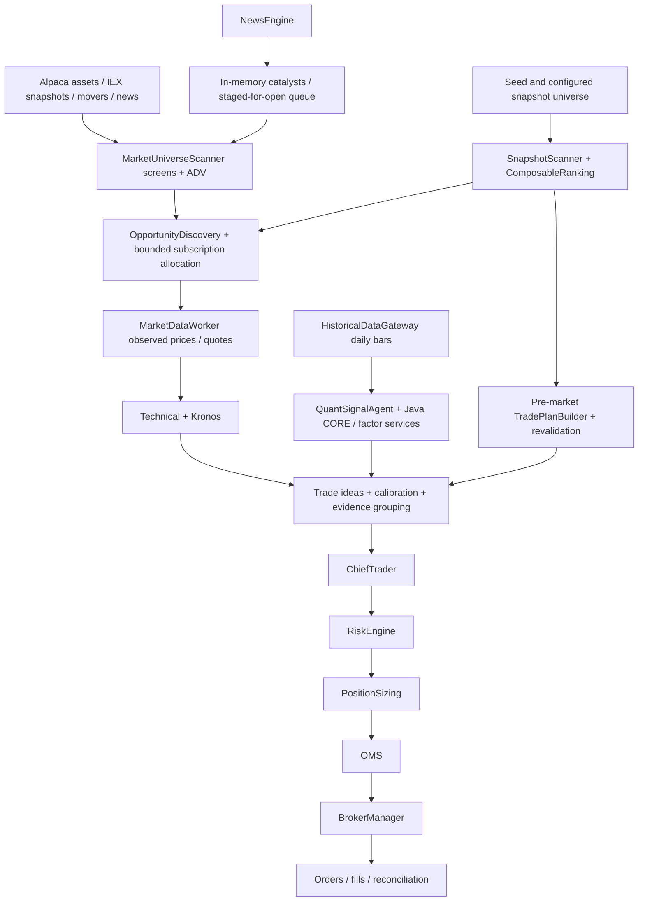
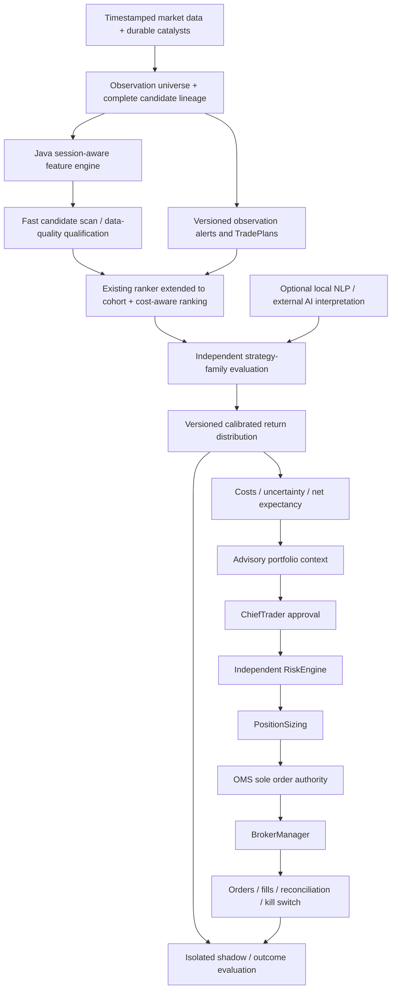

# ARGUS — Missed Opportunity Forensics and Quant-First Redesign Plan

Analysis date: September 26, 2026. Primary case date: Friday, September 25, 2026. Comparison date: Thursday, September 24, 2026, interpreting the follow-up request's “Thuesday” as Thursday. All narrative times are America/New_York (EDT, UTC−04:00); database timestamps remain UTC. **Analysis and planning only. No implementation is authorized by this document.**

## Executive Summary

Argus has **both an upstream discovery/data failure and a downstream evidence-quality bottleneck**. “Discovery works; consensus is too strict” is not an adequate diagnosis of these mornings. Nor does the evidence support buying the six stocks simply because they appeared on a pre-market gainers list.

The strongest findings, in priority order:

1. **Historical ADV retrieval is defective.** `fetchAvgDailyVolumeShares()` asks for daily bars with `limit=days` but no historical `start`/`end`, and ignores pagination. Alpaca documents that the default start is the current day and that the multi-symbol limit is shared across results sorted by symbol. This does not retrieve the intended multi-day, per-symbol ADV. Friday pre-market recorded **2,994 broad-universe ADV_DATA_UNAVAILABLE rejections covering 380 symbols**, and **zero discovery admissions** across broad/mover/news admission events. Thursday had the same pattern: 2,363 broad-universe ADV-data rejections across 399 symbols. Fixing this should recover valid measurements, not weaken liquidity gates. [S1, W1, D1]
2. **Pre-market feature semantics are unreliable.** The discovery screen combines IEX latest price with daily-bar volume; APUS was repeatedly screened using a previous-day trade and previous-day daily bar. The broad scanner's `gapPct` means return from daily-bar open, while the separate ranker uses open/previous-close. The ranker extrapolates regular-session volume before the open, with a 2% floor. These are not a coherent pre-market gap/RVOL definition. [S1–S3, D2]
3. **Overnight catalyst continuity is missing.** AKAM was admitted Thursday afternoon, its Anthropic-related article was analyzed Thursday evening, and catalysts were staged for the next open. Friday restarted. The staging store is an in-memory map/array with no durable rehydration path found. No AKAM pre-market candidate ranking, subscription event, agent prediction, consensus or risk record was found Friday. The store limitation is proven; its exact share of the AKAM miss remains an inference because no restored-queue audit exists. [S4, D3]
4. **AMD was prepared but did not qualify.** It had a 07:10:48 backup BUY TradePlan, was repeatedly ranked and subscribed, and received daily-bar quant evaluation. Java CORE emitted SELL evidence at 0.48, below its 0.60 vote floor; Java factor BUY evidence was only 0.031795. No pre-market consensus/risk row existed. The claim that it was never surfaced internally is false; whether its plan was displayed to the operator is unverified. [D4]
5. **NVDA was analyzed and rejected for substantive reasons.** Ten pre-market consensus rounds included Technical BUY confidence 0.746–0.789 calibrated to 0.457964, opposing Kronos SELL confidence 0.85 calibrated to 0.472119, and Macro HOLD/data-unavailable output. None had two agreeing independent evidence groups. No risk assessment followed. Keeping these rounds out of execution was consistent with the configured safety policy. [D5]
6. **Ranking, pre-market planning, probabilistic evidence, and missed-opportunity diagnostics already exist.** Extend `ComposableRanking`, `TradePlanBuilder`, `QuantEvidence`, forecast infrastructure and existing observability; do not create parallel systems or count Java/TypeScript copies of the same CORE strategies as independent evidence. [S2, S3, S6, S9]
7. **Most Java breadth is research inventory, not validated alpha.** The current registry contains 137 quant models: 131 RESEARCH and six SHADOW. Optional vote adapters exist despite conservative/stale registry comments. None of those statuses establishes incremental predictive value. Priority belongs to data quality, session features, residual/relative-strength signals, cost forecasts and portfolio risk—not activating the whole catalog. [J1]

The first migration phase should therefore repair and verify data semantics and lineage, then preserve overnight candidate state, then test session-specific quantitative evidence. Threshold reductions are not recommended. External AI is already bypassable for some consensus rounds; reliable quant-only operation still needs independently useful, calibrated quantitative evidence and explicit provider-outage validation.

**Limit of this investigation:** complete historical quote tapes, raw broad-universe first-stage responses and a fully matched, executable losing-control sample are unavailable. INLF and PPLI cannot be assigned a precise Friday first-stage rejection. The document supplies the observed traces, bounded conclusions, a preliminary control panel and an exact validation protocol; it does not invent missing evidence or call incomplete comparisons a validated backtest.

## Evidence scope and reproducibility

### What was inspected

- Current source at Git HEAD `a8f04accada7a21d538ab0e243ac63109303e87f`, architecture contracts, relevant tests, reviewed JSON configuration, Java registry and calculation boundaries.
- Initially the immutable read-only `data/backups/argus_2026-09-25.db` snapshot. Its latest observability timestamp is **07:10:28.404 ET**; its file time is approximately 07:10:48. It cannot establish later morning behavior.
- After the user's explicit follow-up, read-only queries against `data/argus.db`, using `better-sqlite3` with `readonly:true`, `fileMustExist:true`, `PRAGMA query_only=ON`, and bounded read transactions. No application startup imports, migrations, API probes requiring credentials, or writes were used. The observed maximum event timestamp was **1790390178575** (2026-09-26T02:36:18.575Z).
- `logs/argus-dev.log` corroborated Friday's subscription churn, agent decisions and startup. Archived audits were used as historical context only; old IBKR entitlement findings were not substituted for Friday's observed Alpaca backend.
- Public vendor documentation and public market/catalyst reports, linked below. External articles establish public availability only, unless Argus ingestion is independently recorded.

Premarket aggregate windows are half-open: **[04:00, 09:30) ET**, or `[08:00Z,13:30Z)`. Full-day summaries use `[04:00Z,next-day 04:00Z)`, the local calendar day. “At 08:45” includes only earlier recorded decisions. A later row's current mutable status is never treated as its earlier status. The initial log probe included the first second after 09:30; all final pre-market totals below use the corrected strict boundary.

No `.env`, encryption key, broker credentials or provider credentials were read. No changes were made to trading settings, code, services, orders or Git staging. Read-only analytical commands were executed inline; this document is the sole deliverable. Existing untracked runtime PID/launch files were present before work.

### Evidence keys

| Key | Reproducible source / locator |
|---|---|
| D1 | `observability_events`, `ts` in each pre-market window; group by `event_type`, distinct `symbol`, and discovery payload `source`/`reason` |
| D2 | APUS Friday discovery event `dd400d4f-c431-4e0f-924f-6ff897b005e5`, 08:41:09.915 ET; all 26 pre-market APUS discovery events |
| D3 | AKAM events Thursday 15:04:53.174, 17:36:21.958, 18:06:07.247 ET; Friday `UNCLEAN_SHUTDOWN_DETECTED` at 07:10:28.404; `news_articles` and NewsCatalystStore source |
| D4 | AMD plan `a4cb23e7-3cb1-4d1f-8a50-5c30b32a8bac`; `candidate_rankings`, `quant_assessments`, `agent_predictions`, Java `QUANT_EVIDENCE_PRODUCED`, fresh-price events |
| D5 | NVDA terminal trace `trace_NVDA_1790338014_e7a4` and nine subsequent terminal rows; detailed table below |
| D6 | Thursday TSLA `risk_assessments.created_at=2026-09-24T12:24:40.367Z`; associated `risk_gate_results` joined on `trace_id` |
| D7 | `agent_confidence_calibration` from the early Friday snapshot; Kronos prediction/outcome join restricted to predictions AND evaluations before 2026-09-25T08:00:00Z |
| D8 | `candidate_rankings` latest cycle before each day's 08:45; `ohlcv_bars` for that day, `timeframe=1Min`, `source=alpaca`; coverage-qualified control panel below |
| S1 | `src/server/continuous/MarketUniverseScanner.ts`: `screenAssets`, `fetchAvgDailyVolumeShares`, `refreshBroadUniverseCache`, `refreshMoversCache`; `discoveryGapEvidence.ts`; `config/continuousIntelligence.json` |
| S2 | `src/server/continuous/SnapshotScanner.ts`: `expectedVolumeAtTimeOfDay`, `scoreSnapshotCandidate`, `getSnapshotScanUniverse`, pre-market branch of ranking cycle |
| S3 | `src/server/continuous/ComposableRanking.ts`, `TradePlanBuilder.ts`, `OpportunityDiscovery.ts`, `BroadUniverseSubscriptionAllocator.ts` |
| S4 | `src/server/services/NewsCatalystStore.ts`, `src/server/news/NewsEngine.ts`, `MarketOpenNewsConfluence.ts`, news providers and scoring |
| S5 | `src/server/services/ChiefTraderAgent.ts`: calibration and serialized consensus; `EvidenceAggregator.ts`, `evidenceIndependence.ts`, `evidenceFamilyTaxonomy.ts` |
| S6 | `JavaCoreEnsembleVoteService.ts`, `JavaQuantAdvisoryService.ts`, `QuantSignalAgent.ts`, `TechnicalAgent.ts` under `src/server/services/` |
| S7 | `KronosForecastAgent.ts`, `engines/kronos/KronosInference.ts`, `ConfidenceCalibration.ts`, `PredictionOutcomeEvaluator.ts`; `config/evaluationHorizons.json` |
| S8 | `src/server/engines/RiskEngine.ts`, `src/server/risk/ExtendedHoursExecutionPolicy.ts`, `config/riskGateOrder.json` |
| S9 | `src/server/quant/QuantEvidence.ts`, `quantEvidenceAdapters.ts`, `src/server/research/forecastEngine.ts`, `quant_forecasts`, Java `ForecastEngine.java` |
| S10 | `CryptoMarketDataIngestion.ts`, `crypto/live/AlpacaCryptoResearchBridge.ts`, `risk/CryptoVenueAvailability.ts`, `src/brokers/CryptoPaperBroker.ts`, `config/cryptoInstruments.json` |
| J1 | `config/engineOwnership.json`, `src/server/config/modelRegistry.ts`, `quant-core-java/src/main/java/io/argus/quantcore/`, module appendix |
| W1 | [Alpaca historical bars API](https://docs.alpaca.markets/us/reference/stockbars): default date range, multi-symbol ordering and pagination |
| W2 | [Alpaca market data FAQ](https://docs.alpaca.markets/us/docs/market-data-faq) and [real-time stock data](https://docs.alpaca.markets/us/docs/real-time-stock-pricing-data): feed and message distinctions |
| W3 | [Alpaca order documentation](https://docs.alpaca.markets/us/docs/orders-at-alpaca): extended-hours order constraints; verify adapter capability independently |
| W4 | [Akamai announcement, September 24](https://www.akamai.com/newsroom/press-release/akamai-announces-11-6-billion-multi-year-agreement-with-anthropic-to-support-growing-demand): $11.6 billion multi-year Anthropic agreement |
| W5 | [September 25 pre-market movers](https://stocksetups.com/movers/premarket), [INLF price history](https://stockscan.io/stocks/INLF/price-history), [INLF news](https://www.benzinga.com/quote/INLF/news), [PPLI quote/news](https://www.benzinga.com/quote/ppli): secondary corroboration, not an immutable 08:45 tape |

Example read-only reconstruction queries (analytical specifications, not implementation code):

```sql
SELECT ts, event_type, symbol, trace_id, payload
FROM observability_events
WHERE ts >= :start_utc_ms AND ts < :end_utc_ms
  AND symbol = :symbol
ORDER BY ts, id;

SELECT agent_name, prediction, COUNT(*) AS n,
       MIN(confidence), MAX(confidence), MIN(timestamp), MAX(timestamp)
FROM agent_predictions
WHERE timestamp >= :start_iso AND timestamp < :end_iso AND symbol=:symbol
GROUP BY agent_name, prediction;

SELECT r.symbol, r.created_at, r.approved, r.rejection_gate,
       g.sequence, g.gate_name, g.passed, g.detail
FROM risk_assessments r JOIN risk_gate_results g ON g.trace_id=r.trace_id
WHERE r.created_at>=:start_iso AND r.created_at<:end_iso
ORDER BY r.created_at, g.sequence;
```

Some event payloads have an extra `payload` wrapper. Normalize it before counting reasons. `CONSENSUS_TERMINAL_REASON.rawConfidence` is an aggregate after producer calibration in these rows; use each participating agent's `rawSignalStrength` for true pre-calibration confidence. Deduplicate ranks by symbol/cycle/version: the first pre-market cycle can persist a second ranking pass with Java context. Do not count these as two independent observations.

## Current-State Architecture



The plan-to-idea and Java-to-idea arrows are gated, not unconditional. Discovery itself does not trade. `BroadUniverseScanner` in the request corresponds to functions in **MarketUniverseScanner.ts**, not a class with that exact name. `MarketMovers` is its mover refresh path.

Friday's fresh-price evidence reports backend **alpaca**; the log shows **12 streaming slots**, not the IBKR 90-line configuration discussed in older audits. Subscription intent, local slot membership, provider acknowledgment, observed price, two-sided executable quote and continuous bar coverage are separate facts.

Node still owns execution control and substantial live computation. Java recomputes CORE strategies and supplies advisory factor/regime/volatility outputs with optional votes. The current registry and older contract descriptions contain stale “advisory only/no consumer” generalizations. Source and persisted events take precedence. Protected execution boundaries remain correct design constraints even where descriptive comments lag code.

Existing ranking uses eight possible components, excludes unavailable components from the denominator, and feeds subscription priority. It is a heuristic score, not expected net return. Existing forecast/evidence contracts already have many requested probability, return, cost and provenance fields; unsupported fields are correctly null. The target is to make these contracts empirically meaningful.

## Today's Six Missed-Opportunity Forensics

### Time boundaries and operational coverage

At **04:00 Friday**, the inspected records do not establish an operating discovery process. Friday's first corroborated runtime activity is around **07:10**, with an unclean-shutdown event referencing Thursday's last heartbeat at 19:42:15.669 ET. This supports an overnight continuity problem; it is not proof that no other process or external feed existed anywhere during 04:00–07:10.

The following traces report first observations within the inspected Thursday/Friday windows, not first awareness over the application's lifetime. The user-reported 08:45 gains are treated as observations, not as verified entry prices or subsequent profitable outcomes.

| Symbol | 04:00 / prior context | By 08:45 Friday | Up to 09:30 Friday | Last demonstrated blockage |
|---|---|---|---|---|
| INLF (~+111% reported) | No symbol event, article or target-day bars found in inspected two-day evidence | No rank, subscription, agent prediction or consensus record | Same absence | Unobserved upstream; exact eligibility/first-stage outcome unknown |
| APUS (~+28%) | Thursday mover detections rejected on PRICE then DOLLAR_VOLUME | Mover found it by 07:15:49; repeated DOLLAR_VOLUME rejection using stale snapshot fields | 26 mover rejections, no agent/rank/plan/consensus | Discovery screen; not a consensus failure |
| AKAM (~+13%) | Thursday 15:04 broad admission; 17:36 and 18:06 catalysts staged, including Anthropic headline | No Friday pre-market continuation into rank/subscription/evaluation | No agent/consensus/risk row | Overnight continuity plus unobserved Friday discovery stage |
| PPLI (~+9%) | Thursday 15:49 broad screen passed enough to reach ADV, then ADV_DATA_UNAVAILABLE | No Friday pre-market recorded candidate activity | No agent/consensus/risk row | Friday exact stage unknown; Thursday ADV failure proven |
| AMD (~+2%) | Friday plan at 07:10:48; subscription at 07:11:34 | Backup BUY plan; repeated daily quant no-trade and weak Java evidence; no consensus | 27 rank rows, 23 quant assessments, no premarket Technical/Kronos prediction | Data continuity and strategy/vote qualification, before ChiefTrader |
| NVDA (modestly positive) | Ranked 07:10:48, subscribed 07:11:34; broad path also rejected on missing ADV | Fresh price by 08:06:54; Technical BUY versus Kronos SELL; ten rejected consensus rounds | 27 rank rows, 25 quant assessments; no Chief approval or risk | Calibration, opposing evidence, insufficient agreeing independence |

### INLF — missing observation, not proven bad rejection

Eligible-universe membership at the time is **unknown**. Broad first-stage per-symbol outcomes are held only for the most recent cycle, and historical persisted rows do not cover every initial asset rejection. No mover event was found. No subscription, quote/trade/bar observation, Technical/Quant/Java/Kronos/Fundamental/Macro/News prediction, calibration input, consensus, risk, OMS or fill record was found before the open.

The reported percentage move would make a gap observable to a feed with a correct previous close and timely trades; Argus's actual access is unproven. Abnormal volume, breakout, volatility expansion and executable liquidity are likewise unproven. A later public report attributes the move to first-half results announced September 24 [W5]; no corresponding Argus article was found. A headline retrieved now must not be inserted retrospectively as if Argus received it then.

**Classification:** DATA_LIMITATION and UNVERIFIED_HYPOTHESIS. Possible price/liquidity/universe/feed exclusions cannot be chosen as the actual reason without raw response evidence. **Verdict:** no basis to say it should have been bought, but insufficient discoverability/lineage to explain the absence. Required capabilities: complete observation-universe ledger, timestamped catalyst intake and session-aware microcap measurements.

### APUS — discovered, then screened using inadequate evidence

Friday's mover path returned APUS. At 08:41:09.915 [D2], Argus recorded price **5.11**, dollar volume **1,598,096.29**, spread **2,738.916 bps**, no ADV, and no valid gap/RVOL. The stored trade timestamp was **Thursday 16:50:24.209 ET**, daily-bar timestamp Thursday midnight ET, and previous-close timestamp Wednesday midnight ET. The same stale trade was still present in the last 09:26 discovery rejection; the displayed spread then was 2,881.356 bps.

The first failing configured screen was **DOLLAR_VOLUME**, below **$5 million**. The stored spread would also exceed the **50 bps** ceiling, but its quote timestamp is not retained in this payload: it cannot certify Friday's executable spread. The gap validator correctly returned `STALE_OR_INCONSISTENT_REFERENCE_TIMESTAMP`. That guard prevented a fabricated gap, while the broader screen still used stale snapshot data for other decisions.

Thursday shows the same structural weakness: first price 2.27 failed the $5 floor; later prices 5.14–7.00 passed price but multiplied stale daily volume, yielding only roughly $8,728–$11,886. Those are measured payload values, not proof of the true consolidated pre-market turnover.

APUS did not reach ADV evaluation Friday because the earlier screen failed. No rank/plan, subscription, agent prediction, confidence, consensus or risk record was found. Volume and bid/ask fields existed in snapshots; **fresh, session-correct availability did not**. Momentum/breakout/volatility could not be reliably reconstructed from these fields. No ingested catalyst was found.

**Classification:** PROVEN_CODE_DEFECT for missing freshness/session validation in the price/volume screen; DATA_LIMITATION for actual market coverage; EXPECTED_SAFE_REJECTION for refusing to trade without reliable liquidity evidence. **Verdict:** failure to observe/rank it correctly is actionable; execution eligibility remains unproven. Do not solve this by lowering volume/spread thresholds.

### AKAM — public catalyst was also known to Argus

Thursday **15:04:53.174**, broad discovery admitted AKAM: price 112.61, observed dollar volume $12.55m, spread 16.839 bps, reported ADV 2,333,106. Because of the defective ADV retrieval, that number is evidence of what the system used, not a certified multi-day average.

The company publicly announced the Anthropic agreement September 24 [W4]. Argus stored an Anthropic/Akamai article with publication time **16:38:52 ET** and analyzed/staged the Yahoo Finance UK catalyst at **18:06:07.247–.248**. Publication-to-analysis delay was about **87m15s**; it does not isolate provider delay from polling/processing. Another source staged AKAM at 17:36.

Friday had no AKAM discovery decision, ranking, TradePlan, subscription or agent/consensus/risk record before 09:30. Current code stores staged catalysts only in process memory. No recovery caller rebuilding `recordNewsCatalyst()` from persisted news was found. Friday restarted, so durable articles do not imply a restored actionable catalyst queue. The ranker's recent-news window also does not substitute for overnight carryover.

Raw/calibrated Friday confidences and risk gates are **not applicable: no evaluation recorded**. Quote, trade, bid/ask, bars and intraday feature availability are unknown. Fundamental context might help judge contract materiality over days; it was not a demonstrated independent short-horizon vote.

**Classification:** ARCHITECTURAL_LIMITATION / MISSING_CAPABILITY for durable catalyst continuity; UNVERIFIED_HYPOTHESIS for assigning the entire miss to the restart. **Verdict:** a strong case for an observation/watchlist and next-open plan; still no evidence that buying at +13% offered positive net expectancy.

### PPLI — prior-day eligibility evidence, missing Friday lineage

Thursday **15:49:55.561**, broad discovery reached the ADV stage: price **35.77**, dollar volume **$6,020,663.32**, spread **16.774 bps**, then rejected `ADV_DATA_UNAVAILABLE`. Thus it was in the prior day's broad eligible path; it cannot be dismissed as a permanently unknown ticker. Friday pre-market no per-symbol discovery, subscription, rank, plan, agent, consensus or risk entry was found.

No PPLI article was found in the inspected publication window. Public secondary reporting links the move to MGM/People transaction reporting [W5]; precise primary-source dissemination time and Argus receipt were not established. There are no local target-period bars for PPLI. Gap/momentum/abnormal volume were potentially observable externally but not proven available to Argus.

**Classification:** DATA_LIMITATION, with Friday cause UNVERIFIED_HYPOTHESIS. **Verdict:** Thursday's missing-ADV rejection was appropriately fail-closed, but the ADV producer requires repair. Friday's exact disappearance cannot be reconstructed from a missing first-stage ledger.

### AMD — preparation existed; quantitative entry evidence did not qualify

At **07:10:48.903**, Argus created a **BACKUP BUY** plan, rank **8**, score **0.560687**, confluence **0.4**. It referenced entry zone **628.61–629.44**, invalidation **628.61**, and a purported RVOL **92.37x**. That RVOL is a ranker artifact requiring session validation, not a certified 92-fold pre-market surge. Friday's 27 rank rows ranged rank **3–9**, score **0.560687–0.636090**; the latest before 09:30 was rank 7, HOLD recommendation.

Subscription requests began **07:11:34.376**; 70 requests and 29 evictions appear through the open boundary in the corroborating log probe. Local subscription membership did not produce continuous useful data: three fresh-price recoveries timed out at 07:27:48–07:58:07, backend Alpaca, price null, zero ticks in the example. Later eviction records show some ticks, so “no data all morning” would also be false.

QuantEngine recorded **23 assessments/no-trade outputs**. The recorded reason was failure to produce a strategy idea clearing live EV and minimum reward/risk; regime-only output was explicitly not a trade. Java CORE produced **16** recorded decisions, **SELL 0.48**, healthy status, three agreeing CORE strategies, two families and effective independent count **1.787817**. The confidence is below the **0.60** vote floor; it also cannot satisfy the alternate three-family/2.5-effective-count qualification. JavaFactorComposite produced four **BUY 0.03179546** shadow predictions beginning 08:22:39, far below its 0.60 vote floor. It was weak, not demonstrably disabled.

No pre-market Technical prediction or Kronos prediction was recorded. Their first log starts at approximately **09:30:00**, outside this window. Fundamental did not produce recorded prediction evidence. An AMD article published 07:03 was analyzed/staged **08:06:16.855–.871**, about **63m17s** later; its headline was valuation caution, not proof of bullish catalyst quality. Macro produced no AMD pre-market prediction in the query.

No consensus, risk assessment, order or fill followed. Raw factor/core strengths above are not calibrated probabilities; no per-round calibration exists because they did not enter an AMD consensus round. Historical bars supported daily models, not demonstrated minute breakout analysis. Latest price access was intermittent; historical bid/ask/spread continuity is not reconstructible.

At **09:31:07**, the plan was DOWNGRADED with price 635.26 and score 0.309. It was finally INVALIDATED at **11:35:01.186**, price 628.17 below 628.61. Its current INVALIDATED status must not be projected backward to 08:45.

**Classification:** EXPECTED_SAFE_REJECTION for unqualified ideas; ARCHITECTURAL_LIMITATION for daily-versus-fast horizon and first-cycle plan creation; DATA_LIMITATION for quote continuity. **Verdict:** improve measurement, plan refresh and useful intraday evidence; do not claim total discovery failure or force a BUY from weak/opposing models.

### NVDA — detailed consensus reconstruction

First Friday rank: **07:10:48.903**. Subscription request: **07:11:34.370**. Broad discovery separately rejected NVDA **eight** times on unavailable ADV; the seed/ranking path kept it under evaluation. Twenty-seven rank rows span rank **5–74**, score **0.445626–0.604558**. No pre-market TradePlan was created for NVDA. Current source only builds drafts when the day's plan list is empty, so a later rising rank does not automatically add a new plan.

Early fresh-price waits timed out. At **08:06:54.972**, a fresh-price event recorded **226.25**, quote age **155 ms**, tick count **30** and backend Alpaca. It establishes an observed price, not a certified NBBO or full tape. The log has 71 subscription requests and 20 evictions through the open probe.

Agent evidence before the open:

| Producer | Observed output | Consequence |
|---|---|---|
| QuantEngine | 25 assessments; strategy/EV/R:R no-trade output | No qualified directional quant idea shown |
| JavaCoreEnsemble | 18 decisions, BUY 0.27; 4/5 agreement, three families, effective independent count 1.595295 | Below 0.60 vote floor and alternate effective-count floor; “four agreeing strategies” is not four independent votes |
| JavaFactorComposite | Six SELL predictions at 0.16941989 | Below vote floor; opposite to Technical BUY |
| KronosEngine | Five SELL and six HOLD forecasts, all raw confidence 0.85 | SELL calibration 0.472119 from 7,271 historical bucket outcomes; HOLD is not a BUY confirmation |
| TechnicalAgent | Three BUY predictions: 0.789, 0.767, 0.746 | Each calibrated to 0.457964; bucket sample 2,131 |
| MacroAgent | Eleven HOLD predictions at 0 | Missing data/non-voting evidence, not independent bearish proof |
| News | Catalyst staged at 08:06:16 from shared AMD valuation article | No NewsAgent consensus vote recorded |
| FundamentalAgent | No recorded pre-market prediction | Absence does not establish its runtime flag; long-horizon evidence should not be forced into a scalp |

| ET terminal time | Trace suffix (full prefix `trace_NVDA_`) | Final aggregate | Terminal reason | Agreeing groups |
|---|---|---:|---|---:|
| 08:06:54.991 | `1790338014_e7a4` | 0.472119 | CONFIDENCE_BELOW_STRONG | 1 |
| 08:09:14.609 | `1790338154_3237` | 0 | AGENT_DATA_UNAVAILABLE | 0 |
| 08:10:53.676 | `1790338228_887a` | 0.136206 | CONFIDENCE_BELOW_STRONG | 1 |
| 08:11:44.633 | `1790338304_0b72` | 0 | AGENT_HOLD | 0 |
| 08:14:14.625 | `1790338454_6e37` | 0 | AGENT_DATA_UNAVAILABLE | 0 |
| 08:34:31.488 | `1790339635_52e2` | 0.457964 | CONFIDENCE_BELOW_STRONG | 1 |
| 08:35:02.119 | `1790339702_1b6b` | 0.136206 | CONFIDENCE_BELOW_STRONG | 1 |
| 08:35:53.568 | `1790339753_4b0b` | 0.136206 | CONFIDENCE_BELOW_STRONG | 1 |
| 08:37:30.921 | `1790339828_3d49` | 0 | AGENT_HOLD | 0 |
| 08:39:39.070 | `1790339978_3015` | 0 | AGENT_HOLD | 0 |

The 08:10 round contains Technical BUY, Kronos SELL and Macro HOLD=0. Disagreement reduces the winning aggregate; the 0.136206 number is not a probability forecast. No round met strong approval, none contributed the alternate quant qualification, and no risk gate evaluated NVDA. Extended-hours policy therefore was **not its realized rejection point**.

**Classification:** MODEL_QUALITY_PROBLEM for low measured reliability; ARCHITECTURAL_LIMITATION for score semantics/horizon mixing; EXPECTED_SAFE_REJECTION for these decisions. **Verdict:** a legitimate candidate was analyzed; the evidence does not justify labeling the blocked trade an error. Later local bars show negative returns over an incomplete post-open interval, illustrating why “positive pre-market” cannot serve as a positive outcome label.

### Common trace fields and honest missing values

For INLF/APUS/AKAM/PPLI, there are no recorded pre-market participating agents or confidences; do not populate them with zeros. For all six, no pre-market RiskEngine row means **gates not reached**, not “all gates failed.” Consequently sizing, OMS, broker order, and fill stages are not reached in the recorded case chains.

APUS had stale snapshot price/volume/spread fields; NVDA demonstrably had fresh observed prices later; AMD had intermittent tick evidence and early timeouts. None has a complete historical two-sided quote/trade tape in this audit. Bar presence at audit time does not prove the bar was ingested before the decision. Exact pre-market high/low, VWAP, abnormal volume, breakout and volatility-expansion values cannot be supplied for each case from the stored data without that provenance. Structural calculation capability and historical availability are different columns in the audit below.

## Pre-Market Capability Audit

| Capability | Current implementation/evidence | Assessment and required change |
|---|---|---|
| Session awareness | SessionLifecycle emits PREMARKET_SESSION_STARTED; separate discovery/preparation/execution paths | Exists; verify holidays, half days and DST, not only weekday/time arithmetic |
| Broad universe | Active tradable equities, allowed exchanges; IEX screen, SIP ADV request, FMP fallback | Broken multi-day ADV request; no complete retained first-stage ledger |
| Movers | Top gainers/losers screened through price/volume/spread/ADV | APUS found; screening can erase valid observation candidates before ranking |
| Subscription | Bounded allocation, rescue, protected slots, aging-aware broad allocation | Friday observed 12-slot backend; heavy churn and early zero-tick slots; requests are not feed coverage |
| Quotes/trades | MarketDataWorker records observed price and bid/ask support | Session/feed coverage must be measured separately; do not declare full pre-market availability from a connected socket |
| Historical bars | Daily Quant/Java analysis; minute bars persisted selectively | No target-period bars for four cases; AMD/NVDA minute coverage incomplete |
| ADV | Intended multi-day consolidated volume | Proven request-range/pagination defect; also require completed sessions and minimum count |
| RVOL | Broad daily volume/ADV; snapshot daily volume divided by regular-session expected-volume proxy | Neither is a validated same-clock pre-market RVOL curve; extreme 50–100x values can be arithmetic artifacts |
| Gap | Broad current/daily-open return; ranker daily-open/previous-close | Different quantities under one name; preserve both with session/time provenance and add true pre-market/previous-RTH-close gap |
| Pre-market high/low | Latest minute/daily ranges are available sometimes | No verified session-specific accumulation across 04:00 onward for the six cases |
| VWAP | Quant modules can compute volume-dependent features | No demonstrated pre-market tape-backed VWAP for the cases; historical daily context is insufficient |
| Liquidity/spread | Dollar-volume/ADV screens; real spread gate outside RTH | Keep execution fail-closed; introduce observation-only candidate state when measurements unavailable |
| News/catalyst | Multi-provider ingestion, local-first analysis, clustering and staging | Persist/recover staged catalysts and instrument associations; distinguish mention from material catalyst |
| Triggers | Tick-driven Technical/Kronos; five-minute quant cycles; co-evaluation | Unsuitable to call every daily-model output fast-momentum evidence; instrument queue/warmup separately |
| TradePlan | Actual pre-market drafts, optional ideas and regular-session revalidation | First-cycle-only creation misses later emerging candidates; plans need revisions and first-seen/last-valid lineage |
| Consensus | Calibration, evidence grouping, strong and optional moderate tiers | Existing safety; add horizon-consistent forecast study rather than lowering floors |
| Extended execution | Market-hours gate plus extended policy; LIMIT construction exists when applicable | Already separate from discovery. Broker capability, fresh spread, liquidity and notional constraints remain mandatory |

The current code already distinguishes **watch** from **trade** for some missing microcap fields (`WATCH_ALLOW_UNKNOWN_REASONS`), but broad/mover hard screens occur before that distinction can preserve every interesting observation. Proposed separation: a broad observation universe, a quality-qualified research universe, and a strictly executable universe. A candidate with unavailable liquidity may receive an alert labeled “needs data,” never a tradable approval.

## Opportunity Funnel

### Observed pre-market throughput

Counts below mix event and unique-symbol units only where explicitly labeled. They are **not** a single monotone population: seed discovery bypasses broad admission, one symbol creates repeated ideas/rounds, and 04:00 coverage was incomplete.

| Stage | Thursday 04:00–09:30 | Friday 04:00–09:30 |
|---|---:|---:|
| Entire market / historical eligible universe | Unknown | Unknown |
| Persisted discovery filter events / distinct symbols | 4,363 / 498 | 5,594 / 479 |
| Broad ADV_DATA_UNAVAILABLE events / symbols | 2,363 / 399 | 2,994 / 380 |
| Discovery admission events | 0 | 0 |
| Candidate ranking rows / symbols / cycles | 2,562 / 122 / 20 | 3,294 / 122 / 26 |
| Subscription request events / symbols | 570 / 18 | 735 / 18 |
| Confirmed continuous usable subscriptions | Not reconstructible | Not reconstructible |
| Quant assessments / symbols | 321 / 14 | 405 / 15 |
| Technical completions / symbols | 342 / 10 | 303 / 7 |
| Trade-idea events / symbols (includes HOLD) | 486 / 10 | 401 / 8 |
| Consensus terminal rounds / symbols | 268 / 9 | 204 / 8 |
| Rounds with ≥2 agreeing evidence groups | 39 | 27 |
| Alternate quant independence contributed | 0 | 0 |
| Chief approvals | 1 (TSLA) | 0 |
| Risk assessments / approvals | 1 / 0 | 0 / 0 |
| Sizing → OMS → broker → fills for these chains | Not reached | Not reached |

Friday discovery filters break down into 2,994 broad missing ADV; mover missing ADV 18; mover dollar volume 315; mover price 2,207; mover spread 60. These are repeated events, not 5,594 distinct misses. The observed 122-symbol ranking universe is seeded/configured, not proof that the broad scanner admitted 122 names.

Full local-calendar-day comparison: Thursday had **2,951 admission events/462 symbols**, **12,845 ideas/16 symbols**, **6,491 terminal rounds**, one Chief approval and one rejected risk assessment. Friday had **3,812 admission events/366 symbols**, **12,550 ideas/20 symbols**, **6,331 terminal rounds**, zero Chief approvals and zero risk assessments. Neither day had a `trades` row in the queried local-day window. Thus broad discovery can operate later in the session, but “hundreds discovered” obscures the pre-market failure and narrow evaluated universe.

Directional and independent-evidence recall cannot be inferred from these counts. A permanent funnel must join candidate episodes across stages, retain multiple simultaneous blockers, and publish coverage/missingness. Agent rows and repeated terminal rounds are not independent opportunities.

### Opportunity recall framework

Define an opportunity episode as `(instrumentId, venue, session, decisionTimeBucket, direction, horizon, labelVersion)`, with overlapping signals merged into one episode by a rule frozen before evaluation. Maintain two denominators: all observed market opportunities, and opportunities executable under the contemporaneous mandate. Report the gap between them; do not redefine eligibility after seeing outcomes.

Retrospective labels may use future data **only in the evaluator**. For each pre-specified decision time and horizon, evaluate a fixed feasible entry/exit policy using the next obtainable quote after modeled latency, bid/ask, size/depth, halts, fees and adverse selection. Require a pre-registered net-return hurdle and drawdown/MAE budget. Keep separate labels for discovery-worthy events and safely tradable opportunities. A future high is not a fill price. If target and stop both occur inside one unresolved bar, use conservative ordering or mark unresolved.

| Metric | Exact denominator / numerator |
|---|---|
| Universe coverage | Labeled opportunities in contemporaneous eligible universe / all labeled observable market opportunities |
| Discovery recall | Labeled eligible episodes discovered before their deadline / all labeled eligible episodes |
| Signal recall | Labeled eligible episodes with a useful timely model evaluation / all labeled eligible episodes; also report conditional-on-discovery version |
| Directional recall | Correct-direction timely evidence on labeled episodes / all labeled eligible episodes |
| Evidence-family coverage | Fraction of episodes with each required observable family; distribution of empirically effective family count, with UNKNOWN separate |
| Consensus conversion | Unique episodes Chief-approved / unique episodes presented to Chief; partition positive/negative labels |
| Risk conversion | Episodes risk-approved / episodes assessed by risk; record valid safety rejections separately |
| Execution conversion | Filled intended episodes / OMS-accepted episodes; also broker-accepted and partial-fill ratios |
| Opportunity capture | Feasible benchmark net value captured by the strategy / feasible benchmark value of labeled eligible episodes; cap/define overlapping capital use |
| Precision | Recommended episodes meeting their pre-registered net utility target / evaluable recommended episodes |
| False-positive rate | Negative-label episodes recommended / all evaluable negative-label episodes; do not confuse with 1−precision |
| Avoided-loss rate | Rejected negative-label episodes / all evaluable rejected episodes; separately report avoided-loss recall over all negatives |

Also report discovery latency, opportunity remaining at first awareness, abstention, quote coverage, decision yield by cohort, calibration error and net expectancy. Unknown outcomes remain censored with counts, not zero-return successes. Extend `missed_opportunities` and its evaluator, but do not make its currently ranked/PROMOTE-biased population the denominator for market recall. Its `classifyMiss` fall-through can describe “approved by both” even when `hadRiskAssessment=false`; this is a source-proven diagnostic labeling defect, not an execution bypass. Correct that in a later authorized observability phase.

## Missed-Opportunity Root Causes

Every major diagnosis uses the requested taxonomy. Severity reflects demonstrated reach, not speculative profit foregone.

| ID | Classification | Evidence and bounded conclusion | Priority |
|---|---|---|---|
| R1 | PROVEN_CODE_DEFECT | ADV request lacks historical dates/pagination; documented API semantics contradict intended multi-day average. Both mornings lose hundreds of broad candidates to missing ADV. Exact provider response attribution is not retained. | P0 |
| R2 | PROVEN_CODE_DEFECT | Screen price/dollar-volume freshness not validated like gap; APUS uses previous-day trade/volume. Snapshot ranking applies regular-session expected volume before open. | P0 |
| R3 | ARCHITECTURAL_LIMITATION | Full first-stage universe/screen responses and subscription acknowledgment/tape lineage absent; INLF/PPLI Friday disappearance cannot be assigned precisely. | P0 |
| R4 | MISSING_CAPABILITY | Durable staged-catalyst recovery absent; AKAM known Thursday and absent Friday after restart. Causal contribution is strongly supported but not fully measured. | P0 |
| R5 | ARCHITECTURAL_LIMITATION | Snapshot ranking universe is configured/seeded; broad/mover candidate union is a separate path. Plans generated only when daily list empty. | P1 |
| R6 | DATA_LIMITATION | Friday Alpaca 12-slot churn, early null prices and sparse bars; account entitlement failure is not proven by these observations. | P1 |
| R7 | MODEL_QUALITY_PROBLEM | Low historical reliability in Technical/Kronos; Java CORE/factor outputs too weak to vote for AMD/NVDA. Profitability and incremental edge remain unestablished. | P1 |
| R8 | ARCHITECTURAL_LIMITATION | Daily quant, irregular ticks, multi-day fundamental and minute-scale trading intentions lack a unified horizon contract. Confidence combines scores and reliability. | P1 |
| R9 | EXTERNAL_PROVIDER_LIMITATION | NVDA debate had no routable provider or no usable verdict on observed rounds. This delayed some decisions but did not create a hidden strong independent BUY. | P1 |
| R10 | EXPECTED_SAFE_REJECTION | NVDA rejected weak/opposing evidence; TSLA Thursday blocked for missing spread; Java votes below floor correctly withheld. | Preserve |
| R11 | OPERATOR_CONFIGURATION | $5 price/$5m dollar-volume/50bps spread/500k ADV, source flags and finite slots define mandate. Values are not defects merely because they exclude a mover. Historical unknown flags remain unknown. | Document |
| R12 | PROVEN_CODE_DEFECT | MissedOpportunityDetector's terminal fallback overstates risk approval when no assessment exists. TradePlan end-of-day helper hardcodes −04:00, unsuitable for standard-time dates; irrelevant to these September dates. | P1 diagnostics/calendar |
| R13 | UNVERIFIED_HYPOTHESIS | Exact INLF exclusion, precise Friday PPLI filter, user-interface visibility failure, historical entitlement cause, and profitability of a hypothetical +111% entry | Do not implement assumptions |

No attribution of “lost profit” is justified. R1–R4 should be addressed first because they corrupt availability and explainability across many symbols; model selection before repairing inputs would optimize artifacts.

## Control-Group Analysis

### What can be compared now

The six are **not a verified winner set**. INLF's secondary reported close was +72.88% versus the user's approximate +111% pre-market observation; that alone shows a positive day need not be a profitable late pre-market entry [W5]. This is context, not a reconstructed executable trade. NVDA and AMD also have negative later sampled returns below.

A reproducible preliminary control pool was built from **all 122 symbols ranked before 08:45** on each day, using the latest cycle at/before the cutoff. Outcomes were inspected afterward. This avoids selecting the pool only from future losers. Local minute bars are sparse and uneven; no historical spread/depth series exists. Therefore these are **gross observed-interval diagnostics**, not same-horizon matched returns, not fill simulations, and not proof of avoided losses.

| Cohort / candidate | Information available before outcome | Later local observed interval (ET), bars | Gross open-to-last-close change | Interpretation |
|---|---|---|---:|---|
| Friday AMD, case | Rank 7 / 0.575661 at 08:42; backup BUY plan | 10:06–12:42, 120 | −0.753% | Case itself can fade after the open; missing 08:45 entry prevents full labeling |
| Friday NVDA, case | Rank 23 / 0.519558; conflicting BUY/SELL evidence | 09:36–15:25, 300 | −1.241% | Positive pre-market is not a success label; sampled MAE −1.479% |
| Friday AMZN, provisional large-cap tech control for AMD | Earlier backup BUY plan 0.596341; rank 9 / 0.564709 at 08:42; RVOL score saturated at 1, catalyst score 0.9 | 09:30–10:25, 56 | −0.274% | Comparable heuristic score can accompany fade; missing pre-market quote matching prevents a causal comparison |
| Friday TQQQ, ETF stress control, not a matched single stock | Backup BUY plan; rank 3 / 0.627775 near cutoff | 09:16–09:25, 6 | −0.414% | Sparse pre-market reversal example; leverage/product structure makes it unsuitable as a matched AMD control |
| Friday SOXL, sector-leverage stress control | Rank 2 / 0.695399 near cutoff; original plan SELL, not BUY | 08:47–09:47, 20 | −0.079%, sampled low −2.407% | Large adverse excursion for a hypothetical long; do not mislabel the existing short thesis as a failed long |
| Thursday ADBE, high-ranked software control candidate | Rank 1 / 0.690829 before 08:45 | 09:30–09:43, 13 | −2.263% | Strong heuristic ranking did not guarantee continuation; exact catalyst/gap matching unavailable |
| Friday AAPL, non-losing background control | Rank 96 / 0.416502 before 08:45 | 09:30–15:59, 144 | +1.508% | Include positive and low-ranked controls to avoid constructing only a failure sample |

Returns are `last observed close / first observed open − 1` over the stated intervals, without costs. No interpolation or cross-window performance comparison is valid. This panel establishes that high rank and positive pre-market observations are insufficient; it does **not** establish a useful discriminant or ranker lift.

### Proper matched losing controls: data requirement and selection rule

INLF/APUS microcap matches cannot be completed honestly: no local target-day bars for those names or candidate MGLD/PMAX, and no point-in-time quote/float/corporate-action panel. Public mover pages list additional candidates but change over time and do not certify the 08:45 state. Do not use a morning decliner as a “failed attractive gainer” merely because it lost money.

Before strategy research, freeze a full market observation panel at 04:00, 07:00, 08:00, 08:45 and 09:25 (or a fixed minute grid), including delisted/renamed instruments and rejected candidates. Match without outcome information on asset type, log price, market cap/float where known, prior liquidity, same-time gap bin, session RVOL, spread, catalyst class/time, halt/shortability state and regime. Use within-day nearest neighbors with pre-registered distance/calipers and at least several controls per case; allow “no adequate match.” Keep leveraged ETFs separate. Only afterward label continuation, fade, illiquidity, failed breakout or unevaluable outcomes at fixed horizons.

Evaluate all matched outcomes, with both positive and negative controls; use label-stratified reporting only after cohort formation. Cluster confidence intervals by day/catalyst and instrument, not repeated signal count. Require enough independent days and events to meet a pre-specified power target. September 24–25 are forensic fixtures, **excluded from final OOS model selection**. This is an explicit unresolved validation prerequisite, not evidence that a control-based redesign already works.

## Consensus Analysis

Friday's 204 pre-market terminal reasons: **165 CONFIDENCE_BELOW_STRONG**, **15 AGENT_HOLD**, **14 AGENT_DATA_UNAVAILABLE**, **7 MODERATE_REJECT_INSUFFICIENT_INDEPENDENCE**, **3 MODERATE_REJECT_CALIBRATION**. Only 27 rounds had two or more agreeing evidence groups, and maximum final confidence was **0.647469**. Thursday: 217 below-strong, 19 hold, 12 data-unavailable, 11 moderate independence, five moderate calibration, three insufficient participation, one approved. Maximum Thursday confidence was 0.946.

The architecture has more than one approval path: strong threshold **0.75**, optional moderate **0.60** with additional tests, and alternate quant independence requiring at least **three families and 2.5 effective independent count**. Moderate-tier events prove evaluation occurred during these sessions. Do not present “one absolute threshold” as the complete current code.

`EvidenceAggregator` computes a weighted directional score, subtracts opposing confidence times the configured disagreement penalty **0.5**, and divides by the combined directional weight. HOLD=0 is excluded; only configured hard-veto HOLD agents penalize direction. Increasing the number of similarly calibrated 0.47 votes does not make their weighted mean 0.75. Conversely, a lower success probability can have positive expectancy with asymmetric payoffs; probability alone cannot replace expected payoff and costs.

This means **weak measured reliability and a semantic mismatch coexist**. There is no evidence that relaxing consensus creates robust expectancy. Keep the current protected path while studying a horizon-specific probabilistic model in shadow. Any eventual replacement decision semantics require a separate reviewed architecture change, not a ranking score smuggled in as 0.82 confidence.

Independence is partly structural, not empirically established. QuantEngine and JavaCoreEnsemble share `CORE_QUANT_ENSEMBLE`; correct. JavaFactorComposite has a different structural model but still consumes related prices. Technical, Kronos, factor and CORE may share market exposure and correlated errors. Measure conditional incremental log-loss/net-utility improvement and error correlation on held-out data; group shared features and duplicated catalysts. Regime, volatility and liquidity are conditioning/risk inputs, not automatic bullish votes. An AI rephrasing of quant evidence is not another independent family.

Thursday TSLA supplies the execution distinction: 23 applicable recorded gates passed, including market-hours, freshness and sizing; `extended_hours_execution_policy` failed `EXTENDED_HOURS_NO_SPREAD_DATA`. The BUY assessment omitted the SELL-only `sell_position_exists` gate. This was not a discovery or consensus failure, and the missing spread must not be synthesized.

## Kronos Analysis

The service called **KronosEngine** here wraps local **Amazon Chronos**, with logs naming `amazon/chronos-t5-mini`; do not confuse its brand with a different pretrained financial “Kronos” model. It consumes rolling observed price values, minimum **30** observations, forecast horizon **five ticks**, cooldown **60 seconds**. Its dedicated outcome evaluator uses **five minutes**. On-demand warmup may seed **daily closes** and append live prices. Irregular tick spacing, mixed daily/tick history and a fixed wall-clock evaluation label are material distribution/horizon concerns. They are source-visible; the contribution of each to measured losses is not separately proven.

Raw confidence is `clamp(1 − relative quantile spread × configured multiplier, floor, ceiling)`. It is a dispersion heuristic, not an estimated probability of profitable trading. Tight sampled forecasts can be confidently wrong; repeat quotes can appear low-volatility. Friday NVDA's 11 forecasts all sat at **0.85**, including HOLD forecasts. This is not evidence of eleven 85%-probability trade opportunities.

Pre-Friday stored bucket [0.8,0.9): **3,429 wins, 3,842 losses, n=7,271**, calibrated confidence **0.472119**. This is a stored calibration population, not 7,271 independent trades or a validated OOS sample.

A separate read-only diagnostic joined `agent_predictions` to unique `prediction_outcomes`, requiring prediction and evaluation before Friday 04:00 ET and BUY/SELL with WIN/LOSS. It found **1,356** evaluable rows, **661 wins (48.75%)**, **1,174 SELL (86.58%)**, raw-score-as-probability **Brier 0.379879**, **log loss 1.046661 nats**. A constant 0.5 binary baseline has Brier 0.25/log loss 0.693147. This is a warning about confidence semantics, not a formal OOS comparison: scores were heuristic, outcome selection/retention differs from the calibration bucket, rows may overlap temporally, and no frozen historical model-version/calibration-version split was reconstructed. No duplicate prediction-outcome keys were found in that source-table query; deduplication does not make correlated observations independent.

Do not use today's calibration mapping to claim historical calibrated Brier improvement. Recover each decision's mapping/version or fit calibration only on prior folds. The mismatch between 1,356 retained joinable outcomes and 7,271 accumulated high-bucket counts must be reconciled before retraining decisions. Report outcome coverage and retention, not just win rate.

Required study: fixed clock bars versus irregular ticks; tick-only versus daily-seeded histories; naive last-price/random-walk and simple trend baselines; direction and return distributions at 1/5/15/60 minutes; proper up/down/flat labels; volatility and session strata; symbol-held-out and time-held-out tests; rolling Brier/log loss/reliability diagrams; class-balanced diagnostics; prediction-interval coverage; error autocorrelation; drift in tick rate/volatility/features. Freeze model artifact hash, training-data description and inference settings. Financial pretraining suitability and incremental information are **unverified**; do not infer them from the model name.

Retain Kronos only if adding it to the same quant baseline improves held-out proper scores and net utility after latency/costs. Test removal in shadow, not by disabling it during this task. Never weaken calibration to restore raw 0.85 approvals.

## Java Quant Analysis

### Authority and module value

The registry audit covers all **137 registered quant models**, plus four indicator entries and five CORE strategy entries; the appendix lists every registered model and intended role. This is an inventory/integration audit and targeted source review, not a mathematical certification of every calculator. Unregistered utilities, math primitives, server codecs, backtest engine, forecast/portfolio helpers and tests were considered as infrastructure; filenames or passing tests do not establish alpha. No Java tests/backtests were executed against production data for this planning task.

The six SHADOW registry models are GARCH, HMM regime, factor composite, market-data quality, feature pipeline and volatility engine. Java factor and CORE vote services have explicit feature/pipeline/idea gates and confidence floors; research status comments cannot be used to infer every runtime flag. Friday CORE evidence proves calculations occurred for AMD/NVDA, while factor prediction rows prove advisory computation. Neither implies a qualified vote.

| Priority group | Existing modules to study | Intended contribution | Incremental-value test / constraint |
|---|---|---|---|
| First | MarketDataQualityEngine, FeaturePipeline, VolumeFeatures, PriceActionFeatures, existing gap/volume engines | Timestamp/session validation; gap, same-time RVOL, VWAP, pre-market range, liquidity features | Recover accurate observations versus current semantics; input fixture/parity tests before any P&L claim |
| Second | CrossSectionalRankingEngine, RiskAdjustedMomentumEngine, RelativeStrengthVsBenchmarkEngine, ResidualReturnEngine | Candidate ranking and market/sector-relative evidence | Existing rank engine ranks trailing returns only; compare net-utility ranking on identical frozen candidate sets |
| Second | GapContinuationEngine, AtrBreakoutEngine, DonchianChannelEngine, IntradayGapReversalEngine | Competing continuation/reversal hypotheses at defined intraday horizons | Not four votes; compare conditional outcomes, shared-feature lineage and ablation |
| Third | FactorAlphaEngine / factor composite, SmartBetaFactorEngine, FactorExposureEngine | Residual/factor forecast and portfolio exposure | Daily factor context is not automatically a minute catalyst signal; point-in-time inputs essential |
| Third | GARCH/EGARCH, HMM/MarketRegimeEngine, VolatilityEngine, RegimeVolatilityOverlay | Conditional variance, downside and abstention | Must improve calibration/cost-adjusted utility; never assign a BUY merely because volatility rose |
| Third | ForecastEngine, logistic/regression primitives, simple regularized models | Return distribution/probability baseline | Learn/calibrate chronologically; keep a simple baseline before forests/boosting/SVM/ARIMA grids |
| Fourth | EwmaCovariance, CorrelationEngine, FactorExposureEngine, OjAlgoPortfolioRiskEngine, risk-parity/mean-variance helpers | Advisory covariance, concentration and marginal portfolio risk | Aligned returns, shrinkage, PSD checks, turnover/cost constraints; no direct quantity authority |
| Separate crypto track | CryptoFeature/Regime, BTC momentum/mean-reversion/Donchian variants, CryptoExpectedEdge, ATR normalization | Venue/session-specific crypto research | Fixed BTC/ETH population first, actual fees/spread; no equity parameter inheritance |
| Defer | Options, bonds/CDS, FX carry/arbitrage, commodities, CDO, index arbitrage calculators | Research outside demonstrated equity/spot-crypto opportunity need | Missing instruments/feeds/execution/validation; activating them would not solve these six cases |

More oscillators on the same bars are low-priority unless they add held-out information beyond CORE/Technical. ta4j parity validates implementation compatibility, not independent evidence. Portfolio engines and quality gates must not become directional agents. Explicit family lineage and measured correlations belong beside every model result.

Promote one narrow engine at a time. New quantitative calculations belong in Java through the existing bridge; Node owns scheduling, persistence, workflow, risk authority and orders. Maintain one authoritative implementation per calculation, parity fixtures, versioned schemas and fail-closed nulls. Resolve observed parity-divergence events before treating Java replacement as equivalent; divergence event count alone does not prove which implementation is wrong.

## News/Catalyst Analysis

The current news stack already normalizes, deduplicates, extracts symbols, estimates credibility/impact, clusters, performs local-first scoring and optionally escalates to AI. It includes RSS and structured provider adapters. The missing design is durable, point-in-time event continuity and materiality evaluation—not simply “add an LLM news agent.”

AKAM demonstrates both successful ingestion and unsuccessful carryover. AMD/NVDA demonstrate that incidental symbol mentions or valuation commentary can receive a high news component without establishing an actionable positive event. A catalyst score of 0.9 in `candidate_rankings` is not a 90% profit probability.

Target a durable catalyst record with original source URL/content hash, publication/update time, first vendor receipt, first Argus receipt, parsed event time, instrument mapping/version, event type, novelty relative to prior disclosures, source reliability, financial materiality, directional uncertainty, expected horizon and expiry/revalidation reason. Source count must deduplicate syndication. Preserve stage-for-open state through restart and consume it idempotently on the next actual trading session. Keep article availability and decision availability as separate timestamps.

Prefer licensed broker/structured feeds, issuer releases and SEC/regulatory filings for existence and facts; use local NLP for classification and optional LLMs for interpretation. No vendor/LLM output may invent price, float, cash flow, order size or execution cost. Store numerical claims with supporting spans and units. Treat earnings release, contract award, financing/dilution, regulatory decision, rumor and generic market commentary as different cohorts. Market reaction is a separate observed feature, never circular confirmation that the text was bullish.

Validate ingestion latency/recall and symbol mapping first; then test catalyst features versus a quant-only baseline on the same candidates. Simulate provider outages, duplicate headlines, corrections, after-hours release/restart/weekend scenarios and stale queue recovery. A news outage should reduce evidence coverage while preserving deterministic quant-only operation; known safety vetoes must retain their reviewed semantics.

## Crypto Analysis

The crypto path is more than a diagram but is **not demonstrated operational opportunity capture** in these two days. Canonical configured instruments are **BTC-USD and ETH-USD**. Real Alpaca crypto REST bars/quotes and Java research snapshots exist. `CryptoMarketDataIngestion` is flag-gated and writes observed midpoint prices to the canonical cache; it does not itself establish a continuous MARKET_DATA-driven agent evaluation stream. The research bridge explicitly has zero production decision consumer. `CryptoPaperBroker` is a long-only in-memory simulator, with spread/fee/slippage assumptions and bounded partial fills, not a real crypto venue.

The queries found no BTC/ETH observability rows in the inspected day windows and no BTC/ETH trade rows September 24–25. This supports **no demonstrated crypto pipeline activity**, not proof every flag was off. Verify startup/configuration and provider receipt evidence in a future controlled run. Broader altcoin movers are outside the registered population; their absence is an explicit universe capability gap, not evidence these two strategies should have traded them.

| Area | Required crypto-specific design |
|---|---|
| Universe | Exchange-qualified instrument IDs, listing/delisting, quote currency, minimum notional and step size; expand only after BTC/ETH validation |
| Clock | 24/7 venue availability, maintenance/outage handling and UTC research boundaries; no US equity market-hours shortcut |
| Data | Venue-specific bid/ask/trades/bars; distinguish exchange volume from consolidated proxies; midpoint freshness is not an executable spread |
| Models | Separate fitted horizons, volatility regimes, momentum/breakout/mean-reversion distributions; gap features must reflect venue interruptions, not an equity open |
| Costs | Maker/taker tier, spread, adverse selection, latency, minimum fees, funding only if applicable instrument exists; no assumed zero-cost fills |
| Risk/sizing | Fractional quantities, reviewed quantity quantization, USD/quote exposure, weekend stress, correlated BTC/ETH drawdowns, long-only constraints |
| Execution | Protected Chief→Risk→Sizing→OMS→Broker path; simulated fills labeled distinctly; reconciliation/restart recovery and partial fills must pass |

Keep synthetic crypto, live-data research, simulated paper and organic broker evidence separate. No LIVE capability is inferred from a broker class or a market-data API.

## Opportunity-Ranking Design

**Extend the existing ranker.** Stage A is observation prioritization; stage B is deep quantitative evaluation; stage C is portfolio-aware selection of independently eligible opportunities. Ranking changes compute allocation and operator visibility first. Top rank never implies trade authorization.

The observation pool should be the deduplicated union of historical eligible universe, movers, durable catalysts, seed watchlists and position-relevant instruments. Preserve low-quality candidates with explicit observation-only status, while execution-qualified cohorts retain hard data/risk requirements. Version each cutoff snapshot, missing-data pattern, corporate-action state and feed scope.

Compute Java features on as-of, session-correct data: true gap versus prior completed RTH close; same-minute pre-market RVOL using prior comparable sessions; acceleration/trend persistence; breakout distance and retest quality; realized volatility; spread/available liquidity; source-timed catalyst features; benchmark/sector-relative returns. Do not mix daily and tick horizons under one score. Avoid rewarding stale/absent fields through denominator renormalization: stratify by coverage and penalize uncertainty explicitly after validation, not by fabricating zeros.

Start with a transparent monotone/regularized baseline, not a large learning-to-rank model. Candidate utility can be represented as:

`expected net return − downside penalty − uncertainty penalty − incremental portfolio risk − turnover cost`.

All terms must share a declared horizon and units. Weights/penalties are research parameters frozen on training folds; this document assigns no production values. Rank within liquidity/asset/session cohorts so microcaps do not win merely by percentage change and mega-caps do not monopolize by dollar volume. Include bounded exploration for data acquisition, with no exploratory order authority. When cost/forecast quality is unknown, show “research rank” separately from “execution-eligible rank.”

Deep evaluation emits lineage-aware evidence and calibrated distributions. ChiefTrader remains the only entry approval authority; RiskEngine independently rechecks safety and sizing. Record rank changes, the displaced candidate, missingness and expected remaining opportunity at each promotion.

## Probabilistic Forecast Design

Extend existing `QuantEvidence`, `ProbabilisticEnvelope` and `quant_forecasts` rather than inventing a second schema. The canonical forecast must identify instrument, as-of timestamp, horizon, data cutoff, target definition, training/calibration/model version and evidence lineage.

Required outputs: `probabilityUp`, `probabilityDown`, `probabilityFlat` summing to one for a declared return band; expected return; return quantiles/volatility; expected downside/shortfall; predictive versus model uncertainty; expected transaction cost with coverage; net expected return; sample size and calibration status. The flat band should be pre-registered relative to economically meaningful costs/noise, not tuned to make accuracy attractive. “Probability up” and “probability profitable after cost” are distinct.

Return and cost units must be explicit: decimal return versus percentage versus basis points. Estimate costs from executable quote/fee/size/latency evidence with conservative uncertainty. Do not infer total cost from organic-paper slippage alone. Preserve null net expectancy until total-cost evidence exists, as the current contract already requires.

Fit a simple distribution/three-class baseline first; calibrate chronologically using held-out calibration folds, hierarchical shrinkage across sparse symbol/session cells, and reliability/interval-coverage diagnostics. Compare proper scores and economic utility with the same candidate/time population. Calibration must not erase predictive uncertainty or treat seven thousand overlapping predictions as seven thousand independent samples. Unknown or out-of-distribution forecasts abstain while preserving the candidate for observation.

## Portfolio Intelligence Design

The existing ojAlgo work computes current/proposed variance and contribution evidence using matrix algebra. It is **not already a production constrained portfolio optimizer**. `OjAlgoPortfolioRiskEngine` documents RESEARCH status and no decision consumer; its contribution fraction is based on current weights, while proposed variance uses changed weights. Review this semantic distinction before exposing a “marginal change” field.

Use aligned point-in-time return series, covariance shrinkage/PSD validation, sector/factor exposure and concentration. Estimate candidate incremental variance, expected shortfall and factor overlap with existing holdings and pending orders. Advisory optimization may maximize expected net portfolio utility subject to mandate, per-symbol/sector/factor limits, turnover, liquidity and uncertainty. Compare against equal-risk, simple diversification and no-optimizer baselines.

Optimizer output remains a proposal. RiskEngine caps and PositionSizing are authoritative; OMS alone submits. Null/stale covariance should produce an explicit fallback to the existing safe path or abstention, never relaxed concentration. AMD and NVDA are particularly useful shared-factor stress cases: multiple ticker names do not guarantee diversification.

## Target Architecture



Java owns deterministic quantitative calculations; Node owns orchestration and protected authority. No broker credentials or order submission in Java. Preserve ChiefTrader, RiskEngine, PositionSizing, OMS, BrokerManager, reconciliation, kill switch and PAPER/LIVE isolation. A “quant-only” path means no dependency on OpenAI, Anthropic, Gemini, OpenRouter or a local LLM for ordinary deterministic decisions; it does not mean invented missing forecasts or weakened safety. Chronos remains optional too.

### Latency and horizon design

Measured NVDA subscription-request→first fresh-price evidence was approximately **55m21s**; this is an observed evidence gap, not a pure network latency estimate. First fresh-price→first terminal was approximately **19 ms**, yet that terminal rejected evidence. At 08:10:28.540 Technical BUY→08:10:53.676 terminal was **25.136 s**, including pending debate. At 08:33:55.915 BUY review→08:34:31.488 terminal was about **35.573 s**. Java factor runs round-robin at a configured 90-second interval, daily quant at five minutes; broad snapshots cache for 15 minutes, movers for five minutes, off-hours snapshot scans for five minutes. These cadences can miss fast development even when computation itself is fast.

Add separate clocks for event publication, provider receipt, discovery completion, subscription requested/acknowledged, first valid quote/trade, feature-ready, agent queue/inference, calibrated evidence, consensus, risk and order acknowledgment. Report p50/p95/p99, timeouts, queue age and price drift at each stage by session and asset. Do not subtract timestamps from unrelated candidate episodes.

Maintain seconds/minutes, intraday, multi-hour and swing tracks with compatible feature windows and forecast labels. Faster discovery/alerts can use partial research evidence; execution still requires independent confirmation and risk. Warmup should use same-frequency history, never silently mix daily closes with irregular ticks. Revalidate after a delayed AI response; do not keep waiting until stale evidence appears unanimous.

## Prioritized Migration Roadmap

The phases below are proposals, not actions taken. Shared acceptance rules: pre-register the candidate set, cost/latency model, label/parameter versions and minimum independent sample/power requirement; use time-ordered OOS and block confidence intervals. “Improvement” requires a lower 95% confidence bound above zero for the pre-specified primary paired metric, unless the phase is a deterministic correctness repair. Precision, tail loss and operational safety must meet frozen non-inferiority limits. Numeric trading thresholds remain unchanged. Time elapsed alone never promotes a model.

### Phase 0 — Repair measurement and make the funnel reconstructible

- **Problem/evidence:** R1–R3, both mornings' missing ADV; APUS stale fields; missing first-stage history.
- **Architecture/components:** correct bounded historical completed-session retrieval/pagination in MarketUniverseScanner; provenance-aware snapshot screen and session feature contract; retained universe/screen/receipt/quality records; correct misleading missed-opportunity classifications.
- **Dependencies/data:** provider API semantics, holiday calendar, split/rename mapping, per-symbol session coverage, immutable fixtures and actual response metadata without secrets.
- **Expected improvement:** recover valid observations and truthful rejection explanations; no claimed profitability lift.
- **Failure risks:** rate-limit exhaustion, accidental partial-day ADV, excessive telemetry, misadjusted volume, discovery qualification accidentally altering execution rules.
- **Experiment:** reproduce empty pre-market/default-range behavior with recorded responses; compare intended completed-session ADV against an independent licensed source on a frozen diverse cohort; test pagination with multi-symbol truncation and missing days. Replay APUS stale snapshot and current/previous-session boundaries.
- **OOS criteria:** all held-out contract fixtures preserve dates/units/provenance; no current-day partial bar enters historical ADV; missing data remains missing; complete trace counts reconcile without double counting.
- **PAPER criteria:** shadow the repaired measurement first across complete sessions, verify provider budgets/coverage and no unauthorized order influence; then supervised PAPER only through existing safety.
- **Rollback criteria:** freshness regression, fabricated values, unbounded requests, trace-loss or safety-invariant failure; revert producer and retain logs.
- **Evidence before next phase:** signed coverage report, baseline/repaired discrepancy table, reason distribution and approved source contract. Do not declare all 380 symbols tradable merely because ADV returns.

### Phase 1 — Durable discovery, catalysts and evolving pre-market plans

- **Problem/evidence:** AKAM overnight staging/restart; AMD proves plans exist; fixed snapshot universe and once-per-day drafts miss later entrants.
- **Architecture/components:** extend NewsCatalystStore persistence/recovery and candidate lifecycle; unify observation candidate union into existing ranking; version/update plans as evidence changes; display discovered, data-incomplete, prepared, rejected and executable states separately.
- **Dependencies/data:** Phase 0 identifiers, timestamps and quality; article/catalyst lineage, original universe snapshots and next-session calendar.
- **Expected improvement:** recover overnight context and increase timely observation recall without promising more approvals.
- **Failure risks:** duplicate catalysts, stale queue resurrection, false symbol matches, alert storms, turning a plan into an extra independent vote.
- **Experiment:** AKAM-shaped after-hours release→restart→pre-market recovery; late 08:40 candidate after a 07:10 plan batch; weekend/holiday expiry and news correction.
- **OOS criteria:** recover all eligible staged records exactly once, retain explicit expiry, demonstrate higher timely recall on held-out sessions with no stale-plan increase.
- **PAPER criteria:** operator can explain every plan/status and its current data; candidate events stay outside order authority; independent evidence accounting unchanged.
- **Rollback criteria:** duplicate ideas, expired catalyst influence or plan-to-order bypass; disable the new discovery/plan adapter, preserving legacy safe decisions.
- **Evidence before proceeding:** durable recovery audit, candidate-level funnel and complete matched-control input panel.

### Phase 2 — Intraday Java features and a small set of independent hypotheses

- **Problem/evidence:** daily quant versus pre-market time scale; CORE 0.27/0.48 and weak factors; inaccurate RVOL; redundant CORE implementations.
- **Architecture/components:** Java session feature engine, gap continuation versus reversal, residual/benchmark momentum, volatility conditioning; versioned QuantEvidence adapters; same-frequency warmup.
- **Dependencies/data:** Phases 0–1 plus point-in-time trades/quotes, session RVOL curves, benchmarks, corporate actions and label definitions.
- **Expected improvement:** more informative short-horizon evidence and calibrated abstention, not more model names.
- **Failure risks:** lookahead in full-day volume, correlated signals, high-frequency noise, parameter mining, increased inference queue latency.
- **Experiment:** compare each family individually and incrementally against current CORE/simple trend on frozen OOS cohorts; preserve a reversal/illiquidity control population.
- **OOS criteria:** proper-score and cost-adjusted utility improvement with independent-day uncertainty; no incremental value means no promotion, even if backtest return rises.
- **PAPER criteria:** stable provenance/latency, deterministic replay parity, no duplicated family votes, risk constraints remain binding.
- **Rollback criteria:** drift, degraded coverage, latency exceeding decision deadline, no sustained incremental utility or inconsistent Java/Node authority.
- **Evidence before proceeding:** model card, family/dependency map, ablation report, calibration and cost sensitivity across regimes.

### Phase 3 — Forecast and rank net opportunity in shadow

- **Problem/evidence:** existing heuristic ranking/weighted confidence are not economic forecasts; high rank can fade; current total-cost fields unsupported.
- **Architecture/components:** extend forecastEngine/Java ForecastEngine, hierarchical calibration and existing ranker to horizon/cohort-specific net utility. Keep ChiefTrader unchanged while measuring counterfactuals.
- **Dependencies/data:** Phase 2 forecasts, calibrated distributions, historical decision versions, bid/ask/fees/size and latency estimates.
- **Expected improvement:** precision/recall tradeoff and expected downside become explicit; prioritization reflects costs and uncertainty.
- **Failure risks:** score leakage, missingness selection bias, overconfident forecasts, treating rank as quorum, optimizing to the six cases.
- **Experiment:** current ranking versus transparent net-utility ranking at identical data/compute budgets; absolute-threshold versus ranked selection, both preserving independent eligibility.
- **OOS criteria:** paired net expectancy and calibration improve, recall gains do not violate pre-registered precision/drawdown constraints; top-k monotonicity stable across cohorts.
- **PAPER criteria:** forecast contracts and costs complete for any proposed execution; rank-only research outputs remain non-tradable; no threshold change without separate reviewed policy.
- **Rollback criteria:** out-of-range probabilities, calibration drift, unknown costs masquerading as net return, worse tail loss/precision.
- **Evidence before proceeding:** pre-registered shadow comparison, confidence intervals, model/version freeze, independent review of decision semantics.

### Phase 4 — Advisory portfolio intelligence and optional-AI ablation

- **Problem/evidence:** ticker-by-ticker decisions obscure AMD/NVDA common exposure; existing ojAlgo is advisory computation, while provider outages delay debate.
- **Architecture/components:** advisory covariance/factor-risk service through Java bridge; counterfactual portfolio selector; async optional AI evidence with deadlines and provenance.
- **Dependencies/data:** aligned returns, holdings/pending orders at decision time, forecast/cost quality, provider receipts and immutable prompt/model versions.
- **Expected improvement:** lower concentration/turnover at comparable opportunity utility; measurable AI contribution and deterministic outage continuity.
- **Failure risks:** unstable covariance, optimizer extreme weights, AI duplication of quant votes, unmeasured cost/time burden.
- **Experiment:** current sizing/selection versus advisory alternatives; quant-only versus identical quant+AI cohorts with all external and local LLM services separately unavailable.
- **OOS criteria:** portfolio net utility/drawdown improves within frozen risk budgets; AI retained only if marginal benefit exceeds cost/latency with uncertainty accounted for.
- **PAPER criteria:** RiskEngine and PositionSizing still determine allowed quantity; OMS/reconciliation unchanged; provider outages cannot fabricate votes/fills.
- **Rollback criteria:** optimizer instability, stale exposure, risk concentration regression or AI-induced deadline failures; revert advisory influence.
- **Evidence before proceeding:** portfolio-risk attribution and independent outage/reconciliation reports.

### Phase 5 — Separate crypto operational validation and controlled expansion

- **Problem/evidence:** BTC/ETH data/research/simulator pieces exist but no observed two-day crypto execution path; broad crypto discovery absent.
- **Architecture/components:** verify end-to-end observed quote→feature→idea delivery, venue-aware safety, crypto-specific model/calibration/cost cohorts; use existing protected spine and paper adapter.
- **Dependencies/data:** venue product rules, actual timestamped quotes/trades/fees, 24/7 coverage and restart-safe accounting; prior phases' provenance standards.
- **Expected improvement:** prove operational BTC/ETH PAPER behavior before expanding the universe.
- **Failure risks:** treating simulator output as organic edge, missing spread, venue outages, precision errors, correlated weekend losses.
- **Experiment:** deterministic outage/stale-data/partial-fill/restart scenarios and historical venue-specific OOS; compare dedicated crypto models with simple baselines.
- **OOS criteria:** net edge survives realistic fee/spread/latency stress and multiple regimes; no equity parameter reuse without evidence.
- **PAPER criteria:** complete quote→decision→risk→order→fill→reconciliation evidence, correct fractional steps and long-only limits; separately label simulated execution.
- **Rollback criteria:** accounting mismatch, stale prices, fills unsupported by liquidity, fee blindness or drift; return to research-only observation.
- **Evidence before expansion:** validated narrow-universe research/PAPER report; explicit separate authority for any real broker/LIVE work. This plan grants none.

## Validation Program

Every strategy recommendation must pass **BACKTEST → OOS → WALK-FORWARD → ROBUSTNESS → SHADOW → PAPER → VALIDATED**. The current registry ladder additionally includes RESEARCH and PRODUCTION_CANDIDATE and lacks separate named OOS/ROBUSTNESS statuses; preserve its reviewed promotion mechanism and attach those experiments as mandatory evidence, rather than silently inventing automatic promotion.

1. **Freeze the evidence.** Version source, parameters, universe, candidate cutoffs, data feed, corporate actions, model artifacts, calibration, cost assumptions and eligible execution environment. Preserve missing/rejected/delisted instruments. No current constituent list applied retroactively.
2. **Separate training, calibration and evaluation.** Chronological splits with purge/embargo at least covering overlapping labels/holding periods. Held-out symbols and regimes where feasible. Fit scalers, feature selection, covariance and ranking weights only with prior data.
3. **Respect actual availability.** Use bar completion/receipt timestamps, original filing/headline publication AND receipt times, vendor corrections and price adjustment vintages. Daily high/low/full-day volume is never available at 08:45. Current LLM knowledge cannot recreate a historical debate.
4. **Model execution honestly.** Next executable quote after latency; spread, fees, slippage/impact, borrow where relevant, halts, partial fills and capital competition. Price-only bar tests are research bounds, not fill proof. Missing depth/tape gets a conservative scenario range or unevaluable label.
5. **Control search complexity.** Pre-register the primary hypothesis and parameter budget; retain failed trials; use nested walk-forward and multiple-comparison/overfitting analysis. Do not retune on these six or on the preliminary losers.
6. **Measure distributional and economic quality.** Brier/log loss, reliability and interval coverage by horizon/session/regime; paired net expectancy, precision/recall, drawdown, turnover, costs and capacity. Report effective sample size and clustered confidence intervals.
7. **Challenge the design.** Feed outages, missing spreads, stale/crossed quotes, split/rename days, sparse symbols, weekend/DST/holiday transitions, news corrections, provider outages and restart recovery. Use adverse cost/latency assumptions and parameter neighborhoods; one favorable regime is insufficient.
8. **Promote slowly.** Shadow cannot place extra orders. PAPER results must be attributable to real engine decisions, separated from manual, replay, synthetic, internal simulator and LIVE evidence. A passing unit test or Java benchmark is not alpha validation.

### Counterfactual shadow research matrix

| Variant | Controlled difference | Required interpretation |
|---|---|---|
| A: current Argus | Frozen baseline | Observed behavior plus deterministic replay; preserve unavailable historical AI as unavailable |
| B: quant-only | Same candidate/data/portfolio budget, AI unavailable | Measures independence from commercial/local LLMs; optional Chronos ablation separately |
| C: quant + AI | Same B plus timestamped AI evidence | Marginal benefit after provider costs/deadlines, not doubled evidence count |
| D: ranked opportunities | Same eligible candidates/forecast models with net-utility prioritization | Measures ranking allocation effect, not easier safety gates |
| E: absolute threshold | Same models/coverage, existing approval semantics | Isolates selection policy from data/model improvements |

Cross data repair × model change × ranking policy in staged ablations to avoid attributing all improvements to the ranker. Maintain independent simulated portfolio/capital constraints per variant; no extra real orders. Use the same outcome clock and cost model. Failed/censored cases must stay in each denominator. An observational AI comparison needs matched availability or randomized shadow treatment; provider availability correlates with market conditions and is not a random experiment.

Operational tests for future implementation should include existing architecture protection, phase21 invariants, continuous-intelligence, rate-limit, evidence-independence, RiskEngine/OMS/reconciliation, Java parity and crypto-boundary suites, plus meaningful regression fixtures for the diagnosed data/catalyst defects. No production startup/migrations or tests with ambiguous DB defaults should be used merely to validate this Markdown plan.

## Risks and Unknowns

- Exact Friday eligible-asset lists and first-stage outcomes for INLF/AKAM/PPLI are not retained. Missing events are not proof of a particular exclusion.
- Historical deployed configuration/source hash per session is incomplete; current source informs mechanism, while recorded payloads anchor historical conclusions. Flags were not inferred from `.env`.
- API documentation establishes the ADV request defect; historical raw HTTP pages/statuses are not available to apportion it against entitlement, empty responses, FMP failure or budgets. Repair request semantics before buying data or loosening gates.
- Historical two-sided quote/trade coverage is insufficient for a proper losing-control study or per-case net profit counterfactual. The preliminary panel is deliberately not an OOS result.
- News articles lack a universal persisted received-at field. Event timestamps establish some actual awareness, but publication time alone does not. Overnight rehydration is missing in the inspected store; no exact recovered-queue record exists.
- Read-only database rows can include later-fetched historical bars and mutable plan status. Only decision-time snapshots/events justify contemporaneous claims.
- Full-market opportunity recall, symbol/regime-specific Kronos incremental edge, current provider entitlements and organic crypto execution are unproven.
- Some source comments conflict with current code: Java “no votes,” gate counts, and MARKET-only descriptions. Preserve binding safety while auditing actual behavior. Do not turn documentation cleanup into unrequested implementation.
- Two mornings and six hand-selected symbols are inadequate for strategy validation. They establish defects and research questions, not deployable alpha.

## Recommended Implementation Sequence

**First:** correct and verify historical ADV retrieval, snapshot timestamp/session semantics and complete candidate lineage. **Second:** persist/recover catalysts and refresh plans for newly emerging candidates. **Third:** build and validate a small, horizon-specific Java feature/strategy set with genuinely incremental information. **Fourth:** calibrate return distributions and realistic costs, then compare extensions of the existing ranker in shadow. **Fifth:** add advisory portfolio selection and prove optional-AI operation. **Sixth:** validate BTC/ETH separately before crypto expansion.

Answers to the fourteen requested decisions:

1. The six did not share one failure: APUS was discovered but screened on inadequate data; AKAM had known overnight news without demonstrated carryover; AMD had a plan but weak/opposing quant evidence; NVDA reached and failed consensus; INLF/PPLI Friday exact upstream outcomes are unknown.
2. Execution restraint was reasonable on the available evidence; data/lineage/catalyst continuity are missing capabilities. No individual profitable counterfactual is proven.
3. Discovery can cover hundreds later, but pre-market admissions failed. Conversion is also weak. Both require attention.
4. Weak reliability and score/threshold semantics coexist. Do not lower thresholds to produce trades.
5. Session/planning machinery exists, but stale measurements, overnight loss and cadence/horizon limitations prevent a reliable “early enough” claim.
6. No: sufficient genuinely independent useful evidence was not demonstrated. CORE duplication is grouped; broader empirical independence still requires testing.
7. Kronos raw dispersion confidence is not calibrated success probability; tick/clock/daily-history mismatch and class imbalance are concrete concerns. Their individual causal contributions remain research questions.
8. Data-quality/features, relative/residual momentum, targeted continuation/reversal models, conditional volatility, forecasts and portfolio risk are the highest-priority Java candidates, subject to ablation.
9. Yes—extend existing cross-sectional ranking in shadow; do not add a competing ranker or bypass safety.
10. Equities need exchange-session/auction/catalyst treatment; crypto needs venue-specific 24/7 data, fees, precision, liquidity and dedicated calibration.
11. Use deterministic features/forecasts and explicit outage handling; keep AI as optional, measured evidence. Existing no-provider consensus behavior is a starting point, not proof of quant edge.
12. Java quantitative computation feeding versioned ranking/forecast/portfolio context, with the unchanged Chief→Risk→Sizing→OMS→Broker authority and durable observation lineage.
13. Follow the ordered phases above; repair observations before expanding models.
14. Prove improvement with frozen matched panels, chronological OOS/walk-forward, realistic execution/costs, independent-family ablations, shadow and supervised PAPER—not retrospective winner capture.

**Stop condition:** this task ends with this planning document. No phase has been implemented, no thresholds changed, and no request to start coding is implied.

## Appendix A — Complete Registered Java Model Inventory

The table below is generated from the inspected registry to prevent selective omission. Status is the registry declaration, not a certification or a claim that every method was numerically verified. “Research” means validate before any decision influence; contextual/risk/utility outputs must not manufacture directional votes. Detailed high-priority treatment is in Java Quant Analysis.

| Registry model | Status | Proposed role | Integration disposition |
|---|---|---|---|
| `garch` | SHADOW | Volatility conditioning; no vote | Priority targeted study |
| `hmm_regime` | SHADOW | Regime conditioning; no vote | Priority targeted study |
| `factor_composite` | SHADOW | Candidate directional hypothesis | Priority targeted study |
| `stat_arb` | RESEARCH | Candidate directional hypothesis | Retain research; require incremental-value ablation |
| `market_data_quality` | SHADOW | Input quality/features; no vote | Priority targeted study |
| `feature_pipeline` | SHADOW | Input quality/features; no vote | Priority targeted study |
| `volatility_engine` | SHADOW | Volatility conditioning; no vote | Priority targeted study |
| `market_regime_engine` | RESEARCH | Regime conditioning; no vote | Retain research; require incremental-value ablation |
| `correlation_engine` | RESEARCH | Portfolio/risk context; no vote | Priority targeted study |
| `quant_ensemble` | RESEARCH | Combine existing evidence; no extra family | Retain research; require incremental-value ablation |
| `regime_volatility_overlay` | RESEARCH | Condition ensemble; no extra family | Retain research; require incremental-value ablation |
| `time_series_momentum` | RESEARCH | Candidate directional hypothesis | Retain research; require incremental-value ablation |
| `donchian_channel` | RESEARCH | Candidate directional hypothesis | Priority targeted study |
| `moving_average_crossover` | RESEARCH | Candidate directional hypothesis | Retain research; require incremental-value ablation |
| `trend_strength_adx` | RESEARCH | Regime conditioning; no vote | Retain research; require incremental-value ablation |
| `cross_sectional_ranking` | RESEARCH | Candidate directional hypothesis | Priority targeted study |
| `mean_reversion_zscore` | RESEARCH | Candidate directional hypothesis | Retain research; require incremental-value ablation |
| `rsi_mean_reversion` | RESEARCH | Candidate directional hypothesis | Retain research; require incremental-value ablation |
| `macd_crossover` | RESEARCH | Candidate directional hypothesis | Retain research; require incremental-value ablation |
| `bollinger_mean_reversion` | RESEARCH | Candidate directional hypothesis | Retain research; require incremental-value ablation |
| `vix_effective_ratio_filter` | RESEARCH | Volatility conditioning; no vote | Retain research; require incremental-value ablation |
| `kama_crossover` | RESEARCH | Candidate directional hypothesis | Retain research; require incremental-value ablation |
| `keltner_channel_breakout` | RESEARCH | Candidate directional hypothesis | Retain research; require incremental-value ablation |
| `aroon_crossover` | RESEARCH | Candidate directional hypothesis | Retain research; require incremental-value ablation |
| `on_balance_volume` | RESEARCH | Candidate directional hypothesis | Retain research; require incremental-value ablation |
| `accumulation_distribution` | RESEARCH | Candidate directional hypothesis | Retain research; require incremental-value ablation |
| `money_flow_index` | RESEARCH | Candidate directional hypothesis | Retain research; require incremental-value ablation |
| `max_effect` | RESEARCH | Candidate directional hypothesis | Retain research; require incremental-value ablation |
| `fifty_two_week_high_momentum` | RESEARCH | Candidate directional hypothesis | Retain research; require incremental-value ablation |
| `gap_continuation` | RESEARCH | Candidate directional hypothesis | Priority targeted study |
| `relative_strength_vs_benchmark` | RESEARCH | Candidate directional hypothesis | Priority targeted study |
| `atr_breakout` | RESEARCH | Candidate directional hypothesis | Priority targeted study |
| `parabolic_sar` | RESEARCH | Candidate directional hypothesis | Retain research; require incremental-value ablation |
| `williams_percent_r` | RESEARCH | Candidate directional hypothesis | Retain research; require incremental-value ablation |
| `intraday_gap_reversal` | RESEARCH | Candidate directional hypothesis | Priority targeted study |
| `volatility_mean_reversion` | RESEARCH | Volatility conditioning; no vote | Retain research; require incremental-value ablation |
| `residual_return` | RESEARCH | Candidate directional hypothesis | Priority targeted study |
| `risk_adjusted_momentum` | RESEARCH | Candidate directional hypothesis | Priority targeted study |
| `three_moving_average_alignment` | RESEARCH | Candidate directional hypothesis | Retain research; require incremental-value ablation |
| `internal_bar_strength` | RESEARCH | Candidate directional hypothesis | Retain research; require incremental-value ablation |
| `hodrick_prescott_filter` | RESEARCH | Regime conditioning; no vote | Retain research; require incremental-value ablation |
| `fx_hp_filtered_ma_crossover` | RESEARCH | Candidate directional hypothesis | Defer outside current instrument scope |
| `fx_carry_trade` | RESEARCH | Candidate directional hypothesis | Defer outside current instrument scope |
| `fx_high_minus_low_carry` | RESEARCH | Candidate directional hypothesis | Defer outside current instrument scope |
| `fx_dollar_carry` | RESEARCH | Candidate directional hypothesis | Defer outside current instrument scope |
| `min_variance_two_strategy_combiner` | RESEARCH | Portfolio/risk context; no vote | Retain research; require incremental-value ablation |
| `fx_triangular_arbitrage` | RESEARCH | Candidate directional hypothesis | Defer outside current instrument scope |
| `cross_sectional_quantile_basket` | RESEARCH | Portfolio/risk context; no vote | Retain research; require incremental-value ablation |
| `commodity_roll_yield` | RESEARCH | Candidate directional hypothesis | Defer outside current instrument scope |
| `commodity_value` | RESEARCH | Candidate directional hypothesis | Defer outside current instrument scope |
| `commodity_skewness_premium` | RESEARCH | Candidate directional hypothesis | Defer outside current instrument scope |
| `commodity_hedging_pressure` | RESEARCH | Candidate directional hypothesis | Defer outside current instrument scope |
| `futures_cross_hedge_ratio` | RESEARCH | Portfolio/risk context; no vote | Defer outside current instrument scope |
| `interest_rate_futures_hedge_ratio` | RESEARCH | Portfolio/risk context; no vote | Defer outside current instrument scope |
| `futures_contrarian` | RESEARCH | Portfolio/risk context; no vote | Defer outside current instrument scope |
| `futures_trend_following` | RESEARCH | Portfolio/risk context; no vote | Defer outside current instrument scope |
| `cdo_tranche_waterfall` | RESEARCH | Portfolio/risk context; no vote | Defer outside current instrument scope |
| `cdo_hedge_ratio` | RESEARCH | Portfolio/risk context; no vote | Defer outside current instrument scope |
| `cdo_curve_trade` | RESEARCH | Portfolio/risk context; no vote | Defer outside current instrument scope |
| `crypto_return_features` | RESEARCH | Portfolio/risk context; no vote | Separate crypto research |
| `option_single_leg` | RESEARCH | Portfolio/risk context; no vote | Defer outside current instrument scope |
| `option_vertical_spread` | RESEARCH | Portfolio/risk context; no vote | Defer outside current instrument scope |
| `option_straddle` | RESEARCH | Portfolio/risk context; no vote | Defer outside current instrument scope |
| `option_strangle` | RESEARCH | Portfolio/risk context; no vote | Defer outside current instrument scope |
| `option_butterfly` | RESEARCH | Portfolio/risk context; no vote | Defer outside current instrument scope |
| `option_condor` | RESEARCH | Portfolio/risk context; no vote | Defer outside current instrument scope |
| `option_ratio_spread` | RESEARCH | Portfolio/risk context; no vote | Defer outside current instrument scope |
| `option_ratio_backspread` | RESEARCH | Portfolio/risk context; no vote | Defer outside current instrument scope |
| `option_synthetic_stock` | RESEARCH | Portfolio/risk context; no vote | Defer outside current instrument scope |
| `option_stock_combination` | RESEARCH | Portfolio/risk context; no vote | Defer outside current instrument scope |
| `option_iron_condor` | RESEARCH | Portfolio/risk context; no vote | Defer outside current instrument scope |
| `option_combo` | RESEARCH | Portfolio/risk context; no vote | Defer outside current instrument scope |
| `option_calendar_diagonal_spread` | RESEARCH | Portfolio/risk context; no vote | Defer outside current instrument scope |
| `option_synthetic_straddle` | RESEARCH | Portfolio/risk context; no vote | Defer outside current instrument scope |
| `option_covered_straddle` | RESEARCH | Portfolio/risk context; no vote | Defer outside current instrument scope |
| `option_iron_butterfly` | RESEARCH | Portfolio/risk context; no vote | Defer outside current instrument scope |
| `option_box_spread` | RESEARCH | Portfolio/risk context; no vote | Defer outside current instrument scope |
| `black_scholes_pricing` | RESEARCH | Portfolio/risk context; no vote | Defer outside current instrument scope |
| `delta_hedged_gamma_pnl` | RESEARCH | Portfolio/risk context; no vote | Defer outside current instrument scope |
| `option_expected_move` | RESEARCH | Portfolio/risk context; no vote | Defer outside current instrument scope |
| `implied_correlation` | RESEARCH | Portfolio/risk context; no vote | Defer outside current instrument scope |
| `bond_duration_convexity` | RESEARCH | Portfolio/risk context; no vote | Defer outside current instrument scope |
| `bond_barbell` | RESEARCH | Portfolio/risk context; no vote | Defer outside current instrument scope |
| `smart_beta_factor` | RESEARCH | Candidate directional hypothesis | Retain research; require incremental-value ablation |
| `position_averaging` | RESEARCH | Portfolio/risk context; no vote | Retain research; require incremental-value ablation |
| `bond_immunization` | RESEARCH | Portfolio/risk context; no vote | Defer outside current instrument scope |
| `bond_butterfly` | RESEARCH | Portfolio/risk context; no vote | Defer outside current instrument scope |
| `bond_carry` | RESEARCH | Candidate directional hypothesis | Defer outside current instrument scope |
| `cds_basis_arbitrage` | RESEARCH | Candidate directional hypothesis | Defer outside current instrument scope |
| `swap_spread_arbitrage` | RESEARCH | Candidate directional hypothesis | Defer outside current instrument scope |
| `index_cash_and_carry_arbitrage` | RESEARCH | Candidate directional hypothesis | Defer outside current instrument scope |
| `index_etf_arbitrage` | RESEARCH | Candidate directional hypothesis | Defer outside current instrument scope |
| `index_volatility_targeting` | RESEARCH | Portfolio/risk context; no vote | Retain research; require incremental-value ablation |
| `vix_futures_basis` | RESEARCH | Candidate directional hypothesis | Defer outside current instrument scope |
| `volatility_carry_hedge_ratio` | RESEARCH | Portfolio/risk context; no vote | Retain research; require incremental-value ablation |
| `volatility_risk_premium` | RESEARCH | Candidate directional hypothesis | Retain research; require incremental-value ablation |
| `variance_swap` | RESEARCH | Portfolio/risk context; no vote | Defer outside current instrument scope |
| `option_ladder` | RESEARCH | Portfolio/risk context; no vote | Defer outside current instrument scope |
| `option_guts` | RESEARCH | Portfolio/risk context; no vote | Defer outside current instrument scope |
| `option_strap_strip` | RESEARCH | Portfolio/risk context; no vote | Defer outside current instrument scope |
| `option_modified_butterfly` | RESEARCH | Portfolio/risk context; no vote | Defer outside current instrument scope |
| `option_seagull_spread` | RESEARCH | Portfolio/risk context; no vote | Defer outside current instrument scope |
| `stochastic_oscillator` | RESEARCH | Candidate directional hypothesis | Retain research; require incremental-value ablation |
| `volume_signal` | RESEARCH | Candidate directional hypothesis | Retain research; require incremental-value ablation |
| `seasonality_effects` | RESEARCH | Regime conditioning; no vote | Retain research; require incremental-value ablation |
| `principal_component_analysis` | RESEARCH | Portfolio/risk context; no vote | Retain research; require incremental-value ablation |
| `decision_tree_regressor` | RESEARCH | Candidate directional hypothesis | Retain research; require incremental-value ablation |
| `random_forest_regressor` | RESEARCH | Candidate directional hypothesis | Retain research; require incremental-value ablation |
| `gradient_boosting_regressor` | RESEARCH | Candidate directional hypothesis | Retain research; require incremental-value ablation |
| `k_nearest_neighbors_regressor` | RESEARCH | Candidate directional hypothesis | Retain research; require incremental-value ablation |
| `linear_svm` | RESEARCH | Candidate directional hypothesis | Retain research; require incremental-value ablation |
| `autoregressive_model` | RESEARCH | Candidate directional hypothesis | Retain research; require incremental-value ablation |
| `vector_autoregression` | RESEARCH | Candidate directional hypothesis | Retain research; require incremental-value ablation |
| `arma_model` | RESEARCH | Candidate directional hypothesis | Retain research; require incremental-value ablation |
| `arima_model` | RESEARCH | Candidate directional hypothesis | Retain research; require incremental-value ablation |
| `kalman_filter` | RESEARCH | Regime conditioning; no vote | Retain research; require incremental-value ablation |
| `egarch` | RESEARCH | Volatility conditioning; no vote | Retain research; require incremental-value ablation |
| `factor_exposure` | RESEARCH | Portfolio/risk context; no vote | Priority targeted study |
| `mean_variance_optimizer` | RESEARCH | Portfolio/risk context; no vote | Retain research; require incremental-value ablation |
| `risk_parity_optimizer` | RESEARCH | Portfolio/risk context; no vote | Retain research; require incremental-value ablation |
| `volatility_targeting` | RESEARCH | Portfolio/risk context; no vote | Retain research; require incremental-value ablation |
| `value_at_risk` | RESEARCH | Portfolio/risk context; no vote | Retain research; require incremental-value ablation |
| `sarima` | RESEARCH | Candidate directional hypothesis | Retain research; require incremental-value ablation |
| `dcc_garch` | RESEARCH | Portfolio/risk context; no vote | Retain research; require incremental-value ablation |
| `dynamic_factor_model` | RESEARCH | Portfolio/risk context; no vote | Retain research; require incremental-value ablation |
| `crypto_feature` | RESEARCH | Feature input; no vote | Separate crypto research |
| `crypto_regime` | RESEARCH | Regime conditioning; no vote | Separate crypto research |
| `btc_tan2025_vol_adjusted_momentum` | RESEARCH | Candidate directional hypothesis | Separate crypto research |
| `btc_adaptive_volatility_momentum` | RESEARCH | Candidate directional hypothesis | Separate crypto research |
| `btc_tan2025_bollinger_mean_reversion` | RESEARCH | Candidate directional hypothesis | Separate crypto research |
| `btc_adaptive_bollinger_mean_reversion` | RESEARCH | Candidate directional hypothesis | Separate crypto research |
| `btc_regime_adaptive_momentum` | RESEARCH | Candidate directional hypothesis | Separate crypto research |
| `btc_donchian_breakout` | RESEARCH | Candidate directional hypothesis | Separate crypto research |
| `crypto_expected_edge` | RESEARCH | Utility/parity; not a strategy | Separate crypto research |
| `crypto_atr_risk_normalization` | RESEARCH | Portfolio/risk context; no vote | Separate crypto research |
| `ta4j_technical_parity` | RESEARCH | Utility/parity; not a strategy | Retain research; require incremental-value ablation |
| `ojalgo_portfolio_risk` | RESEARCH | Portfolio/risk context; no vote | Priority targeted study |

### Indicator and CORE strategy ownership

| Entry | Current registry owner | Declared migration state |
|---|---|---|
| `rsi` | NODE_AUTHORITATIVE | PARITY_SHADOW |
| `macd` | NODE_AUTHORITATIVE | PARITY_SHADOW |
| `bollinger` | NODE_AUTHORITATIVE | PARITY_SHADOW |
| `atr` | NODE_AUTHORITATIVE | NOT_A_PARITY_PAIR |
| `momentum_breakout` | NODE_AUTHORITATIVE | PARITY_ONLY |
| `pullback_continuation` | NODE_AUTHORITATIVE | PARITY_ONLY |
| `mean_reversion` | NODE_AUTHORITATIVE | PARITY_ONLY |
| `trend_following` | NODE_AUTHORITATIVE | PARITY_ONLY |
| `range_reversion` | NODE_AUTHORITATIVE | PARITY_ONLY |

### Supporting Java source inventory

The checkout contains 223 Java source files under `quant-core-java/src/main/java/io/argus/quantcore`. Registry model entries are not the same unit as Java files. Package-level inventory:

| Package | Source files | Role |
|---|---:|---|
| `backtest` | 13 | Offline bars, simulation, costs, reports and graduation; do not confuse with organic fills |
| `buffers` | 1 | Bounded rolling storage |
| `features` | 11 | Deterministic feature/context generation |
| `indicators` | 8 | Indicator calculations and parity |
| `institutional` | 161 | Models, ML, math, quality, feature and portfolio research |
| `logging` | 2 | Trace/log plumbing |
| `risk` | 1 | Expected-value calculation helpers; not Node RiskEngine authority |
| `server` | 10 | HTTP/tick/state/strategy bridge; no independent broker authority |
| `stats` | 2 | Supporting infrastructure; review integration before promotion |
| `strategy` | 14 | CORE and institutional strategy evaluations |

Specific non-registry infrastructure to retain and validate includes `ForecastEngine.java`, `PortfolioOptimizationEngine.java`, `CoreStrategyRunner.java`, `FeaturesToStrategyContextAdapter.java`, `StrategyRegistry.java`, `MarketContext.java`, `FeatureSnapshot.java`, `EwmaCovariance.java`, regression/optimization math primitives, `JavaBacktestEngine.java`, `Commissions.java`, `Slippage.java`, and the HTTP codecs. Registry coverage does not certify all these implementations; future promotion requires targeted mathematical and integration review of the selected module, actual endpoint consumer and data contract. No missing model should be activated solely to make this inventory look complete.

## Appendix B — Interpretation Rules for Future Audits

- Do not equate a subscription request with an observed quote, or a quote with a fill.
- Do not equate a discovery rejection with a rejected trade; record the earliest reached stage and every additional known blocker.
- Do not equate a daily positive return with a feasible profitable entry at 08:45.
- Do not equate a plan created before 08:45 with proof the operator saw it.
- Do not equate publication time with ingestion time, or retained bars with point-in-time availability.
- Do not equate a registry status, independent agent name or Java implementation with independent alpha.
- Preserve source and measurement uncertainty in every recall/precision denominator.

End of planning deliverable. No implementation follows.
