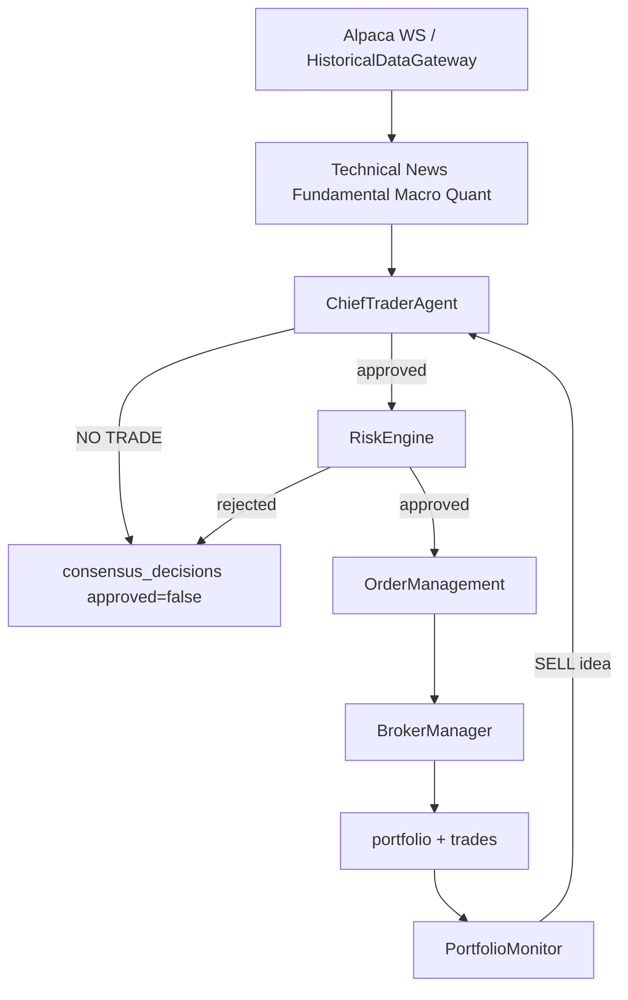

# ARGUS_PHASE16_READINESS_REPORT.md

**Date:** 2026-08-15. Ground truth entering this phase: `ARGUS_REAL_MONEY_READINESS.md` (Phase 15).
Work log: `ARGUS_PHASE16_IMPLEMENTATION_REPORT.md`.

This document does **not** raise readiness by counting new files. Gates 5, 6, 9, and 10 still fail
on evidence. Software safety improved; trading edge did not.

```
AUTONOMOUS REAL-MONEY READINESS:  71%  (was 69% — +2 from EventBus isolation, ticker hygiene,
                                        thesis-invalidation parity, consensus confirmation gates)
SOFTWARE READINESS:               85%  (was 82%)
TRADING-VALIDATION READINESS:     15%  (unchanged — still no OOS edge, still no organic paper book)
AI READINESS:                     45%  (was 40% — ticker/price validators; decision quality still negative)
QUANT STRATEGY READINESS:         30%  (was 28% — live EV gate + thesis invalidation; OOS still failed)

REAL-MONEY STATUS:                NO-GO
CURRENT RECOMMENDATION:           PAPER — continuous organic run of ARGUS_PAPER_EXPERIMENT_001
PROFITABILITY EVIDENCE:           UNVALIDATED (walk-forward OOS near zero)
AI TRADING EDGE:                  UNVALIDATED / NEGATIVE (NewsAgent 44.6% on 242 live predictions)
QUANT EDGE:                       UNVALIDATED (OOS collapse vs in-sample)
```

The +2 autonomous points are operational (stuck-approval class, confirmation, exits matching
stated thesis). They are **not** evidence of a cost-adjusted, out-of-sample edge.

## Direct answer

**Does Argus have a statistically defensible trading edge after costs, slippage, regime changes,
and out-of-sample testing, and is the entire production decision/execution pipeline demonstrably
safe?**

- **Edge:** **NO.** Walk-forward OOS for the two highest in-sample QuantEngine combinations is
  +0.04% (MSFT) and +0.28% (AMD) average test-window return with 79–89% IS→OOS degradation
  (`WALKFORWARD_CHECK_RESULTS.json`). NewsAgent live directional accuracy is 44.6% (worse than
  chance) on 242 evaluated predictions. This environment has **zero organic closed paper trades**.
- **Pipeline safety:** **PARTIAL.** Broker timeouts/circuit breaker, reconciliation pause, risk
  gates, restricted-live ceilings, EventBus listener isolation, two-agent consensus, debate HOLD
  veto, and ticker hygiene are real and tested. Remaining: no pre-trade slippage cap (no L2),
  `market_hours` still treats Alpaca-clock outage as skip-not-block, historical AI replay
  UNTESTABLE, paper experiment not yet run.

**RESTRICTED-LIVE GO: NO. AUTONOMOUS-LIVE GO: NO.**

## Production decision path (traced, not inferred)

```
Alpaca WS ticks → EventBus MARKET_DATA
  → TechnicalAgent (inline RSI/MACD/BB on last 50 ticks)
  → NewsEngine (FinBERT ± LLM, ticker-validated) / FundamentalAgent / MacroAgent (timers)
  → QuantSignalAgent (off unless QUANT_ENGINE_ENABLED=true; daily bars; EV gate on strategy ideas)
  → TRADE_IDEA_GENERATED
  → ChiefTraderAgent (calibrated weights, optional debate, min 2 independent agents, HOLD/AI veto)
  → CHIEF_APPROVED_IDEA
  → RiskAgent → RiskEngine (serialized gates, RestrictedLiveMode ceilings on LIVE)
  → PositionSizing
  → OrderManagement → BrokerManager (Alpaca / InternalPaper / IBKR / Coinbase)
  → fills → portfolio row
  → PortfolioMonitor (settings % exits, or quant stop/target + thesis invalidation)
  → ReflectionEngine (closed SELL P&L only) + PredictionOutcomeEvaluator
```

Legacy `GET /api/v1/signals` is still a separate simulation path and must not be treated as this
pipeline.

## The 10 hard gates

| Gate | Status | Evidence | Remaining risk | Next action |
|---|---|---|---|---|
| 1. Broker Safety | **PASS** | `AlpacaBroker.reliability.test.ts`; timeout/retry/circuit breaker | Frontend still has no cancel-order UI; only Alpaca got the full reliability pass | Optional: same treatment on other adapters |
| 2. Position Reconciliation | **PASS** | `PortfolioReconciliation.tradingBlock.test.ts`; pause reaches RiskEngine | Filled-orders vs `trades` cross-check still not built | Additive recon check |
| 3. Risk Controls | **PASS** | RiskEngine 11+ gates; `RestrictedLiveMode.test.ts`; consecutive-loss/drawdown/stale-data hardcoded | Daily *deployment* cap still absent (loss kill-switch ≠ notional cap) | Document; do not fake a cap |
| 4. Live/Backtest Parity | **PARTIAL** | Quant stop/target live=backtest (16B); thesis invalidation live now exists; TechnicalAgent vs `run()` still duplicated inline; consensus/AI **not** in backtest | Live multi-agent path is not what `runStrategyBacktest()` simulates | Keep QUANT off until paper book exists; do not claim TechnicalAgent parity |
| 5. Strategy Validation | **FAIL** | `ARGUS_STRATEGY_VALIDATION_REPORT.md`; in-sample numbers exist, **not** a validated edge | Positive in-sample Sharpe can be overfitting | Do not tune; extend walk-forward to remaining combos without optimizing |
| 6. Out-of-Sample Evidence | **FAIL** | `WALKFORWARD_CHECK_RESULTS.json`: OOS ≈ 0 after costs | Only 2 of 20 strategy×symbol combos have OOS at all | Run remaining 18 walk-forwards; still do not optimize |
| 7. Failure Recovery | **PASS** | Chaos tests, order crash recovery, AI/broker breakers; EventBus isolation (`EventBus.isolation.test.ts`) | DB-unavailable / DB-transaction-failure still unverified | Optional chaos against SQLite lock |
| 8. Monitoring/Alerting | **PASS** | `AlertingService.test.ts`; webhooks on recon/disconnect/state/AI exhaustion | No pre-trade slippage alert | Post-trade slippage monitor (needs fill vs decision price) |
| 9. AI Reliability | **FAIL** | Schema/enum/confidence: PASS. Ticker + price-disagreement helpers: PASS (`AIOutputValidator.test.ts`). Decision quality: FAIL (NewsAgent 44.6%). Historical replay: UNTESTED / UNTESTABLE | Stage C dataset missing | Accumulate live Stage A/B; do not fake 2019 news |
| 10. Continuous Paper Trading | **FAIL** (mechanism PASS) | `PaperTradingValidation.ts` + experiment id; real DB still 0 organic closed trades (`ARGUS_PAPER_TRADING_VALIDATION.md`) | Cannot compare backtest vs paper P&L | Run `ARGUS_PAPER_EXPERIMENT_001` continuously; do not inject signals |

**PASS: 1, 2, 3, 7, 8. PARTIAL: 4. FAIL: 5, 6, 9, 10.** Same three validation gates that blocked
Phase 15 still block restricted live.

## Live trading behavior changes this phase (explicit)

These alter who gets approved or exited. They do **not** invent an edge.

1. Consensus waits for in-flight debate; min 2 independent agents; debate HOLD / AI contradiction = NO TRADE; PortfolioManager SELL bypasses those entry gates.
2. HOLD votes with confidence > 0 penalize BUY/SELL.
3. Quant positions can exit on thesis invalidation, not only stop/target.
4. Reflection uses closed SELL `profitLoss` only.
5. EventBus continues after a throwing listener.
6. News symbols that fail `looksLikeListedTicker` never emit a trade idea.

## Category scores (same weights as Phase 15)

| Category | Weight | Phase 15 | Phase 16 | Why |
|---|---|---|---|---|
| Trading strategy correctness | 15% | 9 | 9 | No strategy rewrite; confirmation gates don't create an edge |
| Quantitative validation | 15% | 3 | 3 | OOS still failed; EV live gate has n=0 closed strategy trades |
| Risk management | 15% | 13 | 13 | Restricted-live already in; no new bypass found |
| Broker/order execution | 10% | 9 | 9 | Unchanged this close-out |
| Market-data reliability | 10% | 6 | 6 | Clock-outage-as-open still open |
| Portfolio/account reconciliation | 10% | 9 | 9 | Unchanged |
| AI/agent reliability | 10% | 7 | **8** | Ticker + price disagreement validators; quality still negative |
| Backtesting/live parity | 5% | 4 | **4.5** | Thesis invalidation + quant exits; TechnicalAgent duplication remains |
| Observability/monitoring | 5% | 4 | 4 | Experiment id on paper report only |
| Fault tolerance/recovery | 3% | 3 | 3 | EventBus isolation is the 16A follow-up inside an already-PASS gate |
| Security/secrets | 2% | 2 | 2 | Unchanged |
| **Total** | **100% | 69 | ~71** | |

## Architecture (current production path)



## Remaining blockers (ordered)

1. No walk-forward-validated, cost-adjusted OOS edge (gates 5/6).
2. Zero organic closed paper trades — `ARGUS_PAPER_EXPERIMENT_001` has not been run (gate 10).
3. AI decision quality unvalidated / NewsAgent worse than chance; historical replay UNTESTABLE (gate 9).
4. Live multi-agent consensus is not in the backtester (gate 4 partial).
5. No L2/spread → cannot enforce max slippage pre-trade (16M).
6. Alpaca clock fetch failure still skips the market-hours block rather than halting.

## Recommended next phase

**Phase 17 — run paper, do not tune.** Leave `QUANT_ENGINE_ENABLED` at operator choice; do not
optimize walk-forward windows; do not lower OOS bars. Operate continuously in PAPER with
`ARGUS_PAPER_EXPERIMENT_ID=ARGUS_PAPER_EXPERIMENT_001` until ≥30 real closed SELLs exist, then
recompute this scorecard from `GET /api/v2/paper-trading/report` and live `prediction-validation`.
If OOS and paper still show no edge, keep NO-GO permanently for that strategy set.
