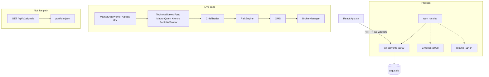
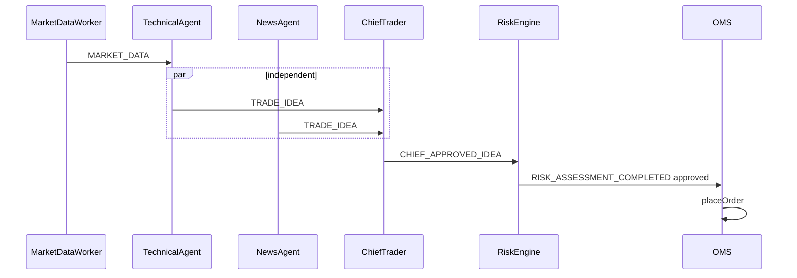

# ARGUS — COMPLETE SYSTEM REVERSE-ENGINEERING & KNOWLEDGE TRANSFER

**File:** `docs/ARGUS_COMPLETE_SYSTEM_SUMMARY.md`  
**Mode:** read-only analysis of **source + tests + config**. Dated reports in `docs/archive/historical/` are not wiring.  
**LIVE real-money:** **NO-GO.** This document does not invent a readiness percentage. Adding markdown does not raise scores.  
**Primary evidence:** code and tests. When docs disagree with code, both are listed.

Companion: [`ARGUS_SYSTEM_INVENTORY.json`](ARGUS_SYSTEM_INVENTORY.json) (machine-readable). Short living docs: [`ARGUS.md`](ARGUS.md), [`ARGUS_REFERENCE.md`](ARGUS_REFERENCE.md). UI honesty: root `FINAL_ANALYSIS.md` §25.3 / §31. Agent contract: root `CLAUDE.md`.

---

## 1. Executive summary

### What Argus is

Argus (`package.json` name `my-money-miner`) is a **single Node.js process** trading terminal: Express HTTP + Vite SPA + raw `ws` + SQLite (`better-sqlite3` + Drizzle, WAL). Port **3000 is hardcoded** (`PORT` is unused). It runs a **multi-agent idea pipeline** that can place **whole-share MARKET orders** through `BrokerManager` after **RiskEngine** approval.

It is **not** a proven alpha engine, not a broker, and not a legally authorized Canadian execution venue.

### Problem it tries to solve

Give an operator one terminal that: streams US equity quotes, lets several agents propose BUY/SELL/HOLD, aggregates those ideas, applies hard risk gates, sends orders to a broker (paper simulator or Alpaca), records traces, and optionally overlays deterministic quant strategies and local/cloud LLMs.

### What it currently does

- **Paper path (mechanically possible):** InternalPaperBroker (~$100k in-memory) or Alpaca paper REST, if keys and Autobot/`TRADING_ENABLED` allow ideas through.
- **Live path (software exists, trading validation does not):** EventBus → idea agents → ChiefTrader → RiskAgent → RiskEngine → OMS → `getActiveBroker().placeOrder()` → `trades` / `fills`.
- **18 recorded risk gates** on every evaluation (all run; first failure is the reported reason).
- **Reconciliation** every 5 minutes; ≥$100 mismatch calls `setTradingState('TRADING_PAUSED')`, which **does** fail gate `emergency_stop`.
- Optional Quant (`QUANT_ENGINE_ENABLED`), Chronos (`:8008`), Ollama, OpenAlice MCP, IBKR Gateway spawn.

### What it does NOT do

- Proven edge / profitable strategies. Walk-forward OOS for checked quant combos **failed**. NewsAgent last scored pass: **~44.6% on 242 predictions** (`FINAL_ANALYSIS.md`). This environment: **zero organic closed paper trades** in that same pass (UNKNOWN if the operator’s machine has since filled any).
- L2 book, options, market breadth, volume profile, TSI, anchored VWAP, pairs, CAD FX conversion (`QuantitativeFeatureEngine` `NOT_SUPPORTED`).
- Fractional / notional share orders (`Math.floor`; Alpaca `qty` only).
- Automated Canadian TSX/TSXV routing (`markets.json` `BLOCKED_IIROC_3200A_1_B_I`).
- Historical AI debate replay of past years without PIT news/LLM logs — **UNAVAILABLE**.
- LangGraph (not in repo). LiteLLM as a runtime (header in `server.ts` is stale).

### How decisions are made

Independent agents emit `TRADE_IDEA_GENERATED`. ChiefTrader waits for a window of evidence, requires **≥2 independent agreeing agents** (`minIndependentAgreeingAgents`) and weighted confidence **≥ 0.75** (`consensusApprovalThreshold`). Optional LLM debate if idea confidence **> 0.6**. HOLD from debate / Bear researcher / Quant AI disagreement can force **NO TRADE**. PortfolioMonitor risk-exits skip the min-agent/debate bar. Manual flatten emits `CHIEF_APPROVED_IDEA` as `ManualOverride` (**still goes through RiskEngine**).

### How orders reach the broker

`CHIEF_APPROVED_IDEA` → `RiskAgent.assessRisk` → `RiskEngine.evaluateRisk` → if approved and `maxQuantity > 0` → OMS inserts `trades` row → `placeOrder` → poll/follow-up fills. AI cannot skip this. `GET /api/v1/signals` **can** still write `data/portfolio.json` **without** this path (**BROKEN relative to the live contract**).

### Backtesting

`HistoricalDataGateway` pulls Alpaca **raw** daily (or requested timeframe) bars into `ohlcv_bars`. `BacktestEngine.run()` uses TA-like rules (not the live agent graph). `runStrategyBacktest()` runs a **named Quant strategy, long-only**, with SEC/FINRA sell fees and dynamic slippage. `ReplayClock` hard-fails future timestamps. Walk-forward **does not optimize**. Live AI/News/ChiefTrader are **not** in the backtest loop.

### How AI participates

All LLM calls go through `AIRouter` (timeout 20s, temperature 0.2 for decision calls). Providers with classes: Gemini, OpenAI, DeepSeek, Nvidia, OpenAI-compatible (Ollama). Extra env keys (Anthropic, Grok, Groq, OpenRouter, Kimi, Mistral) have **no provider class** unless routed via OpenAI-compatible. Bull/Bear notes **null LLM prices**. Quant contradiction AI **cannot overwrite side/confidence**.

### How quant participates

Off unless `QUANT_ENGINE_ENABLED=true`. Timer over **daily bars**, agent name `QuantEngine`. Default live `evaluateAll()` = **five CORE** strategies. Fifteen experimental modules live only if **that** env var is the string `'true'`. Taxonomy JSON maps **~760 named techniques** to families — not 760 live edges. EV/Kelly can **suppress a Quant idea**; they do **not** size RiskEngine orders.

### Risk

Hard gates; AI cannot override. Sizing uses `stopLossAssumptionPct` **0.05**, **not ATR**. Restricted LIVE file ceilings: $5k order, 3 positions, $1k daily loss, $15k daily BUY notional.

### Portfolio monitoring

`PortfolioMonitor` ~60s: take-profit / trailing stop from **settings**, quant stop / thesis invalidation → SELL **ideas** (`agent: PortfolioManager`), not raw `closePosition`.

### Frontend

One SPA: `src/App.tsx` (~10905 lines), **21 tabs**. Mix of real APIs and mocked/educational visuals. `FINAL_ANALYSIS.md` wins. Login early-return is **after** most hooks (effects still run).

### Databases / APIs / local services

- DB: **one** SQLite file `data/argus.db` (**44** `sqliteTable`s).  
- External: Alpaca (data + optional trading), AlphaVantage, Polygon, Finnhub, FMP, FRED, Gemini/OpenAI/DeepSeek/Nvidia, Coinbase Advanced Trade (adapter **IMPLEMENTED BUT UNVERIFIED** vs funded account), IBKR Gateway, Questrade read-only (orders throw).  
- Local: Chronos/Kronos Python `:8008`, Ollama `:11434`, optional OpenAlice Guardian `:47332`, optional IBKR Gateway.

### Incomplete / paper / live

| Question | Verdict |
|---|---|
| Suitable for **careful paper** (InternalPaper or Alpaca paper) to exercise the pipeline? | **PARTIALLY** — software path exists; this env had **no** organic closed paper book in the last scored pass; UI and `/signals` can mislead. |
| Suitable for **real money**? | **NO-GO** — no OOS edge, AI accuracy weak, Coinbase/IBKR not unattended-safe, recon pause does not flatten, `/signals` bypass, Autobot-off ticks still feed TechnicalAgent. |

---

## 2. Repository inventory

### Tree (important directories)

| Path | Purpose | Live? | Backtest? | UI only? |
|---|---|---|---|---|
| `server.ts` | Express entry, leftover `/api/v1/signals`, listen 3000 | Mix | No | Routes |
| `scripts/devWithOpenAlice.ts` | Spawns Chronos/Ollama/OpenAlice/IBKR + `tsx server.ts` | Boot | No | No |
| `src/App.tsx` + `src/components/` | SPA | Consumes WS/HTTP | Charts | Yes |
| `src/server/core/` | EventBus, Auth, encryption, SystemBootstrap, TransactionRegistry | Yes | No | No |
| `src/server/engines/` | TradingEngine, RiskEngine, PositionSizing, TA, backtest, AdvancedQuant, kronos | Mix | Yes (backtest/) | No |
| `src/server/services/` | Agents, OMS, MD worker, recon, reflection | Yes | No | No |
| `src/server/quant/` | Regime, features, strategies, EV, thesis | If flagged | `findStrategy` | Scanner |
| `src/server/ai/` | AIRouter, providers, parseResearchNote | Yes | No | No |
| `src/server/news/` | News pipeline | If Autobot start | No | News tab |
| `src/server/db/` | Drizzle schema + migrate-on-import | Yes | Yes (ohlcv) | No |
| `src/brokers/` | Adapters + BrokerManager | Yes | No | Settings |
| `src/marketdata/` | Alternate MD adapters (Yahoo/Polygon) | **CONFIGURATION / PARTIAL** vs Alpaca worker | Unknown | Unknown |
| `config/*.json` | Fail-boot if required keys missing | Yes | Thresholds | No |
| `drizzle/` | SQL migrations | Boot | — | — |
| `e2e/` | One Playwright spec | — | — | — |
| `docs/` | This pack | — | — | — |
| `docs/archive/historical/` | Dated reports | Do not treat as current | — | — |
| `archive/python-platform/` | **DEAD** — Node never imports | No | No | No |
| `skills/` | Cursor skills | No | No | Agent |

### Important files (live-path, traced)

| File | Role | Who calls | Calls | Live | BT | Dead? |
|---|---|---|---|---|---|---|
| `src/server/core/SystemBootstrap.ts` | Autobot `system.start/stop` | TradingEngine | OMS, news, fund/macro, recon, Quant start, … | Yes | No | No |
| `src/server/services/MarketDataWorker.ts` | Alpaca IEX WS | `startServer` **always** + Autobot start | EventBus MARKET_DATA | Yes | No | No |
| `TechnicalAgent.ts` | Tick RSI/MACD/BB rules | **Import constructor** | `emitTradeIdea` | Yes (even Autobot off) | No | No |
| `NewsEngine.ts` | 10s RSS+APIs | Autobot start | emitTradeIdea NewsAgent | Feature/Autobot | No | No |
| `FundamentalAgent.ts` / `MacroAgent.ts` | ~60s / ~75s AV+LLM | Autobot | emitTradeIdea | Autobot | No | No |
| `QuantSignalAgent.ts` | Daily-bar strategies | Autobot start; no-op unless env | emitTradeIdea QuantEngine | Flagged | Indirect | No |
| `KronosForecastAgent.ts` | Chronos forecast ideas | Import | `publish(TRADE_IDEA…)` | If /health | No | No |
| `ChiefTraderAgent.ts` | Consensus | TRADE_IDEA | CHIEF_APPROVED_IDEA | Yes | No | No |
| `RiskAgent.ts` | Forwarder | CHIEF_APPROVED | evaluateRisk | Yes | No | No |
| `RiskEngine.ts` | 18 gates | RiskAgent, override route | Broker portfolio, DB | Yes | **Not reused as-is** | No |
| `PositionSizing.ts` | Shared sizing | RiskEngine + BacktestEngine | Correlation history | Yes | Yes | No |
| `CapitalAllocation.ts` | budget vs used | RiskEngine only | — | Yes | **Not used in BT** | No |
| `OrderManagement.ts` | placeOrder + fills | RISK_ASSESSMENT_COMPLETED | Broker | Yes | No | No |
| `PipelineFlatten.ts` | Operator SELL via CHIEF_APPROVED | HTTP flatten | EventBus | Yes | No | No |
| `PortfolioMonitor.ts` | Exits as ideas | Autobot 60s | emitTradeIdea PortfolioManager | Yes | No | No |
| `PortfolioReconciliation.ts` | Broker SoT | Autobot 5 min + boot | setTradingState pause | Yes | No | No |
| `BacktestEngine.ts` | run / runStrategyBacktest | API | Gateway, ReplayClock | No | Yes | No |
| `HistoricalDataGateway.ts` | Alpaca bars cache | Quant, BT, outcomes | Alpaca REST | Indirect | Yes | No |
| `AIRouter.ts` | All LLMs | Agents | Providers | Yes | No | No |
| `AdvancedQuantEngines.ts` | Tick OHLC=price | Autobot start | EventBus calc | **DEAD as voter** | No | Computes unused |
| `MarketRegimeAgent.ts` | LLM/sim regime | **Import timer** | MARKET_REGIME_DETECTED | **DEAD as voter** | No | Emits unused |
| `server.ts` `GET /api/v1/signals` | Fabricated votes | App still fetches | portfolio.json | **Bypass** | No | Harmful leftover |

**Not every file in `src/` is listed.** UI widgets: use `FINAL_ANALYSIS.md`. Tests: `*.test.ts` next to modules.

---

## 3. Architecture

1. **High-level:** one Node process; optional companion processes.  
2. **FE/BE:** Vite middleware in dev; static in prod; cookie session if `AUTH_PASSWORD` set.  
3. **Live trading:** diagram above; `tradingMode === 'LIVE'` adds RestrictedLiveMode caps.  
4. **Backtest:** Gateway → ReplayClock prefix → strategy or `run()` rules → PositionSizing + commissions — **no EventBus agents**.  
5. **AI agents:** AIRouter only; no LangGraph.  
6. **Quant:** StrategyEngine + indicators; live gated.  
7. **Risk:** RiskEngine serialized queue; all gates recorded.  
8. **Broker:** BrokerManager active plugin.  
9. **Market data:** primary Alpaca IEX worker; InternalPaper `tick` is a **second** feed (TechnicalAgent uses EventBus only).  
10. **DB:** one writer SQLite.  
11. **EventBus:** in-process EventEmitter; wildcard `*` → WS; persist list in `eventNames.json` (not `PORTFOLIO_UPDATE`).  
12. **Startup/shutdown:** §4. Autobot `stop()` **does not** stop MarketDataWorker.

**Workers / schedulers (Autobot `start` unless noted):** OMS follow-up 15s + crash recovery; recon 5 min; news 10s; fund ~60s; macro ~75s; reflection ~60s; prediction outcomes 5 min; training examples 15 min; portfolio monitor 60s; Quant 5 min if enabled; MarketRegimeAgent **import-time** 5 min; MD reconnect 5s; alerting; AI failure breaker; DB backup.

**Alerting:** `AlertingService` + `AIFailureCircuitBreaker` (5 AI failures / 10 min can pause live — `aiFailureThresholdForLivePause`). **Monitoring:** diagnostics catalog, SystemMetricsWorker. **No** separate Prometheus stack in-repo (**MISSING** as a product).

---

## 4. Application startup (exact sequence)

**Frontend:** Vite loads SPA; `App()` runs hooks **including on Login** if unauthenticated.

**`npm run dev`:** `scripts/devWithOpenAlice.ts`  
- Unless `ARGUS_SKIP_CHRONOS`: `npm run ai:serve` → `scripts/local_ai_service.py` Chronos `amazon/chronos-t5-mini` on `:8008` (first boot may download HF weights).  
- Unless `ARGUS_SKIP_OLLAMA`: `ollama serve` if PATH + port free.  
- Unless `ARGUS_SKIP_OPENALICE`: Guardian if checkout / `OPENALICE_ENABLED`.  
- Unless `ARGUS_SKIP_IBKR`: Gateway if `IBKR_GATEWAY_PATH`.  
- Then `tsx server.ts`.

**`npm run dev:server-only`:** Node only.

**Backend import (before `listen`):**

1. Importing `src/server/db/index.ts` opens SQLite, WAL, **`migrate()` from `drizzle/`** — failure **throws (refuse boot)**. Seeds default models async.  
2. **`npm run db:migrate` is BROKEN** (`database/migrate.ts` missing).  
3. Module constructors: OMS, RiskAgent, TechnicalAgent, ChiefTrader, KronosForecastAgent, **MarketRegimeAgent `setInterval` immediately**, TradingEngine listeners.  
4. `startServer()`: `AIRouter.initialize()` → `tradingEngine.initialize()` (if `autoBotEnabled` in DB → `system.start`) → seed settings if empty (budget 50000, maxTradeSize 3000, PAPER, …) → `BrokerManager.initialize()` → **`marketDataWorker.start()` always** (idle if no Alpaca keys; **does not fabricate ticks**) → `modelRuntimeManager.startAndProbe()` (**warn, continue** if fail) → copy settings into autobot state → ensure sessions + daily_trading_summary tables → `enforceAuthConfigOrExit` (production without auth **exits**) → `listen(3000)`.

| Item | Behavior |
|---|---|
| Mandatory | SQLite migrate, listen 3000 |
| API keys | Alpaca for ticks/history; LLM keys for AI agents; broker creds in DB encrypted |
| Silent / warn | Model probe fail; MD start catch; no Alpaca → MD idle |
| Fallback | InternalPaper if no selected broker; MarketRegimeAgent → `SIMULATED_BULL_MARKET` if no Gemini |
| Optional | Quant, OpenAlice, Chronos, Ollama, IBKR spawn |

---

## 5. Complete trading lifecycle (BUY one share)

| Step | Input | Processing | Output | DB | Events | Errors / fallback |
|---|---|---|---|---|---|---|
| Tick | Alpaca IEX | MarketDataWorker | price map | no | MARKET_DATA (+ UPDATED) | disconnect 5s retry |
| Technical | 50 close ticks | SMA20/50, RSI, MACD, BB | maybe idea | no | TRADE_IDEA, CALCULATION, TECHNICAL_* | none (sync) |
| Other ideas | timers / bars | News/Fund/Macro/Quant/Kronos | ideas | news/quant/kronos tables | TRADE_IDEA | skip if no data/LLM |
| Chief | ideas  same symbol | weights, min 2, 0.75, debate | approve or NO_TRADE | consensus_*, transactions | CHIEF_CONSENSUS_*, CHIEF_APPROVED_IDEA | LLM timeout → no fabricated side |
| OpenAlice | approved | fire-and-forget | verification row | openalice_verifications | OPENALICE_* | **does not block** |
| Risk | proposal + live price | 18 gates | approved + qty | risk_assessments, risk_gate_results | RISK_ASSESSMENT_* | no price → fail price_validity |
| Size | equity, BP, settings | FIXED_DOLLAR default | floor shares | — | CAPITAL_CHECK | equity `\|\| 10000` **weak** |
| OMS | approved qty | insert trade, placeOrder | broker id | trades, fills | ORDER_* | reject row, no fake fill |
| Fill | broker | poll 4s + follow-up 15s / 30m max | FILLED/PARTIAL | fills | ORDER_FILLED | never invent fill |
| Recon | 5 min | broker SoT | portfolio rows | portfolio, reconciliation_events | mismatch | pause if ≥$100 |
| Exit | monitor | TP/trail/thesis | SELL idea | — | TRADE_IDEA PortfolioManager | same pipeline + sell_position_exists |
| P&L | fills + marks | broker + daily_trading_summary | numbers | summary | — | InternalPaper mark-to-tick |
| Journal | UI | notes | — | trades fields / modal | — | UI |
| Attribution | Reflection / outcomes | bars vs prediction | prediction_outcomes | that table | — | no bars → **no row** |

**SELL one share:** same, plus `sell_position_exists`; flatten skips consensus but **not** RiskEngine.

**Timeouts:** Alpaca HTTP AbortController (broker file); AI 20s Promise.race (**does not abort HTTP**). **Retries:** MD reconnect; OMS follow-up; AIRouter failover. **Validation:** `AIOutputValidator` on agent JSON.

---

## 6. All trading agents

| Name | File | Deterministic / AI | Live | BT | Default | Flag | Notes |
|---|---|---|---|---|---|---|---|
| TechnicalAgent | TechnicalAgent.ts | Det. RSI/MACD/BB | Yes | No | On ticks | none | Hardcoded thresholds **CONFIGURATION smell** |
| NewsAgent | NewsEngine.ts | Hybrid RSS+optional LLM | Autobot | No | Autobot | keys | 44.6%/242 last pass |
| FundamentalAgent | FundamentalAgent.ts | AV + AIRouter | Autobot | No | Autobot | AV+LLM | ~60s tracked symbols |
| MacroAgent | MacroAgent.ts | AV + AIRouter | Autobot | No | Autobot | AV+LLM | ~75s |
| QuantEngine | QuantSignalAgent.ts | Det. + optional AI contradiction | If env | via findStrategy | **Off** | QUANT_ENGINE_ENABLED | EV gate can suppress idea |
| KronosEngine | KronosForecastAgent + KronosEngine | Local Chronos | If health | No | On ticks if up | Chronos | Honest warning if /health down |
| PortfolioManager | PortfolioMonitor.ts | Settings + thesis JSON | Autobot | No | Autobot | — | SELL ideas only |
| ChiefTrader | ChiefTraderAgent.ts | Weights + optional LLM | Yes | No | Always constructed | debate settings | |
| RiskAgent | RiskAgent.ts | Forwarder | Yes | No | Always | — | No extra gates |
| ConsensusDebate | ChiefTrader prompt | AI | If debate | No | if conf>0.6 | adversarialDebateMode | Weight 0.35, not min-2 |
| BearResearcher | parseResearchNote | AI qualitative | If QUANT_BULL_BEAR | No | **Off** | env | HOLD evidence; prices nulled |
| MarketRegimeAgent | MarketRegimeAgent.ts | AI or **SIMULATED_BULL_MARKET** | Emits unused | No | Import timer | GEMINI | **DEAD voter** |
| AdvancedQuantEngines | AdvancedQuantEngines.ts | Det. fake OHLC=tick | Unused | No | Autobot start | — | **DEAD voter** |
| ExplainabilityAgent | ExplainabilityAgent.ts | Reports | Side | No | Import | — | Not a voter |
| ReflectionEngine | ReflectionEngine.ts | Scores + LLM rules | Weights + prompt text | No | Autobot | — | Rules truncated into **debate only** |
| ManualOverride | PipelineFlatten / execute-override | Operator | Yes | No | HTTP | — | Still RiskEngine |

**No classes:** SentimentAgent, OrderFlowAgent (UI names). **Temperature:** router 0.2. **Timeout:** 20s. **Retry:** provider failover. **Tools:** none (no function-calling trading tools). OpenAlice is MCP **verification**, not a voter.

---

## 7. Agent communication

- **EventBus** (in-process). No Redis queue. No LangGraph.  
- **Parallel:** idea agents independent. **Sequential:** Chief → Risk → OMS.  
- **Shared state:** `tradingEngine.state`, SQLite, `marketDataWorker` price map.  
- **Bottlenecks:** RiskEngine evaluates **all gates** even after first fail (DB + clock + news + correlation); serialized mutex; SQLite one writer; LLM 20s.

---

## 8. AI models / providers

| Provider | Class | Env | Local/cloud | Agents | Structured? | Enabled |
|---|---|---|---|---|---|---|
| Gemini | GeminiProvider | GEMINI_API_KEY | cloud | Fund/Macro/News/Chief/Regime | JSON coerced | if key |
| OpenAI | OpenAIProvider | OPENAI_API_KEY | cloud | via router | same | if key |
| DeepSeek | DeepSeekProvider | DEEPSEEK_API_KEY | cloud | via router | same | if key |
| Nvidia | NvidiaProvider | NVIDIA_API_KEY | cloud | via router | same | if key |
| Ollama / OpenAI-compat | OpenAICompatibleProvider | OLLAMA_HOST | local | via router | same | if up |
| Chronos | Python :8008 | LOCAL_AI_SERVICE_URL | local GPU/CPU | Kronos | forecast numbers | if health |
| OpenAlice | MCP HTTP | OPENALICE_* | local/ext | post-approve verify | MCP tools | both env |
| Anthropic/Mistral/OpenRouter/Kimi/Grok/Groq | **none** | keys in .env.example | — | — | — | **DEAD keys** |
| FinBERT | local_ai_service | Chronos process | local | News escalation skip | sentiment | if Chronos |

**Cost:** `estimateCost()` published pricing; Ollama $0. **Health:** ModelRuntimeManager probe at boot. **Failure:** failover / no fabricated BUY. **ACTIVE_LLM** env exists; routing also DB `agent_routing_overrides`.

---

## 9. Quantitative calculations

**Live TechnicalAgent (tick closes, period 50):** SMA20/50, RSI (`RSIEngine`), MACD (`MACDEngine`), BB 20±2σ. **Not** the Quant StrategyEngine.

**Quant layer (daily bars when Quant on):** SMA/EMA, DMI/ADX (double-smoothed; unused separate `calculateADX` exists), BOS/CHoCH, RSI, MACD, StochRSI, ROC, Williams %R, CCI, RSI/MACD **divergence as feature (`isTradeSignal:false`)**, ATR%, HV, BB **width%**, Keltner, session VWAP, RVOL, OBV, MFI, CMF, A/D, pivots, Fib, OR (**unavailable on daily**), Donchian prior N, candles/gaps, SMC patterns. **Ichimoku: MISSING.** Breadth/options/L2/profile/TSI/anchored VWAP/pairs/CAD FX: **NOT_SUPPORTED**.

**Risk sizing:** `stopLossAssumptionPct` 0.05 — **not ATR**. **EV/Kelly:** `ExpectedValue.ts`; Kelly refuses <20 trades; cap 10% capital; **does not size RiskEngine**.

**Duplication:** TechnicalAgent vs Quant vs `BacktestEngine.run()` vs unused AdvancedQuantEngines vs unused `calculateADX`. **Parity:** PositionSizing shared live/BT; CapitalAllocation **live only**; TechnicalAgent **not** in BT.

**Math correctness:** standard formulas in engines; **UNVERIFIED** vs academic reference for every oscillator in this pass. Tick OHLC=price in AdvancedQuant is **honestly not real OHLC**.

---

## 10–11. Strategies and execution matrix

**CORE (live evaluateAll default):** MOMENTUM_BREAKOUT, PULLBACK_CONTINUATION, MEAN_REVERSION, TREND_FOLLOWING, RANGE_REVERSION. Regime mismatch **discounts** confidence (`regimeMismatchConfidenceMultiplier` 0.5), never zeros. `minStrategyConfidenceToTrade` 0.6.

**Experimental UNVALIDATED (15):** see `config/quantExperimentalStrategies.json`. Live only if env `'true'`. Backtest via `findStrategy` without flag. **Long-only BT** — bearish SMC does not short.

**TechnicalAgent rules (separate):** momentum breakout / mean reversion BUY / overbought SELL.

**`BacktestEngine.run()`:** separate TA-like LOOKBACK 50.

**Taxonomy:** ~760 names → CORE / EXPERIMENTAL / NOT_SUPPORTED. Not 760 edges.

| Strategy family | Live | Paper | BT | QuantEngine | TechnicalAgent | AI | News | Fund | Macro | Regime | PM | Validation |
|---|---|---|---|---|---|---|---|---|---|---|---|---|
| CORE five | If Quant env | same | findStrategy | Yes | No | optional contradiction | No | No | No | Yes discount | thesis JSON | OOS **failed** |
| Experimental 15 | Per-id env | same | findStrategy | Yes | No | same | No | No | No | Yes | if in thesis JSON | UNVALIDATED |
| TechnicalAgent rules | Tick path | same | No | No | Yes | No | No | No | No | No | No | Unit-ish; no WF |
| News/Fund/Macro ideas | Autobot | same | No | No | No | Yes | Yes | Yes | Yes | No | No | News 44.6% |
| Kronos ideas | If health | same | No | No | No | Chronos | No | No | No | No | No | UNVERIFIED vs live P&L |

Stops/TP: **PortfolioMonitor settings** (15%/5% seed defaults), not per-strategy ATR. Position sizing: RiskEngine after approval.

---

## 12–13. Market data and historical

| Provider | Use | Auth | Fallback |
|---|---|---|---|
| Alpaca IEX WS | Live top-of-book | ALPACA_* | Idle, no fake ticks |
| Alpaca REST bars | History, `adjustment=raw` | same | **throw** if no keys |
| Alpaca clock | market_hours | same | skip if unconfigured; **fail-closed** if keys but HTTP fail |
| AlphaVantage | Fund/Macro/news | ALPHAVANTAGE_API_KEY | DATA_UNAVAILABLE framing |
| Polygon/Finnhub/FMP | News | keys | RSS/Mock provider exists |
| FRED | Macro optional | FRED_API_KEY | — |
| Yahoo/Polygon adapters | `src/marketdata/` | **not** the live EventBus tick path | UNKNOWN consumers |

**Splits/dividends:** raw bars — **corporate actions not applied** (look-ahead of adjusted series avoided; **unadjusted** live/BT). **Timezone:** trading day America/New_York for daily loss. **Missing bars:** BT throws insufficient bars. **Duplicates:** MD worker drops duplicate tick ts+price. **Look-ahead:** ReplayClock `assertNotFuture`; Gateway reads `timestamp <= now`. **News in BT:** **not used** (PASS for BT news leak; live news is wall-clock).

Bar → strategy: `ensureBars` → SQL range → `runStrategyBacktest` prefix → indicators on **past** closes only (engine contract; ReplayClock asserts).

---

## 14. Backtest engine

**Inputs:** symbol(s), dates, timeframe, cash, optional `strategyId`.  
**Reused live:** PositionSizing, some TechnicalIndicators, HistoricalDataGateway, tradingSafety numbers.  
**Not reused:** ChiefTrader, News, RiskEngine gate ladder, CapitalAllocation, brokers, OMS, EventBus agents, AI.  
**Fees:** SEC + FINRA TAF on **sells**; broker commission default $0 (Alpaca-like). CAT fee **not modeled** (disclosed).  
**Slippage:** `Slippage.ts` dynamic. Partial fills: **simulated limited**.  
**Metrics:** Sharpe, PF, win rate, expectancy, CAGR, max DD, regime slices, vs B&H.  
**Walk-forward:** rolling train/test, **no optimization**.  
**MonteCarlo / AccountSizeReport:** analysis APIs.  
**Divergence sources:** long-only vs live shorts; no news/AI; no allocation slice; daily vs ticks; raw vs broker fills; TechnicalAgent ≠ Quant strategies.

---

## 15. Look-ahead bias audit

| Area | Verdict | Evidence |
|---|---|---|
| BT price/indicators | **PASS** (engine) | ReplayClock; prefix bars |
| BT news/fund/macro/AI | **PASS** (N/A) | not in loop |
| Live news | **UNKNOWN** | RSS “latest” not PIT for historical replay |
| Corporate actions | **UNKNOWN / raw** | unadjusted; delistings not modeled |
| Universe | **UNKNOWN** | survivor bias not tested |
| MarketRegimeAgent | **FAIL if consumed** | “general knowledge up to today”; **not consumed** on live path |
| Walk-forward | **PASS process** | no test-set optimize; **FAIL edge** (OOS results failed) |
| Training examples | **UNKNOWN** | TrainingExampleBuilder uses real bars after horizon |

---

## 16. Risk engine (every gate)

Order (first fail = reported reason; **all recorded**):

| Gate | Threshold / source | Hardcoded? | AI bypass? | Paper vs LIVE | BT |
|---|---|---|---|---|---|
| emergency_stop | tradingState must be TRADING_ENABLED (also PAUSED) | state | No | same | N/A |
| daily_loss | 0.8 × daily limit; LIVE min $1000 restricted | JSON + RestrictedLive | No | LIVE tighter | N/A |
| consecutive_loss | 3 FILLED losers | JSON | No | same | N/A |
| portfolio_drawdown | settings, default 15% peak | settings | No | same | BT has own DD breaker tests |
| order_rate_limit | settings default 5/min | settings | No | same | N/A |
| market_hours | Alpaca clock | — | No | skip if no keys | N/A |
| data_freshness | 300000 ms | JSON | No | same | N/A |
| news_veto | impact>80, 4h, **direction-blind** | **80 hardcoded** | No | same | N/A |
| price_validity | finite >0 | — | No | same | N/A |
| order_notional_cap | maxTradeSize / restricted $5k | settings+JSON | No | LIVE $5k | PositionSizing |
| symbol_concentration | 20% | JSON | No | same | shared |
| open_positions_cap | settings / LIVE 3 | settings+JSON | No | LIVE 3 | shared |
| sector_concentration | 40% | JSON | No | same | shared |
| correlation_exposure | 0.7 corr, 50% | JSON | No | same | shared |
| sufficient_size | BP / risk | — | No | same | shared |
| sell_position_exists | broker qty | — | No | same | N/A |
| argus_capital_allocation | settings.budget | settings | No | same | **not in BT** |
| daily_buy_notional | paper 0=off; LIVE $15k | JSON | No | LIVE on | N/A |

Tests: `RiskEngine.test.ts`, `.gates`, `.restrictedLive`, `.concurrency`, PositionSizing, CapitalAllocation. **Broker cannot bypass** OMS path. **`/signals` can bypass.**

---

## 17. Capital management

| Concept | Source |
|---|---|
| Broker equity / BP | `broker.portfolio()` |
| Argus allocation | `settings.budget` |
| Used | position qty×avg + pending BUY notionals |
| Remaining | allocated − used |
| Per-order | maxTradeSize / restricted $5k |
| Per-symbol | 20% equity |
| Risk budget | riskLevel → 1%/2%/3% of equity for stop assumption 5% |

**Example:** broker $2000, budget $100, BUY $101 → **fail `argus_capital_allocation`**. Broker BP is irrelevant.

**Weaknesses:** `portfolio.equity \|\| 10000` if missing; InternalPaper $100k default ≠ budget; pending detection depends on trade statuses; Autobot toggle also checks budget vs BP when enabling.

---

## 18. Position management

PortfolioMonitor (~60s): TP `takeProfitPct`, trailing `trailingStopPct`, quant stop confidence, `thesisInvalidation.json` rules (strategy IDs in JSON, types in TS). Emits SELL ideas. **Does not** flatten on recon pause. Correlation/news on **new** orders via RiskEngine, not continuous flatten.

---

## 19. Brokers

| Adapter | Implemented | Tests | Paper | Live | Status |
|---|---|---|---|---|---|
| InternalPaperBroker | Yes | via manager | Yes in-memory | No | Default |
| AlpacaBroker | Yes REST | reliability tests | Yes | Yes unattended | Only fully unattended |
| InteractiveBrokersAdapter | Client Portal | — | DU* | U* + **2FA ~24h** | `canadianEquities: false`; `placeOrder` **does not** call listing gate |
| CoinbaseBroker | CDP JWT | unit tests | **placeOrder refuses** | Possible after confirm | **UNVERIFIED** funded; `.env.example` **stale** (“placeholder”) |
| QuestradeBroker | OAuth read | tests | orders **throw** | throw | Never active broker |

**PAPER_TRADING_ONLY:** quote WS / legacy signals — **does not force BrokerManager paper**. Live mode needs confirmation phrase.

Idempotency: client order ids / crash recovery lookback 48h. Partial fills: OMS aggregates. Cancel: `POST /api/v2/trading/cancel-order/:id`.

---

## 20. Portfolio reconciliation

Broker **source of truth**. Updates `portfolio`. Mismatch types: qty drift, missing local/remote, open orders, account equity vs cash+MV (1% / $50 floor). **≥$100** → `TRADING_PAUSED` (blocks new orders). **Does not auto-flatten.** Repair = operator. Overlap skip if already reconciling.

---

## 21. Database

**One file:** `ARGUS_DB_PATH` or `data/argus.db`. **44 tables:** users, sessions, settings, kill_switch_events, broker_connections, ai_providers, ai_models, ai_usage, trades, fills, daily_trading_summary, reconciliation_events, portfolio_snapshots, portfolio, learned_rules, agent_predictions, agent_performance_stats, agent_confidence_calibration, explainability_reports, agent_memory, event_traces, memory_rules, news_articles, news_clusters, news_providers, kronos_predictions, agent_routing_overrides, ohlcv_bars, backtest_runs, prediction_engine_weights, escalation_decisions, transactions, consensus_decisions, consensus_evidence, ai_calls, risk_assessments, risk_gate_results, prediction_outcomes, training_examples, openalice_verifications, external_data_cache, quant_assessments, quant_strategy_backtests, quant_backtest_decision_log.

**ER (logical):** settings 1; trades 1—N fills; consensus 1—N evidence; risk_assessments 1—N gate_results; news_clusters 1—N articles; quant_assessments / backtests independent.

Export: `GET /api/v1/system/export-db`. Restore needs `.encryption_key`. Second process on same file can false-`SQLITE_CORRUPT`.

---

## 22. EventBus / logging

Canonical: `config/eventNames.json`. Extra emitted: `MARKET_DATA_UPDATED`, `MARKET_REGIME_DETECTED`, `NEWS_ANALYZED`, `TECHNICAL_ANALYSIS_*`, `RISK_GATE_EVALUATED`, Kronos types, `MARKET_DATA_DISCONNECTED`.

**UI path:** EventBus `*` → WS → React. Persistence: EventStore ring + `event_traces` for persist list. Logger: `Logger.ts`; secrets: `SecretRedaction.ts`.

---

## 23–24. Frontend and visualization

**21 tabs:** dashboard, command, observatory, arena, scanner, opportunities, portfolio, agents, news, intelligence, learning, memory, activity, diagnostics, audit, documentation, evaluation, validation, deployment, kronos, settings.

**Real:** autobot state, trades table, risk gates (if APIs used), Quant scanner when enabled, WS ticks if connected.  
**Educational / MOCK:** AgentWorkflowTheater looping scenes, some Agent Network charts (`FINAL_ANALYSIS.md`).  
**MISSING:** real L2 ladder (must show unavailable).  
**Exists:** agent pulses on matching events, orchestration `/api/v2/orchestration/*`, DigitalTwin from **real WS only**.

---

## 25. Error handling

| Failure | Detection | Handling | Trading |
|---|---|---|---|
| Alpaca WS down | WS close | reconnect 5s; stale gate | block if last tick old |
| No Alpaca keys | start() | idle | no ticks → no Technical ideas; BT throw |
| LLM down | timeout/failover | no fake side | fewer ideas / no debate |
| Chronos down | /health | warning, no Kronos ideas | rest continues |
| News down | provider errors | skip article | no News ideas; news_veto empty |
| Broker throw | OMS catch | REJECTED | no fake fill |
| DB migrate fail | throw | process dead | none |
| WS UI disconnect | browser | reconnect | server continues |
| Recon mismatch | $100 | PAUSE | no new; positions remain |
| AI hallucination | validators + null prices | reject fields | cannot skip RiskEngine |
| Duplicate order | crash recovery | lookup client id | UNKNOWN residual races |

---

## 26. Configuration

**JSON (fail boot if required keys missing):** tradingSafety, eventNames, agentWeights, markets, smcConfluence, thesisInvalidation, noTradeReasons, bullBearResearch, quantExperimentalStrategies, quantStrategyTaxonomy.

**Env (important):** see `.env.example`. `PORT` unused. `QUANT_*` default false. Secrets: AUTH_*, ENCRYPTION_SECRET, broker/AI keys. Questrade env **unread for orders**.

---

## 27. Security (findings, no changes)

- Auth on iff `AUTH_PASSWORD` set; empty password login **fixed** in AuthConfig. Production refuses no-auth.  
- Session cookie httpOnly, sameSite lax; default TTL **3650 days**.  
- API keys encrypted at rest (AES-256-CBC); lose `.encryption_key` → unrecoverable.  
- OpenAlice: refuse trading MCP; no broker creds to MCP.  
- Prompt injection: research parser nulls numbers; RiskEngine still required. **UNKNOWN** residual in free-text reasoning.  
- CORS/WS: same origin typical; **not a full pentest**.  
- Logging: SecretRedaction tests exist.  
- `AUTH_SESSION_SECRET` required with password in real deploy.

---

## 28. Testing

- **Vitest:** ~128 unique `*.test.ts` (glob lists ~254 with Windows path dupes). Safety path heavy.  
- **E2E:** 1 spec `e2e/moduleToggleParity.spec.ts` — must seed wizard **and** tour. Isolated temp DB.  
- **Almost no App.tsx unit tests.**  
- Classes: unit (gates, sizing, commissions), integration (OMS, routes), chaos (`chaosRoutes`), AI providers, recon, backtest, **not** funded Coinbase/IBKR 2FA.

---

## 29. Performance

CPU: indicators on bars, correlation per existing position every risk eval. GPU: Chronos if CUDA. LLM latency 20s cap. SQLite single writer. WS ticks. Rate limits: Alpaca CB 3 fails / 30s. Quant 5 min. **Bottleneck:** all-gates-always + SQLite + LLM debate.

---

## 30. Canadian markets

| Item | Status |
|---|---|
| TSX/TSXV metadata `.TO` | `markets.json` |
| Automated routing | **BLOCKED_IIROC** |
| IBKR canadianEquities | false |
| Questrade orders | throw |
| CAD FX | NOT_SUPPORTED |
| CA hours/holidays | **MISSING** as clock (Alpaca US clock) |
| CA news/fundamentals | not dedicated |
| Fractional / short CA | no |

Metadata ≠ permission to trade.

---

## 31. Prediction vs reality

**Can record:** `agent_predictions`, `kronos_predictions`, `prediction_outcomes` (price after **1h** via real bars), `consensus_decisions`, `ai_calls`, `quant_assessments`.  
**Missing for full replay:** PIT news corpus + LLM logs for a past year; proposal price not always on execution-quality slippage field.  
**“What did Argus predict?”** — tables above if workers ran. **“What happened?”** — outcomes if Alpaca bars exist; else **no row**.

---

## 32. AI trust

| Can AI… | Safeguard | Residual |
|---|---|---|
| Invent prices in Bull/Bear | fields nulled | other prompts |
| Invent news | providers; validator tickers | LLM bias on real headlines |
| Override risk | no | `/signals` bypass |
| Future info in BT | not in BT | RegimeAgent “up to today” unused |
| Malformed side | coerceEnum | |

---

## 33. Live vs paper vs backtest

| Component | Live | Paper | Backtest | Walk-forward | Hist. AI replay |
|---|---|---|---|---|---|
| TechnicalAgent | ticks | ticks | No | No | UNAVAILABLE |
| News/Fund/Macro | Autobot | Autobot | No | No | UNAVAILABLE |
| ChiefTrader | Yes | Yes | No | No | UNAVAILABLE |
| QuantEngine | flag | flag | findStrategy | strategy mode | No |
| RiskEngine | Yes | Yes | sizing subset | No | No |
| Broker | Alpaca/IBKR/Coinbase | Internal/Alpaca paper | simulated | simulated | No |
| Recon | Yes | Yes | No | No | No |
| Fees/slippage | broker real | sim/paper | SEC/FINRA+slip | same | No |
| Restricted caps | LIVE only | no-op | No | No | No |

---

## 34. Real-money readiness (no %)

| Area | Result |
|---|---|
| Software path | **PASS** (exists, tested gates) |
| Trading validation | **FAIL** (no organic closed paper in last pass) |
| Strategy validation | **FAIL** (WF OOS failed) |
| AI validation | **FAIL** (44.6% news) |
| Risk software | **PASS** with weaknesses |
| Broker unattended | **PASS Alpaca only**; IBKR/Coinbase **FAIL** unattended |
| Data | **PARTIAL** (IEX, raw bars) |
| Recon | **PARTIAL** (pause, no flatten) |
| Monitoring | **PARTIAL** |
| Failure recovery | **PARTIAL** (OMS crash recovery) |
| Backtest parity | **FAIL** (agents/news/AI/allocation) |

**Hard blockers:** no OOS edge; LIVE NO-GO policy; `/signals`; IBKR 2FA; Canadian routing; Coinbase unverified; Autobot-off tick path.

---

## 35. Known problems

**P0:** No validated edge; LIVE NO-GO; `/api/v1/signals` bypasses RiskEngine.  
**P1:** Autobot-off Technical/Kronos still on ticks; `PAPER_TRADING_ONLY` ≠ BrokerManager paper; IBKR no listing check; SQLite one writer; mocked UI; AI replay unavailable; news_veto direction-blind; equity fallback 10000; recon pause doesn’t flatten.  
**P2:** Duplicate indicator stacks; taxonomy ≠ live edges; ExpectedValue.ts **comment** claims ATR sizing (code uses 5%); `server.ts` header ATR/LiteLLM stale; `.env.example` Coinbase placeholder vs real adapter; AGENTS.md ATR story.  
**P3:** Session TTL 10 years; MarketRegimeAgent simulated regime.  
**P4:** 760-name catalog UX; Canadian research-only.

---

## 36. Duplication / dead code

- AdvancedQuantEngines, MarketRegimeAgent (non-voters).  
- `archive/python-platform/`.  
- Extra AI env keys.  
- Questrade as active broker (refused).  
- TechnicalAgent vs Quant vs `run()`.  
- Feature flags: all QUANT_* default false.  
- MockNewsProvider.  
- Temporary `scripts/_*.ts` audit helpers (untracked possible).

---

## 37–38. Data-flow and decision-flow

**BUY one share:** fresh tick or Quant/News/Fund/Macro/Kronos idea → second agreeing agent → confidence ≥0.75 → not HOLD veto → RiskEngine all pass including allocation and whole-share qty ≥1 → OMS placeOrder accepted → fill.  
**SELL:** same + position exists; or PortfolioMonitor/flatten CHIEF_APPROVED → RiskEngine.

Market data → prices → agents → ideas → consensus → risk → order → fill → portfolio → monitor → SELL idea.

---

## 39. File-to-function map

See §2 table plus: flatten `PipelineFlatten.submitPipelineSells`; override `v2System` `POST /trading/execute-override` (still RiskEngine); toggle `TradingEngine.toggle`; capital `snapshotCapital` / `evaluateAllocationGuard`.

---

## 40. Ground truth vs documentation

| Claim | Reality |
|---|---|
| 45 tables | **44** |
| AGENTS.md ATR live sizing | **false** — 5% assumption |
| server.ts header ATR / LiteLLM / OpenRouter | **stale** |
| ExpectedValue.ts “PositionSizing ATR” | **false** |
| .env.example Coinbase unimplemented | **false** — JWT adapter |
| PipelineFlatten skips RiskEngine | **false** — emits CHIEF_APPROVED_IDEA |
| CLAUDE 45 tables | may lag; schema is 44 |
| Readiness 53% vs 69% | dated — **do not average** |
| FINAL_ANALYSIS recon-pause unused | **fixed** — TRADING_PAUSED hits emergency_stop |

---

## 41. Scorecard

| Category | Status | Evidence | Confidence |
|---|---|---|---|
| Architecture | IMPLEMENTED + VERIFIED (tests) | EventBus path | High |
| Trading logic | IMPLEMENTED + PARTIALLY exercised | tests; no organic paper here | Med |
| Strategies | FEATURE-FLAGGED / UNVALIDATED | WF failed | High |
| Quant | FEATURE-FLAGGED | default off | High |
| AI | CONFIGURATION-DEPENDENT | 44.6% news | High |
| Market data | EXTERNAL-DEPENDENCY | Alpaca | High |
| Backtesting | IMPLEMENTED + VERIFIED unit | not live parity | High |
| Risk | IMPLEMENTED + VERIFIED | gate tests | High |
| Broker | MIXED | Alpaca vs others | High |
| Execution | IMPLEMENTED BUT UNVERIFIED live $ | OMS tests | Med |
| Recon | IMPLEMENTED + VERIFIED tests | pause no flatten | High |
| Database | IMPLEMENTED | 44 tables | High |
| Frontend | PARTIAL / MOCK mix | FINAL_ANALYSIS | High |
| Observability | PARTIAL | events | Med |
| Errors | PARTIAL | timeouts exist | Med |
| Security | PARTIAL | AuthConfig tests | Med |
| Testing | PARTIAL | 1 e2e, fat backend | High |
| Performance | UNKNOWN prod load | — | Low |
| Canadian | MISSING routing | markets.json | High |
| Paper | IMPLEMENTED BUT UNVERIFIED this env | empty book last pass | Med |
| Real money | **FAIL / NO-GO** | blockers | High |

---

## 42. What Argus really is today

If a **senior engineer** joined: one process, two execution paths, do not rewrite EventBus→Risk→OMS, do not trust UI lamps, SQLite is the SoT besides the broker.

If a **quant** joined: five real strategy modules + 15 experimental + 760 aliases; WF OOS failed; live Quant off; BT long-only; no L2/options/breadth.

If a **trader** joined: paper is a software exercise; news accuracy ~coin-flip last pass; no proven edge; LIVE is forbidden; Canadian names in JSON are not executable.

If an **AI engineer** joined: AIRouter only; extra env keys are dead; AI interprets, never sizes; Chronos is a local forecast voter if healthy.

If deployed tomorrow: `/signals` confusion, Autobot-off orders from TechnicalAgent, IBKR 2FA expiry, recon pause with open risk, LLM outage, stale IEX, budget vs $100k paper cash mismatch.

**Does well:** honest NOT_SUPPORTED, gate recording, ReplayClock, allocation vs broker equity, OpenAlice non-blocking, fail-closed clock.

**Mostly infrastructure:** EventBus, OMS lifecycle, diagnostics, 21-tab SPA.

**Validated:** unit/integration of gates and sizing. **Unvalidated:** live edge, Coinbase funds, News accuracy in this env. **Simulated:** InternalPaper, MarketRegime without Gemini. **Unknown:** current operator DB trade count.

---

## 43. Knowledge transfer (condensed)

Argus is a Node trading terminal. **Live path:** EventBus ideas → ChiefTrader (≥2 agents, 0.75) → RiskEngine (18 gates, 5% stop assumption, `settings.budget` allocation) → OMS → BrokerManager. **Quant off** unless env. **Five CORE** strategies; 15 experimental per-id flags; 760 names are aliases. **Do not bypass RiskEngine.** **Do not add a second kill switch.** **LIVE NO-GO.** Port 3000. 44 SQLite tables. Alpaca is the only unattended broker. IBKR needs 2FA. Coinbase JWT exists, paper refuses, unverified live. Questrade cannot place. Canadian routing blocked. `/api/v1/signals` is a fake path. Autobot stop leaves MarketDataWorker and TechnicalAgent on. Tests cover safety backend; one Playwright spec. News 44.6%/242. WF OOS failed. AI year-replay unavailable. TradingAgents is inspiration only.

---

## 44. Machine-readable inventory

See [`ARGUS_SYSTEM_INVENTORY.json`](ARGUS_SYSTEM_INVENTORY.json).

---

## 45. Analysis rules used

Code + tests over filenames. Implemented ≠ exercised. Det. vs AI separated. Paper ≠ live ≠ backtest. No profitability claim. UNKNOWN stated. Dual implementations listed. Flags and env listed.

---

## ARGUS IN ONE PAGE (paste into another AI)

Argus is a single Node.js (Express + Vite + ws + SQLite) multi-agent trading terminal on **hardcoded port 3000**. The **only honest live decision path** is EventBus `TRADE_IDEA_GENERATED` → ChiefTrader (min 2 independent agents, weighted confidence ≥ 0.75, optional LLM debate) → `CHIEF_APPROVED_IDEA` → RiskAgent → RiskEngine (18 recorded gates; AI cannot override; sizing uses `stopLossAssumptionPct` 0.05 not ATR; `settings.budget` is Argus allocation not broker equity) → OMS → `BrokerManager.getActiveBroker().placeOrder`. Default broker is InternalPaper (~$100k). Alpaca is the only fully unattended real broker. IBKR needs human 2FA; Questrade cannot place; Coinbase is a real JWT adapter that refuses paper orders and is not funded-account verified. Quant (`src/server/quant`) is **off** unless `QUANT_ENGINE_ENABLED=true`; live `evaluateAll()` is five CORE strategies; 15 experimental modules each need their own env=`true`; `quantStrategyTaxonomy.json` aliases ~760 names — not 760 live edges. Backtest reuses PositionSizing and Alpaca raw bars with ReplayClock; it does **not** run News/ChiefTrader/RiskEngine/AI. `GET /api/v1/signals` fabricates agents and bypasses the live path. MarketDataWorker starts at boot even if Autobot is off, so TechnicalAgent can still emit ideas. Reconciliation ≥$100 pauses trading (`TRADING_PAUSED` fails `emergency_stop`) but does not flatten. SQLite has **44** tables. Canadian automated routing is IIROC-blocked. LangGraph is not used. LIVE real-money is **NO-GO**: no OOS edge, NewsAgent ~44.6% on 242, last scored pass had zero organic closed paper trades. Do not rewrite the live path. Do not enable Quant/LIVE flags “to see if it works.” Do not invent a readiness percentage.

---

## Counts (this pass)

| # | Item | Count / note |
|---|---|---|
| 1 | Files inspected (core) | ~50 implementation files + schema + config JSON + FINAL_ANALYSIS grep + existing ARGUS.md |
| 2 | Source area | `src/` + `server.ts` + `config/` (not every App.tsx line) |
| 3 | Agents (incl. non-voters) | 16 named in §6 |
| 4 | AI providers with classes | 5 + Chronos + OpenAlice MCP; ~7 env keys without class |
| 5 | Strategy modules | 5 CORE + 15 experimental + TechnicalAgent rules + `run()` rules |
| 6 | Quant calculations | ~30 named indicator families in §9 |
| 7 | DB tables | **44** |
| 8 | HTTP | mixed `/api/v1` + `/api/v2` (not fully counted) |
| 9 | Canonical events | 29 keys in eventNames.json + extras |
| 10 | Tests | ~128 Vitest files + 1 Playwright spec |
| 11 | Feature flags | QUANT_ENGINE + 15 experimental + BULL_BEAR + OPENALICE + ARGUS_SKIP_* + PAPER_TRADING_ONLY |
| 12 | External deps | Alpaca, AV, Polygon, Finnhub, FMP, FRED, LLM clouds, IBKR, Coinbase, Questrade |
| 13 | Known issues | §35 (~20) |
| 14 | Unverified | Coinbase live, IBKR funded, this-env paper book, prod load |
| 15 | Disabled | Quant default, all experimental env, Bull/Bear, OpenAlice unless set |

### TOP 20 most important things

1. Live path is EventBus → Chief → Risk → OMS → Broker.  
2. `/signals` is not that path.  
3. RiskEngine cannot be skipped on the live path.  
4. One kill switch (`TRADING_PAUSED` / EMERGENCY_STOP).  
5. `budget` ≠ broker cash.  
6. Quant off by default.  
7. Five CORE strategies, not 760 edges.  
8. Port 3000 hardcoded.  
9. 44 SQLite tables.  
10. Alpaca unattended only.  
11. TechnicalAgent listens even if Autobot off.  
12. PositionSizing 5% stop assumption.  
13. News veto direction-blind.  
14. BT long-only, no AI.  
15. ReplayClock anti-lookahead.  
16. OpenAlice non-blocking.  
17. Canadian routing blocked.  
18. UI mixed real/mock.  
19. LIVE NO-GO.  
20. Tests beat old markdown.

### TOP 20 limitations

1. No OOS edge. 2. News ~45%. 3. Empty paper book last pass. 4. No L2/options/breadth. 5. No fractions. 6. No CAD FX. 7. IBKR 2FA. 8. Coinbase unverified. 9. Questrade no orders. 10. SQLite writer. 11. One e2e spec. 12. App.tsx untested. 13. AI replay unavailable. 14. Raw bars only. 15. Long-only BT. 16. Autobot-off ticks. 17. `/signals`. 18. Mocked charts. 19. Dead env AI keys. 20. RegimeAgent unused.

### TOP 20 highest-risk findings

1. `/signals` bypass. 2. LIVE if operator ignores NO-GO. 3. Autobot-off Technical ideas. 4. equity fallback 10000. 5. Direction-blind news veto. 6. Recon pause without flatten. 7. IBKR place without listing gate. 8. PAPER_TRADING_ONLY vs manager. 9. Dual MD feeds. 10. MarketRegime simulated bull. 11. LLM timeout doesn’t abort HTTP. 12. Session TTL 10y. 13. Unattended Chronos/Ollama spawn. 14. SQLite corruption false positive second process. 15. Stale IEX. 16. Clock fail-closed vs no keys skip. 17. Coinbase live after phrase. 18. Operator flatten still needs live price. 19. Consensus 2-agent bar with noisy News. 20. Doc/code ATR contradiction causing wrong future patches.

### TOP 20 valuable future improvements (do not implement here)

1. Delete or hard-disable `/signals`. 2. Gate TechnicalAgent on TRADING_ENABLED. 3. Paper soak with organic fills. 4. PIT news for replay. 5. Align docs (AGENTS, server header, .env.example). 6. IBKR listing refuse. 7. Flatten-or-alert on recon. 8. Remove equity 10000 fallback. 9. Direction-aware news. 10. E2E on live path. 11. App.tsx tests. 12. Single MD bus. 13. CAT fee disclosure in UI. 14. AbortSignal on LLM HTTP. 15. Shorter session TTL. 16. Keep Quant experimental off until OOS. 17. BrokerManager honor PAPER_TRADING_ONLY. 18. Canadian legally permitted venue only. 19. Calibrate NewsAgent or demote weight. 20. Execution slippage persistence.
