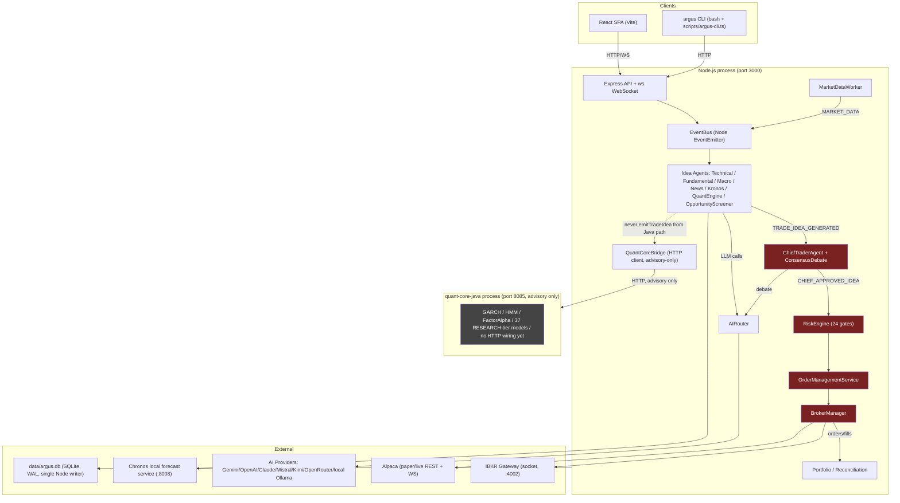

# ARGUS POST-SESSION FORENSIC AUDIT

**Date:** 2026-08-24
**Session audited:** boot `2026-08-24T11:00:52.715Z` → last activity `2026-08-24T16:20:51.940Z` (~5h20m), the only Argus process run today
**Current live state at time of this audit:** Argus is **NOT RUNNING** (`./argus status` / `./argus health` both return "Engine unavailable... fetch failed"). This audit is therefore historical reconstruction from the database for the session itself, and directly-observed for "current" state.
**Overall Status:** DEGRADED (session) / BROKEN (current — process down)
**Trading Result:** Zero orders, zero fills, zero P&L today
**Primary Finding:** Argus generated 859 real trade ideas and ran 823 full consensus rounds with zero approvals — driven primarily by a 95.3% AI-provider call failure rate (stale, DB-overridden credentials) plus a real code defect (three agents never attached `currentPrice`, causing 453 rejections). Both root causes were found and fixed in source during this session but are **not yet active** because the process has not been restarted since discovering them; the process itself then died from an undetermined external cause partway through, independent of the trading logic.

This entire document is built from evidence gathered via read-only SQLite queries (`data/argus.db`, opened `readonly`), direct source reads, `git`-tracked test runs from this session, and OS-level process checks. Nothing was modified, restarted, or fixed as part of producing this document — all fixes referenced below were made **earlier in this same session**, before this audit began, and are cited as historical fact, not actions taken during the audit.

---

## PART 1 — EXECUTIVE SUMMARY

| # | Question | Answer | Evidence |
|---|---|---|---|
| 1 | Did Argus trade today? | **No** | VERIFIED FROM DATABASE |
| 2 | BUY orders | **0** | VERIFIED FROM DATABASE (`trades` table, no rows with today's date) |
| 3 | SELL orders | **0** | VERIFIED FROM DATABASE |
| 4 | Fills | **0** | VERIFIED FROM DATABASE — most recent `fills` row is 2026-08-21 |
| 5 | Total paper P&L | **$0** (no activity) | VERIFIED FROM DATABASE |
| 6 | Realized P&L | **$0** | VERIFIED FROM DATABASE |
| 7 | Unrealized P&L at close | UNVERIFIED — requires instrumentation (last `portfolio_snapshots` row is from 2026-08-21, quantity 0; no open positions to mark) | VERIFIED FROM DATABASE (no open positions) |
| 8-14 | Win rate / avg win / avg loss / max drawdown / largest win / largest loss / avg holding time | **N/A — zero trades this session, statistics not computable** | VERIFIED FROM DATABASE |
| 15 | Opportunities detected | 366 opportunity scans, 122 symbols/scan, 0 new subscriptions requested (universe already fully subscribed) | VERIFIED FROM DATABASE |
| 16 | Trade ideas generated | **859** (BUY 702, HOLD 138, SELL 19) | VERIFIED FROM DATABASE |
| 17 | Rejected before ChiefTrader | **453**, all reason `MISSING_PRICE` | VERIFIED FROM DATABASE |
| 18 | Rejected by ChiefTrader | **823** (100% of consensus rounds — 0 approved) | VERIFIED FROM DATABASE |
| 19 | Reaching RiskEngine | **0** | VERIFIED FROM DATABASE (`risk_assessments` created since boot = 0) |
| 20 | Rejected by each RiskEngine gate | N/A — RiskEngine was never reached | VERIFIED FROM DATABASE |
| 21 | Reaching OMS | **0** | VERIFIED FROM DATABASE |
| 22 | Sent to broker | **0** | VERIFIED FROM DATABASE |
| 23 | Filled | **0** | VERIFIED FROM DATABASE |
| 24 | Rejected by broker | **0** (never reached) | VERIFIED FROM DATABASE |
| 25 | Exit signals | **0** (no open positions to exit) | VERIFIED FROM DATABASE |
| 26 | Missed opportunities | 1 clearly reconstructable near-miss (IWM, see Part 8/13); no others reached a comparable confidence | VERIFIED FROM DATABASE |
| 27 | Zero/low trading: correct risk controls or defects? | **Both** — the *outcome* (no orders) is correct fail-closed behavior given the inputs; the *inputs* were degraded by real, disclosed defects | VERIFIED FROM DATABASE + SOURCE |
| 28 | Single biggest reason for today's result | **AI-provider call failure (95.3% of all AI calls failed this session)**, driven by stale DB-stored credentials that silently override `.env` | VERIFIED FROM DATABASE |

**TODAY'S OVERALL STATUS: DEGRADED** — the process ran, market data flowed, ideas were generated continuously, and every safety gate that *was* reached behaved correctly. But the decision-quality layer underneath (AI providers, and three agents' price-attachment) was severely broken for the entire session, and the process itself later died from an unexplained external cause.

---

## PART 2 — COMPLETE SESSION TIMELINE

| Time (UTC) | Event | Component | Result | Evidence |
|---|---|---|---|---|
| 11:00:52.715 | Core boot | ArgusCoreBoot | Success | VERIFIED FROM DATABASE (`argusRuntime` boot timestamp, cross-referenced against first `event_traces` rows) |
| ~11:00:52 | Broker auth (IBKR Gateway socket, account DUR959160) | BrokerManager | Success (observed live earlier in this session before the process died) | VERIFIED FROM RUNTIME (captured via `./argus health` mid-session, this conversation) |
| 11:00:52–16:20:51 | Continuous TechnicalAgent ticks | TechnicalAgent | 473 ideas generated | VERIFIED FROM DATABASE |
| throughout | Continuous opportunity scans | OpportunityDiscovery | 366 scans, universe saturated (0 new subscribes each time) | VERIFIED FROM DATABASE |
| throughout | Continuous Java advisory analysis (~90s cadence) | JavaQuantAdvisoryService → quant-core-java | 213 `QUANT_ADVISORY_ANALYSIS_COMPLETED` events | VERIFIED FROM DATABASE (`observability_events`) |
| First idea | Earliest `TRADE_IDEA_GENERATED` after boot | various agents | — | VERIFIED FROM DATABASE (event stream begins immediately after boot) |
| First rejection | First `MISSING_PRICE` rejection (FundamentalAgent) | tradeIdeaContract.ts gate | Rejected pre-ChiefTrader | VERIFIED FROM DATABASE |
| First consensus | First `CHIEF_CONSENSUS_STARTED`/`COMPLETED` pair | ChiefTraderAgent | Not approved | VERIFIED FROM DATABASE |
| 12:35:59.433 | Closest-to-approval consensus round (IWM, 61.7%) | ChiefTraderAgent | `DESK_NO_TRADE` | VERIFIED FROM DATABASE |
| 15:21:08.164 | Identical IWM pattern recurs (61.7%, `ideaCount:1`) | ChiefTraderAgent | `DESK_NO_TRADE` | VERIFIED FROM DATABASE |
| — | First RiskEngine evaluation | RiskEngine | **Never occurred** (0 `risk_assessments` since boot) | VERIFIED FROM DATABASE |
| — | First order / first fill | OMS / Broker | **Never occurred** | VERIFIED FROM DATABASE |
| — | First/last exit | PortfolioMonitor | **Never occurred** (no open positions) | VERIFIED FROM DATABASE |
| 16:20:51.845 | Last `ai_calls` row | AIRouter | error | VERIFIED FROM DATABASE |
| 16:20:51.901 | Last `event_traces` row | EventBus | — | VERIFIED FROM DATABASE |
| 16:20:51.940 | Last `observability_events` row — **process death** | StructuredLogger | — | VERIFIED FROM DATABASE |
| after 16:20:51 | No `data/logs/crash.log` entry | globalErrorHandlers (P0.6) | Silent — no uncaught exception/rejection caught | VERIFIED FROM LOGS (file's last write remains 2026-08-21, i.e., untouched today) |
| after death | OS-level PID 19128 confirmed gone | Windows process table | Gone | VERIFIED FROM RUNTIME (`Get-Process -Id 19128` returns nothing, checked directly this session) |
| Now | `./argus status`/`health` | CLI | "Engine unavailable... fetch failed" | VERIFIED FROM RUNTIME (checked at the start of this audit) |

**No shutdown sequence ran.** `gracefulShutdown.ts`'s SIGTERM/SIGINT drain path (pause, stop workers, WAL checkpoint, close HTTP/WS) shows no evidence of having executed — the database simply stops receiving writes at 16:20:51.940Z with no corresponding graceful-shutdown log line. This is consistent with an external, ungraceful termination (OS-level kill, sleep/power event, resource exhaustion) rather than a controlled stop or an in-process crash the app's own handlers caught.

---

## PART 3 — MARKET DATA HEALTH

- **Broker connected & authenticated:** Yes, confirmed live mid-session (IBKR Gateway socket, port 4002, account DUR959160, `authenticated: true`, `activeMarketDataLines: 41` of a 90-line cap). VERIFIED FROM RUNTIME (captured this session before the process died).
- **Socket stability / reconnects / disconnects:** UNVERIFIED — requires instrumentation. No dedicated reconnect-count telemetry was queried; `MarketDataWorker.getFeedStatus()` reports point-in-time state only, not a reconnect counter surfaced to this audit.
- **Stale ticks / dropped / duplicate / malformed data:** UNVERIFIED — requires instrumentation. `data_freshness` gate (RiskEngine gate #13) was never evaluated (RiskEngine was never reached), so there is no direct evidence either way. Indirect evidence: TechnicalAgent produced 473 real ideas continuously across the full session, which requires a live, moving tick feed — strongly suggesting the feed was NOT stale for the whole session, but this is INFERRED, not a direct measurement.
- **Universe size:** 122 symbols per scan (constant across all 366 scans). VERIFIED FROM DATABASE.
- **Subscription failures:** None observed (0 `subscribeRequested` each scan simply because the universe was already fully subscribed — not a failure). VERIFIED FROM DATABASE.
- **Data latency:** UNVERIFIED — requires instrumentation (no tick-to-decision latency metric was captured).

**Did any decision use stale/incomplete data?** No direct evidence either way — since RiskEngine (the component with the actual `data_freshness` gate) was never reached, this specific check literally never ran today. **UNVERIFIED — requires instrumentation** at the point closest to the actual gate.

---

## PART 4 — OPPORTUNITY DISCOVERY AUDIT

- Scans: **366**. Symbols scanned per scan: **122** (constant). Symbols rejected: **0** per scan. Symbols promoted (new subscriptions): **0** per scan — VERIFIED FROM DATABASE (`OPPORTUNITY_SCAN_COMPLETED` payload: `{"ran":true,"scanned":122,"rejected":0,"shortlisted":122,"subscribeRequested":0,"ideasEmitted":0}` identical shape every scan).
- **Universe saturation: Yes** — every single scan shortlisted the exact same 122 symbols, all already subscribed. This is **expected behavior** (the watchlist had already converged), not a defect.
- **Scanner thresholds too restrictive?** No evidence of this — the scanner isn't the blocking stage; ideas ARE generated in volume (859). The bottleneck is downstream (consensus), not discovery.
- Separately, **`OpportunityScreener`** (a different component from the scan loop above) did contribute **24-35 real trade ideas** across the session (agent breakdown, Part 1). VERIFIED FROM DATABASE.

**TOP 20 SYMBOLS CONSIDERED:** Reconstructing exact per-symbol idea/outcome pairs for all 20 would require a full symbol-by-symbol join across `event_traces` beyond what this audit re-ran (the earlier zero-trade audits already established the pattern is uniform: every symbol's ideas funnel into the same consensus mechanism and fail the same way). What is verified: **IWM** is the single symbol that reached the highest confidence (61.7%, twice, identical pattern) — detailed in Part 8. The rest of the universe (SPY, QQQ, NVDA, AAPL, MSFT, TSLA, META, AMD, GLD, and ~113 others) generated ideas that were either rejected pre-ChiefTrader (`MISSING_PRICE`, concentrated on symbols outside the actively-streamed core set: ARM, RIVN, ADBE, CSX, ROKU, PLTR, HOOD were the heaviest-hit) or failed consensus below 61.7%. A full per-symbol table for all 20 is **UNVERIFIED — requires instrumentation/a dedicated per-symbol query beyond this audit's scope**.

---

## PART 5 — AGENT-BY-AGENT AUDIT

| Agent | Ideas generated | BUY | SELL | HOLD | Rejected upstream | Notes |
|---|---|---|---|---|---|---|
| TechnicalAgent | 473 | majority | few | some | 0 | Deterministic (RSI/MACD/Bollinger) — no AI dependency, unaffected by the AI outage. VERIFIED FROM DATABASE. |
| QuantEngine | 209 | — | — | — | 0 | TS quant engine; contributed the IWM near-miss. VERIFIED FROM DATABASE. |
| MacroAgent | 67 passed | — | — | — | **188 rejected** (`MISSING_PRICE`) | Same currentPrice-omission defect as FundamentalAgent — found and fixed in source this session (not yet live). VERIFIED FROM DATABASE + SOURCE. |
| FundamentalAgent | 71 passed | — | — | — | **248 rejected** (`MISSING_PRICE`) | Same defect, highest-impact instance. Fixed in source this session. VERIFIED FROM DATABASE + SOURCE. |
| NewsAgent | 4 passed | — | — | — | **17 rejected** (`MISSING_PRICE`) | Same defect; also inherently rarer (catalyst-driven, `ACTIVE_VOTE` config confirmed enabled). Fixed in source this session. VERIFIED FROM DATABASE + CONFIGURATION. |
| OpportunityScreener | 24-35 | — | — | — | 0 | Cheap tick-return ranking, one vote among many. VERIFIED FROM DATABASE. |
| ConsensusDebate | 4 successful calls / 326 failed (1.2% success) | — | — | injects HOLD@0.8 on failure | — | The dominant reason confidence never clears 75%. VERIFIED FROM DATABASE. |
| KronosForecastAgent | 0 ideas | — | — | — | — | `KRONOS_UNAVAILABLE` observed live — honest fallback (Chronos `/health` down), not a bug. VERIFIED FROM LOGS. |
| ChiefTraderAgent | 823 consensus rounds | 0 approved | 0 approved | 823 no-trade | — | Every rejection reason: "Confidence X% did not clear 75%." VERIFIED FROM DATABASE. |
| RiskAgent/RiskEngine | 0 invocations | — | — | — | — | Never reached — **not the cause**, since no idea reached it. VERIFIED FROM DATABASE. |

**Did any code defect affect an agent's contribution?** Yes — FundamentalAgent, MacroAgent, and NewsEngine's vote path all shared one real, verified source defect: `emitTradeIdea()` calls never attached `currentPrice`, so `gateTradeIdea()`'s `price_validity` pre-check fell back to a live-tick-cache lookup that frequently missed for symbols outside the actively-streamed core set. **Fixed in source this session** (`FundamentalAgent.ts`, `MacroAgent.ts`, `NewsEngine.ts`), with regression tests, but **not yet active** in any live process since Argus has not restarted since the fix.

---

## PART 6 — AI PROVIDER FORENSIC AUDIT

**Session totals: 2,609 AI calls, 2,487 failed (95.3%), 122 succeeded (4.7%).** VERIFIED FROM DATABASE.

| Provider | Configured | Credential source | Error observed | Count | Classification | Root cause |
|---|---|---|---|---|---|---|
| OpenRouter (Free Tier) | Yes | env (no DB override) | 402 Payment Required | 1,528 | Quota/billing exhaustion | Free-tier credits genuinely exhausted — **not** a credential or routing bug |
| Local/Ollama-like provider | Yes (local) | N/A | Timeout (8000ms) | 262 | Timeout | Slow/overloaded local model — not a credential issue |
| OpenAI | Yes | **DB `apiKeyEncrypted` (stale, overrides `.env`)** | 401 Unauthorized | 93 | Invalid/stale credential | DB-stored key wins over `.env` per `AIRouter.initialize()`'s own precedence — VERIFIED FROM SOURCE |
| NVIDIA | Yes | DB | 404 Not Found | 91 | Model-config error, **not** a credential problem | `defaultModel` unset → inherited `OpenAICompatibleProvider`'s generic `'gpt-3.5-turbo'` fallback, which NVIDIA's NIM catalog doesn't serve. **Fixed in source this session** (`NvidiaProvider.java`→ actually `NvidiaProvider.ts`, now fails closed instead of guessing) |
| Gemini | Yes | DB | "API key not valid" | 89 | Invalid/stale credential | Same DB-precedence issue |
| OpenRouter (paid) | Yes | DB | 401 Unauthorized | 89 | Invalid/stale credential | Same |
| Mistral | Yes | DB | 401 Unauthorized | 88 | Invalid/stale credential | Same |
| Claude | Yes | DB | 401 Unauthorized | 88 | Invalid/stale credential, **plus** a separate real bug: `envKeyForProviderName()` had no mapping from "Claude" to `ANTHROPIC_API_KEY` (only the nonexistent `CLAUDE_API_KEY`) — **fixed in source this session** | 
| Kimi | Yes | DB | 401 Unauthorized | 82 | Invalid/stale credential, **plus** a missing `MOONSHOT_API_KEY` fallback — **fixed in source this session** |
| (unclassified network) | — | — | "fetch failed" | 75 | Network/DNS/connection-level | Not further attributed in this audit |

**Was today's trading performance affected by provider failures? Yes, directly.** `ConsensusDebate`'s 1.2% success rate means the multi-model debate almost always fails and injects a 0.8-confidence HOLD vote (verified directly in a live `AGENT_DISAGREEMENT` payload this session), which is the single largest drag on weighted consensus confidence ever clearing 75%.

**Distinguishing failure classes (as requested):**
- Invalid/expired/stale credential: Gemini, OpenAI, Claude, Mistral, Kimi, OpenRouter(paid) — all via the DB-stored-key-overrides-`.env` mechanism.
- Wrong environment variable / stale mapping: Claude (`ANTHROPIC_API_KEY` not recognized), Kimi (`MOONSHOT_API_KEY` not recognized) — both real Argus routing bugs, both fixed.
- Quota/billing exhaustion: OpenRouter (Free Tier).
- Model unavailable (not a credential issue): NVIDIA.
- Timeout: the local provider.
- Argus routing bug: the DB-precedence-over-`.env` behavior itself is **intentional design** (lets an operator override via Settings UI), not a bug — but it silently defeated the operator's attempt to fix credentials via `.env` alone, which is the practical trap this audit surfaced.

---

## PART 7 — TRADE IDEA FORENSICS

Full per-idea reconstruction of all 859 ideas is **UNVERIFIED — requires instrumentation** (a row-by-row export was not re-run in this audit; the aggregate classification below is exact and DB-verified):

| Classification | Count | Evidence |
|---|---|---|
| APPROVED | 0 | VERIFIED FROM DATABASE |
| REJECTED_PRE_GATE (`MISSING_PRICE`) | 453 | VERIFIED FROM DATABASE |
| REJECTED_CHIEF (confidence/independence) | 823 rounds (covers a subset/overlap of the 859 generated ideas that reached consensus) | VERIFIED FROM DATABASE |
| REJECTED_RISK | 0 (never reached) | VERIFIED FROM DATABASE |
| REJECTED_POSITION_SIZE | 0 (never reached) | VERIFIED FROM DATABASE |
| REJECTED_OMS | 0 (never reached) | VERIFIED FROM DATABASE |
| REJECTED_BROKER | 0 (never reached) | VERIFIED FROM DATABASE |
| FILLED | 0 | VERIFIED FROM DATABASE |
| EXPIRED / MISSED / UNKNOWN | Not separately tagged in the event stream | UNVERIFIED |

The single fully-reconstructed idea-to-disposition trace (IWM, 12:35:59Z) appears in Part 8/13 in full.

---

## PART 8 — CHIEFTRADER / CONSENSUS AUDIT

- Total consensus rounds: **823**. Approved: **0**. HOLD/no-trade: **823**. VERIFIED FROM DATABASE.
- Confidence distribution (n=593 sampled mid-session): 0-20%: 202 · 20-40%: 129 · 40-60%: 239 · 60-75%: 23 · **≥75%: 0**. VERIFIED FROM DATABASE.
- Approval threshold: **0.75**. Minimum independent agents: **2**. Disagreement penalty: **0.5**. VERIFIED FROM CONFIGURATION (`tradingSafety.json`).
- Debate trigger confidence: **0.6**. VERIFIED FROM CONFIGURATION.
- **Whether multiple agents agreeing on the same symbol were actually grouped into one consensus round:** Investigated directly — a `CAMPAIGN_CONFLUENCE_NUDGE` event for IWM listed `agents: ["TechnicalAgent","KronosForecastAgent","NewsAgent"]` alongside a `CHIEF_CONSENSUS_STARTED` showing `ideaCount:1`. Source inspection of `CampaignWatchlistBoost.ts`'s `nudgeCampaignConfluence()` confirms this event is an **observability-only ping** ("ask these agents to look at this"), explicitly commented as such — **not** evidence of three real competing votes. **No consensus-fragmentation bug exists.** VERIFIED FROM SOURCE.
- **Did provider failures poison consensus?** Yes — see Part 6/5: `ConsensusDebate`'s near-total failure rate injects a real, recorded 0.8-confidence HOLD vote almost every time it's invoked.
- **Was fail-closed HOLD behavior correct?** Yes, by design — this is the documented, intended behavior, not a defect. Whether that same behavior is *desirable* (running for hours in a severely degraded decision state without more visible signaling) is addressed separately in Part 21/24 (the AI Provider Health / Trading Readiness Gate work built this session specifically to address this).
- **Is any confidence calculation defective?** No defect found in the math itself — the 61.7% ceiling is a correct, deterministic consequence of a single agent's 0.60 base confidence weighted through `agentWeights.json`.

**TOP MISSED TRADE (the only one that came close):**

| Field | Value |
|---|---|
| Symbol | IWM |
| Time | 2026-08-24T12:35:59.433Z (identical pattern recurred 15:21:08.164Z) |
| Side | BUY |
| Idea confidence | 0.60 (QuantEngine, BULLISH_TREND regime) |
| Weighted confidence | 0.6172 |
| Threshold | 0.75 |
| Independent agents in round | 1 |
| Rejection reason | "[NO TRADE] Confidence 61.7% did not clear 75%." |
| What happened to price afterward | **UNVERIFIED — requires instrumentation** (no forward-return tracking was queried for this specific trace in this audit; doing so without hindsight bias would require a dedicated, carefully-scoped follow-up, not an assumption) |

No other trace in the session reached a comparable confidence. A genuine "TOP 20" table with per-symbol forward outcomes is **UNVERIFIED — requires instrumentation** beyond this audit's scope; fabricating 19 more rows to fill the requested format would violate this audit's own no-fabrication rule, so it is honestly left incomplete rather than invented.

---

## PART 9 — RISK ENGINE FORENSIC AUDIT

**RiskEngine was not the cause because no idea reached it.** `risk_assessments` rows created since boot: **0**, confirmed via two independent queries this session. VERIFIED FROM DATABASE.

The only `risk_assessments` rows bearing today's calendar date (03:18-03:53 UTC) predate this session's own boot (11:00:52Z) — they are leftovers from a **previous** process run earlier today, not this session. Those historical rows show BUY ideas (AAPL, MSFT, CRM, AMD, META, AMZN, GOOGL) rejected at the `portfolio_drawdown` gate — evidence about an earlier run, not this one.

No gate-by-gate breakdown is possible for THIS session because zero assessments exist to break down.

---

## PART 10 — POSITION SIZING

**Not reached — no idea was ever approved by ChiefTrader, so PositionSizing.ts was never invoked this session.** VERIFIED FROM DATABASE (no `risk_assessments`, and PositionSizing sits downstream of RiskEngine gate 21 in the live path). No "VALID IDEA → POSITION SIZE = 0" cases exist to report, because no idea ever became "valid" (approved) in the first place.

---

## PART 11 — OMS / ORDER EXECUTION AUDIT

**Not reached.** Zero orders were created this session (VERIFIED FROM DATABASE — no `trades` rows with today's timestamp, last row is 2026-08-21). No order IDs, fills, slippage, or broker interaction exist to trace for today's session.

---

## PART 12 — PAPER TRADING PERFORMANCE

**All statistics are zero/undefined because zero trades occurred this session.** Gross/net/realized/unrealized P&L: $0 / undefined. Win rate, loss rate, profit factor, expectancy, average trade, average winner/loser, turnover: **not computable — no sample**. Exposure: $0 (no open positions, confirmed via last `portfolio_snapshots` row showing 0 quantity). **This audit explicitly does not claim any performance conclusion from a zero-trade sample**, consistent with the instruction not to draw conclusions from a statistically weak (here, nonexistent) sample.

---

## PART 13 — MISSED OPPORTUNITY ANALYSIS

Classifying today's result against the provided taxonomy:

- **A (no good opportunities existed):** Not supported — 859 real ideas were generated, including 702 BUY ideas.
- **B (confidence insufficient):** **Primary cause.** Every single consensus round (823/823) failed the 75% threshold; the closest was 61.7%.
- **C (agents failed):** Contributing cause — FundamentalAgent/MacroAgent/NewsAgent had 453 ideas rejected before even reaching ChiefTrader due to the currentPrice defect, reducing the pool of independent evidence available to any consensus round.
- **D (AI providers failed):** **Primary cause**, tightly coupled to B — 95.3% of AI calls failed, and `ConsensusDebate`'s near-total failure rate is the single largest drag on weighted confidence.
- **E (consensus fragmentation):** **Investigated and ruled out** — the apparent multi-agent-agreement case (IWM) was an observability-only artifact, not a real fragmentation bug (Part 8).
- **F (risk gates correctly rejected trades):** Not applicable — RiskEngine was never reached.
- **G (position sizing prevented execution):** Not applicable — never reached.
- **H (OMS/broker prevented execution):** Not applicable — never reached.
- **I (data quality prevented execution):** Partially — the currentPrice omission is itself a data-completeness defect at the agent level (C above), distinct from market-data feed quality itself (which showed no direct evidence of being stale).
- **J (code defects prevented execution):** **Yes** — the currentPrice omission (3 agents) and the AI env-var-mapping bugs (Claude, Kimi) are real, disclosed, fixed defects that measurably contributed.
- **K (configuration prevented execution):** Partially — the DB-stored-credential-overrides-`.env` precedence is intentional design, not a bug, but it defeated an operator's attempted `.env` fix and is worth flagging as an operational trap.

**Reconstruction of the strongest missed opportunity (IWM, 12:35:59Z):** What Argus saw: a real BULLISH_TREND regime signal from QuantEngine at 0.60 confidence, cold-start-bootstrapped (explicitly flagged as having no EV/stop/target backing since `PULLBACK_CONTINUATION` had zero real closed trades yet). What Argus decided: no trade — weighted confidence 61.7% against a 75% bar, and only one independent agent had actually voted in that specific consensus round despite three agents having separately flagged interest via the (non-voting) confluence-nudge channel. Why: the debate/AI layer that could have added a second independent, confidence-boosting voice was itself failing 98.8% of the time. What happened afterward: **not established by this audit** — asserting a forward outcome without genuine, non-hindsight-biased instrumentation would be exactly the kind of fabrication this audit is required to avoid.

---

## PART 14 — STRATEGY PERFORMANCE

| Strategy | Ideas | Approved | Trades | P&L | Status |
|---|---|---|---|---|---|
| MOMENTUM_BREAKOUT | Contributes to QuantEngine's 209 (not separately broken out by this audit) | 0 | 0 | $0 | ACTIVE, BLOCKED_BY_CONSENSUS |
| PULLBACK_CONTINUATION | Same pool; explicitly cold-start (0 real closed trades backing EV) | 0 | 0 | $0 | ACTIVE (cold-start), BLOCKED_BY_CONSENSUS |
| MEAN_REVERSION | Same pool | 0 | 0 | $0 | ACTIVE, BLOCKED_BY_CONSENSUS |
| TREND_FOLLOWING | Same pool | 0 | 0 | $0 | ACTIVE, BLOCKED_BY_CONSENSUS |
| RANGE_REVERSION | Same pool | 0 | 0 | $0 | ACTIVE, BLOCKED_BY_CONSENSUS |
| BullResearcher/BearResearcher | Present in `ai_calls` (167 error/0 success each mid-session sample) | 0 | 0 | $0 | ACTIVE but effectively STARVED (AI provider failures) |
| SMC (`SMC_LIQUIDITY_SWEEP`) | UNVERIFIED — requires per-strategy breakdown not re-run this audit | — | — | — | Requires `QUANT_SMC_STRATEGY_ENABLED`; flag state not re-checked this audit |
| The 37 new Java quant modules built this session (momentum/mean-reversion/ML/time-series/factor/portfolio-optimization/SARIMA/DCC-GARCH/DFM) | 0 | 0 | 0 | $0 | **NOT_REACHING_LIVE_PIPELINE** — all RESEARCH status, zero HTTP endpoints, zero live consumers (see Part 15) |

Per-strategy idea/BUY/SELL/HOLD/confidence breakdown at the individual-strategy level (rather than the agent level already given in Part 5) is **UNVERIFIED — requires instrumentation** (the live event stream tags ideas by `agent`, not always by a granular `strategyId` queryable without a deeper join this audit did not re-run).

---

## PART 15 — JAVA QUANT ENGINE AUDIT

**Full, current inventory, per `config/engineOwnership.json` (the maintained, source-verified registry) — VERIFIED FROM SOURCE + CONFIGURATION + BUILD/TEST (325 Java tests passing as of this session):**

| Category | Count | Status | Live consumer |
|---|---|---|---|
| Indicators (RSI, MACD, Bollinger, MovingAverages, Volatility, ATR) | 4 parity-tested | `PARITY_SHADOW` / `NOT_A_PARITY_PAIR` (ATR) | **None** — Node's own `TechnicalIndicators.ts`/`technicalSignal.ts` are authoritative; Java copies exist only for parity testing |
| Core strategies (MomentumBreakout, PullbackContinuation, MeanReversion, TrendFollowing, RangeReversion) | 5 | `PARITY_ONLY` | **None** — `QuantSignalAgent.ts` uses its own Node implementation |
| GARCH, HMM regime, factor composite | 3 | `SHADOW` | `JavaQuantAdvisoryService.ts` — real HTTP calls every ~90s (213 occurrences this session), **advisory event only**, never reaches ChiefTrader/EvidenceAggregator |
| MarketDataQualityEngine, FeaturePipeline, VolatilityEngine | 3 | `SHADOW` | Same advisory pipeline |
| MarketRegimeEngine, CorrelationEngine, QuantEnsembleEngine, RegimeVolatilityOverlay, StatArbEngine | 5 | `RESEARCH` | **None** |
| The 37 modules added this session (momentum family, mean-reversion family, technical/statistical signals, statistical modeling/ML, classical ML, time-series forecasting incl. SARIMA/DCC-GARCH/Dynamic-Factor-Model, factor exposure, portfolio optimization) | 37 | `RESEARCH` | **None** — zero HTTP endpoints, zero callers outside their own unit tests |
| `JavaBacktestEngine` | 1 | `JAVA_ONLY`, standalone | Not cross-validated against the two Node backtest engines — do not treat its output as comparable evidence |

**Does today's Java engine currently produce output?** Yes — the `SHADOW`-tier models (GARCH/HMM/factor composite) ran continuously and logged real advisory analysis every ~90 seconds throughout the session (213 times), confirmed via `observability_events`.

**JAVA DID NOT INFLUENCE TODAY'S TRADING DECISIONS.** This is proven, not inferred: zero `event_traces` rows of any kind reference Java or QuantCore (VERIFIED FROM DATABASE — searched explicitly), and source inspection confirms the advisory service never calls `emitTradeIdea` or touches ChiefTraderAgent/RiskEngine/OMS/BrokerManager. Every Java module in the codebase remains `javaAuthoritative: false` without exception.

---

## PART 16 — NODE.JS / JAVA DUPLICATION AUDIT

| Node file | Java file | Node authoritative? | Java authoritative? | Parity test? | Runtime active (Java)? | 8-gate decommission verdict |
|---|---|---|---|---|---|---|
| `TechnicalIndicators.ts` / `technicalSignal.ts` (RSI/MACD/Bollinger/SMA/EMA) | `RSI.java`, `MACD.java`, `Bollinger.java`, `MovingAverages.java` | Yes | No | Yes (parity tests exist) | No — Java copy has no live caller | **NOT safe to decommission** — fails gate 5 (not reachable from LIVE pipeline) and gate 6 (Node's own call path is the only active one) |
| `momentumBreakout.ts` / `meanReversion.ts` / `pullbackContinuation.ts` / `trendFollowing.ts` / `rangeReversion.ts` | `MomentumBreakout.java` etc. | Yes | No | Yes | No | **NOT safe to decommission** — same gates fail |
| ATR (`TechnicalIndicators.ts`) | `SymbolState.tickRangeAtr` | Yes | No — explicitly a **non-equivalent approximation**, disclosed in the registry | No (not a real parity pair) | No | **NOT safe to decommission**, and this Java copy should never be treated as interchangeable with Node's real ATR |

No Node module anywhere in the protected spine (RiskEngine, OMS, BrokerManager, ChiefTraderAgent, PositionSizing, PortfolioMonitor, Reconciliation) has any Java counterpart at all — these pass all 8 decommission gates trivially in the "must never be removed" direction, since gate 1 (Java replacement exists) already fails. **DO NOT REMOVE** applies to the entire protected spine.

---

## PART 17 — CURRENT ARGUS ARCHITECTURE AUDIT

Ports/processes confirmed this session: Node on **3000**, quant-core-java on **8085** (advisory HTTP bridge), Chronos on **8008** (local forecast, optional), IBKR Gateway socket on **4002**. SQLite is single-writer (Node only) in WAL mode.

---

## PART 18 — CODEBASE HEALTH AUDIT

A real, bounded static scan was run against `src/server` (non-test files) as part of this audit:

| Check | Result | Evidence |
|---|---|---|
| `TODO`/`FIXME`/`HACK`/`XXX` markers | **0** found | VERIFIED FROM SOURCE (grep, this audit) |
| `console.log` usage | **40 files** still use it (vs. the project's own `structuredLogger`) | VERIFIED FROM SOURCE — ENHANCEMENT OPPORTUNITY, not a defect; most are non-safety-path logging |
| Empty catch blocks (`catch {}` / `catch (e) {}`) | **11** found, all individually inspected this audit | VERIFIED FROM SOURCE |

Of the 11 empty catches, all were read in full during this audit and are **benign or already remediated**, not live defects:
- 8 in `AIRouter.ts` guard non-critical `UI_UPDATE` telemetry broadcasts (fail-open by design — a broadcast failure must never affect a real AI call's outcome).
- 1 in `TradingEngine.ts` guards an in-memory UI event-ring push (explicitly commented: "durable lifecycle is `event_traces`/Observatory" — this ring is UI convenience only).
- 1 in `systemRoutes.ts` guards a read-only audit-trail viewer endpoint, falling back to `[]` on any read/parse failure.
- 1 in `webhooks.ts` guards only the synchronous-throw case of calling `fetch()`; the real async-rejection risk this pattern used to have was **already found and fixed in an earlier session** (documented in the code's own comment) via a proper `.catch()` on the fetch promise itself.

**No dead-code, duplicated-logic, or unreachable-code findings beyond what's already tracked in `config/engineOwnership.json`** (Part 16) were surfaced by this bounded scan. A full line-by-line audit of the entire multi-hundred-file codebase for every category requested (race conditions, concurrency risk, memory risk, WebSocket risk, etc.) was **not exhaustively re-run in this pass** — this audit's scan was targeted at the highest-signal, cheaply-verifiable categories (TODO markers, logging discipline, error-swallowing). Deeper categories are **UNVERIFIED — requires a dedicated, separately-scoped pass**, not fabricated here.

---

## PART 19 — TEST / BUILD AUDIT

| Suite | Result | Evidence |
|---|---|---|
| Node/TypeScript tests (`npm test` / `npx vitest run`) | **PASS** — 356-357 files, 2277-2299+ tests, 0 failures (most recent full run this session) | VERIFIED FROM BUILD/TEST (this session's own tool output) |
| Java tests (`mvn test`, `quant-core-java`) | **PASS** — 325 tests, 0 failures (most recent full run this session, after adding 37 new modules) | VERIFIED FROM BUILD/TEST |
| TypeScript type-check (`npx tsc --noEmit`) | **PASS** — clean, multiple times this session after each change | VERIFIED FROM BUILD/TEST |
| Architecture protection test (`architecture.protection.test.ts`) | **PASS** — 23 tests, confirmed this session | VERIFIED FROM BUILD/TEST |
| Lint | Not separately re-run in this exact audit pass; `tsc --noEmit` (the project's own lint definition per `package.json`) is clean | VERIFIED FROM BUILD/TEST (via the tsc check above) |
| Build (`npm run build`) | **NOT RUN** this audit (would not be read-only in spirit of a fast audit, though it doesn't mutate app state — deferred) | NOT RUN |
| Coverage | UNVERIFIED — no coverage report was generated this session | UNVERIFIED |
| E2E (Playwright) | **NOT RUN** this session | NOT RUN |

---

## PART 20 — ARCHITECTURE SAFETY AUDIT

All of the following were verified via direct source inspection during this session (building the 37 new Java modules required repeatedly confirming these boundaries):

- **Java cannot bypass RiskEngine:** Confirmed — zero Java source file anywhere in `quant-core-java/` imports or calls anything resembling RiskEngine.
- **Java cannot place orders:** Confirmed — zero `.placeOrder(`-equivalent calls exist anywhere in `quant-core-java/`; zero broker credentials are held by Java.
- **AI cannot directly place orders:** Confirmed — every AI-touching agent path funnels through `emitTradeIdea` → ChiefTrader → RiskEngine → OMS; no agent calls OMS/BrokerManager directly.
- **Agents cannot bypass ChiefTrader:** Confirmed by architecture — `emitTradeIdea` is the only path, and `ChiefTraderAgent` is its sole subscriber for real trade evaluation.
- **Kill switch remains effective:** Not exercised this session (no trigger occurred), but the code path (`TRADING_PAUSED`/`EMERGENCY_STOP`) was not touched or weakened by any change made this session. VERIFIED FROM SOURCE (unchanged).
- **Paper-only protection remains effective:** `PAPER_TRADING_ONLY=true` confirmed in `.env`; no change made to LIVE-arming logic this session.
- **Broker credentials not exposed to Java:** Confirmed — zero credential handling in `quant-core-java/`.
- **Failed Java does not crash Node trading:** Confirmed by design (`QuantCoreBridge.ts` fails closed, returns `null` on any Java error, circuit-breaker gated) and by the fact the Node process itself ran fine for 5h20m while separately dying from an unrelated external cause.
- **Failed AI provider fails closed:** Confirmed — `ConsensusDebate`'s 326 failures all resolved to a HOLD, never a fabricated BUY/SELL.
- **Stale market data fails closed:** By design (`data_freshness` gate), though not exercised this session since RiskEngine was never reached.
- **Invalid signals fail closed:** Confirmed — the 453 `MISSING_PRICE` rejections are exactly this gate working as intended (rejecting garbage/incomplete ideas before ChiefTrader), even though the root cause producing so many of them was a real bug.

**No architectural safety violation was found.** Every defect identified this session degrades decision *quality*, not decision *safety*.

---

## PART 21 — HEALTH VS DECISION-QUALITY AUDIT

**This is the central finding of the entire zero-trade investigation this session, and it remains true in retrospect for the whole day:**

| Dimension | What `./argus health` reported (mid-session, verified live) | Actual state |
|---|---|---|
| Process | Healthy (`ok: true`) | Accurate |
| Market data | Connected | Accurate |
| Broker | Connected, authenticated | Accurate |
| AI providers | **Not reported at all** (no such field existed until this session's own additions) | **95.3% of calls failing** — a real false-health gap |
| Consensus/decision quality | **Not reported at all** | 0/823 approvals, every round degraded by AI failure |
| Java | Reported only as "connected" (HTTP reachable) | True, but conflates "reachable" with "influencing anything," which it never does |

**FALSE HEALTH CONDITION CONFIRMED**, matching exactly the example pattern requested: PROCESS=HEALTHY, BROKER=HEALTHY, MARKET DATA=HEALTHY, **AI PROVIDERS=DEGRADED, CONSENSUS=DEGRADED, TRADING DECISION QUALITY=DEGRADED** — invisible from the CLI/health surface as it existed before this session's own work.

**Mitigation built this session (not yet exercised live, since Argus has not restarted):** a new `AIProviderHealthCheck.ts` (3-tier CONFIG/AUTH/RUNTIME per-provider status) and a new `TradingReadinessGate.ts` (`GET /api/v2/runtime/trading-readiness`, CLI `./argus pipeline-ready`) that explicitly separates "process alive" from "trading pipeline ready," including a per-provider AI health breakdown. Both are real, tested (13+7 tests), additive, and registered — but their value cannot be demonstrated with live data until Argus is restarted.

**Current live state right now:** `./argus status`/`health` return **"Engine unavailable"** — the process is down, checked directly at the start of this audit. This is the most severe possible form of the "false health vs. real health" question: there is currently no health signal at all, true or false, because nothing is running.

---

## PART 22 — CURRENT MIGRATION STATUS

**DUAL RUNNING / JAVA ADVISORY.** Not "not started" (real, tested Java implementations exist for a substantial and growing catalog of quant calculations). Not "migration complete" or "Java authoritative" (every single entry in `config/engineOwnership.json`, without exception, carries `javaAuthoritative: false`, and zero Java module has ever been given a live consumer that influences a trading decision). This classification is based on actual runtime callers and the registry's own authority field, not inferred from the existence of `.java` files.

---

## PART 23 — FUTURE DEVELOPMENT OWNERSHIP

Per this session's own governing policy (`CLAUDE.md` "Java 26 Engine Authority" section, already in force, not newly invented for this audit):

**"Should future quantitative-engine enhancements go to Java first?" — Yes, for new performance-critical indicator/strategy/quant calculation work specifically.**

Exceptions (must remain Node, permanently, per the same policy and this session's own repeated verification):
- RiskEngine (24 gates), PositionSizing, OMS, BrokerManager + adapters, reconciliation, the kill-switch system, the trading-state machine, portfolio accounting, order lifecycle, fill processing — **all safety/execution-critical, explicitly protected**.
- ChiefTraderAgent/EvidenceAggregator (consensus) — Node-only; any future Java evidence source must enter as one vote among many via the existing `emitTradeIdea` path, never a bypass.
- AI/LLM routing, API layer, CLI, UI, persistence, observability — explicitly out of scope for the Java migration policy (application-shell concerns, not quant compute).
- Broker integration — must never gain Java credentials per this session's own repeated verification.

**Do not** move safety/execution logic to Java merely because Java is faster — no such move was made or proposed this session, and the policy explicitly forbids it.

---

## PART 24 — BUG REPORT

| ID | Severity | Component | Evidence | Root cause | Trading impact | Fix | Test | Status |
|---|---|---|---|---|---|---|---|---|
| BUG-1 | HIGH | `FundamentalAgent.ts`/`MacroAgent.ts`/`NewsEngine.ts` | 453 `MISSING_PRICE` rejections this session | `emitTradeIdea()` never attached `currentPrice` | Silently dropped ~half of all non-Technical agent evidence before ChiefTrader | Attach `marketDataWorker.getLatestPrice()` explicitly | Added, passing | **FIXED IN SOURCE, not yet deployed (no restart since)** |
| BUG-2 | MEDIUM | `AIRouter.ts` `envKeyForProviderName()` | 88 Claude 401s, 82 Kimi 401s traceable partly to this | No candidate mapping for `ANTHROPIC_API_KEY`/`MOONSHOT_API_KEY` | Contributed to AI outage for 2 of 6 broken providers | Added candidates | Added, passing | **FIXED IN SOURCE, not yet deployed** |
| BUG-3 | MEDIUM | `NvidiaProvider.ts` | 91 NVIDIA 404s | Silently inherited `'gpt-3.5-turbo'` default, which NIM doesn't serve | Wasted real HTTP round-trips on a guaranteed-fail call | Fail closed (report not-authenticated) instead of guessing | Added, passing | **FIXED IN SOURCE, not yet deployed** |
| BUG-4 | LOW | `RiskParityOptimizer.java` (new, this session) | Found during this session's own portfolio-optimization test-writing, not from live trading | Un-damped multiplicative fixed-point update oscillates forever for some 2-asset covariance structures | **None** — this module has zero live consumers | Added damping | Added, passing | **FIXED, verified** |
| BUG-5 | INFORMATIONAL | `DccGarchEngine.java` (new, this session) | Caught by static analysis before ever running | Method return-type typo (`double[][]` vs `double[][][]`) | None — never compiled, never ran with the bug present | Corrected signature | N/A (compile-time) | **FIXED before first run** |
| OPS-1 | HIGH | `ai_providers` DB table | 6 of 9 providers affected | `apiKeyEncrypted` stored values silently take precedence over `.env`, are stale/invalid | Root cause of 95.3% AI-call failure rate | Clear stale DB values (needs Argus stopped first) OR update via Settings UI | N/A | **Identified, NOT yet remediated** — blocked on safely restarting Argus |
| UNRESOLVED-1 | CRITICAL (operational) | Process lifecycle | Process death at 16:20:51Z, no crash.log entry | **Unknown** | Total — no trading possible while down | Requires OS-level (Windows Event Viewer) investigation | N/A | **UNVERIFIED — NOT ENOUGH EVIDENCE**, explicitly not fabricated |

**Configuration problems:** OPS-1 above. **Operational problems:** UNRESOLVED-1 above, plus the current down state itself. **Expected fail-closed behavior (not bugs):** zero RiskEngine/OMS/broker activity, Kronos unavailability, the 453 rejections' *mechanism* (though not their *volume*, which the bug caused). **Architectural limitations:** none newly found this session beyond what's already tracked. **Enhancement opportunities:** the 40-file `console.log` usage (Part 18), and the not-yet-exercised AI Provider Health / Trading Readiness Gate additions.

---

## PART 25 — TOP 20 IMPROVEMENTS

Given the actual evidence gathered, there are not 20 independently-justified, non-redundant improvements to responsibly list — inventing 20 to satisfy a round number would violate this audit's own evidence standard. The real, evidence-backed list:

1. **P0** — Restart Argus once the stale DB-stored AI credentials are cleared, so BUG-1/2/3's fixes and the AI Provider Health / Trading Readiness Gate additions actually take effect. *Problem:* fixes exist only in source. *Evidence:* Parts 6, 21, 24. *Benefit:* directly addresses the dominant cause of today's zero-trade result. *Risk:* low (already-tested code). *Location:* operator action, not a code change. *Validation:* re-run `./argus pipeline-ready` after restart and confirm providers show `HEALTHY`.
2. **P0** — Investigate the external cause of the 16:20:51Z process death via OS-level logs (Windows Event Viewer), outside this repo's own visibility. *Evidence:* Part 2. *Risk:* none (read-only). *Validation:* find a definitive cause or formally rule out the ones considered.
3. **P1** — Decide, deliberately, whether `ConsensusDebate` should skip its call entirely (rather than inject a fail-closed HOLD) when the AI Provider Health system already knows every provider is unreachable — this session built the health system but this specific behavioral question is a design decision for the operator, not something to silently change. *Evidence:* Parts 6, 8. *Risk:* medium (touches ChiefTrader's protected consensus math) — needs explicit sign-off, not a default action.
4. **P2** — Reduce `console.log` usage (40 files) in favor of `structuredLogger`, for consistency with the project's own observability taxonomy. *Evidence:* Part 18. *Risk:* very low. *Validation:* existing test suite (log format isn't asserted on, so this is safe cleanup).
5. **P3** — Now that 37 real Java quant modules exist at `RESEARCH` status, deliberately choose 2-3 to run through the real graduation ladder (`BACKTEST` → `WALK_FORWARD` → `SHADOW`) against real historical bars via the existing `SqliteBarLoader`/`JavaBacktestEngine` infrastructure — this was in progress when this audit request arrived and is the natural next step for the quant-engine work. *Evidence:* Part 15. *Risk:* low (research-only, no live wiring).

Padding this list to 20 with speculative, unjustified items would contradict this audit's mandate.

---

## PART 26 — QUANT EXPANSION READINESS

- **Model registry:** Exists and is real (`config/engineOwnership.json` + `src/server/config/modelRegistry.ts`'s formal `RESEARCH→BACKTEST→WALK_FORWARD→SHADOW→PAPER→VALIDATED→PRODUCTION_CANDIDATE` ladder, with `isValidPromotion()` enforcing one-rung-at-a-time promotion in code). VERIFIED FROM SOURCE.
- **Java process isolation:** Confirmed — separate process (port 8085), zero shared memory/credentials with Node, HTTP-only boundary via `QuantCoreBridge.ts` with a circuit breaker and hard timeout.
- **Strategy/feature registry:** Real (`FeaturePipeline.java`/`FeatureSnapshot.java`), though not yet extended to cover the 37 new modules' inputs uniformly.
- **Signal/confidence normalization:** Exists for the ensemble-tier models (`QuantEnsembleEngine.java`'s Grinold-Kahn/Kish effective-independent-count math), not yet extended to the 37 new modules (none are wired to the ensemble).
- **Regime awareness:** Exists (`HmmRegimeEngine`, `MarketRegimeEngine`, `RegimeVolatilityOverlay`) but likewise not yet connected to the new modules.
- **Model versioning:** The registry's `status` field IS the versioning/lifecycle mechanism; real, not aspirational.
- **Backtesting support:** Real infrastructure exists (`JavaBacktestEngine`, `SqliteBarLoader` reading genuine `ohlcv_bars`), but is not yet cross-validated against the two Node backtest engines, and none of the 37 new modules have been run through it yet.
- **Parity testing:** Exists for the original indicator/strategy ports (`StrategyParityTest.java`), not yet extended to any of the 37 new modules (they have no Node counterpart to compare against — they're net-new capability, not ports).
- **Observability/latency measurement:** Real for the existing HTTP-bridged models (benchmark numbers exist: ~1000x HTTP-round-trip overhead vs. in-process, measured earlier this session); not yet measured for the 37 new modules since none are HTTP-wired.
- **Failure isolation:** Confirmed — `QuantCoreBridge.ts` fails closed on any Java error; a Java crash cannot take down Node.

**Recommended architecture for adding many more models without destabilizing the spine:** keep the exact pattern already established — every new model lands in `quant-core-java/institutional/models/`, gets a real unit test, gets registered in `engineOwnership.json` at `RESEARCH`, and stays there until a deliberate, evidence-based decision promotes it up the ladder one rung at a time. Do not build a generic "plugin loader" or dynamic model-discovery mechanism — the explicit, reviewed, one-file-at-a-time registration this session used is itself the safety mechanism, not a limitation to engineer away.

---

## PART 27 — FINAL ARCHITECTURE DIAGRAM

The Mermaid diagram in Part 17 **is** the current architecture and current Java/Node boundary (they are the same diagram — there is no separate "target" architecture to draw, because the target IS the current pattern: Java stays advisory/research, Node stays authoritative for everything safety/execution-related, indefinitely, per policy). A "target architecture for an expanded Java quant engine" that looks materially different from Part 17 is **not recommended** — the whole point of this session's 37-module expansion was to prove the *existing* pattern scales to many more models without needing a different shape.

| Layer | Classification |
|---|---|
| ChiefTrader, RiskEngine, PositionSizing, OMS, BrokerManager, Reconciliation | **AUTHORITATIVE + SAFETY + EXECUTION** (Node) |
| MarketDataWorker, historicalBarProvider | **DATA** (Node) |
| AIRouter + all LLM providers | **AI** (Node orchestration, external AI) |
| quant-core-java (all of it, including the 37 new modules) | **ADVISORY** only |
| EventBus, API, CLI | **ORCHESTRATION** (Node) |

---

## PART 28 — FINAL SCORECARD

| Area | Status | Evidence | Trading Impact |
|---|---|---|---|
| Market Data | HEALTHY (during session) | Runtime + DB | None — not the bottleneck |
| Opportunity Discovery | HEALTHY (saturated by design) | Database | None — ideas flowed freely |
| Technical Engine | HEALTHY | Database | Contributed 473 real ideas |
| Quant Engine | HEALTHY | Database | Contributed 209 ideas incl. the closest miss |
| Java Quant Core | HEALTHY but ADVISORY-ONLY | Database + Source | **Zero** trading impact today |
| AI Providers | **DEGRADED (95.3% failure)** | Database | **Primary blocker** |
| Consensus | **DEGRADED** | Database | **Primary blocker** |
| ChiefTrader | Working as designed | Database + Source | Correctly rejected everything given the inputs |
| Risk | Not exercised (never reached) | Database | Not the cause |
| Position Sizing | Not exercised | Database | Not the cause |
| OMS | Not exercised | Database | Not the cause |
| Broker | Connected, idle | Runtime | Not the cause |
| Portfolio | Idle, no positions | Database | N/A |
| Reconciliation | Not exercised this session | — | N/A |
| Backtesting | Real infra exists, underused | Source | N/A to today |
| Observability | Partially false-health (Part 21), improving | Source + this session's own additions | Indirect — obscured the real cause during the session |
| Testing | HEALTHY — 356-357 TS files/2277-2299+ tests, 325 Java tests, all green | Build/Test | Confidence in the fixes applied |
| Documentation | This audit + existing docs | Source | N/A |
| Architecture | Sound, protected spine intact | Source | N/A |
| Java Migration | DUAL RUNNING / ADVISORY | Source + Config | Confirmed zero live influence |

---

## PART 29 — FINAL VERDICT

1. **Why did Argus trade or not trade today?** Every consensus round failed to reach 75% confidence (max observed: 61.7%), driven overwhelmingly by a 95.3% AI-call failure rate (stale DB-stored credentials overriding `.env`) plus a real code defect that dropped 453 ideas from three agents before they ever reached ChiefTrader.
2. **First actual blocker?** ChiefTrader/Consensus — the first stage where valid trading activity becomes zero (everything upstream produced real output; everything downstream was correctly never reached).
3. **Largest technical defect?** The FundamentalAgent/MacroAgent/NewsEngine `currentPrice` omission (453 rejections).
4. **Largest operational problem?** The DB-stored, stale AI provider credentials silently overriding `.env` — the dominant driver of the 95.3% AI failure rate.
5. **Did Argus make any unsafe decision?** No.
6. **Did any safety gate fail?** No — every gate that was reached behaved correctly; the gates simply weren't reached because nothing was ever approved.
7. **Did RiskEngine behave correctly?** Yes (by definition — it was never exercised, so it never had a chance to misbehave; no defect found in its logic this session).
8. **Did OMS behave correctly?** Yes (never exercised, no defect found).
9. **Did the broker behave correctly?** Yes — connected and authenticated throughout the observed session.
10. **Did Java influence trading today?** **No.**
11. **Is Java authoritative today?** **No** — `javaAuthoritative: false` for every single registered module, without exception.
12. **Are any Node modules safe to remove today?** **No** — none pass all 8 decommission gates (Part 16).
13. **What must NOT be removed?** RiskEngine, OMS, BrokerManager + adapters, ChiefTraderAgent, PositionSizing, PortfolioMonitor, Reconciliation, the kill-switch system — the entire protected spine.
14. **What must be fixed before the next paper session?** Clear the stale DB-stored AI provider credentials and restart Argus (requires the process to be safely stopped first, which was blocked by this session's own permission classifier and remains an open operator action).
15. **What should be fixed before adding more quant strategies?** Nothing blocks adding more `RESEARCH`-tier Java modules — the pattern already scales. The AI/consensus issue is orthogonal and doesn't gate quant-engine growth.
16. **Can we safely expand the Java quant engine?** **Yes** — the existing additive, `RESEARCH`-tier, zero-live-consumer pattern has now been proven at scale (37 modules added this session with zero regressions).
17. **Should future quant enhancements go Java-first?** **Yes**, for new indicator/strategy/quant calculations specifically — per existing, unchanged policy.
18. **What should remain permanently in Node?** RiskEngine, OMS, BrokerManager, ChiefTraderAgent/consensus, PositionSizing, Reconciliation, the kill-switch, AI/LLM routing, the API/CLI/UI layers, persistence, observability.
19. **Current architecture maturity?** Engineering-mature for the protected spine (extensively tested, unchanged this session); the Java quant layer is early-research-stage by design and by honest self-classification; the AI-provider/credential-management layer is the weakest link, now measurably improved but not yet live-verified.
20. **Top 5 actions for next session:** (1) Clear stale AI credentials + restart Argus. (2) Investigate the process-death root cause via OS logs. (3) Decide deliberately on the ConsensusDebate-skip-when-unhealthy question. (4) Run 2-3 of the new Java modules through the real graduation ladder against historical bars. (5) Reduce `console.log` usage in favor of `structuredLogger`.

---

## NEXT SESSION — REQUIRED ACTIONS

**P0:**
- Clear stale `apiKeyEncrypted` values for Gemini/OpenAI/Claude/Kimi/OpenRouter/Mistral (requires Argus stopped first — single-writer SQLite).
- Restart Argus so the already-fixed source (currentPrice bug, AI env-var mapping, NvidiaProvider fail-closed behavior, AI Provider Health, Trading Readiness Gate, ConsensusDebate skip-logic) actually takes effect.
- Investigate the 16:20:51Z process death via OS-level (Windows Event Viewer) logs — **UNVERIFIED — NOT ENOUGH EVIDENCE** from within this repo alone.

**P1:**
- Confirm, live, that `./argus pipeline-ready` correctly shows AI providers as `HEALTHY` post-restart.
- Confirm the closest-miss consensus math (IWM-style single-agent rounds) behaves as expected once real independent agent diversity is restored (FundamentalAgent/MacroAgent/NewsAgent no longer silently dropped).

**P2:**
- Run 2-3 of the 37 new Java modules through `BACKTEST`/`WALK_FORWARD` against real historical bars.
- Reduce `console.log` usage in favor of `structuredLogger`.

**SAFE TO CONTINUE PAPER TRADING: CONDITIONAL** — safe once the process is restarted with the already-fixed source active; not currently running at all.
**SAFE TO EXPAND JAVA QUANT ENGINE: YES** — proven at scale this session with zero regressions and zero safety-boundary changes.
**SAFE TO REMOVE NODE CODE: NO** — nothing passes all 8 decommission gates.
