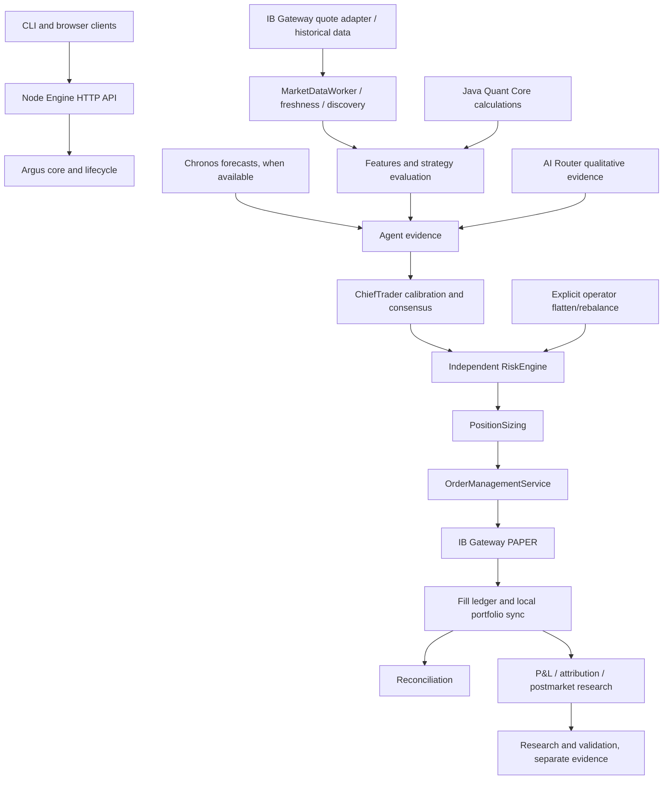

# Argus zero-trade forensic audit — 2026-09-18

**Paper readiness: NOT READY.** No engine restart, order, fill, trading enablement, threshold change, or RiskEngine/OMS modification was performed. Chronos was restored independently using cached models. Source fixes are built but are not deployed into a running engine.

## Evidence window and reproducibility

The supplied counters are reproducible, but belong to the **September 17 exchange day**, not September 18. A read-only query of `data/argus.db` reproduces every supplied event counter at **2026-09-18T00:01:19.430Z** (September 17, 20:01 EDT). This cutoff is the 1,119th consensus start plus one second, not an invented current runtime snapshot. The database subsequently recorded another 33 rounds.

Read-only extractors: `agent_workspace/zero_trade_probe.cjs` and `agent_workspace/zero_trade_summary.cjs`. Detailed output, including every missing-price event ID, trace ID, symbol, timestamp, preceding discovery/subscription/error/agent records, and explicitly unknown fields: `agent_workspace/zero_trade_summary.json`. Exchange-day window: `[2026-09-17T04:00:00Z, 2026-09-18T04:00:00Z)`. No September 18 production event-trace rows were present when queried. Queries do not import application bootstrap or write to the production database.

`./argus help` was executed using Git Bash's absolute path; subsequent commands used the actual Node CLI to which the shell delegates. The current API on port 3000 refuses connections, including outside the sandbox. Recorded engine PID **26096** and watchdog PID **16060** were absent. `watchdog-status` returned `running:false, pid:null`. Last engine session marker: started `2026-09-17T10:54:58.790Z`, heartbeat `2026-09-18T01:28:36.133Z`, `cleanShutdown:false`. We did not cause or diagnose the process exit from this marker alone.

## Funnel

| Measure | Reproduced supplied snapshot | Complete persisted Sept 17 window |
|---|---:|---:|
| Discovery admissions (events) | 3,033 | 3,503 |
| Distinct admitted symbols | 436 | 436 |
| Missing-price rejection events | 143 | 187 |
| Distinct symbols with missing-price rejections | 38 | 39 |
| Ideas generated | 1,460 | 1,493 |
| Ideas rejected | 143 | 187 |
| Consensus rounds started/completed | 1,119 / 1,119 | 1,152 / 1,152 |
| Approvals | 0 | 0 |
| Risk evaluations / approvals | 0 / 0 | 0 / 0 |
| Orders / fills | 0 / 0 | 0 / 0 |
| Reconciliation-match events | 163 | 180 |

Admission events are not unique candidates or trade ideas. The production risk, trades and fills tables contain no rows in this window. Thus there is no execution-stage rejection to attribute to RiskEngine or OMS. IBKR **market-data** failures are upstream evidence and must not be confused with order rejection.

## Consensus rejection breakdown

| Persisted terminal code | Supplied snapshot | Full window |
|---|---:|---:|
| CONFIDENCE_BELOW_STRONG | 749 | 749 |
| AGENT_DATA_UNAVAILABLE | 169 | 192 |
| AGENT_HOLD | 135 | 135 |
| MODERATE_REJECT_INSUFFICIENT_INDEPENDENCE | 66 | 76 |
| Total | 1,119 | 1,152 |

The 6,620 `DESK_NO_TRADE` events are not 6,620 terminal rounds. The structured `CONSENSUS_TERMINAL_REASON` records provide the one-per-completed-round distribution above.

At the supplied cutoff: 3 rounds had zero participating evidence entries, 574 had one, and 542 had two or more (355 two, 172 three, 15 four). Fifteen rounds contained opposing BUY/SELL entries. **749 rounds had at least one `SUFFICIENT_CALIBRATION_DATA` entry. No final confidence reached 0.75; maximum was approximately 0.70.** This directly supports confidence as the largest recorded terminal bottleneck; missing data alone does not explain all zero approvals.

The persisted `independentAgentCount` histogram is 0:304, 1:515, 2:285, 3:15. Source inspection shows this field counts distinct non-debate agent names in `result.agreements`, **not a complete persisted correlation-adjusted independence calculation**. All 300 rounds with this field >=2 contain BUY evidence; none contains SELL evidence. These are not certified independent BUY votes. Exact effective-independence distributions cannot be reconstructed from that field. We did not count correlated strategies as independent or replace calibrated confidence with raw strength.

No round contains Kronos evidence. This is evidence absence, not a count of rounds that required Chronos. AI-unavailability and Chronos-unavailability causal counts per round are not separately persisted in every terminal payload and are not inferred from their absence. Existing moderate-tier terminal codes were observed; no tier settings were changed.

## Missing-price breakdown

All 143 supplied-snapshot rejections came from **MacroAgent**. The report's former `Candidate Symbols Missing Price` incorrectly repeated the event count. It now deduplicates symbol names, while retaining the separate rejection-event count.

Trace-exact operational breakdown:

| Evidence | Count |
|---|---:|
| Matching rescue grant, followed by no usable fresh price | 124 |
| No matching persisted rescue lifecycle record | 19 |
| Matching rescue denial | 0 |
| Total | 143 |

Preceding broker-error context for these same events: **139 code 10089**, **3 code 200**, **1 code 10197**. These are nearest preceding same-symbol errors within the exchange day, not proof that each error remained active at rejection. They must not be relabeled as 143 conclusively proven broker-rejected subscriptions. No evidence supports declaring any particular historical line accepted, quote never received, or quote stale solely from these joins.

Symbols (rejection-event counts): SPY 7, QQQ 6, NVDA 14, AAPL 11, GLD 6, XLE 5, MSFT 9, TSLA 12, IWM 12, AXP 1, FDX 1, XOM 3, AAL 1, AMZN 1, AMD 12, META 9, XLK 3, SOXL 2, TQQQ 3, ARM 1, INTC 1, HD 1, COST 1, ABBV 1, ORCL 1, SQ 1, GOOG 2, RIOT 1, HPE 1, XLF 2, SMH 2, SQQQ 3, MRK 1, BRK.B 2, UNH 1, GOOGL 1, AVGO 1, JPM 1.

Historical first/last quote timestamps, per-rejection active-line state, price source, freshness, asset class and discovery rank were not all persisted. They are explicitly null in the extract, not guessed from ticker names or today's source. Preceding Technical/Quant evaluations are shown where present; same-symbol history does not establish candidate-specific evaluation. `FRESH_PRICE_WAIT_OUTCOME` now records trace-linked outcome, backend, cached price, quote age/time, allocation state and broker error. It cannot backfill missing history.

## Technical engine and streaming ownership

There were **2,849 TECHNICAL_ANALYSIS_STARTED and 2,849 COMPLETED events**. Last completion: **2026-09-17T21:03:22.269Z**, GLD. TechnicalAgent was therefore executing earlier, not continuously dead. The readiness reporter derives health from heartbeat age and marks an armed agent with stale heartbeat FAILED. An enabled toggle only expresses configuration. No historical full health snapshot supplies last successful tick, consecutive failures, last exception or event-loop stall at the supplied cutoff. Worker death versus no usable ticks cannot be conclusively separated after shutdown. The health reporter was not changed to turn green.

A concrete data-path defect was reproduced and fixed: `setBrokerQuoteContext()` changed the backend/cap to IBKR without retiring the Alpaca socket or transferring existing allocated symbols. `start()` could still open Alpaca under IBKR ownership. Alpaca's symbol-limit recovery operated on the shared active set and called `unsubscribe()` through the **current IBKR bridge**, repeatedly purging non-core IBKR lines.

Persisted evidence: 374 disconnect events (187 pairs associated with symbol-limit recovery), 187 market-data-gap events, and 9,967 IBKR market-data errors: 9,642 code 10089 (additional API market-data subscription required), 241 code 200 (contract resolution), 84 code 10197 (competing session). This establishes competing data paths and repeated resets; it does not quantify how many lost quotes each reset caused.

The fix retires the old socket/reconnect timer, cancels old IBKR subscriptions when leaving that backend, transfers existing allocation through the selected backend, and prevents Alpaca start/reconnect/recovery under IBKR ownership. Existing caps, duplicate checks, dynamic dwell, scoring, rescue bounds and broker pacing are retained. New tests prove old socket errors cannot purge IBKR lines. Source-side subscription membership still is not broker acknowledgment.

The 90-line setting belongs to IBKR; Alpaca limit recovery retained ten core symbols. Increasing the per-cycle 20-request limit would not fix that conflict or missing entitlements. Existing bounded allocator machinery was retained; no cap was increased.

## Broad-universe deployment verification

Full-window requests: BROAD_UNIVERSE_TOPUP **8,271**; CAMPAIGN_WATCHLIST_BOOST **4,380**; SNAPSHOT_HOT_SWAP **964**; SEED_UNIVERSE_EXPANSION **490**; CAMPAIGN_OPENING_SURGE **8**. Total **14,113**. Persisted payloads retain reason/source; momentumScore remains present when supplied. The broad-discovery-to-subscription and whitelist fixes were therefore running, not merely present in source. A request is not accepted streaming coverage.

## AI failover

At the reproduced cutoff: **75 successes / 1,588 calls = 4.7%**. `Consensus Provider Availability: YES` means only `healthyProviderCount > 0` from a minimal provider health probe. It does not certify prompt latency, normalized consensus evidence, calibrated confidence, or two independent agents.

| Provider | Full-window successful / failed calls | Recorded failure evidence |
|---|---:|---|
| Gemini | 14 / 64 | Quota exhausted |
| OpenRouter Free | 0 / 51 | Insufficient credits |
| LiteLLM Gateway | 0 / 281 | Fetch failures / timeout |
| Ollama | 69 / 644 | 643 outer 25-second timeouts, one abort |
| OpenAI | 0 / 43 | No credits / timeout |
| Claude | 0 / 40 | Quota/billing failure / timeout |
| Kimi | 0 / 72 | Suspended for insufficient balance / timeout |
| OpenRouter | 0 / 66 | Insufficient credits |
| Mistral | 0 / 302 | Rate limit / timeout |
| NVIDIA | 0 / 73 | Model endpoint returned 410, retired model |

Ollama **did service ConsensusDebate**: four success rows and three errors. Its other successes were 65 MarketRegimeAgent calls. MacroAgent had 87 Ollama errors and no success. Thus local routing exists but a healthy minimal probe substantially overstates usable task capacity. AIRouter uses configured local routes and fallbacks, bounded abortable invocation, rejects empty responses and tries other eligible providers; downstream validation remains fail-closed. The evidence does not establish a missing-Ollama-failover bug. No fake HOLD/BUY/SELL confidence was substituted. Current Ollama `/api/tags` responded 200; external provider statuses above are persisted session evidence, not fresh paid probes.

## Kronos / Chronos

Latest startup log ends with repeated `ModuleNotFoundError: No module named 'truststore'`; port 8008 initially refused connections. `requirements-ai.txt` already declares truststore. The system Python now has truststore, torch, chronos and transformers; the repository venv still lacks truststore. The launcher selects system `python`, so no dependency installation or interpreter change was necessary in this audit.

Started only the companion with `HF_HUB_OFFLINE=1` and `TRANSFORMERS_OFFLINE=1`. Cached `amazon/chronos-t5-mini` and `ProsusAI/finbert` loaded on CPU. `/health` returned 200, `status:ok`, both model names; listening PID **26632**. Subsequent isolated outage-scenario output contains real Chronos inference on synthetic bars. This restores the local service, not proof that the stopped production engine has reconnected. Chronos was not made mandatory.

## Gap data quality

Largest admitted absolute gap found in this window was SDGR **0.2415940224** (price 29.91). Historical discovery payloads omit original open, previous close, reference timestamps and corporate-action state. These historical gaps cannot be certified valid or corrupt from persisted ratios alone.

The existing 20x open/previous-close ratio rule was an arbitrary magnitude-based substitute for provenance. Replaced it with finite positive reference checks, source-bar timestamp ordering/current exchange date, and open-within-source-session-high/low validation. Large returns are retained; no split adjustment is invented. Previous close and corporate-action state (UNKNOWN) are preserved for audit. `gapPct` remains the existing **intraday return from the daily-bar open**, not a newly claimed overnight gap or independently verified regular-session opening auction. Invalid/missing provenance quarantines the gap only; it does not discard an otherwise liquid candidate. Null gaps never create discovery shadow predictions. Regression coverage includes that real persistence path.

## Validation and deployment

Targeted suite: **163 passed across 7 files** before the added outage-generator test. Typecheck passed. Production frontend/server build passed, with the existing large-chunk warning. Full-suite and final scenario outcomes are recorded in the completion appendix below.

No engine was started or resumed: current broker positions/reconciliation cannot be verified through the unavailable API, and the watchdog is absent. TCP port 4002 is listening (PID 19800), which is not proof of a reconciled paper session. `LIVE_NO_GO` itself is expected and is not the readiness failure. New runtime behavior remains unverified until a controlled paper restart with current reconciliation, no open positions/mismatch, and one watchdog is possible.

Remaining concrete blockers: engine/watchdog stopped; current paper broker reconciliation unavailable; market-data entitlements/contract/competing-session errors; AI quota/billing/model and local task-timeout failures; no demonstrated legitimate production consensus approval; incomplete historical quote/health telemetry; synthetic certification does not establish complete execution readiness or live-market alpha.

## Files changed

- `src/server/services/MarketDataWorker.ts` and `.test.ts`
- `src/server/core/tradingSessionReport.ts` and `.test.ts`
- `src/server/core/waitForFreshMarketData.ts` and `.test.ts`
- `src/server/continuous/discoveryGapEvidence.ts`
- `src/server/continuous/MarketUniverseScanner.ts`, `.test.ts`, `.gapPctValidation.test.ts`
- `src/server/observability/discoveryCandidateLedger.ts`
- `src/server/replay/synthetic/SyntheticScenario.ts` and `SyntheticMarketDataEngine.test.ts`
- Read-only extractors and JSON evidence in `agent_workspace/zero_trade_*`
- This report

Pre-existing deletion of `.argus_dev.pid` was left untouched. RiskEngine, OMS, consensus thresholds and production calibration records were not edited.

## Synthetic execution status

Seed **12345**, speed **60**, isolated child-process databases, real SyntheticSessionEngine/Argus agents/RiskEngine/OMS/HistoricalReplayBroker. Synthetic calibration seeding was disclosed by the existing mandatory Test B launcher and confined to its isolated database; no production calibration was seeded.

| Scenario | Implemented | Executed this audit | Passed | Certified |
|---|---|---|---|---|
| QUIET_OPEN | Yes | Yes, twice, 90 simulated minutes | Existing gate PASS; zero fills, NO_CONSENSUS | Limited no-trade gate result only |
| VALIDATED_CONVERGENCE_CONTROL | Yes | Yes, twice, 240 simulated minutes | No; blocked at CONSENSUS, no trade | No |
| DATA_INTERRUPTION | Added | Yes, 90 simulated minutes, five symbols | Process completed; generator assertions covered by tests | No end-to-end outage safety certification |
| EXTREME_NOISE | Yes | Not separately executed | Not established | No claim |
| TRENDING_BULL_GAP_AND_GO | Yes | Not separately executed | Not established | No claim |
| TRENDING_BEAR | Yes | Not separately executed | Not established | No claim |
| SIDEWAYS | Yes | Not separately executed | Not established | No claim |
| HIGH_VOLATILITY_OPEN | Yes | Not separately executed | Not established | No claim |
| NEWS_SHOCK | Yes | Not separately executed | Not established | No claim |
| CERTIFIED_BULLISH_ENTRY_EXIT | Yes | Not separately executed | Not established | Name is not certification |

Final mandatory certification remained **OVERALL FAIL after Chronos recovery**. DATA_INTERRUPTION removes ten bars per symbol at minutes 30–39 rather than interpolating or refreshing stale prices; generated bars resume at minute 40. Actual run: 33.7 seconds, RSS 286.3→287.7 MB, heap 68.2→71.4 MB, event-loop p95 225.97 ms, p99 258.21 ms. Its successful process exit does not prove no stale orders during the gap.

Existing certification limitations found in source: the quiet branch returns PASS unconditionally; the lifecycle gate equates nonzero realized P&L with a closed position and does not itself certify partial-fill reconciliation. Therefore these reports do not certify the requested complete execution lifecycle, even when an existing gate says PASS. No synthetic result is evidence of live-market alpha. Broader scenario execution and stronger lifecycle assertions remain separate, concrete certification work.

## Evening system audit: fixed evidence cutoff and scope

This appendix supersedes the earlier **current-state** descriptions, not the historical observations. Exchange date is **2026-09-18**, America/New_York; persisted evidence window is **04:00:00Z through 2026-09-19 02:17:12.769Z**, exclusive end. The market was CLOSED during the evening checks. The original 1,460/1,119 figures belong to the earlier September 17 snapshot; they are not September 18 totals.

Reproducible evidence: `agent_workspace/ultimate_audit_snapshot.cjs` opens `data/argus.db` with `readonly:true`, begins a read transaction, applies one cutoff, and writes only `agent_workspace/ultimate_audit_snapshot.json`. That artifact preserves individual missing-price payloads/trace IDs/symbols, consensus terminal payloads, provider/task outcomes, schemas, research evidence paths, strategy source conditions, and the engine ownership registry. It does not read account credentials. Queries and source paths below allow independent inspection. Classification: VERIFIED means directly observed in the named evidence, not profitable or production-certified; PARTIALLY VERIFIED distinguishes source/test support from runtime proof; INSUFFICIENT DATA is not a zero.

### 1. What Argus is and its actual objective

Argus is a systematic research and supervised paper-trading platform with deterministic quantitative calculations, optional AI interpretation, an event-driven decision process, independent risk and a persistent order lifecycle. Its desired economic objective is sustainable **net risk-adjusted expectancy**, measured out of sample and in organic paper operation. Its current engineering breadth does not establish that objective has been achieved. The current scope remains PAPER ONLY / LIVE_NO_GO.

### 2. Actual architecture and ownership

Source: `ArgusCoreBoot`, `TradingEngine`, `ChiefTraderAgent`, `RiskAgent`, `RiskEngine`, `PositionSizing`, `OrderManagementService`, `BrokerManager`, `localPortfolioSync`, `fillLedger`, and `PortfolioReconciliation`. The CLI's default replay runs through the engine and isolated HistoricalReplayBroker; its Java demonstration backtest is a separate research tool, not an alternative production execution path.

**Architectural exception requiring honest documentation:** `src/server/services/PipelineFlatten.ts` constructs an explicitly manual approval (`ManualOverride`, threshold 0, confidence 1) and emits `CHIEF_APPROVED_IDEA`; `PortfolioRebalance.ts` also uses this operator path. It still reaches RiskEngine and OMS. Therefore “every possible order originates from organic quantitative consensus” is contradicted by source. Manual control evidence must never count as organic strategy validation. No new override was introduced here.

### 3. Capabilities and subsystem status

| Subsystem | Evidence-based state | Evidence / limitation | Priority |
|---|---|---|---|
| Engine, CLI, API, database | PARTIAL | Running API and persisted telemetry; process health does not imply tradability | P1 |
| Market data / subscriptions | BROKEN for the observed session | 90 occupied slots, zero received ticks; historical 10089/200 errors | P1 |
| Discovery / broad universe | PARTIAL | 4,139 admissions; broad top-up events reach subscriptions; not 4,139 distinct opportunities | P1 |
| Allocation / rescue | PARTIAL | Bounded capacity, dwell/rescue logic implemented; reconnect ownership discrepancy observed | P1 |
| Data quality / features | PARTIAL | Freshness checks and gap provenance; missing streaming evidence prevents current evaluation | P0/P1 |
| Technical agent | BLOCKED | Enabled, no first tick in current process, no recorded consecutive exception failures | P1 |
| Quant engine / Java | PARTIAL | 12,655 assessment events on 92 symbols; Java results present, no proven economic edge | P1/P2 |
| Chronos / Kronos | PARTIAL | Chronos service recovered; Kronos still awaiting market data; service health is not a forecast | P1 |
| Strategy library / diversity | UNPROVEN | 21 TS definitions plus 10 Java research catalog entries; parameter variants are not independent votes | P2 |
| Calibration / consensus | PARTIAL | Real terminal reasons; missing calibration and independence prevent approval | P1/P2 |
| AI routing | DEGRADED | 54 successful calls, 986 errors; task-level availability differs from provider health | P1 |
| Portfolio construction | PARTIAL | Operator target rebalance and constraints; no validated expected-return optimizer established | P2 |
| Sizing / risk | PARTIAL | Independent gates present; no September 18 evaluations; valuation defects identified below | P0 |
| OMS / IBKR / positions | PARTIAL | Connected paper adapter, reconciliation matches; no organic September 18 lifecycle | P0/P1 |
| P&L / attribution / execution quality | UNPROVEN | Three lifetime PAPER fill records have no realized P&L or strategy ID; environment mixing risk | P0/P2 |
| Premarket / postmarket / missed opportunities | PARTIAL | Implemented diagnostics and idea adapters; causal correctness and economic benefit not certified | P2 |
| Learning / promotion | UNPROVEN | Candidate/calibration records exist; strategy promotion evidence is incomplete | P2 |
| Backtesting / walk-forward | PARTIAL | 177 completed backtests; five baseline evidence files, none promotable | P2 |
| Historical replay | PARTIAL | Isolated execution path and persisted replay trades; not paper alpha | P1/P2 |
| Synthetic certification | PARTIAL | Quiet run executed; convergence control failed; scenario names are not certification | P0/P1 |
| Observability / frontend | PARTIAL | Trace/lineage and UI source/tests; incomplete historical linkage and misleading readiness corrected in source | P1/P3 |
| Watchdog / deployment | PARTIAL | Existing heartbeat and controlled lifecycle; transient API health failures observed | P1 |
| Memory / performance | UNPROVEN | Single process RSS readings and synthetic metrics, no long soak/profile establishing a leak or capacity bound | P3 |
| Security | PARTIAL | Session auth and local service boundaries, untrusted-news handling; no comprehensive penetration assessment | P0/P3 |

These are subsystem assessments, not a claim to have executed every Java calculator, strategy, UI path, or failure scenario.

### 4. Current causal funnel: verified counts, not interchangeable denominators

| Stage | Count / interpretation |
|---|---|
| Universe total / point-in-time eligible universe | INSUFFICIENT DATA for one consistently versioned universe |
| Discovery admissions | 4,139 events / 325 distinct symbols |
| Discovery filtered | 28,423 events / 1,064 distinct symbols; repeated scans included |
| Subscription requests | 3,593 events; retries/repeated requests are not unique subscriptions |
| Occupied slots in evening runtime | 90 / configured cap 90 |
| Slots with received ticks in that process | 0 |
| Missing-price failures | 223 events / 92 distinct symbols |
| Quant assessments | 12,655 events / 92 symbols; assessments can fail quality checks |
| Ideas generated | 20 |
| Ideas rejected for missing price | 223; not a subset of the 20 emitted ideas |
| Consensus started / terminal outcomes | 20 / 20 |
| Approvals | 0 |
| Risk evaluations / approvals | 0 / 0 |
| Orders / accepted orders / fills | 0 / 0 / 0 |
| Local portfolio rows at cutoff | 0 |
| September 18 realized trade P&L | No executed trades; no evidence of strategy profitability |
| Reconciliation match events | 145 |

Queries: aggregate `event_traces` by `event_type` and timestamp; aggregate `observability_events` by event type and distinct symbol using `ts`; count `risk_assessments.created_at`, `trades.timestamp`, and `fills.filled_at` within the same ISO window. The extractor contains exact SQL. A complete one-row-per-candidate conservation funnel is **INSUFFICIENT DATA**: discovery attempts, emitted ideas, repeated evaluations, and subscriptions use different denominators. Do not manufacture subtraction-based drop-offs between these counts.

### 5. Why approvals and trades were zero

| Persisted terminal reason | Rounds |
|---|---:|
| MODERATE_REJECT_INSUFFICIENT_INDEPENDENCE | 18 |
| AGENT_HOLD | 2 |
| Total | 20 |

Eighteen terminals contain only one participating agent, JavaCoreEnsemble; two contain zero participating agents. No terminal has two participating agents, independent BUY agreement, independent SELL agreement, or opposing participating directions. The single-agent rows contain SELL evidence with final confidence 0.635 and `NO_CALIBRATION_DATA`, sample size 0. These are neither calibrated probabilities nor sufficient independent support. An internal multi-strategy Java ensemble is not automatically two independent agent votes.

Zero approvals explain zero Risk evaluations and orders. This is not evidence that RiskEngine or OMS rejected these trades. After the explicit pause at **19:37:30Z / 15:37:30 EDT**, no new trading is expected. Market closure and the intentional pause must not be misclassified as engineering failures.

### 6. Missing-price root causes and data quality

All 223 `FRESH_PRICE_WAIT_OUTCOME` records are timeouts with no usable price. **217** carry contemporaneous broker error **10089**, requesting additional API market-data subscription; **6** carry error **200**, no security definition (BRK.B and SQ, three each). These records include the allocated slot, backend, zero ticks, null quote age/time, error and trace ID. They prove requests reached the subscription layer but did not yield a usable quote during the wait. They do not prove that later account changes are ineffective.

The latest screenshot proves API acknowledgement enabled, not symbol/exchange entitlement or fresh quote delivery. User confirmed Gateway had not been relogged after signing, then reported restarting it. At **02:22:26Z**, paper Gateway authentication was true on 4002, but broker active market-data lines were **0** while MarketDataWorker retained **90** slots. Cached slot errors were dated before that restart.

Source proves a reconnect defect: `IbkrSocketSession.disconnect()` clears `activeMktData`/`symbolToTicker`; reconnect restores accounts/orders/executions but not market-data subscriptions. `MarketDataWorker.subscribe()` returns early for retained active symbols; its IBKR `reconnect()` branch only returns feed status. Therefore local allocation can remain apparently full while the reconnected broker has no requests. A controlled engine restart is a recovery workaround, not an automatic-reconnect fix. Add a bounded generation-aware subscription reconciliation service with pacing and cancellation tests as P1 follow-up.

The earlier same-day gap fix preserves current-bar reference provenance, rejects objectively invalid references, retains valid extreme moves and represents unknown corporate actions as UNKNOWN. It does not transform the existing intraday-return field into a verified overnight gap. Historical records without reference provenance cannot be retrospectively certified.

### 7. Technical, Quant and Chronos availability

Current Technical status is `IDLE_WAITING_FOR_MARKET_DATA`, last tick null, zero consecutive failures. With zero received quotes, **NO USABLE DATA / SUBSCRIPTION STARVATION** is verified; worker death or a hidden exception is not established. Historical September 17 tick completions show that “enabled” and “ever ran” must be separated by session.

Chronos recovery earlier in this audit restored the local service using existing installed dependencies after the prior environment startup failure. Current `chronosAvailable:true` differs from the original unavailable snapshot. Kronos still needs market-data events; an available model is not itself a generated forecast. Quant assessment execution can proceed on historical bars while streaming quotes are absent. The asynchronous Java vote path previously used that historical price before the TS freshness gate; the new emission check closes this specific source-level defect.

### 8. AI status and quant-first assessment

| Provider | Successful calls | Errors |
|---|---:|---:|
| Gemini | 10 | 74 |
| Ollama (Local) | 44 | 269 |
| Claude | 0 | 40 |
| Kimi | 0 | 80 |
| LiteLLM Gateway | 0 | 137 |
| Mistral | 0 | 139 |
| NVIDIA | 0 | 67 |
| OpenAI | 0 | 39 |
| OpenRouter | 0 | 71 |
| OpenRouter Free | 0 | 70 |

Total **54/1,040 = 5.19%** success in the fixed window. All 44 Ollama successes were MarketRegimeAgent calls; Ollama failed three BullResearcher, three BearResearcher, 205 QuantContradictionAnalyzer, 27 NewsAgent and 31 MarketRegimeAgent calls. Thus healthy-provider availability does not demonstrate successful consensus evidence generation. Earlier error details establish quota/account/model failures and local task timeouts. A health snapshot is not the same denominator as this persisted call table.

`AIRouter`, provider health/selection, task calls and normalization are present. Failed debate evidence is excluded fail-closed; no fake directional confidence should replace it. **Quant-first capability is PARTIALLY VERIFIED by source**: deterministic strategies and Java calculations can emit evidence without an external LLM, and optional forecast unavailability is represented honestly. **Autonomous quant-only approval and complete paper execution with all AI/Chronos unavailable is UNPROVEN** in this session; the mandatory synthetic positive control did not demonstrate it. Add an isolated real-pipeline test with genuine deterministic independent evidence, not seeded production approvals.

### 9. Alpha and research evidence

Platform alpha classification: **UNPROVEN**. Runtime absence of usable data prevents determining whether profitable opportunities existed; it does not prove there was no edge in the market.

`quant_strategy_backtests`: 224 runs, 177 completed, 47 failed. Completed counts by CORE strategy: MOMENTUM 132, PULLBACK 10, MEAN_REVERSION 10, TREND 15, RANGE 10. Repeated overlapping datasets are not independent samples. The five filesystem baseline `evidence.json` artifacts are real research evidence despite empty `research_experiments` and strategy-engine promotion tables.

| Baseline | OOS trades | OOS gate | Walk-forward | Promotable |
|---|---:|---|---|---|
| MOMENTUM_BREAKOUT | 1 | FAIL | FAIL | No |
| PULLBACK_CONTINUATION | 42 | PASS | FAIL | No |
| MEAN_REVERSION | 2 | FAIL | FAIL | No |
| TREND_FOLLOWING | 2 | FAIL | FAIL | No |
| RANGE_REVERSION | 148 | FAIL | FAIL | No |

All five use a shared SPY daily baseline, NEXT_BAR_OPEN semantics, and FEATURE_SUBSET_PARITY rather than full strategy parity. PULLBACK's isolated OOS gate pass is **limited supporting evidence**, not multi-regime robustness or permission to promote: its robustness tests failed. No baseline is promotable. Lifetime PAPER trade rows: three FILLED, all `profit_loss:null` and `quant_strategy_id:null`, including explicit manual provenance. There is no demonstrated organic closed-paper strategy P&L in those rows.

### 10. Strategy inventory and evidence boundaries

`strategySources` in the JSON artifact enumerates exact source files, IDs, regimes and entry/stop/target condition lines for all 21 TypeScript definitions. Five CORE: MOMENTUM_BREAKOUT, PULLBACK_CONTINUATION, MEAN_REVERSION, TREND_FOLLOWING, RANGE_REVERSION. Sixteen experimental: SMC_LIQUIDITY_SWEEP, VWAP_VOLUME_STRUCTURE, OPENING_RANGE_BREAKOUT, VWAP_MEAN_REVERSION, DONCHIAN_CHANNEL_BREAKOUT, MA_CROSSOVER, OSCILLATOR_MOMENTUM, BOLLINGER_VOLATILITY, PREVIOUS_PERIOD_BREAKOUT, CANDLESTICK_REVERSAL, GAP_CONTINUATION, FIBONACCI_PULLBACK, VOLUME_CONFIRMATION, SR_BOUNCE, RELATIVE_STRENGTH_ROTATION, STATISTICAL_MEAN_REVERSION.

Java research catalog adds rsi_mean_reversion, macd_crossover, bollinger_mean_reversion, moving_average_crossover, donchian_channel, trend_strength_adx, mean_reversion_zscore, stochastic_oscillator, time_series_momentum and volume_signal. These are not 31 validated paper strategies. The broader `config/engineOwnership.json` inventory includes calculators and non-stock research engines; counting implementations as participating strategies is invalid.

Observed strategy-readiness history covers only three CORE strategies: PULLBACK (2,720 observations/effective N 50, RETIRED), TREND (134/effective N 8), RANGE (779/effective N 12), all `NO_EDGE_DETECTABLE`; remaining 18 TS definitions are NEVER_EMITTED in that report. These are prediction observations, not executed trades. Strategy-specific validated cost/slippage, capacity, portfolio correlation, training/OOS lineage and promotion approval remain UNKNOWN unless explicitly present in the captured baseline evidence. `StrategyEmissionEligibility` permits UNTESTED and blocks retired/degraded states; “implemented/enabled/reachable” is not validation. The catalog's CORE `liveEligible` flag is structural and can misleadingly remain true for a retired strategy.

### 11. BUY, SELL and SHORT

Current `RiskEngine.ts` SELL handling requires positive held quantity (`sell_position_exists`) and limits sale size to that holding. Thus SELL reduces/closes a long; it does **not** open a short or reverse long to short. The AAPL SELL-only evidence from a flat portfolio would not establish an executable short opportunity, even had consensus approved. No short-selling risk gate was relaxed. A future short capability requires explicit separate intent, borrow/locate evidence, margin, buy-to-cover accounting, recalls, borrow fees and gap stress, plus isolated lifecycle certification before paper activation.

### 12. Consensus and economic decision weaknesses

Source uses calibrated evidence when available but retains raw-confidence fallback when calibration is unavailable; observed Java confidence 0.635 illustrates why it must not be labelled probability. STRONG comparison and existing moderate-tier conditions must be documented as implemented rather than silently altered to increase activity. Agent-name count and Java assumed correlation adjustments do not prove statistical independence. Future evidence should aggregate strategy families, report empirical effective N, uncertainty and costs, and advance only validated net opportunity evidence. AI text remains a qualitative input, never an execution authority.

### 13. Execution and attribution weaknesses

RiskAgent consumes `CHIEF_APPROVED_IDEA`, invokes independent `RiskEngine.evaluateRisk`, sizing precedes OMS, and OMS owns broker order submission. Fill ledger/local portfolio sync and reconciliation are implemented and tested in isolated environments, but zero organic approvals means this session did not exercise the paper path.

`src/server/research/executionQuality.ts::buildExecutionQualityReport` selects FILLED/PARTIALLY_FILLED rows across environments; rows carry `executionEnvironment`, but `summarizeExecutionQuality` aggregates them without partitioning. `forecastEngine.ts` consumes that summary. This is a **verified source-level evidence-contamination risk**, not proof of today's zero approvals. Partition by environment and organic/manual provenance before using these costs for paper forecasting. Record decision/arrival/submission/ack/fill/cancel times and commissions; do not infer missing latency or slippage as zero.

### 14. Risk weaknesses found without weakening risk

`src/server/engines/PositionSizing.ts` values same-sector holdings using each holding's quantity multiplied by **the proposed symbol's current price** (line 211 at audit); correlated exposure repeats this at line 240. This is a verified source valuation defect for heterogeneous-price holdings. It can mis-size exposure; it did not cause this session's zero Risk evaluations. Follow-up must supply per-holding timestamped marks, fail closed on unavailable valuation, and test mixed-price portfolios. Do not remove concentration limits to compensate. No RiskEngine/OMS implementation was changed in this pass.

### 15. Required changes and executable priorities

| Task | Files / owner | Dependencies, tests and acceptance evidence | Priority / risk |
|---|---|---|---|
| Fresh-quote readiness and Java emission check | `core/marketDataReadiness`, readiness/session report, Java vote service | Deterministic stale/missing/invalid/valid cases; runtime quote counts before paper resume | P1; implemented, low execution risk |
| Reconcile IBKR subscription generations | `MarketDataWorker`, broker quote bridge integration, socket reconnect tests | Detect socket generation; bounded paced restoration; no duplicates; reset/cancel races; retained90/broker0 regression | P1; medium, no order-path changes |
| Confirm account data entitlements | IB Gateway paper session and operator account settings | New request timestamps and actual quotes, not cached errors; contract errors handled separately | P1; external dependency |
| Correct holding valuation | `engines/PositionSizing.ts` and caller mark snapshot | Mixed-price sector/correlation tests, missing-mark fail closed, unchanged limits | P0; high, independent review |
| Separate evidence environments | `research/executionQuality.ts`, `forecastEngine.ts`, reports | REPLAY/manual/organic PAPER partition regression; unknown costs stay unknown | P0; medium |
| Make certification prove lifecycle | `replay/synthetic/CertificationGate.ts` and scenario runner | Flat quantities, partial-fill ledger totals, reconciliation, duplicate/restart assertions; quiet failure must fail | P0/P1; medium |
| Prove deterministic quant-only pipeline | real replay/synthetic pipeline tests | All AI/Chronos unavailable; true independent strategy evidence; genuine risk/OMS pass or precise refusal | P1; no production seeding |
| Task-level AI availability | AI Router/provider health and observability | Bounded local calls, latency/error by task; timeout fail-closed; no fabricated fallback | P1; low |
| Point-in-time research manifests | research runner/data gateway and Java backtests | Dataset/features/config/code hashes, split dates, costs, corporate actions, delistings, overlap-aware effective N | P2; medium |
| Promotion and strategy lifecycle | strategy registry/eligibility and research evidence | Research -> shadow -> paper -> reviewed promotion; no parameter-family double counting | P2; medium |
| Portfolio and attribution | portfolio/research services around protected spine | Validated forecasts and timestamped marks first; per-strategy net P&L, exposure and uncertainty | P2; high |
| Causal operator UI and performance | existing observability routes/frontend/watchdog | Missing/stale/unknown displayed honestly; bounded queries; soak and crash/recovery measurements | P3; medium |
| Advanced portfolio, capacity and short research | Java quant/research, separately approved execution extensions | Sufficient OOS evidence, validated inputs, stress/borrow/impact models before activation | P4; high |

### 16. Changes implemented in this evening pass

- `src/server/core/marketDataReadiness.ts` and new test: require connected feed plus a finite positive fresh observed quote; report fresh/active counts.
- `src/server/core/TradingReadinessGate.ts` and test: consume quote evidence; first-data waiting during RTH is not healthy/not-applicable.
- `src/server/core/tradingSessionReport.ts` and test: connection alone cannot report market-data READY; exceptions fail closed.
- `src/server/services/JavaCoreEnsembleVoteService.ts` and test: validate the observed quote on asynchronous completion and emit its actual price; unavailable data produces explicit no-trade telemetry.
- `CLAUDE.md` and `docs/architecture/ARGUS_ARCHITECTURE.md`: corresponding operational contract and architecture updates.
- Read-only extractor/JSON artifact and this appended report. Earlier same-day fixes are listed above separately.

An external commit appeared during the audit (`498f218`), incorporating some already-present changes. It was not created by this agent. File attribution above describes work performed, not a claim that every file remains uncommitted. No unrelated history or audit archive was removed.

### 17. Verification status

Initial targeted command: `node node_modules/vitest/vitest.mjs run src/server/core/marketDataReadiness.test.ts src/server/core/TradingReadinessGate.test.ts src/server/core/tradingSessionReport.test.ts src/server/services/JavaCoreEnsembleVoteService.test.ts src/server/routes/v2Runtime.test.ts src/server/architecture.protection.test.ts src/server/research/phase21.invariants.test.ts`: **96 passed / 7 files**. Final typecheck/build/full-suite completion is recorded in the closing verification note, not inferred from source diffs. Logs: `agent_workspace/ultimate_audit_targeted.log`, `ultimate_audit_typecheck.log`, `ultimate_audit_build.log`, `ultimate_audit_full.log`.

Vitest setup uses unique temporary `ARGUS_DB_PATH` and research paths, disabled local integrations and guarded test DB ownership. Three IDs printed by the targeted test run were explicitly checked absent from production observability rows. Test logs containing simulated orders/fills are not paper execution evidence. Earlier synthetic results remain the scenario table above; they were not upgraded by passing unit tests.

### 18. Paper status, 19. alpha status, 20. funnel interpretation

**PAPER: NOT READY. ALPHA: UNPROVEN. LIVE: NO-GO.** Engine PID 13680 was running paused in the evening; watchdog PID 20892 had a heartbeat. IB Gateway paper port 4002 was connected/authenticated. Reconciliation at 02:20:38Z reported matches true, zero mismatches, no unresolved filled orphans. Technical/Kronos had no received ticks. The subsequent Gateway restart requires restoring subscriptions and observing current data. Process running, API acknowledgement, model health and a unit-test pass cannot certify safe paper operation. The actual current funnel is Section 4, not the original September 17 numbers.

### 21. Immediate actions and 30/60/90-day ownership plan

**Next session / days 1-30:** restore paced subscriptions after authenticated paper reconnect; prove fresh-data coverage during an eligible session; correct mark valuation and environment mixing; certify partial-fill/restart/reconciliation invariants; produce candidate-level trace coverage and task-level provider health. Acceptance: no phantom active subscriptions after restart, no stale-price approvals, no mixed-environment economics, reproducible quant-only positive/negative controls and a supervised organic paper lifecycle only if evidence actually qualifies.

**Days 31-60:** consolidate point-in-time dataset manifests and feature/strategy versioning; rerun five CORE strategies with realistic costs, purged walk-forward/OOS, multiple-testing and sensitivity checks; explicitly retire failures; partition prediction calibration by strategy/regime/horizon and empirical dependence; implement net execution/strategy attribution. Acceptance: every paper-enabled strategy has inspectable evidence, or an explicitly labelled research/shadow status; no promotion based on one backtest.

**Days 61-90:** evaluate simple portfolio construction against validated forecasts/uncertainty and current marks; add liquidity/capacity stress and bounded exploration allocation; complete outage/duplicate/out-of-order/clock/database-lock soak scenarios; use resulting paper evidence for reviewed strategy promotion. Study short capability only as a separately scoped, certified paper extension. No calendar date substitutes for statistical evidence or authorizes LIVE trading.

### 22. Argus V2 design and objective definitions of done

Evolve existing components incrementally: **data -> quality -> features -> research -> strategies -> forecasts/evidence -> portfolio proposals -> independent risk -> OMS -> execution -> reconciliation -> attribution -> research feedback**. Keep one engine, one risk authority and one order boundary. Java owns new quantitative calculations; Node owns orchestration, persistence and safety integration. AI explains/interprets evidence but cannot grant execution authority.

Contracts should be versioned, append-only evidence records: `data_observation(id,symbol,source,observedAt,receivedAt,quality,corporateActionState)`; `evaluation(id,parentObservationIds,strategyId,strategyVersion,featureVersion,regime,horizon,decision,reason)`; `forecast(id,evaluationIds,expectedReturn,uncertainty,probabilityOfProfit,cost,netExpectedReturn,valueState,modelVersion)`; `decision_trace(traceId,parentIds,sessionId,environment,provenance,stage,reason,at)`; `research_manifest(runId,dataHash,codeHash,configHash,splits,costModel,validationResults)`; `promotion_decision(strategyVersion,evidenceIds,reviewer,status)`. These are proposed contracts, not deployed schemas. Each economic field must distinguish OBSERVED/MODELLED/ESTIMATED/UNKNOWN, with null when unsupported; do not convert confidence into probability.

Allocation should reserve safety-critical position/anchor lines, rank eligible candidates by measured liquidity/freshness/catalyst/coverage, age queued candidates and bound exploration. Preserve the existing cap/pacing/dwell and duplicate protection. Persist allocation requested/accepted/rejected/expired and actual first/last quote evidence. Do not invent expected opportunity value for unvalidated strategies.

Reliability requirements: bounded queues and DB queries; generation-aware idempotent reconnect; ordered/replayable event provenance; unknown submission state contained until broker reconciliation; crash-safe fill deduplication; stale-data refusal; provider/model outage represented as unavailable. Measure p95/p99 loop/API latency, queue age, RSS and recovery times against recorded baselines before setting numerical SLOs. UI should expose these facts and causal why-not-traded traces, rather than replacing missing values with zero.

**PAPER READY:** current paper authentication and reconciliation; usable data for evaluated candidates; correct risk/sizing/OMS/fill lifecycle; no unresolved broker state; functioning watchdog and recovery; legitimate evidence can reach execution in isolated certification and supervised paper observation, without forcing a trade. A quiet session can still pass if abstentions are causally correct.

**RESEARCH READY:** reproducible point-in-time data and splits, cost models, provenance, full-parity limitations disclosed, leakage/multiple-testing controls, deterministic replay and independently inspectable results.

**STRATEGY PROMOTION READY:** sufficient effective sample size and OOS/robustness evidence, uncertainty and dependence assessed, capacity/costs measured, organic paper attribution and explicit review. Unit tests and raw win rate alone cannot qualify.

**LIVE-CANDIDATE READY:** a future review package would additionally need all production safety, capital, operational, regulatory and statistical criteria independently satisfied. This audit does not grant it; LIVE remains NO-GO.

### Closing verification and September 19 continuation

- Full suite: `node node_modules/vitest/vitest.mjs run` completed with **521 files / 3,868 tests passed**, exit 0, 717 seconds. Exact log: `agent_workspace/ultimate_audit_full.log`.
- Final typecheck: `node node_modules/typescript/bin/tsc --noEmit`, exit 0.
- Final production build: `npm.cmd run build`, native exit 0; Vite and server esbuild completed. Existing chunk-size/dynamic-import warnings remain. PowerShell's earlier stderr handling produced a misleading command exit; the final run explicitly propagated `$LASTEXITCODE`.
- `git diff --check` passed; no commit/push was made by this agent. External commit `51a6674` subsequently captured the working tree; do not attribute that commit to an agent action.
- Before deployment: paper-only, paused, empty local portfolio/order ledger, reconciliation matched with zero mismatches/orphans; watchdog 20892 healthy. Engine 13680 was gracefully stopped and confirmed gone. Replacement PID 21404 subsequently ran: persisted Java logs and watchdog recovery at 02:30Z establish startup, but no complete post-deployment quote/readiness capture was obtained before the session interruption.
- At September 19 11:28Z, no Node engine/watchdog process remained, API port 3000 and Gateway port 4002 were closed, and the watchdog's last heartbeat was 02:31:54Z. The cause of that later shutdown is **INSUFFICIENT DATA**; it must not be labelled a crash, a successful deployment, or a data-entitlement failure without evidence. A new plain CLI start (without enable-trading) was initiated to restore supervised diagnostics, preserving pause. Final current runtime verification follows below.

**September 19 11:32Z runtime result:** plain CLI start completed. Process command-line classification confirms exactly one engine **3388** and one watchdog **27988**; watchdog heartbeat HEALTHY at 11:31:57Z. Engine PAPER_ONLY, TRADING_PAUSED, LIVE_NO_GO. Java `/health` 200 UP; Chronos `/health` 200 with chronos-t5-mini and FinBERT loaded. Gateway socket **OFFLINE**, port 4002 closed, authenticated false, account/server time absent, zero active broker lines and zero MarketDataWorker slots. The user was asked to log into Gateway Paper Trading; no response was yet received at this verification point.

Deployed `session-report` now reports **Market Data DEGRADED**, Session CLOSED, 0/90 active symbols and all September 19 funnel counts zero (one reconciliation match). `pipeline-ready` reports market data FAIL, AI FAIL, trading readiness FAIL; Technical/Quant first-data waiting is N/A outside RTH. Thus the new readiness behavior is verified in the running process for unavailable data. No positive Java vote or organic execution was induced merely to validate deployment.

**Additional verified reporting defect / P1:** the broker summary and reconciliation endpoint say sync READY/matched while the adapter's connection snapshot is unauthenticated/OFFLINE. Cached or empty reconciliation state is not proof of an active reconciled broker. Follow-up: join connection/authentication/fresh broker snapshot evidence into broker readiness; add disconnected-with-empty-cache regression coverage. No broker or reconciliation implementation was altered in this audit. Overall paper status remains **NOT READY** regardless of that misleading individual green check.

Current AI provider snapshot is 0/10 healthy (nine PROVIDER_UNAVAILABLE, Ollama TIMEOUT), despite the Ollama companion process health reporting READY. This is a new-day task/health snapshot, not a replacement for September 18's 54/1,040 persisted call distribution. Current blockers: Gateway paper login/listening socket; verified current subscriptions/quote evidence after connection; AI task availability; unproven independent calibrated opportunity and positive-control lifecycle; identified subscription-reconnect, holding-valuation, environment-partition and certification defects. No thresholds were lowered and no resume/order was requested.

## Master-mandate continuation: September 19 evidence and implementation

This section is a new snapshot, not a rewrite of the September 18 findings above. Local date September 19 is Saturday; UTC evidence window is **2026-09-19 04:00:00Z to 2026-09-20 01:58:00.299Z**. Read-only transaction/extractor: `agent_workspace/master_day_read.cjs`; fixed output: `master_day_snapshot.json`. API snapshot: `master_runtime_snapshot.json` at 01:57:24Z. The running engine remained PID 3388, PAPER, TRADING_PAUSED; watchdog 27988.

### Current causal evidence

- **VERIFIED:** no persisted idea-generated or consensus-start events in this window; zero terminal consensus records, risk assessments, trades and fills. Zero missing-price rejections do not prove data availability when no ideas were emitted.
- **VERIFIED:** 8,863 `DESK_NO_TRADE` events, all `EXPECTED_VALUE_TOO_LOW`. These are repeated upstream desk abstentions, not 8,863 completed consensus rounds or unique candidates. Their payload says that a strategy must clear live EV/minimum risk-reward and a regime-only fallback is not a trade. The existing session report groups these under a broad no-trade label; retain the denominator distinction.
- **VERIFIED:** 4,800 subscription-request events, 155 opportunity scans and 173 reconciliation-match events. These are event counts, not unique streaming lines or opportunities.
- **VERIFIED:** Gateway socket 4002 authenticated with paper-only enabled, 90/90 allocated lines. Runtime slot telemetry has **0/90 with received ticks**, **88 error 10089** (additional API market-data subscription required), and **2 error 200** (`BRK.B`, `SQ`: no security definition). The entitlement errors are actual broker responses after the user's acknowledgement/login; a signed acknowledgement alone has not established usable data for these requests. Stored error timestamps precede the snapshot; deployment verification must recheck freshly issued requests.
- **VERIFIED:** broker portfolio positions empty, local order ledger empty, latest reconciliation 01:55:05Z matched with zero mismatches and no unacknowledged filled orphans. No resume/order was requested.
- **PARTIALLY VERIFIED:** Java bridge connected on a direct health query but the aggregate health sample timed out. Chronos and Ollama companion health READY; task-provider health 1/10. These are different checks, not proof every inference/consensus task succeeds.

The historical September 18 distribution remains **20 rounds: 18 insufficient-independence, 2 AGENT_HOLD; zero approvals/risk/orders/fills**. It must not be relabelled as today's activity. Neither snapshot implicates OMS/Risk rejection as the cause of zero trades. Required evidence/data refusal is correct; failed data delivery and misleading evidence aggregation are engineering/data defects.

### Implemented changes and boundaries

1. **P1 subscription recovery:** preserve bounded desired subscriptions across IB socket generations; reissue once after authenticated reconnect through existing SDK pacing; reject stale connection completion; cancellation by symbol or latest request handle while offline removes intent; explicit teardown stops retry and clears ownership. Reissued requests clear obsolete worker quote/error caches. Tests cover cap, deduplication, cancellation, old-ID ticks and interrupted connection probes.
2. **P0 BUY valuation correctness:** sector/correlation exposure uses each relevant holding's own sourced fresh price. Missing/invalid/stale required marks fail closed. RiskEngine supplies current feed/replay cache marks; PIT backtest supplies bars visible at its clock. SELL shared sizing remains unconstrained by BUY exposure math and downstream held-quantity clamps remain authoritative. Replay cache age does not certify underlying historical-bar age.
3. **P0 evidence integrity:** execution-quality cohorts explicitly separate organic/manual/unattributed PAPER, REPLAY, BACKTEST, SIMULATION, LIVE and UNKNOWN. Scope is applied before LIMIT. A regression exposed SQL-builder qualifier stripping inside correlated subqueries; explicit outer-table references prevent attribution to another transaction. Gateway/Web IDs now map to the actual OMS environment; no historical fill was relabelled.
4. **P0 forecast honesty:** total transaction costs, net expectancy and profit probabilities remain UNKNOWN/null when commissions/other total costs are missing. Observed organic-paper slippage is recorded separately. Java still owns gross-return calculations. Migration 0070 transactionally preserves all historical forecast values and indexes while making cost nullable; reads suppress unsupported legacy net fields without rewriting rows. Model contract version advanced to `forecast-v2-gross-only-2026-09-19`.
5. **P1 broker diagnostic:** readiness requires synchronized manager state, authenticated connection where exposed, and healthy adapter status with bounded timeout. Selected broker identity alone cannot turn the check green. Cached reconciliation freshness itself remains a separate follow-up; this diagnostic is not a new execution gate.

No consensus, independence, calibration or risk thresholds were lowered. No live enablement, promotion, synthetic production fills, forced paper orders, commit or push occurred.

### Answers to the economic mandate

| Question | Evidence-backed answer |
|---|---|
| Credible positive edge; contributing strategies | **UNPROVEN.** No strategy can be named as a demonstrated source of net organic paper alpha from this evidence. |
| Effective sample size | Earlier fixed audit: PULLBACK_CONTINUATION raw 2,720/effective 50, TREND_CONTINUATION 134/8, RANGE_REVERSION 779/12; classified NO_EDGE. These are prediction-history counts, not independent completed trades. |
| Survives costs, OOS, walk-forward and regimes | Not established. Five baseline strategies not promotable; all failed the required walk-forward checks. One 42-trade OOS pass is insufficient when robustness fails. Full realized cost data is absent. |
| Organic paper evidence | No September 19 fills; no demonstrated organic closed-paper profitability. Historical three PAPER fills lack complete strategy/net P&L attribution and include manual activity. |
| Largest current funnel loss | Data coverage: zero received-tick lines among 90 allocated. Today's repeated desk events stop upstream of idea/consensus. Event counts cannot reconstruct unique candidate attrition where lineage is absent. |
| Correct refusals | Missing/stale data, uncalibrated or insufficient independent evidence, no supported expectancy and paused/closed-session restrictions. |
| Defects versus architecture weakness | Verified defects above; weaknesses remain fragmented lineage, unsupported cost estimates in older evidence, incomplete quantitative positive-control certification, and incomplete research/promotion evidence. |
| Operates with all external AI/Chronos absent | Quantitative generation is source-supported; full autonomous quant-only approval-to-reconciled-execution is **UNPROVEN**. Do not replace unavailable evidence with artificial votes. |
| Market-data coverage sufficient | **No**, zero observed tick-bearing slots in this snapshot. Allocator occupancy does not answer coverage. |
| Strategy selection optimal | **UNPROVEN**; no valid cost-aware comparative OOS evidence establishes optimal selection. |
| Consensus mathematically appropriate | Independence/calibration protections are necessary; optimal decision policy and profit interpretation are unproven. Confidence is not probability, and correlated variants are not independent votes. |
| Portfolio adequate | Existing risk/sizing infrastructure is useful; corrected mark valuation was necessary. Forecast/covariance/cost inputs do not yet justify enabling advanced optimization. |
| Execution preserving alpha | Unanswerable from no organic execution sample and incomplete total costs. Cohort-isolated slippage now supports future measurement. |
| P&L attribution correct | Partial infrastructure; existing historical missing strategy/cost/closed-trade evidence prevents complete economic attribution. |
| Highest-value changes | Restore valid data, preserve lifecycle state, value holdings correctly, isolate evidence, complete real-pipeline certification, then validate strategies with costs and OOS. |
| Preserve | Single engine, independent RiskEngine, OMS boundary, reconciliation, paper-only, fail-closed data/approval checks and unmodified thresholds. |
| Economic progress versus complexity | Repairs remove provable correctness/evidence defects. They do **not** establish more net profits. No advanced optimization or extra agents were added. |

### Precise next engineering sequence

**P0/first 30 days:** complete these regression/build/runtime checks; fresh API entitlement and contract verification; strengthen certification around flat quantities, actual partial fills and reconciliation; audit reconciliation freshness; enforce source/environment manifests and complete fee/commission attribution. Acceptance: no unknown/stale data presented as usable, no mixed evidence, no fabricated profitable control.

**P1/first 30 days:** verify first/last fresh quotes and fair bounded subscriptions during an eligible session; deterministic independent-evidence positive/negative controls through real Risk/OMS/replay; causal candidate IDs across discovery, data and terminal decisions. Acceptance is observed correct execution or explicit legitimate refusal, not an order quota.

**P2/days 31-60:** strategy-version/data-split manifests; realistic total costs; purged walk-forward, OOS, regime, dependence, sensitivity and multiple-testing checks; reviewed shadow-to-paper promotion. Reject strategies whose evidence fails.

**P3/days 61-90:** execution timing/shortfall, USD attribution and exposure-aware allocation after the inputs are reliable; measure queue/loop latency and memory before setting SLOs. **P4** capacity/impact, more advanced portfolio methods and short research follow only when validated inputs justify them.

Economic unit contract: expected net dollar value is **notional USD ? expected gross return fraction ? estimated total dollar costs**, with uncertainty represented explicitly. Shares alone times a return fraction is not dollars. Unknown costs or unsupported expectancy cannot justify an optimized position. Existing gates remain authoritative.

Final tests, synthetic execution and deployment evidence are appended below when completed.

**Account-side follow-up:** error 10089 specifically means the user's subscription does not support API data, per [IBKR's current error-code documentation](https://www.interactivebrokers.com/docs/tws-api/doc/error-handling/error-codes). Verify the subscription entitlement for the actual paper username or its live-to-paper data sharing; [IBKR's third-party FAQ](https://www.interactivebrokers.com/docs/third-party-integrations/general-third-party-frequently-asked-questions) distinguishes per-username subscriptions and sharing. The API acknowledgement is already enabled according to the user's screenshot. This audit did not purchase subscriptions or alter subscriber classification. Resolve the required exchanges with IBKR rather than guessing paid packages.

**Current synthetic rerun:** `node node_modules/tsx/dist/cli.mjs scripts/sim/marketOpen.ts --certify --seed=12345 --speed=60`, exit 1. QUIET_OPEN existing gate PASS (no trade/NO_CONSENSUS); VALIDATED_CONVERGENCE_CONTROL FAIL at CONSENSUS, no trade. Test B disclosed seeded synthetic calibration in its isolated temporary database, never production. Overall FAIL; no complete execution certification and no alpha claim. Log: `agent_workspace/master_certification.log`. The previously documented limitations of the certification gate remain unresolved.
