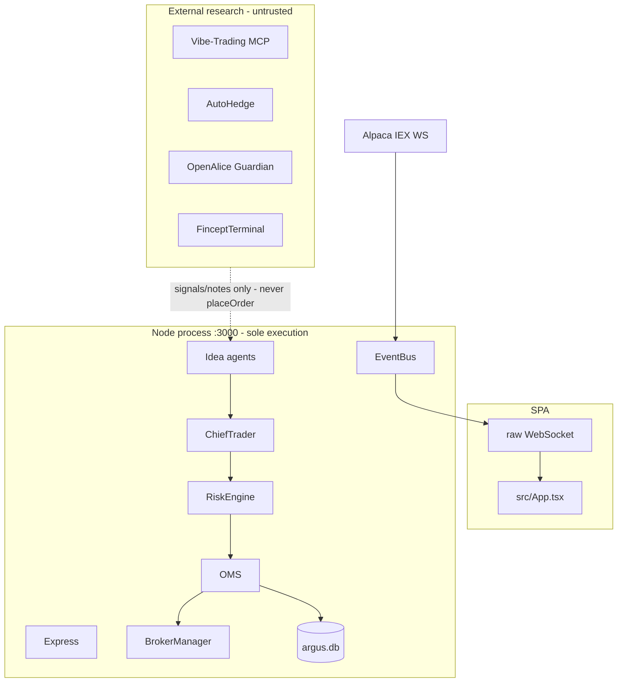
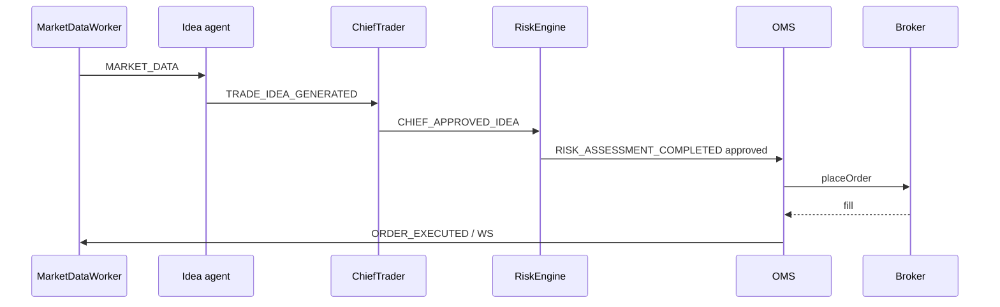

# 02 — Architecture

Single Node trading process. Two execution paths that **do not share state**. Optional sibling research processes are **outside** this diagram’s order path — see [ECOSYSTEM.md](../ECOSYSTEM.md).

**Trust:** Argus alone executes (ChiefTrader → RiskEngine → OMS → Broker). vibe-trading / autohedge / OpenAlice / FinceptTerminal are untrusted research/verification sidecars.

## Layer map

| Layer | Path | Notes |
|---|---|---|
| Frontend | `src/App.tsx`, `src/components/` | Login early-return **after** most hooks |
| Backend | `server.ts`, `src/server/routes/` | Mix of v1 leftover and v2 |
| Trading engine | `TradingEngine.ts` | Autobot timers; `toggle()` async capital check |
| AI | `src/server/ai/AIRouter.ts` | Failover, cost estimate, abort |
| Quant | `src/server/quant/` | Feature-flagged |
| Risk | `RiskEngine.ts`, `PositionSizing.ts`, `CapitalAllocation.ts`, `DailyBuyNotional.ts` | |
| Broker | `src/brokers/` | |
| Market data | `MarketDataWorker.ts` + `src/marketdata/` | Two feeds — see `10` |
| DB | `src/server/db/` | migrate on import |
| EventBus | `EventBus.ts`, `EventStore.ts` ring | `event_traces` for persist list |
| Local AI | Chronos `:8008`, Ollama `:11434` | Optional |
| Backtest | `src/server/engines/backtest/` | No OMS |
| Paper | InternalPaper or Alpaca paper | |
| Live | Alpaca unattended; others not | **NO-GO** |

## Live trading

## Backtesting

Historical bars (Alpaca raw) → ReplayClock (fail on future ts) → strategy or TA rules → PositionSizing → BacktestRiskParity capital gates → simulated fills + SEC/FINRA on sells. **No** ChiefTrader, News, OMS, broker.

## Startup / shutdown

See `04`. `system.stop` does **not** stop MarketDataWorker. Ctrl+C on `npm run dev` kills spawned companions.

## Observability

Diagnostics routes, `ai_calls`, `risk_gate_results`, Observatory UI. AlertingService exists (**IMPLEMENTED BUT UNVERIFIED** in production paging). No Datadog/Sentry required.
